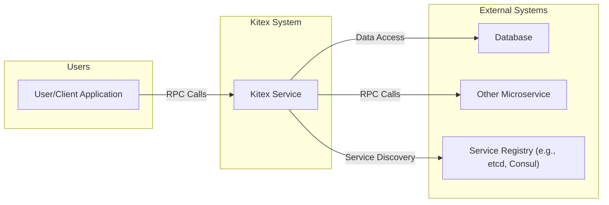
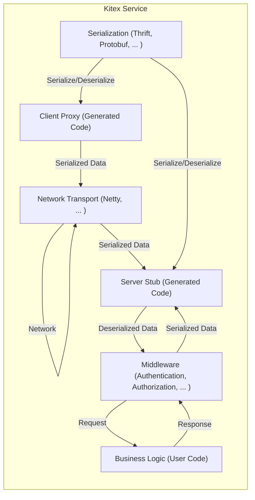
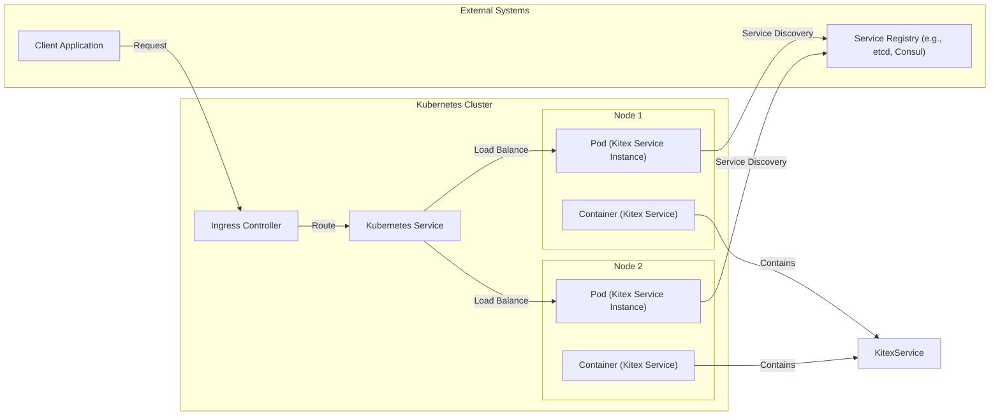
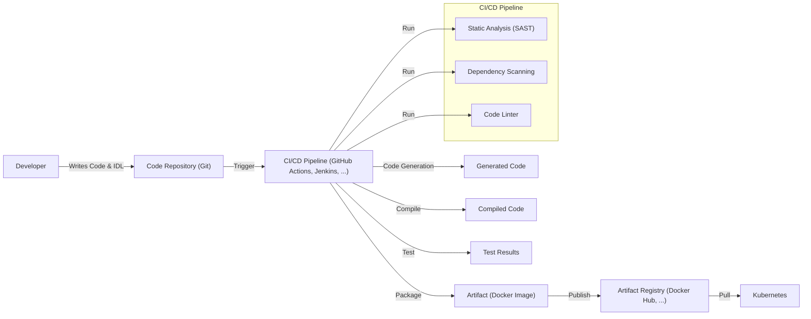

Okay, let's create a design document for the Kitex project.

# BUSINESS POSTURE

Kitex is a high-performance, extensible, and feature-rich RPC (Remote Procedure Call) framework developed by ByteDance. It's designed for building distributed systems, particularly microservices.  The primary business goals driving Kitex's development and adoption are:

*   High Performance and Efficiency: Minimize latency and maximize throughput for inter-service communication, crucial for large-scale, performance-sensitive applications.  This directly impacts user experience and operational costs.
*   Scalability and Extensibility:  Enable easy scaling of services and the addition of new features or integrations without significant code changes. This supports rapid business growth and adaptation to new requirements.
*   Developer Productivity: Provide a user-friendly API and tooling to simplify the development, testing, and deployment of microservices. This accelerates development cycles and reduces time-to-market.
*   Reliability and Fault Tolerance: Ensure robust communication between services, even in the face of network issues or service failures. This is critical for maintaining business continuity and data consistency.
*   Observability: Offer built-in mechanisms for monitoring, tracing, and logging to facilitate troubleshooting and performance optimization. This reduces operational overhead and improves system stability.

Based on these priorities, the most important business risks that need to be addressed are:

*   Service Disruptions: Failures in the RPC framework could lead to cascading failures across the distributed system, impacting critical business functions.
*   Performance Bottlenecks: Inefficient communication can degrade application performance, leading to poor user experience and increased infrastructure costs.
*   Security Vulnerabilities:  Exploitable weaknesses in the framework could expose sensitive data or allow unauthorized access to services.
*   Integration Challenges: Difficulty integrating with existing systems or adopting new technologies could hinder innovation and slow down development.
*   Operational Complexity:  Lack of proper tooling or observability can make it difficult to manage and troubleshoot the distributed system, increasing operational costs and impacting reliability.

# SECURITY POSTURE

Kitex, being an RPC framework, inherently deals with network communication and thus requires a strong security posture.  The following outlines the existing and recommended security controls, accepted risks, and security requirements.

Existing Security Controls (Inferred from the repository and common practices):

*   security control: Transport Layer Security (TLS):  Kitex likely supports (and encourages) the use of TLS for encrypting communication between services. This protects data in transit. (Implementation: Likely integrated into the network transport layer, configurable via options).
*   security control: Service Discovery Integration: Kitex integrates with service discovery mechanisms (e.g., etcd, Consul, Nacos). Secure configuration of these integrations is crucial. (Implementation: Through provided integration modules).
*   security control: Extensible Middleware: Kitex's middleware architecture allows for the implementation of custom security logic, such as authentication and authorization checks. (Implementation:  Via the middleware interface).
*   security control: Code Generation: Kitex uses code generation from IDL (Interface Definition Language) files.  Secure coding practices in the code generator are essential. (Implementation: Within the `kitex` tool).
*   security control: Regular Updates and Patching: The Kitex team likely releases updates to address security vulnerabilities.  Users are responsible for applying these updates. (Implementation:  Through package management and release channels).

Accepted Risks:

*   accepted risk:  Reliance on External Dependencies: Kitex depends on external libraries (e.g., for networking, serialization). Vulnerabilities in these dependencies could impact Kitex's security.
*   accepted risk:  Misconfiguration:  Incorrect configuration of security settings (e.g., disabling TLS, weak ciphers) can expose the system to risks.
*   accepted risk:  Limited Default Security:  While Kitex provides the *mechanisms* for security, it may not enforce strong security defaults "out of the box," requiring explicit configuration by the user.

Recommended Security Controls (High Priority):

*   security control:  Input Validation and Sanitization:  Implement rigorous input validation and sanitization at the IDL level and within service handlers to prevent injection attacks.
*   security control:  Authentication and Authorization:  Enforce strong authentication and authorization mechanisms for all service interactions.  Consider integrating with existing identity providers (e.g., OAuth 2.0, JWT).
*   security control:  Rate Limiting and Throttling:  Implement rate limiting and throttling to protect against denial-of-service (DoS) attacks.
*   security control:  Auditing and Logging:  Log all security-relevant events (e.g., authentication failures, authorization decisions) for auditing and incident response.
*   security control:  Dependency Scanning:  Regularly scan dependencies for known vulnerabilities and update them promptly.
*   security control:  Security Testing:  Incorporate security testing (e.g., static analysis, dynamic analysis, penetration testing) into the development lifecycle.

Security Requirements:

*   Authentication:
    *   Services must authenticate each other before establishing communication.
    *   Support for mutual TLS (mTLS) is highly recommended.
    *   Integration with existing identity providers (e.g., OAuth 2.0, JWT) should be supported.
*   Authorization:
    *   Access control policies must be enforced to restrict access to specific services and methods based on the caller's identity and roles.
    *   Support for fine-grained authorization (e.g., attribute-based access control) is desirable.
*   Input Validation:
    *   All input data received from clients or other services must be validated against a predefined schema.
    *   Input sanitization must be performed to prevent injection attacks (e.g., cross-site scripting, SQL injection).
*   Cryptography:
    *   TLS 1.3 or higher must be used for all network communication.
    *   Strong cryptographic algorithms and key lengths must be used.
    *   Secure key management practices must be followed.

# DESIGN

## C4 CONTEXT

Element Descriptions:

*   Element:
    *   Name: User/Client Application
    *   Type: External System (User)
    *   Description:  An application or user that interacts with the Kitex service.
    *   Responsibilities:  Initiates RPC calls to the Kitex service.
    *   Security controls:  May implement authentication and authorization mechanisms to identify itself to the Kitex service.

*   Element:
    *   Name: Kitex Service
    *   Type: System
    *   Description:  The core service built using the Kitex framework.
    *   Responsibilities:  Handles incoming RPC requests, processes business logic, interacts with other services and databases.
    *   Security controls:  TLS, authentication, authorization, input validation, rate limiting.

*   Element:
    *   Name: Database
    *   Type: External System
    *   Description:  A database used by the Kitex service to store and retrieve data.
    *   Responsibilities:  Provides data persistence.
    *   Security controls:  Database access controls, encryption at rest, encryption in transit.

*   Element:
    *   Name: Other Microservice
    *   Type: External System
    *   Description:  Another microservice that the Kitex service interacts with.
    *   Responsibilities:  Provides specific functionality to the Kitex service.
    *   Security controls:  Similar security controls as the Kitex Service.

*   Element:
    *   Name: Service Registry (e.g., etcd, Consul)
    *   Type: External System
    *   Description:  A service registry used for service discovery.
    *   Responsibilities:  Maintains a registry of available services and their locations.
    *   Security controls:  Secure communication with the Kitex service, access controls.

## C4 CONTAINER

Element Descriptions:

*   Element:
    *   Name: Client Proxy (Generated Code)
    *   Type: Container
    *   Description:  Code generated by Kitex based on the IDL, used by clients to make RPC calls.
    *   Responsibilities:  Handles serialization, request construction, and communication with the server.
    *   Security controls:  May include TLS configuration, potentially authentication token handling.

*   Element:
    *   Name: Server Stub (Generated Code)
    *   Type: Container
    *   Description:  Code generated by Kitex based on the IDL, used by the server to handle incoming requests.
    *   Responsibilities:  Handles deserialization, request routing, and response construction.
    *   Security controls:  May include TLS configuration.

*   Element:
    *   Name: Business Logic (User Code)
    *   Type: Container
    *   Description:  The user-implemented code that contains the actual service logic.
    *   Responsibilities:  Processes requests and generates responses.
    *   Security controls:  Input validation, authorization checks, secure coding practices.

*   Element:
    *   Name: Network Transport (Netty, ... )
    *   Type: Container
    *   Description:  The underlying network transport layer used for communication.
    *   Responsibilities:  Handles network connections, data transmission, and potentially TLS.
    *   Security controls:  TLS configuration, network-level security settings.

*   Element:
    *   Name: Serialization (Thrift, Protobuf, ... )
    *   Type: Container
    *   Description:  The serialization library used to convert data into a format suitable for network transmission.
    *   Responsibilities:  Serializes and deserializes data.
    *   Security controls:  Secure configuration of the serialization library, potentially input validation.

*   Element:
    *   Name: Middleware (Authentication, Authorization, ... )
    *   Type: Container
    *   Description:  A chain of middleware components that intercept requests and responses.
    *   Responsibilities:  Handles cross-cutting concerns like authentication, authorization, logging, tracing, and rate limiting.
    *   Security controls:  Implementation of authentication, authorization, and other security mechanisms.

## DEPLOYMENT

Kitex services can be deployed in various environments, including:

1.  Bare Metal Servers:  Directly on physical servers.
2.  Virtual Machines:  Within virtual machines (e.g., AWS EC2, Google Compute Engine).
3.  Containers:  Within containers (e.g., Docker) orchestrated by systems like Kubernetes.
4.  Serverless Platforms:  As functions within serverless platforms (e.g., AWS Lambda, Google Cloud Functions).  This would likely involve adapting Kitex for a function-based invocation model.

We'll describe the containerized deployment using Kubernetes, as it's a common and recommended approach for microservices.

Element Descriptions:

*   Element:
    *   Name: Kubernetes Cluster
    *   Type: Deployment Environment
    *   Description: The Kubernetes cluster where the Kitex service is deployed.
    *   Responsibilities: Orchestrates and manages the containers running the Kitex service.
    *   Security controls: Kubernetes RBAC, network policies, pod security policies.

*   Element:
    *   Name: Node 1, Node 2
    *   Type: Node
    *   Description: Worker nodes within the Kubernetes cluster.
    *   Responsibilities: Run the pods containing the Kitex service instances.
    *   Security controls: Node-level security hardening, OS-level security controls.

*   Element:
    *   Name: Pod (Kitex Service Instance)
    *   Type: Pod
    *   Description: A Kubernetes pod running one or more instances of the Kitex service.
    *   Responsibilities: Hosts the Kitex service container.
    *   Security controls: Pod security context, resource limits.

*   Element:
    *   Name: Container (Kitex Service)
    *   Type: Container
    *   Description: The Docker container running the Kitex service.
    *   Responsibilities: Executes the Kitex service code.
    *   Security controls: Container image security scanning, minimal base image.

*   Element:
    *   Name: Kubernetes Service
    *   Type: Service
    *   Description: A Kubernetes Service that provides a stable endpoint for accessing the Kitex service pods.
    *   Responsibilities: Load balances traffic across the Kitex service pods.
    *   Security controls: Network policies.

*   Element:
    *   Name: Ingress Controller
    *   Type: Ingress
    *   Description: An Ingress controller that manages external access to the Kubernetes cluster.
    *   Responsibilities: Routes external traffic to the appropriate Kubernetes Services.
    *   Security controls: TLS termination, authentication, authorization.

*   Element:
    *   Name: Client Application
    *   Type: External System
    *   Description: An application or user that interacts with the Kitex service.
    *   Responsibilities: Initiates RPC calls to the Kitex service.
    *   Security controls: May implement authentication and authorization mechanisms.

*   Element:
    *   Name: Service Registry (e.g., etcd, Consul)
    *   Type: External System
    *   Description: A service registry used for service discovery.
    *   Responsibilities: Maintains a registry of available services and their locations.
    *   Security controls: Secure communication with the Kitex service, access controls.

## BUILD

The build process for Kitex services typically involves the following steps:

1.  Development: Developers write the service code and define the IDL (Interface Definition Language) using Thrift or Protobuf.
2.  Code Generation: The `kitex` tool generates client and server code based on the IDL.
3.  Compilation: The service code (including generated code) is compiled.
4.  Testing: Unit tests, integration tests, and potentially other types of tests are executed.
5.  Packaging: The compiled code and dependencies are packaged into a deployable artifact (e.g., a Docker image).
6.  Publishing: The artifact is published to a registry (e.g., Docker Hub, a private container registry).

Security Controls in the Build Process:

*   security control:  Code Repository Security: Access controls and branch protection rules in the code repository (e.g., GitHub).
*   security control:  CI/CD Pipeline Security: Secure configuration of the CI/CD pipeline, including access controls and secrets management.
*   security control:  Static Analysis (SAST):  Use static analysis tools to scan the code for security vulnerabilities.
*   security control:  Dependency Scanning:  Use dependency scanning tools to identify and remediate known vulnerabilities in dependencies.
*   security control:  Code Linters:  Use linters to enforce coding standards and identify potential security issues.
*   security control:  Artifact Signing:  Sign the generated artifacts (e.g., Docker images) to ensure their integrity.
*   security control:  Secure Artifact Registry:  Use a secure artifact registry with access controls and vulnerability scanning.

# RISK ASSESSMENT

*   Critical Business Processes:
    *   Inter-service communication within the distributed system.  Kitex is the backbone of this communication, so its failure would disrupt all dependent services.
    *   Any business function that relies on the services built with Kitex.  This could include core business operations, customer-facing applications, and internal tools.

*   Data Sensitivity:
    *   The data transmitted through Kitex depends on the specific services using it.  This could range from non-sensitive data to highly sensitive data, including:
        *   Personally Identifiable Information (PII)
        *   Financial Data
        *   Protected Health Information (PHI)
        *   Authentication Credentials
        *   Proprietary Business Data
    *   The sensitivity of the data dictates the level of security required for the Kitex framework and the services built with it.

# QUESTIONS & ASSUMPTIONS

*   Questions:
    *   What specific service discovery mechanisms are most commonly used with Kitex in production deployments?
    *   What are the recommended best practices for configuring TLS with Kitex (e.g., cipher suites, key management)?
    *   What are the performance characteristics of Kitex under various load conditions and with different serialization formats?
    *   Are there any known limitations or performance bottlenecks in Kitex?
    *   What is the roadmap for future security enhancements in Kitex?
    *   What level of support is provided for integrating with various authentication and authorization systems?
    *   Does Kitex provide built-in support for distributed tracing, and if so, which tracing systems are supported?
    *   What are the recommended monitoring and logging configurations for Kitex services in production?

*   Assumptions:
    *   BUSINESS POSTURE: We assume a high-growth, performance-sensitive environment where microservices are heavily used.
    *   SECURITY POSTURE: We assume a moderate risk tolerance, but with a strong emphasis on protecting sensitive data and ensuring service availability. We assume that users of Kitex are responsible for configuring and maintaining the security of their deployments.
    *   DESIGN: We assume that Kubernetes is the primary deployment platform. We assume that developers are familiar with IDL-based development and code generation. We assume that the Kitex framework provides sufficient flexibility for implementing custom security logic.