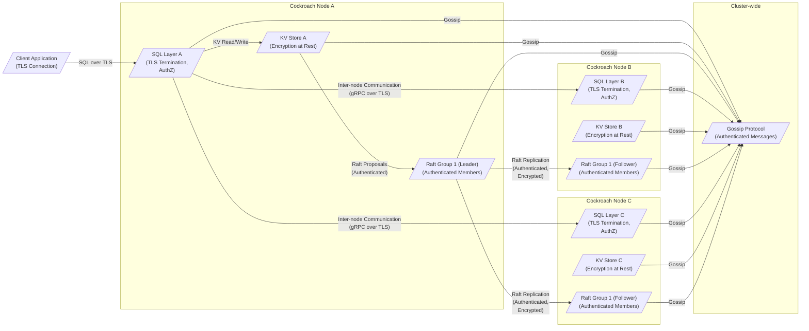
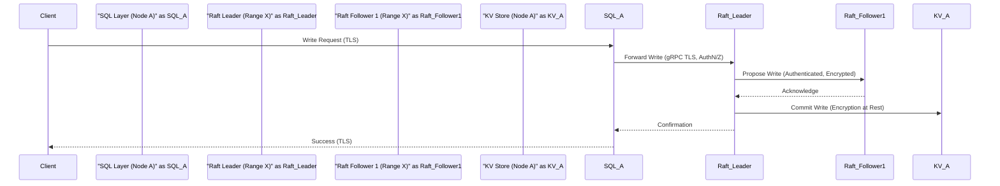
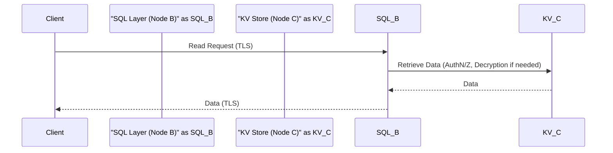

# Project Design Document: CockroachDB for Threat Modeling (Improved)

**Version:** 1.1
**Date:** October 26, 2023
**Author:** AI Software Architect

## 1. Introduction

This document provides an enhanced high-level design overview of the CockroachDB distributed SQL database system, specifically tailored for threat modeling activities. Building upon the foundational understanding of CockroachDB's architecture, this version delves deeper into security-relevant aspects of its components and interactions. The aim is to provide a comprehensive resource for identifying potential vulnerabilities and attack vectors. This design is based on the information available in the official CockroachDB GitHub repository: [https://github.com/cockroachdb/cockroach](https://github.com/cockroachdb/cockroach).

## 2. System Overview

CockroachDB is engineered as a distributed SQL database prioritizing high availability, strong consistency, and horizontal scalability. It offers the familiar transactional guarantees of traditional relational databases while leveraging a distributed architecture for resilience and scale, similar to NoSQL systems. Key architectural characteristics relevant to security include:

*   **Decentralized Architecture:**  The absence of a single point of failure enhances resilience but also necessitates robust inter-node security.
*   **Strongly Consistent Distributed Consensus:** The Raft protocol ensures data integrity across replicas, but its implementation and configuration are critical for security.
*   **Standard SQL Interface:** While providing developer familiarity, it also inherits potential SQL injection vulnerabilities if not handled carefully by client applications.
*   **Automatic Data Replication and Distribution:** While beneficial for availability, improper configuration can lead to data exposure if replication targets are not secured.
*   **Geo-Partitioning Capabilities:**  Distributing data geographically can introduce complexities in access control and compliance.

## 3. Key Components and Interactions (Security Focused)

This section details the major components of CockroachDB, emphasizing their interactions and security implications:

*   **Cockroach Node:**  Each node is a self-contained instance of the CockroachDB server.
    *   **Security Responsibility:** Authenticating incoming connections, enforcing authorization policies, and protecting locally stored data.
    *   **Communication:** Communicates with other nodes using gRPC, which can be secured with TLS.
*   **SQL Layer:** The entry point for client queries.
    *   **Security Responsibility:**  Preventing SQL injection attacks through parameterized queries, enforcing user privileges, and auditing query execution.
    *   **Interaction:** Receives client connections (potentially over TLS), interacts with the KV store to retrieve and manipulate data.
*   **Distributed Key-Value Store (KV Store):** The persistent storage layer.
    *   **Security Responsibility:**  Encrypting data at rest, controlling access to underlying storage mechanisms, and ensuring data integrity.
    *   **Interaction:** Receives read and write requests from the SQL layer and the Raft consensus mechanism.
*   **Raft Consensus:**  Manages data replication and consistency within a range.
    *   **Security Responsibility:**  Authenticating participants in the consensus group to prevent unauthorized modifications, ensuring the integrity of the consensus process.
    *   **Interaction:** Nodes within a Raft group communicate to elect leaders and replicate data changes. This communication should be secured.
*   **Gossip Protocol:**  Facilitates cluster membership and information sharing.
    *   **Security Responsibility:**  Authenticating gossip messages to prevent malicious nodes from injecting false information or disrupting the cluster.
    *   **Interaction:** Nodes periodically exchange information about their status and the cluster topology.
*   **Replication and Distribution Manager:**  Automates data replication and movement.
    *   **Security Responsibility:**  Ensuring that data is replicated to authorized nodes and that data movement is secure.
    *   **Interaction:**  Interacts with the KV store and Raft to manage data placement and replication.
*   **Admin UI:**  Provides a web interface for management.
    *   **Security Responsibility:**  Requires strong authentication and authorization to prevent unauthorized administrative actions. Should be served over HTTPS.
    *   **Interaction:**  Communicates with CockroachDB nodes to retrieve cluster status and execute commands.
*   **Command-Line Interface (CLI):**  A tool for interacting with the cluster.
    *   **Security Responsibility:**  Requires secure authentication and authorization. Access should be controlled.
    *   **Interaction:**  Communicates with CockroachDB nodes to execute commands and queries.
*   **Client Drivers:** Libraries used by applications to connect.
    *   **Security Responsibility:**  Responsible for establishing secure connections (e.g., using TLS) and handling credentials securely.
    *   **Interaction:**  Communicate with the SQL layer of CockroachDB nodes.

**Component Interaction Flow (Security Context):**

## 4. Data Flow (Security Considerations)

This section details the data flow, highlighting security measures at each stage:

**Secure Write Operation:**

1. A client application sends a write request to a CockroachDB node. The connection should be established using TLS to ensure confidentiality and integrity.
2. The receiving node's SQL layer authenticates the client and authorizes the request based on configured privileges. Input validation is performed to prevent SQL injection.
3. The SQL layer identifies the affected ranges. Communication with the Raft leader for these ranges occurs over secure channels (typically gRPC with TLS).
4. The write proposal sent to the Raft leader is authenticated to ensure only legitimate leaders can propose changes.
5. The Raft leader replicates the write proposal to followers. This communication is authenticated and can be encrypted.
6. Once a quorum is reached, the leader commits the write to its local KV store. Data at rest in the KV store is potentially encrypted.
7. The leader informs the followers to commit. This communication is also authenticated.
8. The leader sends a confirmation back to the originating SQL layer.
9. The originating SQL layer sends a success response to the client over the secure TLS connection.

**Secure Read Operation:**

1. A client application sends a read request to a CockroachDB node over a TLS connection.
2. The receiving node's SQL layer authenticates the client and authorizes the request.
3. The SQL layer identifies the ranges containing the data. The selection of the replica to read from may consider factors like locality and load, but access is still governed by authorization policies.
4. The chosen replica retrieves the data from its local KV store. If encryption at rest is enabled, the data is decrypted upon retrieval.
5. The data is returned to the originating SQL layer.
6. The originating SQL layer sends the data back to the client over the secure TLS connection.

## 5. Security Considerations (Detailed)

This section expands on the security features of CockroachDB:

*   **Authentication and Authorization:**
    *   **Mechanisms:** Supports password-based authentication, client certificates, and integration with external authentication providers. Role-Based Access Control (RBAC) allows granular control over data access and administrative privileges.
    *   **Threat Mitigation:** Prevents unauthorized access to the database and restricts actions based on user roles, mitigating risks of data breaches and unauthorized modifications.
*   **Encryption in Transit (TLS):**
    *   **Mechanism:** Uses Transport Layer Security (TLS) to encrypt communication between clients and nodes, and between nodes within the cluster. This protects data from eavesdropping and tampering during transmission.
    *   **Threat Mitigation:** Protects sensitive data like credentials and query results from network-based attacks.
*   **Encryption at Rest:**
    *   **Mechanism:** Supports encrypting data stored on disk using industry-standard encryption algorithms. This protects data if the underlying storage is compromised.
    *   **Threat Mitigation:**  Reduces the risk of data exposure in case of physical theft of storage devices or unauthorized access to the file system.
*   **Auditing:**
    *   **Mechanism:** Logs security-related events, such as authentication attempts, authorization decisions, and data access operations. These logs can be used for monitoring and forensic analysis.
    *   **Threat Mitigation:** Enables detection of suspicious activity and provides an audit trail for security investigations.
*   **Network Security:**
    *   **Mechanism:** CockroachDB relies on underlying network infrastructure (firewalls, network segmentation) to control access to the cluster.
    *   **Threat Mitigation:** Limits the attack surface by restricting network access to authorized clients and nodes.
*   **Secure Defaults:**
    *   **Mechanism:** CockroachDB aims to have secure default configurations, such as requiring authentication and encouraging the use of TLS.
    *   **Threat Mitigation:** Reduces the likelihood of misconfigurations that could introduce security vulnerabilities.

## 6. Deployment Model (Security Implications)

The chosen deployment model significantly impacts the security posture of CockroachDB:

*   **Cloud Environments (AWS, GCP, Azure):**
    *   **Security Considerations:** Leveraging cloud provider security features (firewalls, IAM, encryption services) is crucial. Proper configuration of network security groups and access control lists is essential. Consider using managed CockroachDB offerings for simplified security management.
    *   **Potential Threats:** Misconfigured cloud resources, compromised cloud accounts, data breaches due to improperly secured storage.
*   **On-Premises:**
    *   **Security Considerations:**  Organizations are responsible for all aspects of security, including physical security, network security, and operating system hardening.
    *   **Potential Threats:**  Physical access to servers, network intrusions, insider threats.
*   **Hybrid Environments:**
    *   **Security Considerations:**  Requires careful consideration of security boundaries and secure communication between on-premises and cloud components. Consistent security policies across environments are essential.
    *   **Potential Threats:**  Vulnerabilities in the communication links between environments, inconsistent security policies leading to gaps.

## 7. Assumptions and Constraints

*   This design document is based on publicly available information and the general architecture of CockroachDB. Specific implementation details may vary across versions.
*   The focus is on architectural security considerations relevant to threat modeling.
*   We assume that best practices for operating system and network security are followed.
*   We assume that client applications interacting with CockroachDB are developed with security in mind (e.g., using parameterized queries).

## 8. Out of Scope

This document does not cover:

*   Detailed code-level vulnerabilities or specific implementation flaws.
*   Security of third-party tools or integrations with CockroachDB.
*   Denial-of-service (DoS) attack mitigation strategies in detail.
*   Specific compliance requirements (e.g., GDPR, HIPAA) and how CockroachDB helps achieve them.

## 9. Diagrams

The diagrams included throughout this document provide visual representations of the system architecture and data flow, highlighting security-relevant components and interactions. These diagrams are crucial for understanding potential attack vectors and security boundaries.

This improved design document provides a more detailed and security-focused overview of CockroachDB, intended to facilitate thorough threat modeling exercises. By understanding the components, their interactions, and the built-in security mechanisms, security professionals can effectively identify and mitigate potential risks.
