## Project Design Document: CockroachDB (Improved)

**1. Introduction**

This document provides an enhanced architectural overview of the CockroachDB project, based on the codebase available at [https://github.com/cockroachdb/cockroach](https://github.com/cockroachdb/cockroach). This detailed design document is specifically structured to facilitate subsequent threat modeling activities. It elaborates on the key components, their intricate interactions, and the overall system architecture, providing a deeper understanding for security analysis.

**2. Goals and Objectives**

CockroachDB is engineered as a distributed SQL database with a core focus on resilience, horizontal scalability, and strong consistency. The primary objectives guiding its design include:

*   Presenting a standard SQL interface compatible with PostgreSQL, simplifying adoption for developers.
*   Guaranteeing data survivability and continuous operation even with multiple node failures.
*   Enabling seamless horizontal scaling to accommodate growing datasets and transaction loads without application downtime.
*   Maintaining strict data consistency (serializable isolation) across the distributed cluster, ensuring data integrity.
*   Delivering high availability, minimizing service disruptions and ensuring business continuity.
*   Providing robust transactional semantics across distributed data.

**3. High-Level Architecture**

CockroachDB functions as a distributed cluster where each node operates as a peer, eliminating single points of failure. The following diagram illustrates the key components and their interactions within and between nodes:

```mermaid
graph LR
    subgraph "CockroachDB Cluster"
        direction LR
        A("Client Application") --> B("SQL Interface");
        B --> C("DistSQL Engine");
        C --> D("Transaction Coordinator");
        D --> E("Range Replicas");
        E --> F("Storage Engine (RocksDB)");
        G("Gossip Network") --> B;
        G --> C;
        G --> D;
        G --> E;
        subgraph "Node 1"
            style B fill:#f9f,stroke:#333,stroke-width:2px
            style C fill:#ccf,stroke:#333,stroke-width:2px
            style D fill:#ccf,stroke:#333,stroke-width:2px
            style E fill:#ddf,stroke:#333,stroke-width:2px
            style F fill:#eee,stroke:#333,stroke-width:2px
        end
        subgraph "Node 2"
            B2("SQL Interface")
            C2("DistSQL Engine")
            D2("Transaction Coordinator")
            E2("Range Replicas")
            F2("Storage Engine (RocksDB)")
            style B2 fill:#f9f,stroke:#333,stroke-width:2px
            style C2 fill:#ccf,stroke:#333,stroke-width:2px
            style D2 fill:#ccf,stroke:#333,stroke-width:2px
            style E2 fill:#ddf,stroke:#333,stroke-width:2px
            style F2 fill:#eee,stroke:#333,stroke-width:2px
        end
        subgraph "Node N"
            BN("SQL Interface")
            CN("DistSQL Engine")
            DN("Transaction Coordinator")
            EN("Range Replicas")
            FN("Storage Engine (RocksDB)")
            style BN fill:#f9f,stroke:#333,stroke-width:2px
            style CN fill:#ccf,stroke:#333,stroke-width:2px
            style DN fill:#ccf,stroke:#333,stroke-width:2px
            style EN fill:#ddf,stroke:#333,stroke-width:2px
            style FN fill:#eee,stroke:#333,stroke-width:2px
        end
        B -- "SQL Queries" --> C;
        B2 -- "SQL Queries" --> C2;
        BN -- "SQL Queries" --> CN;
        C -- "Distributed Query Plan" --> D;
        C2 -- "Distributed Query Plan" --> D2;
        CN -- "Distributed Query Plan" --> DN;
        D -- "Read/Write Requests" --> E;
        D2 -- "Read/Write Requests" --> E2;
        DN -- "Read/Write Requests" --> EN;
        E -- "Data Storage" --> F;
        E2 -- "Data Storage" --> F2;
        EN -- "Data Storage" --> FN;
        E -- "Raft Consensus" --> E2;
        E -- "Raft Consensus" --> EN;
        E2 -- "Raft Consensus" --> EN;
    end
```

**4. Component Details**

This section provides a more in-depth look at the key components within a CockroachDB cluster, highlighting their roles and potential security considerations:

*   **Client Application:**  External applications interact with CockroachDB using the PostgreSQL wire protocol.
    *   Security considerations include: secure storage of database credentials, protection against SQL injection vulnerabilities.

*   **SQL Interface:**  The initial point of contact for client queries.
    *   Responsibilities:
        *   Receives and parses SQL statements.
        *   Performs semantic validation and authorization checks based on user roles and privileges.
        *   Generates an optimized distributed query plan.
        *   Manages client connections and sessions.
        *   Authenticates clients using mechanisms like password authentication, client certificates, or Single Sign-On (SSO) integration.
    *   Security considerations: potential for authentication bypass, authorization flaws, vulnerabilities in the SQL parser.

*   **DistSQL Engine (Distributed SQL Engine):**  Responsible for executing the distributed query plan.
    *   Responsibilities:
        *   Breaks down complex queries into smaller operations that can be executed in parallel across different nodes.
        *   Manages the flow of data between nodes during query execution, including shuffling and aggregation.
        *   Optimizes query execution for performance across the distributed environment.
    *   Security considerations: risks associated with inter-node communication, potential for data leakage during distributed query processing, resource exhaustion attacks.

*   **Transaction Coordinator:** Manages the lifecycle of transactions to ensure ACID properties.
    *   Responsibilities:
        *   Initiates and coordinates distributed transactions, often involving multiple ranges and nodes.
        *   Implements a distributed consensus protocol (like Raft) for transaction commit.
        *   Manages concurrency control using optimistic concurrency control with retry mechanisms based on MVCC (Multi-Version Concurrency Control).
        *   Handles transaction retries and rollbacks in case of conflicts or failures.
    *   Security considerations: vulnerabilities in the transaction coordination protocol, potential for inconsistencies if consensus is compromised, risks associated with long-running transactions.

*   **Range Replicas:** Data is divided into ranges, and each range is replicated across multiple nodes for fault tolerance and availability.
    *   Responsibilities:
        *   Each replica stores a copy of the data for a specific range of the key space.
        *   One replica is elected as the leader for a range and is responsible for coordinating write operations.
        *   Follower replicas replicate changes from the leader through the Raft consensus protocol.
        *   Handles read requests, potentially serving them from the closest replica for latency optimization.
    *   Security considerations: risks associated with inter-replica communication, potential for data corruption if consensus is compromised, vulnerabilities in the Raft implementation.

*   **Storage Engine (RocksDB):** The persistent key-value store used by each replica to store its data.
    *   Responsibilities:
        *   Provides efficient storage and retrieval of data on disk.
        *   Supports atomic operations and consistent snapshots.
        *   Manages data compaction and garbage collection.
        *   May offer features like encryption at rest.
    *   Security considerations: vulnerabilities in the underlying storage engine, risks of unauthorized access to the storage layer, potential for data breaches if encryption is not properly implemented or keys are compromised.

*   **Raft Consensus:** A distributed consensus algorithm ensuring all replicas of a range agree on the order of changes.
    *   Responsibilities:
        *   Ensures strong consistency by guaranteeing that writes are durable and applied in the same order on all replicas.
        *   Manages leader election in case of leader failure.
        *   Handles membership changes in the replica set.
    *   Security considerations: vulnerabilities in the Raft protocol implementation, risks of split-brain scenarios if quorum is not maintained, potential for denial-of-service attacks targeting the consensus mechanism.

*   **Gossip Network:** A peer-to-peer communication protocol used for cluster management and discovery.
    *   Responsibilities:
        *   Nodes exchange information about the cluster topology, including the location of ranges and the health status of other nodes.
        *   Allows new nodes to join the cluster and existing nodes to detect failures.
        *   Distributes important cluster-wide information.
    *   Security considerations: risks of malicious nodes injecting false information into the gossip network, potential for information leakage about the cluster topology, vulnerabilities in the gossip protocol implementation.

*   **Time Series Database (TSDB):** Integrated for monitoring and storing internal metrics.
    *   Responsibilities:
        *   Collects and stores time-series data about the cluster's performance, health, and resource utilization.
        *   Used for internal monitoring, dashboards, and alerting.
    *   Security considerations: potential for unauthorized access to monitoring data, risks of data injection to manipulate metrics, vulnerabilities in the TSDB component.

*   **Job Registry:** Manages long-running background tasks within the cluster.
    *   Responsibilities:
        *   Schedules and manages asynchronous tasks such as schema changes, backups, and data rebalancing.
        *   Ensures the reliable execution of these tasks.
    *   Security considerations: potential for unauthorized initiation or manipulation of background jobs, risks associated with long-running processes, vulnerabilities in the job scheduling mechanism.

**5. Data Flow (Example: Write Operation with Raft)**

The following details the data flow for a write operation, emphasizing the role of the Raft consensus protocol:

1. A client application sends an SQL `INSERT`, `UPDATE`, or `DELETE` statement to a CockroachDB node.
2. The **SQL Interface** on the receiving node parses the statement and performs authorization checks.
3. The **DistSQL Engine** identifies the range(s) affected by the write and routes the request to the **Transaction Coordinator**.
4. The **Transaction Coordinator** on a node becomes the coordinator for this transaction.
5. The **Transaction Coordinator** sends the write request to the leader replica of the affected range(s).
6. **Raft Consensus Initiation:** The leader replica proposes the change to the follower replicas in its Raft group. This proposal includes the command to be executed and a log index.
7. **Raft Voting:** Follower replicas vote on the proposal. If a majority of replicas (quorum) agree, they append the proposal to their Raft log.
8. **Raft Commit:** Once a quorum of replicas have acknowledged the proposal, the leader commits the entry to its Raft log and informs the followers to do the same.
9. **Storage Engine Write:** The committed write is then applied to the **Storage Engine (RocksDB)** on each replica in the Raft group.
10. The leader replica informs the **Transaction Coordinator** that the write was successfully applied.
11. The **Transaction Coordinator** may need to coordinate with other range leaders if the transaction involves multiple ranges (using a distributed commit protocol).
12. Once the transaction is committed across all involved ranges, the **Transaction Coordinator** informs the **SQL Interface**.
13. The **SQL Interface** sends a success response back to the client application.

**6. Security Considerations (Detailed)**

This section expands on the security considerations for CockroachDB:

*   **Authentication and Authorization:**
    *   **Mechanisms:** Password authentication (SCRAM-SHA-256), client certificates (TLS mutual authentication), integration with external authentication providers (via SSO or LDAP).
    *   **Authorization:** Role-Based Access Control (RBAC) with granular permissions on databases, tables, and operations. Row-level security policies can further restrict data access.
    *   **Threats:** Brute-force attacks on passwords, compromised client certificates, privilege escalation vulnerabilities, bypass of authorization checks.

*   **Network Security:**
    *   **Encryption:** TLS encryption is mandatory for all client-to-node and node-to-node communication. Cipher suites and TLS versions can be configured.
    *   **Network Policies:** Firewall rules and network segmentation are crucial for restricting access to the cluster.
    *   **Threats:** Man-in-the-middle attacks, eavesdropping on network traffic, unauthorized access to internal cluster communication.

*   **Data at Rest Encryption:**
    *   **Mechanism:** CockroachDB supports encryption at rest using AES-256. Encryption keys can be managed externally using Key Management Systems (KMS).
    *   **Threats:** Unauthorized access to physical storage, compromised encryption keys, vulnerabilities in the encryption implementation.

*   **Auditing:**
    *   **Logging:** Comprehensive audit logs capture security-related events, including authentication attempts, authorization decisions, and data access.
    *   **Threats:** Tampering with audit logs, insufficient logging coverage, failure to monitor audit logs.

*   **Vulnerability Management:**
    *   **Process:** The CockroachDB team actively monitors for and addresses security vulnerabilities. Security advisories are published for identified issues.
    *   **Threats:** Exploitation of known vulnerabilities before patches are applied, zero-day attacks.

*   **Secure Deployment Practices:**
    *   **Recommendations:** Following security best practices for deploying distributed systems, including secure node configuration, regular security updates, and principle of least privilege.
    *   **Threats:** Misconfigurations leading to security weaknesses, insecure default settings.

**7. Deployment Model**

CockroachDB offers flexibility in deployment environments:

*   **Cloud Environments (AWS, GCP, Azure):**
    *   **Virtual Machines (VMs):**  Deployed on individual VMs, leveraging cloud provider infrastructure.
    *   **Container Orchestration (Kubernetes):**  Deployed as containerized applications managed by Kubernetes for scalability and resilience. Operators simplify deployment and management.
    *   **Managed Services:** Cloud providers offer managed CockroachDB services, abstracting away infrastructure management.
    *   Security considerations: securing cloud infrastructure, managing access control for cloud resources, ensuring proper network configuration within the cloud environment.

*   **On-Premise Data Centers:**
    *   **Physical Servers:** Deployed directly on physical hardware.
    *   **Virtualized Infrastructure:** Deployed on virtual machines within a private cloud environment.
    *   Security considerations: physical security of servers, network security within the data center, secure configuration of the operating system and underlying infrastructure.

*   **Hybrid Environments:**
    *   Combination of cloud and on-premise deployments, potentially for disaster recovery or regulatory compliance.
    *   Security considerations: securing communication between cloud and on-premise environments, managing data consistency and security across different environments.

**8. Assumptions and Constraints**

*   This document provides a detailed architectural overview but does not encompass every minute implementation detail.
*   The architecture is based on the current understanding of the CockroachDB project as reflected in the public GitHub repository.
*   Specific configurations, deployment choices, and the version of CockroachDB in use can influence the exact behavior and security characteristics of a deployed cluster.

This improved design document provides a more comprehensive foundation for threat modeling activities, offering deeper insights into the components, data flow, and security considerations of CockroachDB. Each aspect detailed here should be further scrutinized to identify potential vulnerabilities and develop appropriate mitigation strategies.
