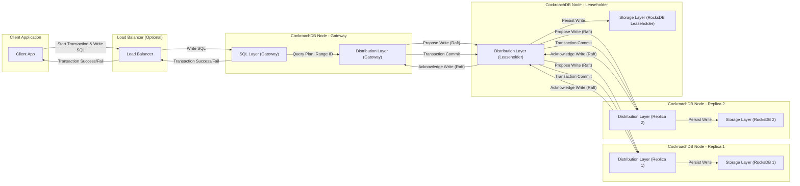

## Project Design Document: CockroachDB for Threat Modeling (Improved)

**1. Introduction**

This document provides a detailed architectural overview of CockroachDB, a distributed SQL database, specifically designed to facilitate thorough threat modeling. It elaborates on the core components, intricate data flows, and critical security mechanisms relevant to identifying potential vulnerabilities and attack vectors. This document is primarily intended for security engineers, security architects, and development teams responsible for evaluating and securing systems that incorporate CockroachDB. The information presented here will serve as a foundation for conducting comprehensive threat analysis.

**2. Project Overview**

CockroachDB is a resilient, scalable, and strongly consistent distributed SQL database. It aims to combine the familiar transactional guarantees of traditional relational databases with the horizontal scalability and fault tolerance characteristic of NoSQL systems. Key architectural principles and features include:

*   **Globally Distributed Architecture:** Data is partitioned and replicated across multiple nodes, potentially spanning geographical locations.
*   **Strong Consistency via Raft:** Employs the Raft consensus algorithm to ensure transactional consistency across all replicas, even in the presence of network partitions or node failures.
*   **Standard SQL Interface:** Supports a rich subset of standard SQL, making it accessible and integrable with existing applications and developer workflows.
*   **Automatic Failover and Recovery:**  The system is designed to automatically detect and recover from node failures without manual intervention, ensuring high availability.
*   **Geo-Partitioning (Data Locality):**  Allows for the strategic placement of data partitions closer to users or applications, reducing latency and improving performance for geographically distributed workloads.

**3. System Architecture: Deeper Dive**

CockroachDB's architecture is layered, with each layer responsible for specific functionalities. Understanding these layers is crucial for identifying potential attack surfaces:

*   **SQL Layer (Entry Point):** This layer acts as the primary interface for client interactions and handles:
    *   **SQL Parsing and Validation:**  Receives and parses incoming SQL queries, validating their syntax and semantics. This is a critical point for input validation and preventing SQL injection.
    *   **Query Planning and Optimization:**  Develops efficient execution plans for queries, considering data distribution and node capabilities. Inefficient plans could be exploited for resource exhaustion.
    *   **Transaction Management (ACID Properties):**  Ensures atomicity, consistency, isolation, and durability (ACID) for transactions, even in a distributed environment. Vulnerabilities here could lead to data corruption or inconsistencies.
    *   **Access Control and Authorization:** Enforces user authentication and authorization policies, controlling access to databases, tables, and specific operations. Bypassing this layer is a primary attack goal.
*   **Distribution Layer (The Brains):** This layer manages the distributed nature of the database and is responsible for:
    *   **Range Management:**  Divides data into logical units called "ranges," which are the fundamental units of replication and distribution. Understanding range ownership is key to understanding data access paths.
    *   **Transaction Coordination (Distributed Transactions):** Coordinates complex transactions that span multiple ranges and nodes, ensuring atomicity across the distributed system. This is a complex area with potential for concurrency issues and vulnerabilities.
    *   **Replication and Consensus (Raft Protocol):**  Maintains multiple replicas of each range on different nodes and uses the Raft consensus algorithm to ensure that all replicas agree on the state of the data. Compromising the Raft process could lead to data manipulation or inconsistencies.
    *   **Load Balancing and Rebalancing:**  Distributes data and workload across nodes to maintain performance and resilience. Exploiting imbalances could lead to denial of service.
*   **Storage Layer (Persistence):** This layer handles the durable storage of data on each node:
    *   **Key-Value Store (Embedded RocksDB):** Each CockroachDB node embeds a local instance of RocksDB, a high-performance key-value store, as its storage engine. Vulnerabilities in RocksDB could directly impact data integrity.
    *   **SSTables (Sorted String Tables):** Data in RocksDB is organized into immutable sorted string tables (SSTables). Understanding the structure of SSTables is relevant for data recovery and potential forensic analysis.
    *   **Log Structured Merge (LSM) Tree Architecture:** RocksDB utilizes an LSM tree architecture, optimized for write performance. Understanding the compaction process is important for performance and potential resource exhaustion attacks.
*   **Networking Layer (Communication Fabric):** Facilitates all communication within the CockroachDB cluster and with external clients:
    *   **gRPC Framework:**  Uses gRPC, a high-performance RPC framework, for secure and efficient inter-node communication and client connections. Security configurations of gRPC are critical.
    *   **TLS Encryption (Mutual TLS Optional):** Supports Transport Layer Security (TLS) for encrypting communication channels, protecting data in transit. Mutual TLS provides stronger authentication by requiring both client and server certificates.

**4. Data Flow: A Detailed Transaction**

Let's examine the data flow for a more complex scenario – a distributed write transaction:

*   **Client Initiates Transaction:** A client application connects to a CockroachDB node (the gateway node) via gRPC, potentially through a load balancer. The client begins a transaction.
*   **SQL Reception and Parsing:** The gateway node's SQL layer receives and parses the write SQL statement(s).
*   **Query Planning and Range Identification:** The SQL layer determines the ranges affected by the write operation and identifies the nodes responsible for those ranges (the leaseholders).
*   **Distributed Transaction Coordination:** The gateway node acts as the transaction coordinator. It communicates with the leaseholders of the affected ranges.
*   **Raft Consensus on Leaseholders:** For each affected range, the transaction coordinator proposes the write operation to the Raft group of the leaseholder node. The Raft protocol ensures that a majority of replicas agree on the write.
*   **Data Write to Storage (RocksDB):** Once consensus is reached, the write is applied to the local RocksDB instance on the leaseholder node and its followers.
*   **Transaction Commit/Rollback:**  The transaction coordinator orchestrates the commit or rollback of the transaction across all involved ranges, ensuring atomicity.
*   **Response to Client:** The gateway node sends a confirmation (or error) back to the client.

**5. Key Security Considerations: A Threat-Focused View**

*   **Authentication Mechanisms (Attack Vectors):**
    *   **Password-based authentication:** Susceptible to brute-force attacks, dictionary attacks, and credential stuffing if not properly protected (e.g., strong password policies, rate limiting).
    *   **Certificate-based authentication (TLS client certificates):**  Requires secure management and distribution of client certificates. Compromised certificates can grant unauthorized access.
    *   **SCRAM-SHA-256:** While more secure than basic password authentication, it's still vulnerable to phishing or man-in-the-middle attacks if the initial exchange is not protected.
*   **Authorization (RBAC Vulnerabilities):**
    *   **Misconfigured roles and permissions:**  Granting excessive privileges to users or roles can lead to unauthorized data access or modification.
    *   **Role exploitation:**  Attackers may attempt to assume roles with higher privileges.
*   **Encryption in Transit (TLS Weaknesses):**
    *   **Outdated TLS versions or weak cipher suites:**  Vulnerable to downgrade attacks and eavesdropping.
    *   **Improper certificate validation:**  Can allow man-in-the-middle attacks.
*   **Encryption at Rest (Implementation Flaws):**
    *   **Weak encryption algorithms or key management practices:**  Compromised encryption keys render the encryption ineffective.
    *   **Lack of encryption for backups:**  Exposes sensitive data in backups.
*   **Auditing (Insufficient Logging):**
    *   **Inadequate audit logging:**  Makes it difficult to detect and investigate security incidents.
    *   **Tampering with audit logs:**  Attackers may attempt to erase their tracks.
*   **Input Validation (SQL Injection Risks):**
    *   **Insufficient input sanitization:**  Can allow attackers to inject malicious SQL code, potentially leading to data breaches or unauthorized actions.
*   **Network Security (Exposure Risks):**
    *   **Open ports and services:**  Increase the attack surface.
    *   **Lack of network segmentation:**  Allows attackers to move laterally within the network.
*   **Node Security (Compromise Scenarios):**
    *   **Unpatched operating systems and software:**  Provide entry points for attackers.
    *   **Weak access controls on nodes:**  Allow unauthorized access to the underlying infrastructure.
*   **Backup and Recovery (Vulnerabilities):**
    *   **Unencrypted backups:**  Expose sensitive data if backups are compromised.
    *   **Insecure storage of backups:**  Makes backups an easy target for attackers.
*   **Vulnerability Management (Patching Gaps):**
    *   **Delayed patching:**  Leaves systems vulnerable to known exploits.
*   **Supply Chain Attacks (Dependency Risks):**
    *   **Compromised dependencies (e.g., RocksDB):**  Can introduce vulnerabilities into CockroachDB.
*   **Insider Threats (Mitigation Strategies):**
    *   Requires strong access controls, monitoring, and separation of duties.

**6. Deployment Model: Security Implications**

The chosen deployment model significantly influences the security considerations:

*   **Cloud Environments (Shared Responsibility):** Security is a shared responsibility between the cloud provider and the user. Understanding the division of responsibilities is crucial.
    *   **AWS, GCP, Azure:** Each provider offers various security services that can be integrated with CockroachDB.
*   **On-Premise (Full Responsibility):** The organization is responsible for the entire security stack, from physical security to application security.
*   **Hybrid Cloud (Complex Security Landscape):** Requires careful coordination and consistent security policies across different environments.
*   **Containerized Environments (Orchestration Security):**  Security considerations include container image security, orchestration platform security (e.g., Kubernetes), and network policies.

**7. Technology Stack: Potential Vulnerabilities**

Understanding the underlying technologies helps identify potential vulnerabilities:

*   **Go:**  Memory safety and concurrency issues are potential concerns.
*   **RocksDB:**  Vulnerabilities in the underlying key-value store can directly impact data integrity and availability.
*   **gRPC:**  Misconfigurations or vulnerabilities in gRPC can lead to security issues in communication.
*   **Protocol Buffers:**  Deserialization vulnerabilities are a potential concern.
*   **Raft:**  Implementation flaws in the Raft consensus algorithm could lead to inconsistencies or denial of service.
*   **SQL (PostgreSQL dialect):**  Susceptible to SQL injection if input is not properly sanitized.

**8. Potential Threat Areas: Categorized for Analysis**

For a structured threat modeling exercise, consider these categories:

*   **Network Layer Threats:**  Attacks targeting network communication and infrastructure.
*   **Authentication and Authorization Threats:**  Attempts to bypass access controls.
*   **Data Confidentiality Threats:**  Risks to the secrecy of stored and transmitted data.
*   **Data Integrity Threats:**  Risks to the accuracy and consistency of data.
*   **Availability Threats:**  Attacks aimed at disrupting service.
*   **Compliance Threats:**  Failure to meet regulatory requirements.
*   **Operational Threats:**  Risks associated with the operation and maintenance of the system.

**9. Diagrams**

The diagrams provided in the "Data Flow" section offer a visual representation of the system's interactions. Further diagrams focusing on specific security aspects, such as authentication flows or encryption processes, could be beneficial for more targeted threat modeling.

**10. Conclusion**

This enhanced design document provides a more in-depth understanding of CockroachDB's architecture, emphasizing security considerations relevant to threat modeling. By examining the components, data flows, and potential vulnerabilities within each layer and technology, security professionals can conduct more effective threat analysis and implement appropriate mitigation strategies. This document serves as a crucial resource for securing CockroachDB deployments and protecting sensitive data. Continuous review and updates are necessary to address evolving threats and vulnerabilities.