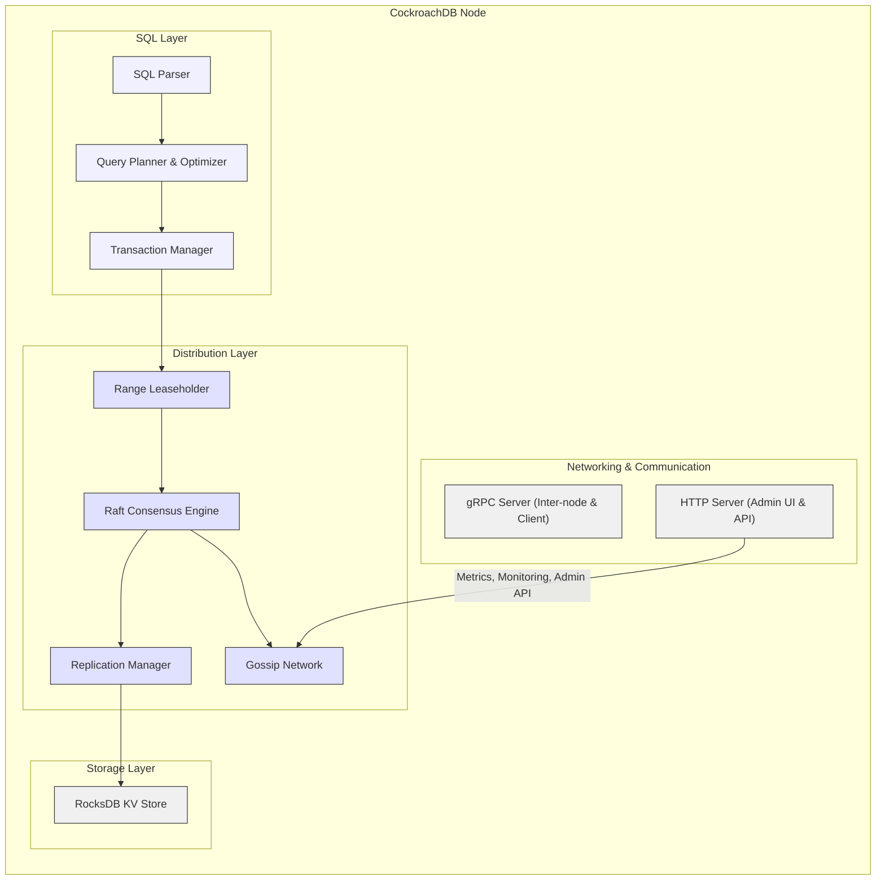

# Project Design Document: CockroachDB

**Version:** 1.1
**Date:** October 26, 2023
**Author:** Gemini (AI Expert in Software, Cloud, and Cybersecurity Architecture)
**Project Repository:** [https://github.com/cockroachdb/cockroach](https://github.com/cockroachdb/cockroach)

## 1. Introduction

This document provides a detailed design overview of CockroachDB, a distributed SQL database. It is intended to serve as a comprehensive resource for threat modeling and security analysis, as well as for development and operations teams seeking a deeper understanding of the system's architecture. This document outlines the key architectural components, data flow, technology stack, deployment models, and security considerations of CockroachDB.

## 2. Project Overview

CockroachDB is a cloud-native, distributed SQL database designed for resilience, scalability, and strong data consistency. It provides a familiar SQL interface while operating across a distributed cluster of nodes.  Its core principles are to ensure data survivability, horizontal scalability, and ease of operation, making it suitable for mission-critical applications requiring high availability and data integrity.

Key features include:

*   **Distributed SQL:**  Full support for standard SQL, including transactions, indexes, and joins, distributed across a cluster.
*   **Strong Consistency:** Serializable transaction isolation level by default, guaranteeing ACID properties and data correctness.
*   **High Availability and Fault Tolerance:** Automatic data replication and rebalancing to tolerate node and zone failures without data loss or downtime.
*   **Horizontal Scalability:**  Linear scalability achieved by adding more nodes to the cluster to increase capacity and performance.
*   **Geo-Distribution:**  Data can be pinned to specific geographic regions for low latency access and data sovereignty compliance.
*   **Cloud-Native Architecture:**  Optimized for deployment in cloud environments, containerized platforms like Kubernetes, and on-premise infrastructure.
*   **Automated Operations:**  Simplified cluster management with automated repairs, upgrades, and monitoring.

## 3. Goals and Objectives

The primary goals of CockroachDB are:

*   **Unbreakable Data Survivability:** To ensure data remains consistent, accessible, and durable even in the face of significant infrastructure failures, including node outages, network partitions, and even datacenter failures.
*   **Limitless Scalability and Performance:** To provide near-linear scalability for both read and write operations as the cluster size increases, accommodating growing data volumes and user traffic.
*   **Effortless Operations:** To simplify the operational complexity of distributed databases, offering automated management features and a user-friendly experience.
*   **Globally Consistent Transactions:** To maintain strong ACID properties and serializable isolation across distributed transactions, ensuring data integrity for complex applications.
*   **Robust Security Posture:** To protect data confidentiality, integrity, and availability through comprehensive security mechanisms at all layers of the system.

## 4. Target Audience

This design document is intended for a broad audience involved in the lifecycle of CockroachDB deployments:

*   **Security Engineers and Architects:** To gain a deep understanding of the architecture for conducting thorough threat modeling, vulnerability assessments, and penetration testing.
*   **Software Development Teams:** To understand the system design for seamless integration with applications, optimizing data access patterns, and leveraging CockroachDB's distributed capabilities.
*   **Operations and Infrastructure Teams:** To understand the deployment architecture, operational procedures, monitoring requirements, and maintenance tasks for managing CockroachDB clusters.
*   **Technical Decision Makers:** To evaluate CockroachDB's architecture and security features for adoption in their organizations.
*   **Anyone interested in the internal workings and design principles of a modern distributed SQL database.**

## 5. System Architecture

CockroachDB employs a distributed, layered architecture, designed for modularity, scalability, and resilience.

### 5.1. High-Level Architecture Diagram

```mermaid
graph LR
    subgraph "Client Layer"
        A["SQL Client (psql, Application)"]
    end
    subgraph "CockroachDB Cluster"
        subgraph "SQL Layer (Any Node)"
            B["SQL Gateway Node (Any Node)"]
        end
        subgraph "Distribution Layer (Across Nodes)"
            C["Range Replicas (Node 1)"]
            D["Range Replicas (Node 2)"]
            E["Range Replicas (Node 3)"]
        end>
        subgraph "Storage Layer (Per Node)"
            F["RocksDB Instance (Node 1)"]
            G["RocksDB Instance (Node 2)"]
            H["RocksDB Instance (Node 3)"]
        end
        B --> C & D & E
        C --> F
        D --> G
        E --> H
    end
    A --> B
    style A fill:#f9f,stroke:#333,stroke-width:2px
    style B fill:#ccf,stroke:#333,stroke-width:2px
    style C fill:#ccf,stroke:#333,stroke-width:2px
    style D fill:#ccf,stroke:#333,stroke-width:2px
    style E fill:#ccf,stroke:#333,stroke-width:2px
    style F fill:#eee,stroke:#333,stroke-width:2px
    style G fill:#eee,stroke:#333,stroke-width:2px
    style H fill:#eee,stroke:#333,stroke-width:2px
```

**Description:**

*   **SQL Client (psql, Application):** Represents any application, tool, or user interface that interacts with CockroachDB using a standard SQL driver (e.g., JDBC, Go, Python).
*   **SQL Gateway Node (Any Node):**  Any CockroachDB node can act as a SQL gateway. It serves as the entry point for client connections, handling SQL parsing, query planning, optimization, and routing queries to the appropriate data ranges. This distributed gateway architecture enhances availability and scalability.
*   **Range Replicas (Node 1, 2, 3):** CockroachDB divides data into logical units called "ranges." Each range is replicated across multiple nodes (typically 3 or 5) for fault tolerance and high availability. These replicas participate in the Raft consensus protocol to ensure data consistency and durability.
*   **RocksDB Instance (Node 1, 2, 3):** Each CockroachDB node utilizes a local instance of RocksDB, a high-performance embedded key-value store, for persistent storage of its range replicas. RocksDB provides efficient storage and retrieval of data on disk.

### 5.2. Component-Level Architecture (Per Node)



**Component Descriptions:**

*   **SQL Layer:** Responsible for processing SQL queries.
    *   **SQL Parser:**  Analyzes and validates incoming SQL queries, converting them into an internal representation for further processing.
    *   **Query Planner & Optimizer:**  Develops efficient execution plans for SQL queries, considering data distribution, indexes, and cost-based optimization techniques to minimize query latency.
    *   **Transaction Manager:**  Manages distributed transactions across multiple ranges and nodes, ensuring ACID properties (Atomicity, Consistency, Isolation, Durability) and serializable isolation using distributed consensus.
*   **Distribution Layer:** Manages data distribution, replication, and consistency across the cluster.
    *   **Range Leaseholder:**  For each range, one replica is elected as the leaseholder. The leaseholder is responsible for coordinating write operations and ensuring linearizability for that range.
    *   **Raft Consensus Engine:** Implements the Raft consensus algorithm to replicate data and transaction logs across replicas within a range. Raft ensures strong consistency and fault tolerance by maintaining a replicated log of operations.
    *   **Replication Manager:**  Manages range replication, automatic rebalancing of ranges across nodes, and data recovery in case of node failures. It ensures the desired replication factor is maintained and data is evenly distributed.
    *   **Gossip Network:**  A peer-to-peer communication protocol used for cluster-wide information dissemination. Nodes use gossip to share cluster topology information, node status, range locations, load balancing data, and other metadata. It enables automatic discovery and decentralized cluster management.
*   **Storage Layer:** Provides persistent data storage.
    *   **RocksDB KV Store:**  A high-performance, persistent key-value store embedded within each CockroachDB node. RocksDB stores the actual data for each range replica on local disk, optimized for fast read and write operations.
*   **Networking & Communication:** Handles communication within the cluster and with clients.
    *   **gRPC Server (Inter-node & Client):**  Utilizes gRPC for efficient and high-performance communication. It serves both inter-node communication within the cluster (for Raft, gossip, replication) and client-node communication for SQL protocol and other internal APIs.
    *   **HTTP Server (Admin UI & API):**  Provides an HTTP-based interface for the web-based Admin UI, allowing users to monitor cluster status, manage configurations, and perform administrative tasks. It also exposes an administrative API for programmatic cluster management and monitoring.

## 6. Data Flow

### 6.1. Write Path (e.g., `INSERT`, `UPDATE`, `DELETE`)

1.  **SQL Client sends a write request to a SQL Gateway Node.** Any node can serve as a gateway.
2.  **SQL Gateway Node receives the request, parses the SQL query, and plans the execution.** It identifies the ranges affected by the write operation.
3.  **Transaction Manager on the Gateway Node initiates a distributed transaction.** It coordinates the transaction across potentially multiple ranges and nodes.
4.  **For each affected range, the write operation is routed to the Range Leaseholder.** The Gateway Node uses gossip information to locate the leaseholder for each range.
5.  **Range Leaseholder receives the write request and proposes it to other replicas in the range via the Raft consensus protocol.** This involves appending the write operation to the Raft log.
6.  **Raft Consensus Engine ensures that a quorum of replicas (majority) agree on the proposed write operation.** Once a quorum is reached, the write is considered committed in the Raft log.
7.  **Each replica in the range, including the leaseholder and followers, applies the committed write operation from the Raft log to its local RocksDB instance.** This ensures data consistency across all replicas.
8.  **After successfully applying the write to its RocksDB instance, the Range Leaseholder responds to the SQL Gateway Node, confirming the success of the write operation.**
9.  **SQL Gateway Node, upon receiving confirmation from all involved Range Leaseholders, responds to the SQL Client, indicating the successful completion of the write request.**

### 6.2. Read Path (e.g., `SELECT`)

1.  **SQL Client sends a read request to a SQL Gateway Node.**
2.  **SQL Gateway Node receives the request, parses the SQL query, and plans the execution.** It identifies the ranges containing the requested data.
3.  **The read operation is routed to a replica of the range containing the requested data.** For consistent reads (the default), the request is typically routed to the Range Leaseholder to ensure reading the most up-to-date data. For less critical read operations, follower replicas can be used to distribute read load.
4.  **The chosen replica retrieves the requested data from its local RocksDB instance.**
5.  **The replica returns the data to the SQL Gateway Node.**
6.  **SQL Gateway Node aggregates the data (if necessary, for queries spanning multiple ranges) and responds to the SQL Client with the requested data.**

## 7. Technology Stack

*   **Programming Language:** Go (Primarily for core database components), JavaScript/TypeScript (Admin UI)
*   **Data Storage Engine:** RocksDB (Embedded Key-Value Store, written in C++)
*   **Inter-Process Communication:** gRPC (Protocol Buffers)
*   **Consensus Algorithm:** Raft (Implementation in Go)
*   **Networking:** TCP/IP, HTTP/2, TLS
*   **Operating Systems:** Linux (Primarily for production), macOS, Windows (for development)
*   **Deployment & Orchestration:** Kubernetes, Docker, Systemd, Cloud Provider Infrastructure (AWS, GCP, Azure)
*   **Monitoring & Metrics:** Prometheus, Grafana (Integration)

## 8. Deployment Model

CockroachDB offers flexible deployment options to suit various infrastructure needs:

*   **Cloud Deployments:**
    *   **CockroachDB Dedicated (Managed Service):** A fully managed database-as-a-service offering by Cockroach Labs, simplifying operations and providing enterprise-grade features.
    *   **Self-Managed on Cloud VMs:** Deploying CockroachDB on virtual machines (e.g., AWS EC2, GCP Compute Engine, Azure VMs) within cloud provider environments, providing more control over infrastructure.
    *   **Kubernetes on Cloud (EKS, GKE, AKS):** Deploying CockroachDB within Kubernetes clusters managed by cloud providers, leveraging container orchestration and scalability.
*   **On-Premise Deployments:**
    *   **Physical Servers:** Deploying CockroachDB directly on physical servers in a data center for maximum performance and hardware control.
    *   **Virtual Machines (Private Cloud):** Deploying CockroachDB on virtual machines within a private cloud environment, offering virtualization benefits within a private infrastructure.
    *   **Kubernetes On-Premise (Self-Managed):** Deploying CockroachDB within self-managed Kubernetes clusters in an on-premise data center, providing container orchestration and portability.
*   **Hybrid Cloud Deployments:** Combining cloud and on-premise deployments for specific use cases, such as geo-distributed applications or data sovereignty requirements.

## 9. Security Considerations (Detailed)

CockroachDB incorporates a comprehensive set of security features to protect data and infrastructure.

*   **Authentication and Authorization:**
    *   **Client Authentication:** Supports password-based authentication, certificate-based authentication (TLS client certificates), and integration with external authentication providers (LDAP, OIDC/SAML via third-party proxies).
    *   **Role-Based Access Control (RBAC):** Granular RBAC system to manage user permissions at the database, table, and column levels. Allows defining roles with specific privileges (e.g., `SELECT`, `INSERT`, `UPDATE`, `DELETE`, `ADMIN`) and assigning users to these roles.
    *   **Inter-node Authentication:** Mutual TLS authentication between CockroachDB nodes to secure inter-node communication and prevent unauthorized nodes from joining the cluster.
    *   **SQL Audit Logging:** Logs all SQL queries and authentication attempts for auditing and compliance purposes.
*   **Data Encryption:**
    *   **Encryption in Transit (TLS):** Mandatory TLS encryption for all network communication, including client-node, inter-node (gRPC), and Admin UI (HTTPS) traffic. Supports configurable TLS versions and cipher suites.
    *   **Encryption at Rest:** Supports encryption of data stored in RocksDB using AES-256-GCM encryption. Encryption keys can be managed by CockroachDB's built-in key management system or integrated with external Key Management Systems (KMS) like HashiCorp Vault, AWS KMS, GCP KMS, Azure Key Vault for enhanced key security and management.
    *   **Column-Level Encryption (Future Enhancement):** While not currently implemented, column-level encryption is a potential future enhancement to provide finer-grained data protection.
*   **Network Security:**
    *   **Firewall Rules:**  Recommendations for configuring firewalls to restrict network access to CockroachDB nodes, allowing only necessary ports and protocols.
    *   **Network Segmentation:**  Best practices for network segmentation to isolate the CockroachDB cluster within a dedicated network segment or VPC, limiting the blast radius of potential security breaches.
    *   **Network Policies (Kubernetes):**  Leveraging Kubernetes network policies to enforce network isolation and restrict traffic flow between pods and namespaces within a Kubernetes deployment.
    *   **Secure Load Balancers and Proxies:**  Guidance on securely configuring load balancers and reverse proxies in front of the CockroachDB cluster, including TLS termination, access control, and DDoS protection.
*   **Auditing and Logging:**
    *   **Comprehensive Logging:**  Detailed logging of various events, including security-related events (authentication, authorization), transaction logs, and system events. Configurable log levels and output destinations (files, syslog, cloud logging services).
    *   **Integration with SIEM Systems:**  Logs can be integrated with Security Information and Event Management (SIEM) systems for centralized security monitoring, alerting, and incident response.
*   **Vulnerability Management:**
    *   **Regular Security Patching and Updates:**  Cockroach Labs provides regular security patches and updates to address identified vulnerabilities. Users are encouraged to apply updates promptly.
    *   **Security Vulnerability Scanning:**  Recommendations for performing regular vulnerability scanning of CockroachDB deployments using security scanning tools.
    *   **Penetration Testing:**  Encouragement for conducting periodic penetration testing by qualified security professionals to identify and address potential security weaknesses.
    *   **Bug Bounty Program:** Cockroach Labs operates a public bug bounty program to incentivize security researchers to report vulnerabilities responsibly.
    *   **Security Advisories:**  Cockroach Labs publishes security advisories for disclosed vulnerabilities, providing details and mitigation guidance.
*   **Denial of Service (DoS) Protection:**
    *   **Rate Limiting and Connection Limits:**  Configurable rate limiting and connection limits to prevent resource exhaustion from excessive client requests or malicious attacks.
    *   **Request Queue Management:**  Mechanisms to manage and prioritize incoming requests, preventing overload and ensuring fair resource allocation.
    *   **DDoS Mitigation Strategies:**  Recommendations for implementing DDoS mitigation strategies at the network and application layers, potentially using cloud-based DDoS protection services.
*   **Data Backup and Recovery:**
    *   **Secure Backup Procedures:**  Guidance on implementing secure backup procedures, including encryption of backups and secure storage of backup data.
    *   **Backup Encryption:**  CockroachDB backups can be encrypted using encryption keys managed by the user or an external KMS.
    *   **Regular Backup Testing:**  Importance of regularly testing backup and restore procedures to ensure data recoverability and business continuity.
*   **Admin UI Security:**
    *   **HTTPS Only Access:**  Admin UI is accessible only over HTTPS, enforcing encryption for all administrative traffic.
    *   **Authentication and Authorization for Admin UI:**  Requires authentication and authorization to access the Admin UI, using the same user and role management system as the SQL interface.
    *   **Content Security Policy (CSP):**  Implementation of Content Security Policy (CSP) headers to mitigate Cross-Site Scripting (XSS) vulnerabilities in the Admin UI.
    *   **Regular Security Audits of Admin UI:**  Ongoing security audits and vulnerability assessments of the Admin UI to identify and address potential web security vulnerabilities.

## 10. Assumptions and Constraints

*   **Secure Infrastructure:**  This design assumes that the underlying infrastructure (network, servers, cloud environment) is reasonably secure and properly configured according to security best practices.
*   **Competent System Administration:**  Effective security relies on competent system administration practices, including proper configuration of CockroachDB security features, timely patching, and adherence to security guidelines.
*   **Strong Password Policies:**  If password-based authentication is used, it is assumed that strong password policies are enforced and users choose strong, unique passwords.
*   **Secure Key Management Practices:**  For encryption features, it is assumed that secure key management practices are implemented, including secure generation, storage, rotation, and access control of encryption keys.
*   **Regular Monitoring and Security Audits:**  Maintaining a strong security posture requires ongoing monitoring of the CockroachDB cluster, regular security audits, and proactive identification and remediation of security vulnerabilities.

## 11. Next Steps

The immediate next step is to conduct a comprehensive threat modeling exercise based on this detailed design document. This will involve:

*   **Threat Modeling Workshop:** Organize a workshop with security engineers, developers, and operations personnel to collaboratively identify potential threats.
*   **Identifying Threat Actors and Threat Vectors:**  Define potential threat actors (e.g., malicious insiders, external attackers, compromised accounts) and their potential attack vectors (e.g., network attacks, SQL injection, privilege escalation).
*   **Analyzing Potential Threats and Vulnerabilities:** Systematically analyze each component and data flow described in this document to identify potential threats and vulnerabilities, considering confidentiality, integrity, and availability.
*   **Developing Mitigation Strategies and Security Controls:**  For each identified threat, develop specific mitigation strategies and security controls to reduce the risk to an acceptable level. This may involve implementing new security features, strengthening existing controls, or modifying operational procedures.
*   **Creating a Threat Model Diagram and Threat Catalog:**  Visually represent the threat model using diagrams and create a detailed threat catalog documenting identified threats, vulnerabilities, and mitigation strategies.
*   **Prioritization and Remediation Planning:** Prioritize identified threats based on risk level and develop a remediation plan to address the most critical vulnerabilities first.

This enhanced design document provides a robust foundation for understanding CockroachDB's architecture and security features, enabling a more effective and targeted threat modeling process. The resulting threat model will guide further security enhancements and ensure a strong security posture for CockroachDB deployments.