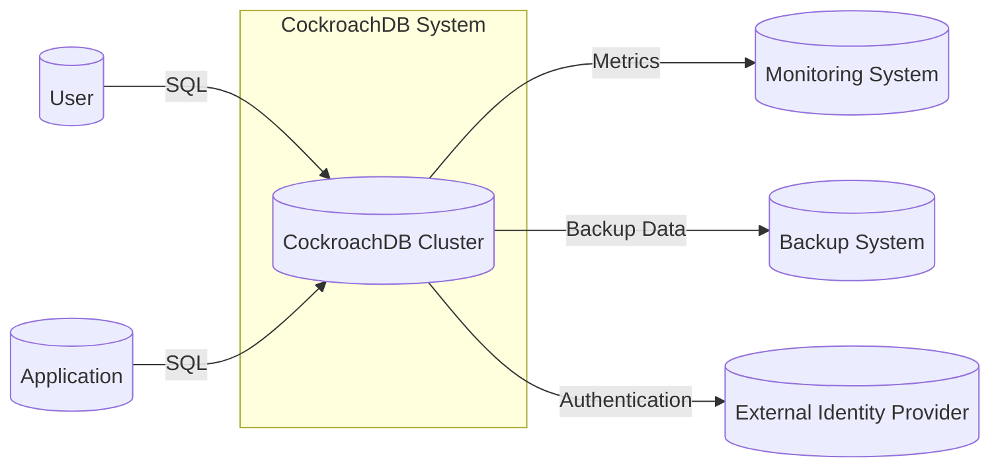
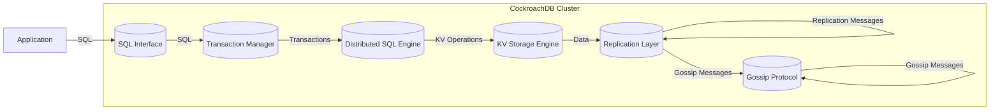
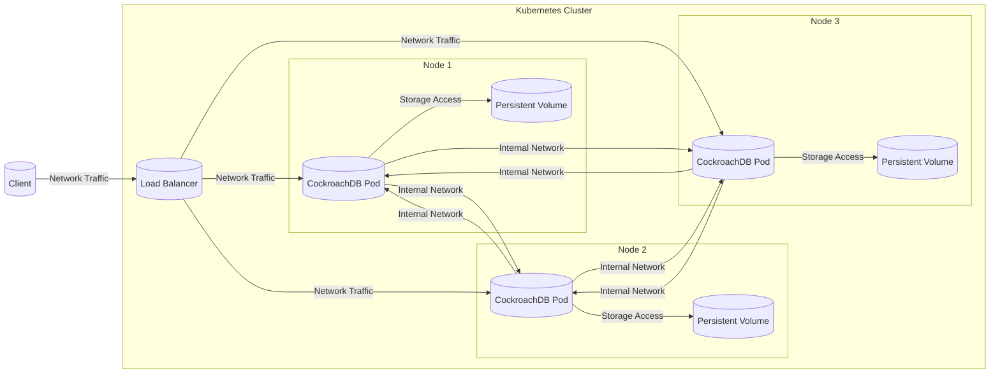
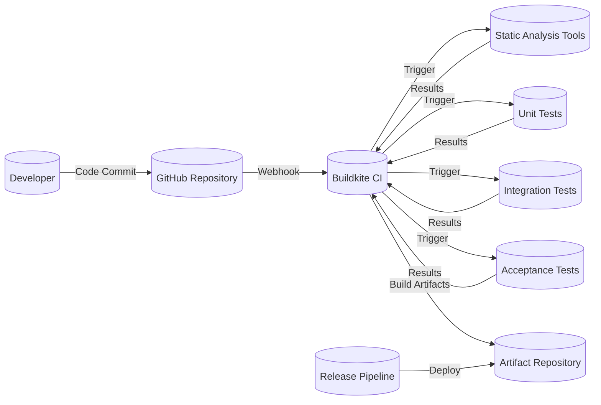

Okay, let's create a design document for CockroachDB, focusing on aspects relevant to threat modeling.

# BUSINESS POSTURE

CockroachDB is a distributed SQL database designed for consistency, scalability, and survivability.  It aims to provide a database solution that can handle high volumes of transactional data while remaining resilient to failures, even at the datacenter level.  It targets businesses that require strong data consistency and high availability, particularly those operating in cloud-native or geographically distributed environments.

Business Priorities:

*   Data Consistency:  Ensuring ACID (Atomicity, Consistency, Isolation, Durability) properties for transactions is paramount.  This is a core differentiator from many NoSQL databases.
*   High Availability:  Minimizing downtime and ensuring continuous operation, even in the face of node or datacenter failures.
*   Scalability:  Ability to handle increasing workloads and data volumes by adding more nodes to the cluster.
*   Operational Simplicity:  Reducing the complexity of managing a distributed database.
*   Cloud-Native Compatibility:  Designed to work well in containerized and orchestrated environments (e.g., Kubernetes).
*   Geo-Distribution: Supporting deployments across multiple geographic regions for low latency and data locality.

Business Risks:

*   Data Loss or Corruption:  Any failure that compromises the integrity or availability of data is a critical risk.
*   Service Outage:  Extended periods of unavailability can lead to significant business disruption and financial losses.
*   Performance Degradation:  Slow query performance or high latency can negatively impact user experience and application functionality.
*   Security Breach:  Unauthorized access to data or control of the database could lead to data breaches, reputational damage, and legal liabilities.
*   Operational Complexity: Difficulty in managing, monitoring, and troubleshooting the distributed system could lead to errors and inefficiencies.
*   Cost Overruns: Inefficient resource utilization or unexpected scaling needs could lead to higher-than-anticipated infrastructure costs.

# SECURITY POSTURE

CockroachDB incorporates several built-in security features and supports secure deployment practices.

Existing Security Controls:

*   security control: Network Encryption: TLS encryption for all inter-node communication and client-server communication. (Implemented in Go's `net/http` and `crypto/tls` packages, configured via command-line flags and environment variables).
*   security control: Authentication: Supports multiple authentication methods, including password-based authentication, certificate-based authentication, and integration with external identity providers (e.g., via GSSAPI). (Described in CockroachDB documentation and implemented in the `security` and `server` packages).
*   security control: Authorization: Role-Based Access Control (RBAC) to manage user privileges and restrict access to specific databases, tables, and operations. (Implemented in the `sql` package and controlled via SQL commands like `GRANT` and `REVOKE`).
*   security control: Auditing: Logging of database events, including successful and failed login attempts, schema changes, and data modifications. (Implemented in the `util/log` package and configurable via command-line flags).
*   security control: Data at Rest Encryption: Encryption of data stored on disk. (Implemented using Go's `crypto` libraries and configurable via command-line flags).
*   security control: Input Validation: SQL parsing and query planning to prevent SQL injection vulnerabilities. (Implemented in the `sql` package).
*   security control: Regular Security Audits and Penetration Testing: Cockroach Labs conducts regular security assessments. (Described in their security documentation).
*   security control: Secure Software Development Practices: Cockroach Labs follows secure coding guidelines and uses static analysis tools. (Inferred from their development process and public statements).

Accepted Risks:

*   accepted risk: Complexity of Distributed Systems: Managing a distributed database inherently involves complexities that can introduce potential security risks if not properly configured and monitored.
*   accepted risk: Reliance on Underlying Infrastructure: The security of CockroachDB ultimately depends on the security of the underlying infrastructure (e.g., network, operating system, hardware).
*   accepted risk: Potential for Zero-Day Vulnerabilities: Like any software, CockroachDB is susceptible to unknown vulnerabilities that could be exploited before patches are available.

Recommended Security Controls:

*   security control: Enhanced Network Segmentation: Implement stricter network policies to isolate CockroachDB nodes from other systems and limit network access to only necessary ports and protocols.
*   security control: Intrusion Detection and Prevention Systems (IDPS): Deploy IDPS to monitor network traffic and detect malicious activity.
*   security control: Regular Vulnerability Scanning: Conduct regular vulnerability scans of the CockroachDB deployment and underlying infrastructure.
*   security control: Key Management: Use a robust key management system to protect encryption keys.
*   security control: Multi-Factor Authentication (MFA): Enforce MFA for all administrative users.

Security Requirements:

*   Authentication:
    *   Support strong password policies.
    *   Provide options for certificate-based authentication.
    *   Integrate with existing enterprise identity providers (e.g., LDAP, Active Directory).
    *   Implement robust session management.

*   Authorization:
    *   Implement fine-grained access control using RBAC.
    *   Support the principle of least privilege.
    *   Allow for granular control over database objects and operations.

*   Input Validation:
    *   Prevent SQL injection vulnerabilities through rigorous input validation and parameterized queries.
    *   Sanitize all user inputs to prevent other types of injection attacks.

*   Cryptography:
    *   Use strong, industry-standard encryption algorithms for data in transit and at rest.
    *   Protect encryption keys using a secure key management system.
    *   Regularly review and update cryptographic protocols and algorithms.

# DESIGN

## C4 CONTEXT

C4 Context Element Descriptions:

*   Element:
    *   Name: User
    *   Type: Person
    *   Description: A human user interacting directly with CockroachDB, typically through a SQL client.
    *   Responsibilities: Execute SQL queries, manage database objects, administer the database.
    *   Security controls: Authentication, Authorization, Auditing.

*   Element:
    *   Name: Application
    *   Type: Software System
    *   Description: A software application that uses CockroachDB as its database.
    *   Responsibilities: Interact with CockroachDB to store and retrieve data, perform business logic.
    *   Security controls: Authentication, Authorization, Input Validation, Secure Communication (TLS).

*   Element:
    *   Name: CockroachDB Cluster
    *   Type: Software System
    *   Description: The distributed SQL database system.
    *   Responsibilities: Store data, process SQL queries, ensure data consistency and availability.
    *   Security controls: Network Encryption, Authentication, Authorization, Auditing, Data at Rest Encryption, Input Validation.

*   Element:
    *   Name: Monitoring System
    *   Type: Software System
    *   Description: A system that collects and displays metrics from the CockroachDB cluster.
    *   Responsibilities: Monitor the health and performance of the database.
    *   Security controls: Secure Communication (TLS), Authentication.

*   Element:
    *   Name: Backup System
    *   Type: Software System
    *   Description: A system that stores backups of the CockroachDB data.
    *   Responsibilities: Create and restore backups of the database.
    *   Security controls: Data Encryption, Access Control.

*   Element:
    *   Name: External Identity Provider
    *   Type: Software System
    *   Description: An external system used for user authentication (e.g., LDAP, Active Directory).
    *   Responsibilities: Authenticate users and provide identity information to CockroachDB.
    *   Security controls: Secure Communication (TLS), Strong Authentication Mechanisms.

## C4 CONTAINER

C4 Container Element Descriptions:

*   Element:
    *   Name: SQL Interface
    *   Type: Container (API)
    *   Description: The entry point for SQL clients and applications.
    *   Responsibilities: Parse SQL queries, perform authentication and authorization, route requests to the transaction manager.
    *   Security controls: Authentication, Authorization, Input Validation, Network Encryption (TLS).

*   Element:
    *   Name: Transaction Manager
    *   Type: Container (Component)
    *   Description: Manages distributed transactions and ensures ACID properties.
    *   Responsibilities: Coordinate transactions across multiple nodes, handle concurrency control, ensure atomicity and isolation.
    *   Security controls: Access Control.

*   Element:
    *   Name: Distributed SQL Engine (DistSQL)
    *   Type: Container (Component)
    *   Description: Optimizes and executes SQL queries across multiple nodes.
    *   Responsibilities: Plan and execute distributed queries, optimize data access, aggregate results.
    *   Security controls: Access Control.

*   Element:
    *   Name: KV Storage Engine
    *   Type: Container (Component)
    *   Description: Provides a distributed key-value store for storing data.
    *   Responsibilities: Store and retrieve data based on keys, manage data persistence.
    *   Security controls: Data at Rest Encryption, Access Control.

*   Element:
    *   Name: Replication Layer
    *   Type: Container (Component)
    *   Description: Replicates data across multiple nodes for high availability and fault tolerance.
    *   Responsibilities: Replicate data changes, handle node failures, ensure data consistency.
    *   Security controls: Network Encryption (TLS), Data Integrity Checks.

*   Element:
    *   Name: Gossip Protocol
    *   Type: Container (Component)
    *   Description: Used for node discovery and cluster membership management.
    *   Responsibilities: Share information about node status and cluster configuration.
    *   Security controls: Network Encryption (TLS).

## DEPLOYMENT

CockroachDB can be deployed in various environments, including:

1.  Bare Metal: Directly on physical servers.
2.  Virtual Machines: On virtual machines within a private or public cloud.
3.  Containers (Kubernetes): Within a container orchestration platform like Kubernetes. This is the recommended and most common deployment method.
4.  Cloud Provider Managed Services: Using managed CockroachDB services offered by cloud providers (e.g., CockroachDB Dedicated on AWS, GCP, or Azure).

We'll describe the Kubernetes deployment in detail:

Deployment Element Descriptions:

*   Element:
    *   Name: Client
    *   Type: External Entity
    *   Description: An application or user connecting to the CockroachDB cluster.
    *   Responsibilities: Send requests to the database.
    *   Security controls: Network Security (e.g., firewalls), Client-side Authentication.

*   Element:
    *   Name: Load Balancer
    *   Type: Infrastructure Node
    *   Description: Distributes client traffic across multiple CockroachDB pods.
    *   Responsibilities: Route traffic to healthy pods, provide a single point of access.
    *   Security controls: TLS Termination, Network Access Control.

*   Element:
    *   Name: CockroachDB Pod
    *   Type: Container Instance
    *   Description: A Kubernetes pod running a single instance of the CockroachDB server.
    *   Responsibilities: Execute database operations, participate in the distributed consensus.
    *   Security controls: Container Security (e.g., image scanning, resource limits), Network Policies.

*   Element:
    *   Name: Persistent Volume
    *   Type: Storage
    *   Description: Persistent storage for the CockroachDB data.
    *   Responsibilities: Store data reliably, even if pods are restarted.
    *   Security controls: Data at Rest Encryption, Storage Access Control.

*   Element:
    *   Name: Node 1, Node 2, Node 3
    *   Type: Infrastructure Node
    *   Description: Kubernetes worker nodes hosting the CockroachDB pods.
    *   Responsibilities: Provide compute and storage resources for the pods.
    *   Security controls: Operating System Security, Network Security.

## BUILD

CockroachDB's build process is automated and incorporates several security measures. The process generally follows these steps:

1.  Development: Developers write code and submit pull requests to the GitHub repository.
2.  Code Review: Pull requests are reviewed by other developers for correctness, security, and style.
3.  Automated Build (CI): CockroachDB uses Buildkite as its CI system. When a pull request is created or updated, Buildkite automatically triggers a build.
4.  Static Analysis: The build process includes static analysis tools (e.g., linters, static analyzers for Go) to identify potential code quality and security issues.
5.  Unit Tests: Extensive unit tests are run to verify the correctness of individual components.
6.  Integration Tests: Integration tests are run to test the interaction between different components.
7.  Acceptance Tests: Acceptance tests are run to verify the overall functionality of the system.
8.  Artifact Creation: If all tests pass, the build process creates build artifacts, including binaries and container images.
9.  Artifact Storage: Build artifacts are stored in a secure repository.
10. Release Process: Cockroach Labs follows a defined release process to promote builds to different environments (e.g., testing, staging, production).

Build Security Controls:

*   security control: Code Review: Mandatory code reviews help to identify potential security vulnerabilities before they are merged into the codebase.
*   security control: Static Analysis: Automated static analysis tools detect potential security flaws, such as buffer overflows, SQL injection vulnerabilities, and insecure coding practices.
*   security control: Automated Testing: Comprehensive testing (unit, integration, acceptance) helps to ensure that security features are working as expected and that new code changes do not introduce regressions.
*   security control: Buildkite CI: Buildkite provides a secure and controlled environment for building and testing the software.
*   security control: Artifact Repository: Build artifacts are stored in a secure repository with access control.
*   security control: Supply Chain Security: CockroachDB is working on improving supply chain security, including signing build artifacts and using software bill of materials (SBOMs).

# RISK ASSESSMENT

Critical Business Processes:

*   Online Transaction Processing (OLTP): CockroachDB is primarily designed for OLTP workloads, where data consistency and availability are critical.
*   Data Storage and Retrieval: The core function of the database is to store and retrieve data reliably and efficiently.
*   Business Continuity and Disaster Recovery: CockroachDB's distributed architecture is designed to support business continuity and disaster recovery.

Data Sensitivity:

The data stored in CockroachDB can vary in sensitivity depending on the specific application. It can range from:

*   Non-sensitive data: Publicly available information.
*   Personally Identifiable Information (PII): Names, addresses, email addresses, etc.
*   Protected Health Information (PHI): Medical records and other health-related data.
*   Financial Data: Credit card numbers, bank account details, transaction history.
*   Proprietary Business Data: Trade secrets, intellectual property, confidential business information.

CockroachDB itself does not inherently classify data sensitivity. It is the responsibility of the application and the database administrator to implement appropriate security controls based on the sensitivity of the data being stored.

# QUESTIONS & ASSUMPTIONS

Questions:

*   What specific compliance requirements (e.g., GDPR, HIPAA, PCI DSS) must the CockroachDB deployment meet?
*   What are the specific performance requirements (e.g., transactions per second, latency)?
*   What is the expected growth rate of the data and workload?
*   What are the existing security policies and procedures of the organization deploying CockroachDB?
*   What is the level of expertise of the team managing the CockroachDB deployment?
*   What monitoring and alerting systems are in place?
*   What is the backup and recovery strategy?
*   Are there any specific threat actors or attack vectors that are of particular concern?

Assumptions:

*   BUSINESS POSTURE: The organization deploying CockroachDB prioritizes data consistency, high availability, and security.
*   SECURITY POSTURE: The organization has a basic understanding of security best practices and is willing to invest in security measures. The underlying infrastructure (network, operating system, Kubernetes cluster) is reasonably secure.
*   DESIGN: The CockroachDB deployment will be managed by a team with some experience in distributed systems and Kubernetes. The deployment will follow CockroachDB's recommended best practices.