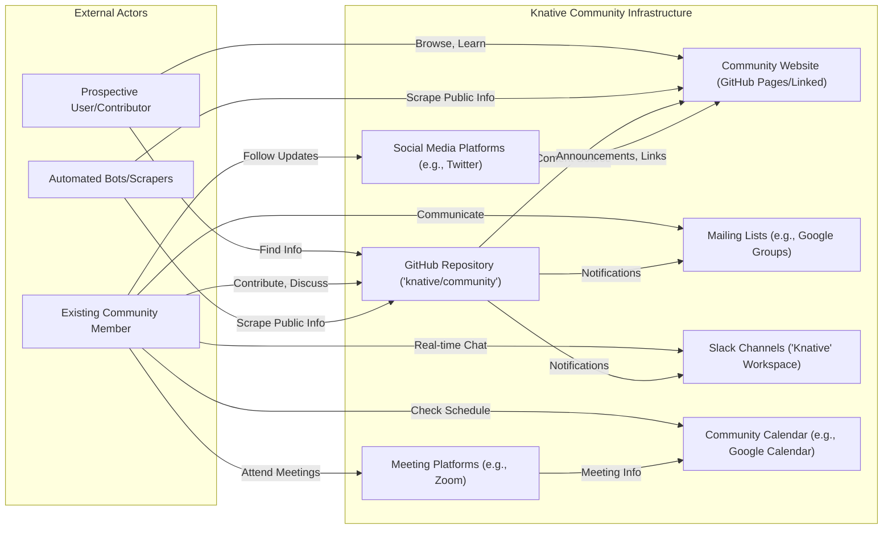
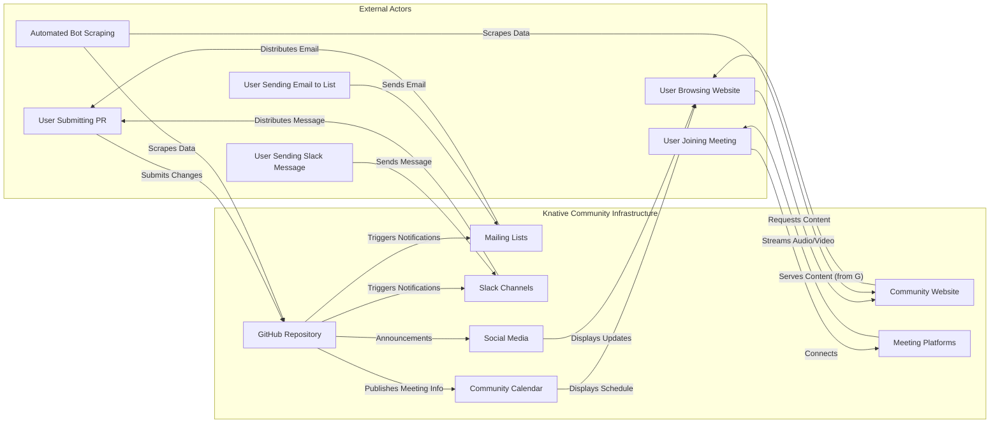

## Project Design Document: Knative Community (Improved)

**1. Introduction**

This document provides a detailed architectural overview of the Knative Community project, primarily hosted on GitHub at [https://github.com/knative/community](https://github.com/knative/community). This document is designed to serve as a foundation for subsequent threat modeling activities by clearly outlining the project's components, data flows, and interactions, with a focus on identifying potential attack surfaces.

**2. Goals and Objectives**

The primary goals of the Knative Community project are to:

*   Cultivate a thriving and collaborative community around the Knative project.
*   Serve as the central, authoritative source for community-related information, guidelines, and processes.
*   Facilitate effective communication and engagement among diverse community members.
*   Document and make transparent community governance and decision-making processes.
*   Provide resources and guidance to onboard new contributors and users to the Knative ecosystem.

**3. Scope**

This design document focuses on the publicly accessible and directly managed aspects of the Knative Community project, primarily encompassing:

*   The core GitHub repository (`github.com/knative/community`) and its contents.
*   The official community website and documentation, whether hosted within the repository (e.g., using GitHub Pages) or linked directly from it.
*   Publicly accessible and officially managed communication channels, such as designated mailing lists and the official Knative Slack workspace (to the extent their management is linked to the community repository).
*   Publicly accessible meeting minutes, recordings, and associated documents officially linked within the community repository.

This document explicitly excludes:

*   The internal infrastructure and codebase of the core Knative project components (e.g., Serving, Eventing).
*   Individual contributors' personal development environments and tools.
*   Private or unofficial communication channels not directly managed or officially linked within the community repository.
*   The security posture of third-party services integrated with the community infrastructure (these are noted but not analyzed in detail).

**4. High-Level Architecture**

**5. Component Details**

*   **GitHub Repository ('knative/community'):**
    *   **Purpose:** The central, version-controlled repository for all community-related documentation, guidelines, meeting minutes, governance information, and processes. Serves as the primary platform for contribution and collaboration.
    *   **Functionality:**
        *   Version control of documents using Git.
        *   Issue tracking for bug reports, feature requests, discussions, and action items.
        *   Pull requests for proposing and reviewing contributions and changes.
        *   Wikis for collaboratively building and maintaining documentation.
        *   Discussions for asynchronous communication and brainstorming.
        *   Mechanisms for enforcing the Code of Conduct (e.g., reporting).
        *   Branching and merging strategies for managing changes and releases of documentation.
        *   Fine-grained access control based on GitHub roles (e.g., maintainers, committers, contributors, read-only).
    *   **Data Involved:**
        *   Markdown files (documents, meeting minutes, governance charters, etc.).
        *   Issue and pull request metadata (titles, descriptions, comments, labels, assignees, milestones).
        *   Wiki page content and revision history.
        *   Discussion threads and individual posts.
        *   Usernames and associated activity logs (e.g., commits, issue creation).
        *   Contribution history and statistics.
    *   **User Interaction:**
        *   Browsing files and directories.
        *   Reading and commenting on issues and pull requests.
        *   Creating new issues and submitting pull requests.
        *   Editing wiki pages (with appropriate permissions).
        *   Participating in discussion forums.
        *   Starring and watching the repository for updates.
        *   Forking the repository to propose changes.
    *   **Technology Stack:** Git, GitHub platform infrastructure and services.

*   **Community Website (GitHub Pages/Linked):**
    *   **Purpose:** To provide a user-friendly and organized interface for accessing key community information, often built using static site generators and hosted via GitHub Pages or an externally linked service. Acts as a curated entry point to community resources.
    *   **Functionality:**
        *   Displaying structured information organized into pages and sections (e.g., getting started, governance, contributing).
        *   Providing clear navigation and links to relevant resources within the GitHub repository and external sites.
        *   Potentially embedding content dynamically sourced from the GitHub repository (e.g., latest meeting minutes).
        *   May include a blog or news section for announcements.
        *   Search functionality to locate specific information.
    *   **Data Involved:**
        *   HTML, CSS, and JavaScript files for the website's structure and presentation.
        *   Images, videos, and other media assets.
        *   Content sourced directly from Markdown files within the GitHub repository, often rendered as HTML.
        *   Potentially data from external sources via APIs or embedded iframes.
    *   **User Interaction:**
        *   Browsing website pages and navigating through the site.
        *   Following links to other internal and external resources.
        *   Reading blog posts or news updates.
        *   Using the search functionality.
    *   **Technology Stack:** Potentially Jekyll, Hugo, or other static site generators; HTML, CSS, JavaScript; GitHub Pages infrastructure or external hosting providers.

*   **Mailing Lists (e.g., Google Groups):**
    *   **Purpose:** To facilitate asynchronous, email-based communication and discussions among community members on specific topics.
    *   **Functionality:**
        *   Sending and receiving emails to a group of subscribed members.
        *   Archiving past discussions for future reference.
        *   Subscription management (joining, leaving, configuring email preferences).
        *   Potentially moderation features to manage inappropriate content.
    *   **Data Involved:**
        *   Email addresses of subscribers.
        *   Email content (subject, body, sender/recipient information, headers).
        *   Subscription status and preferences for each member.
        *   Archive of past email communications.
    *   **User Interaction:**
        *   Subscribing and unsubscribing to mailing lists.
        *   Sending and receiving emails to the list.
        *   Browsing the archives of past discussions.
    *   **Technology Stack:** Typically Google Groups or similar mailing list service providers.

*   **Slack Channels ('Knative' Workspace):**
    *   **Purpose:** To provide real-time, text-based communication and collaboration channels for the community, enabling quick discussions and information sharing.
    *   **Functionality:**
        *   Sending and receiving messages in organized channels dedicated to specific topics.
        *   Direct messaging between individual users.
        *   Threaded conversations within channels to maintain context.
        *   File sharing capabilities.
        *   Integrations with other tools and services (e.g., GitHub notifications).
        *   Search functionality for past messages.
    *   **Data Involved:**
        *   User profiles (usernames, potentially email addresses, display names).
        *   Messages and their content, including timestamps and sender information.
        *   Files shared within channels and direct messages.
        *   Channel membership information and permissions.
        *   Logs of user activity within the workspace.
    *   **User Interaction:**
        *   Sending and receiving messages in public and private channels.
        *   Joining and leaving channels.
        *   Participating in threaded conversations.
        *   Sharing files with other users.
        *   Searching for past messages and information.
    *   **Technology Stack:** Slack platform infrastructure and services.

*   **Meeting Platforms (e.g., Zoom):**
    *   **Purpose:** To host virtual meetings for community discussions, working groups, governance meetings, and other collaborative activities.
    *   **Functionality:**
        *   Video and audio conferencing capabilities.
        *   Screen sharing functionality.
        *   Recording meetings (typically with consent and for archival purposes).
        *   Chat functionality during meetings.
        *   Features for managing participants (e.g., muting, promoting).
    *   **Data Involved:**
        *   Meeting recordings (audio and video files).
        *   Chat logs generated during meetings.
        *   Participant lists and attendance information.
        *   Potentially screen sharing content captured in recordings.
    *   **User Interaction:**
        *   Joining and participating in scheduled meetings.
        *   Sharing video and audio feeds.
        *   Sharing their screen with other participants.
        *   Using the chat feature to communicate during the meeting.
    *   **Technology Stack:** Zoom, Google Meet, or similar video conferencing platforms and their associated infrastructure.

*   **Community Calendar (e.g., Google Calendar):**
    *   **Purpose:** To publicly display the schedule of upcoming community meetings, events, and important deadlines. Provides a central location for tracking community activities.
    *   **Functionality:**
        *   Listing upcoming events with dates, times, descriptions, and relevant links (e.g., meeting links).
        *   Allowing users to add events to their personal calendars.
        *   Potentially providing reminders for upcoming events.
    *   **Data Involved:**
        *   Event titles, dates, times, and descriptions.
        *   Links to meeting platforms or other relevant resources.
        *   Potentially information about event organizers or contacts.
    *   **User Interaction:**
        *   Viewing the calendar to see scheduled events.
        *   Adding events to their personal calendars.
        *   Following links to join meetings or access event details.
    *   **Technology Stack:** Google Calendar or similar online calendaring platforms.

*   **Social Media Platforms (e.g., Twitter):**
    *   **Purpose:** To publicly announce community updates, events, news, and engage with the broader open-source community. Used for outreach and dissemination of information.
    *   **Functionality:**
        *   Posting updates, announcements, and links to relevant resources.
        *   Engaging with followers through replies and retweets.
        *   Promoting community events and initiatives.
    *   **Data Involved:**
        *   Tweets and other social media posts (text, images, links).
        *   Follower counts and engagement metrics.
        *   Potentially direct messages exchanged with users.
    *   **User Interaction:**
        *   Following the community's social media accounts.
        *   Reading and interacting with posts (liking, retweeting, replying).
        *   Sharing posts with their own networks.
    *   **Technology Stack:** Twitter, Mastodon, or other social media platforms and their respective APIs.

**6. Data Flow**

**7. Security Considerations (Focused on Threat Modeling)**

This section outlines potential security threats and vulnerabilities associated with each component, categorized by potential impact and likelihood.

*   **GitHub Repository ('knative/community'):**
    *   **Threat:** Malicious Contribution Injection
        *   **Threat Agent:** Malicious Contributor
        *   **Goal:** Introduce malicious code or content (e.g., scripts in documents) that could be executed by other users or compromise the integrity of the repository.
        *   **Mitigation:** Code review processes, input sanitization for web-based editing, access controls.
    *   **Threat:** Account Compromise (Maintainer/Committer)
        *   **Threat Agent:** External Attacker
        *   **Goal:** Gain unauthorized access to a privileged account to modify content, introduce malicious changes, or disrupt the project.
        *   **Mitigation:** Strong authentication (MFA), secure key management, regular security audits.
    *   **Threat:** Denial of Service (DoS)
        *   **Threat Agent:** Malicious User/Bot
        *   **Goal:** Overwhelm the repository with excessive requests (e.g., issue/PR spam) to disrupt its availability.
        *   **Mitigation:** Rate limiting, CAPTCHA for certain actions, abuse reporting mechanisms.
    *   **Threat:** Data Breach (Sensitive Information Exposure)
        *   **Threat Agent:** Insider Threat/External Attacker
        *   **Goal:** Access and exfiltrate sensitive information inadvertently stored in the repository (e.g., API keys, credentials).
        *   **Mitigation:** Regular audits for sensitive data, secure storage practices, access controls.

*   **Community Website (GitHub Pages/Linked):**
    *   **Threat:** Cross-Site Scripting (XSS)
        *   **Threat Agent:** Malicious Contributor/Attacker
        *   **Goal:** Inject malicious scripts into the website that can be executed in the browsers of other users, potentially stealing cookies or redirecting to malicious sites.
        *   **Mitigation:** Input sanitization, output encoding, Content Security Policy (CSP).
    *   **Threat:** Defacement
        *   **Threat Agent:** Unauthorized User
        *   **Goal:** Modify the website content to display misleading or malicious information, damaging the community's reputation.
        *   **Mitigation:** Strong access controls for website content management, regular backups.
    *   **Threat:** Man-in-the-Middle (MitM) Attack
        *   **Threat Agent:** Network Attacker
        *   **Goal:** Intercept communication between users and the website to steal credentials or sensitive information.
        *   **Mitigation:** Enforce HTTPS, use secure hosting configurations.

*   **Mailing Lists (e.g., Google Groups):**
    *   **Threat:** Spam and Phishing
        *   **Threat Agent:** Spammers/Phishers
        *   **Goal:** Distribute unsolicited or malicious emails to community members, potentially leading to credential theft or malware infection.
        *   **Mitigation:** Spam filtering, moderation policies, user education.
    *   **Threat:** Email Spoofing
        *   **Threat Agent:** Malicious Actor
        *   **Goal:** Send emails that appear to originate from legitimate community members or addresses to deceive recipients.
        *   **Mitigation:** SPF, DKIM, DMARC email authentication protocols.

*   **Slack Channels ('Knative' Workspace):**
    *   **Threat:** Social Engineering
        *   **Threat Agent:** Malicious Actor
        *   **Goal:** Deceive community members into revealing sensitive information or performing actions that compromise security.
        *   **Mitigation:** User education, clear guidelines on sharing sensitive information.
    *   **Threat:** Account Takeover
        *   **Threat Agent:** External Attacker
        *   **Goal:** Gain unauthorized access to user accounts to spread misinformation or perform malicious actions.
        *   **Mitigation:** Enforce MFA, encourage strong passwords.
    *   **Threat:** Data Leakage
        *   **Threat Agent:** Insider Threat/Compromised Account
        *   **Goal:** Exfiltrate sensitive information shared within Slack channels.
        *   **Mitigation:** Data retention policies, access controls for sensitive channels.

*   **Meeting Platforms (e.g., Zoom):**
    *   **Threat:** Unauthorized Access (Zoombombing)
        *   **Threat Agent:** Uninvited Participants
        *   **Goal:** Disrupt meetings with inappropriate content or behavior.
        *   **Mitigation:** Meeting passwords, waiting rooms, locking meetings.
    *   **Threat:** Recording Without Consent
        *   **Threat Agent:** Malicious Participant
        *   **Goal:** Record meetings without the knowledge or consent of participants, potentially capturing sensitive information.
        *   **Mitigation:** Clear policies on recording, visible recording indicators.

*   **Community Calendar (e.g., Google Calendar):**
    *   **Threat:** Calendar Spam/Malicious Event Injection
        *   **Threat Agent:** Malicious Actor
        *   **Goal:** Add misleading or malicious events to the calendar, potentially directing users to harmful links.
        *   **Mitigation:** Restrict calendar editing permissions, monitor for suspicious events.

*   **Social Media Platforms (e.g., Twitter):**
    *   **Threat:** Account Hijacking
        *   **Threat Agent:** External Attacker
        *   **Goal:** Gain unauthorized access to the community's social media accounts to spread misinformation or damage reputation.
        *   **Mitigation:** Strong passwords, MFA, secure account management practices.
    *   **Threat:** Phishing Links in Posts
        *   **Threat Agent:** Malicious Actor
        *   **Goal:** Post links to phishing sites disguised as legitimate community resources.
        *   **Mitigation:** Link shortening services with security checks, monitoring for suspicious links.

**8. Assumptions and Constraints**

*   The security of third-party platforms (e.g., GitHub, Slack, Zoom, Google Groups) is primarily the responsibility of those providers. The community relies on their security measures.
*   Public communication channels are inherently less secure than private channels. Information shared on these platforms should be considered public.
*   Community members are expected to adhere to the project's Code of Conduct, which includes guidelines for respectful and responsible behavior.
*   Maintainers and committers have elevated privileges within the GitHub repository and are trusted to act responsibly.
*   This document focuses on the security of the community's online presence and does not cover the security of the core Knative project's codebase or infrastructure.

**9. Future Considerations**

*   Regular security audits of the community infrastructure and processes should be conducted.
*   Formal security policies and incident response plans should be developed and documented.
*   As the community grows and evolves, the security landscape may change, requiring updates to this design document and security measures.
*   Consider implementing security awareness training for community members, especially those with elevated privileges.

This improved design document provides a more detailed and threat-modeling-focused overview of the Knative Community project's architecture. It highlights potential attack surfaces and vulnerabilities, enabling the community to proactively address security risks and maintain a secure and collaborative environment.