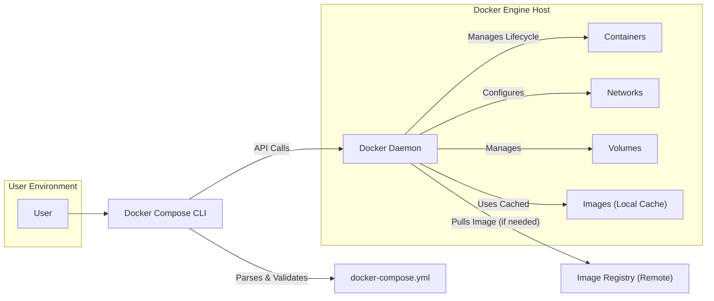
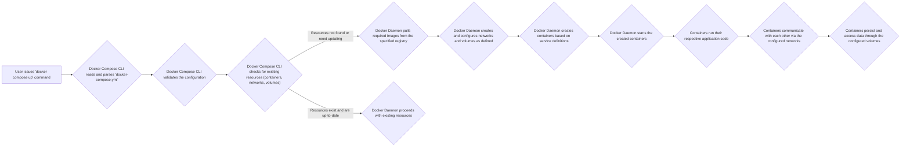

# Project Design Document: Docker Compose

**Version:** 1.1
**Date:** October 26, 2023
**Author:** AI Software Architect

## 1. Introduction

This document provides a detailed design overview of the Docker Compose project, as represented by the codebase at [https://github.com/docker/compose](https://github.com/docker/compose). This document aims to provide a comprehensive understanding of the system's architecture, components, and data flow, which will serve as the foundation for subsequent threat modeling activities. The target audience for this document includes security engineers, developers, and operations personnel involved in the security assessment and deployment of systems utilizing Docker Compose. This revision includes clarifications and expansions based on initial review.

## 2. Goals and Scope

The primary goal of this document is to clearly articulate the design of Docker Compose to facilitate effective threat modeling. The scope of this document encompasses:

*   The core functionality of Docker Compose in defining and managing multi-container Docker applications, including the lifecycle management of these applications.
*   Key components involved in the execution of Docker Compose commands, focusing on the interaction between the CLI and the Docker Engine.
*   The flow of data and commands within the system, from user input to the resulting state of the Docker environment.
*   Identification of critical interfaces and interactions, highlighting potential points of vulnerability.

This document will not cover:

*   The internal implementation details of the Docker Engine itself, beyond its interaction with Docker Compose.
*   Specific details of containerized application logic or the internal workings of the applications being orchestrated.
*   The user interface aspects beyond the command-line interface (CLI) and the structure of the `docker-compose.yml` file.

## 3. System Overview

Docker Compose is a tool for defining and running multi-container Docker applications. It leverages a declarative YAML file (`docker-compose.yml`) to configure the application's constituent services, their networking, and persistent storage. With a single command, users can orchestrate the creation, startup, and shutdown of all the services defined in the configuration. This simplifies the management of complex, multi-service applications.

Key concepts within Docker Compose include:

*   **Services:** Represent individual, isolated containers that form the building blocks of the application. Each service is defined by a Docker image and associated configuration.
*   **Networks:** Define isolated, virtual network environments that enable secure and controlled communication between containers within the application.
*   **Volumes:** Provide mechanisms for persistent data storage for containers, ensuring data survives container restarts and lifecycle changes. Volumes can be host-mounted or Docker-managed.
*   **`docker-compose.yml`:** The central YAML configuration file that declaratively defines the services, networks, volumes, dependencies, and other configurations required for the application.
*   **Docker Engine:** The underlying containerization runtime environment provided by Docker. Docker Compose acts as a client to the Docker Engine, instructing it to manage containers and related resources.

## 4. System Architecture

The architecture of Docker Compose is characterized by a client-server interaction model, where the Docker Compose CLI acts as the client and the Docker Engine as the server. The following diagram illustrates the key components and their interactions:

### 4.1. Component Descriptions

*   **User:** The individual or automated system interacting with the Docker Compose CLI to define, start, stop, or manage multi-container applications.
*   **Docker Compose CLI:** The command-line interface tool. It is responsible for:
    *   Parsing and validating the `docker-compose.yml` file.
    *   Translating the configuration into a series of API calls to the Docker Daemon.
    *   Managing the lifecycle of the application based on user commands.
*   **`docker-compose.yml`:** A YAML file that serves as the declarative specification for the multi-container application. It defines:
    *   Service definitions (image, ports, environment variables, etc.).
    *   Network configurations.
    *   Volume definitions and mount points.
    *   Dependencies between services.
*   **Docker Daemon:** The core component of the Docker Engine, responsible for:
    *   Receiving and processing API requests from the Docker Compose CLI.
    *   Pulling Docker images from registries.
    *   Creating, starting, stopping, and managing containers.
    *   Creating and managing networks and volumes.
    *   Managing the local image cache.
*   **Containers:** Isolated runtime environments for applications. They are created from Docker images and managed by the Docker Daemon.
*   **Networks:** Virtual networks managed by the Docker Daemon, providing isolated communication channels for containers.
*   **Volumes:** Persistent data storage locations managed by the Docker Daemon, accessible by containers.
*   **Images (Local Cache):** Stored templates used to create containers. The Docker Daemon maintains a local cache of pulled images.
*   **Image Registry (Remote):** A remote repository (e.g., Docker Hub, a private registry) where Docker images are stored and distributed. The Docker Daemon pulls images from these registries when needed.

## 5. Data Flow

The typical workflow of Docker Compose, initiated by the `docker compose up` command, involves the following sequence of actions:

Detailed data flow description:

*   **User Command:** The user initiates a Docker Compose command, such as `docker compose up`, instructing Docker Compose to start the application.
*   **Configuration Processing:** The Docker Compose CLI reads the `docker-compose.yml` file and parses its contents to understand the application's desired state.
*   **Configuration Validation:** The CLI validates the syntax and semantics of the `docker-compose.yml` file to ensure it's a valid configuration.
*   **Resource State Check:** Docker Compose queries the Docker Daemon via its API to determine the current state of the resources (containers, networks, volumes) defined in the configuration.
*   **Image Management:** If required images are not present locally or if a newer version is available, the Docker Daemon pulls the necessary images from the specified image registry.
*   **Resource Provisioning:** The Docker Daemon creates and configures the necessary networks and volumes as defined in the `docker-compose.yml`.
*   **Container Creation:** The Docker Daemon creates container instances based on the service definitions in the `docker-compose.yml`, utilizing the specified images and configurations.
*   **Container Startup:** The Docker Daemon starts the newly created containers.
*   **Application Execution:** The applications within the containers begin their execution.
*   **Inter-Service Communication:** Containers communicate with each other over the virtual networks configured by Docker Compose.
*   **Data Persistence:** Containers read and write data to the configured volumes, ensuring data persistence beyond the container's lifecycle.

## 6. Security Considerations (For Threat Modeling)

This section outlines key security considerations relevant for threat modeling Docker Compose deployments. These areas represent potential vulnerabilities and attack vectors.

*   **`docker-compose.yml` Security:**
    *   **Hardcoded Secrets:** Storing sensitive information (passwords, API keys) directly in the `docker-compose.yml` file.
    *   **Insecure File Permissions:** Incorrect permissions on the `docker-compose.yml` file allowing unauthorized access or modification.
    *   **Exposure in Version Control:** Accidentally committing sensitive information within the configuration file to version control systems.
    *   **External Entities:**  Referencing external resources or configurations that could be compromised.
*   **Image Security:**
    *   **Vulnerable Base Images:** Using base images with known security vulnerabilities.
    *   **Malicious Images:** Pulling and using compromised or malicious images from untrusted registries.
    *   **Lack of Image Verification:** Not verifying the authenticity and integrity of pulled images.
    *   **Supply Chain Attacks:** Vulnerabilities introduced through the image build process or dependencies.
*   **Network Security:**
    *   **Unnecessary Port Exposure:** Exposing container ports to the host or external networks without proper justification.
    *   **Lack of Network Segmentation:** Insufficient isolation between different services or environments.
    *   **Insecure Inter-Container Communication:** Communication between containers not being encrypted or authenticated when necessary.
*   **Volume Security:**
    *   **Sensitive Data in Volumes:** Storing sensitive data in volumes without proper encryption.
    *   **Incorrect Volume Permissions:** Incorrect permissions on host-mounted volumes allowing unauthorized access.
    *   **Data Leakage:** Potential for data leakage if volumes are not properly managed or cleaned up.
*   **Docker Engine Security:**
    *   **Docker Daemon Vulnerabilities:** Exploiting vulnerabilities in the Docker Daemon itself.
    *   **Insecure Daemon Configuration:** Running the Docker Daemon with insecure configurations or default settings.
    *   **Unauthorized API Access:** Gaining unauthorized access to the Docker Daemon API.
*   **User and Access Control:**
    *   **Excessive Permissions:** Users having more permissions than necessary to run Docker Compose commands.
    *   **Lack of Auditing:** Insufficient logging and auditing of Docker Compose actions.
    *   **Compromised Credentials:** User accounts or API keys used to interact with Docker Compose being compromised.
*   **Dependency Management:**
    *   **Vulnerabilities in Dependencies:**  Applications within containers having vulnerable dependencies.
    *   **Unverified Dependencies:**  Pulling dependencies from untrusted sources.

## 7. Future Considerations

While this document focuses on the current design for threat modeling, future considerations for Docker Compose development and security include:

*   **Enhanced Secrets Management Integration:** Tighter integration with dedicated secrets management solutions.
*   **Improved Security Scanning Capabilities:** Built-in or integrated tools for scanning images and configurations for vulnerabilities.
*   **Role-Based Access Control (RBAC):** Implementing more granular access control for Docker Compose operations.
*   **Integration with Security Information and Event Management (SIEM) Systems:**  Enhanced logging and integration with SIEM platforms for security monitoring.

## 8. Conclusion

This revised document provides a more detailed and comprehensive design overview of Docker Compose, elaborating on its architecture, components, and data flow. The enhanced descriptions and the expanded section on security considerations provide a stronger foundation for conducting thorough threat modeling. By understanding the intricacies of Docker Compose's design, security professionals can more effectively identify and mitigate potential risks associated with its use in deploying and managing multi-container applications.