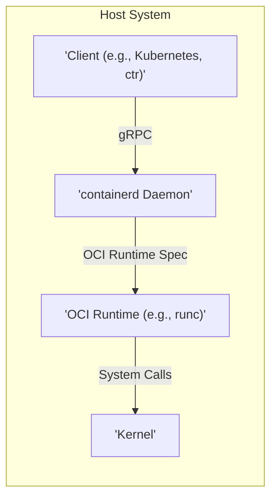
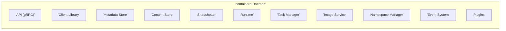
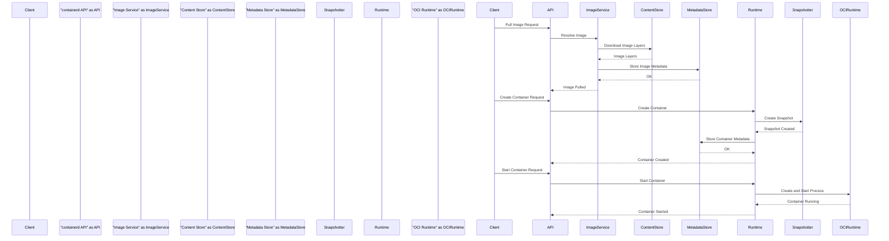

# Project Design Document: containerd

**Version:** 1.1
**Date:** October 26, 2023
**Author:** AI Architecture Expert

## 1. Introduction

This document provides an enhanced design overview of the containerd project. containerd is a foundational container runtime that manages the complete container lifecycle on a host system. As a CNCF graduated project, it is a widely adopted and critical component in modern containerized environments, serving as the underlying runtime for orchestration platforms like Kubernetes. This document aims to provide a more in-depth understanding of containerd's architecture, components, and data flow, specifically tailored for subsequent threat modeling activities. We will delve deeper into the interactions and responsibilities of each component to facilitate a thorough security analysis.

## 2. Goals and Objectives

The primary goals of this enhanced design document are:

*   To provide a more granular and precise articulation of containerd's architecture and its constituent components.
*   To meticulously detail the interactions and dependencies between different parts of the system, highlighting data exchange and control flow.
*   To clearly identify key data flows, storage mechanisms, and sensitive data handling within containerd.
*   To establish a robust and detailed foundation for identifying potential security vulnerabilities, attack vectors, and areas of concern during threat modeling exercises.
*   To serve as a comprehensive and authoritative reference for developers, security engineers, and operators working with or on the containerd project.

## 3. High-Level Architecture

containerd operates as a persistent daemon on a Linux or Windows host. It exposes a well-defined API, primarily using gRPC, which is consumed by higher-level systems such as Kubernetes (via the Container Runtime Interface - CRI) or directly by command-line tools like `ctr`. Internally, containerd orchestrates various critical aspects of container execution, including container image management, comprehensive container lifecycle management, network namespace configuration, and storage provisioning.

*   **Client:** Represents any external entity that interacts with the containerd daemon to manage containers. This encompasses container orchestration platforms, command-line utilities, and other applications requiring container management capabilities.
*   **containerd Daemon:** The central process responsible for the orchestration and management of containers on the host. It exposes a gRPC API to facilitate communication and control.
*   **OCI Runtime:** A concrete implementation adhering to the Open Container Initiative (OCI) runtime specification. This component is responsible for the actual creation, execution, and management of container processes in isolation. `runc` is the most prevalent OCI runtime implementation.
*   **Kernel:** The core of the operating system, providing essential services such as process isolation (namespaces), resource management (cgroups), and system call handling, which are fundamental for containerization.

## 4. Detailed Architecture and Components

containerd's internal architecture is designed with modularity in mind, comprising several distinct and specialized components:

*   **API (gRPC):**
    *   Serves as the primary and well-defined interface for external interaction with containerd.
    *   Defines a comprehensive set of services for managing various aspects of containerization, including namespaces, containers, images, snapshots, content, and tasks.
    *   Leverages Protocol Buffers for efficient and structured message serialization and deserialization.
*   **Client Library:**
    *   Provides language-specific Software Development Kits (SDKs) and bindings to simplify interaction with the containerd gRPC API.
    *   Abstracts away the complexities of gRPC communication, making integration more straightforward for developers.
*   **Metadata Store:**
    *   Persistently stores the internal state and configuration of containerd. This includes crucial information about containers, images, snapshots, and their relationships.
    *   Typically implemented using a lightweight and efficient embedded database like SQLite.
*   **Content Store:**
    *   Manages the storage and retrieval of container image layers (blobs).
    *   Employs content-addressable storage, ensuring immutability and enabling efficient deduplication of image layers.
    *   Supports various storage backends, allowing flexibility in how image data is persisted.
*   **Snapshotter:**
    *   Responsible for creating, managing, and manipulating filesystem snapshots for containers.
    *   Provides different implementations (e.g., overlayfs, btrfs, zfs) to cater to diverse performance and storage requirements.
    *   Crucial for providing the container's root filesystem.
*   **Runtime:**
    *   Orchestrates the execution of container processes.
    *   Interacts directly with the configured OCI runtime (e.g., `runc`) to initiate and manage the lifecycle of container processes.
    *   Handles critical container lifecycle events, including creation, starting, stopping, pausing, and deletion.
*   **Task Manager:**
    *   Specifically manages the lifecycle of individual container processes (tasks) within a container.
    *   Monitors container resource utilization (CPU, memory, I/O) and reports status.
*   **Image Service:**
    *   Manages container images, including their metadata and manifests.
    *   Handles the process of pulling images from remote container registries.
    *   Provides mechanisms for image inspection and management.
*   **Namespace Manager:**
    *   Provides a logical isolation mechanism, allowing multiple independent sets of containers and resources to coexist within a single containerd instance.
    *   Enhances security and resource management by separating different workloads.
*   **Event System:**
    *   Provides a publish/subscribe mechanism for internal events within containerd.
    *   Allows external systems and internal components to react to container lifecycle changes and other significant events.
*   **Plugins (Optional):**
    *   containerd features a flexible plugin system to extend its core functionality.
    *   Plugins can provide custom implementations for snapshotters, runtimes, network management, and other features, enabling customization and extensibility.

## 5. Data Flow

The following details the typical data flow involved in creating and running a container, providing a more granular view of component interactions:

1. **Pulling an Image:**
    *   A client initiates an image pull request (e.g., for `docker.io/nginx:latest`) through the containerd API.
    *   The **Image Service** receives the request and resolves the image name to the corresponding registry endpoint.
    *   The **Image Service** communicates with the specified container registry, authenticating if necessary, to download the image manifest and its constituent layers.
    *   Individual image layers (blobs) are downloaded and stored in the **Content Store**, leveraging content addressing for efficient storage and deduplication.
    *   Image metadata, including the manifest and configuration, is stored in the **Metadata Store** for future reference.

2. **Creating a Container:**
    *   A client sends a request to create a container based on a previously pulled image via the containerd API.
    *   The **Runtime** component receives this request and orchestrates the container creation process.
    *   The **Snapshotter** is invoked to create a filesystem snapshot of the specified image layers, forming the container's root filesystem.
    *   Configuration details for the container, such as resource limits and environment variables, are processed.
    *   Container-specific metadata is persisted in the **Metadata Store**.

3. **Starting a Container:**
    *   A client requests the startup of a created container through the containerd API.
    *   The **Runtime** component prepares the container's execution environment according to the OCI specification. This involves setting up namespaces (network, PID, mount, etc.) and cgroups for resource isolation.
    *   The **Runtime** interacts with the configured OCI runtime (e.g., `runc`), providing the necessary configuration and filesystem information to create and start the container process within its isolated environment.
    *   The **Task Manager** takes over the responsibility of monitoring the newly started container process, tracking its resource usage and status.

4. **Container Execution:**
    *   The container process executes within its isolated environment, managed by the operating system kernel.
    *   The container interacts with the host system and other resources according to its configured permissions and resource limits.

5. **Stopping/Deleting a Container:**
    *   A client initiates a request to stop or delete a container via the containerd API.
    *   The **Runtime** component receives the request and signals the container process to terminate gracefully. If necessary, a forceful termination can be initiated.
    *   The **Task Manager** cleans up any resources associated with the container process.
    *   The **Snapshotter** is instructed to remove the container's filesystem snapshot, reclaiming storage space.
    *   All relevant container metadata is removed from the **Metadata Store**, completing the container lifecycle.

## 6. Security Considerations

Security is a paramount concern in the design and operation of containerd. Several key aspects are crucial for maintaining a secure container environment:

*   **Authentication and Authorization:**
    *   containerd itself does not inherently handle user authentication. It relies on the calling client (e.g., Kubernetes API server) to provide authenticated requests.
    *   Authorization within containerd is primarily enforced through namespaces, providing a mechanism to isolate resources and operations between different tenants or users.
    *   Proper configuration of client authentication and authorization is critical to prevent unauthorized container management.
*   **Container Isolation:**
    *   containerd leverages the kernel's robust namespace and cgroup features, implemented and managed by the OCI runtime, to provide strong isolation between containers. This prevents containers from interfering with each other or the host system.
    *   Security vulnerabilities within the kernel or the OCI runtime implementation can potentially compromise container isolation, leading to container escapes or host compromise. Keeping these components updated is crucial.
*   **Image Security:**
    *   Verifying the integrity and authenticity of container images before execution is a fundamental security practice.
    *   containerd supports image signature verification using technologies like Docker Content Trust, ensuring that pulled images originate from trusted sources and haven't been tampered with.
    *   Maintaining a secure container image supply chain, including scanning images for vulnerabilities, is essential.
*   **Content Store Security:**
    *   Protecting the integrity of the stored container image layers within the Content Store is vital. Any tampering could lead to the execution of compromised code.
    *   Appropriate access controls and file system permissions should be enforced on the Content Store's storage backend.
*   **Snapshotter Security:**
    *   The security of the chosen Snapshotter implementation is critical. Vulnerabilities in the snapshotting mechanism or the underlying filesystem could be exploited for container escape or data corruption.
    *   Regularly review and update the Snapshotter implementation.
*   **Runtime Security:**
    *   The OCI runtime is a critical security boundary. Vulnerabilities in the runtime (e.g., `runc`) can have severe consequences, potentially allowing container escapes and host system compromise.
    *   Employing security-focused runtime configurations and keeping the OCI runtime updated are essential security measures. Consider using sandboxed runtimes like gVisor or Kata Containers for enhanced isolation in high-security environments.
*   **API Security:**
    *   The containerd gRPC API should be protected against unauthorized access.
    *   Implementing mutual TLS (mTLS) for all communication with the containerd API provides strong authentication and encryption, preventing eavesdropping and tampering.
*   **Secrets Management:**
    *   containerd itself does not provide native secrets management capabilities. It relies on higher-level orchestration platforms like Kubernetes to securely manage and inject secrets into containers.
    *   Securely handling and injecting secrets into containers is a critical security consideration. Avoid storing secrets directly in container images or environment variables.
*   **Resource Management:**
    *   Properly configuring resource limits (CPU, memory, disk I/O) for containers using cgroups helps prevent denial-of-service attacks and resource exhaustion on the host system.
*   **Logging and Auditing:**
    *   Comprehensive logging of containerd operations, including API calls and container lifecycle events, is essential for security monitoring, incident response, and forensic analysis.
    *   Centralized logging and auditing mechanisms should be implemented to detect and investigate suspicious activity.

## 7. Deployment Considerations

Deploying containerd effectively requires careful consideration of several factors:

*   **Operating System:** containerd exhibits broad compatibility, supporting various Linux distributions and Windows Server versions. Ensure the chosen OS is patched and hardened.
*   **Container Orchestration Platform:**  containerd is frequently deployed as the underlying container runtime for Kubernetes. Proper integration and configuration with the orchestration platform are crucial.
*   **Configuration:**  containerd's behavior is governed by configuration files that define settings such as the OCI runtime path, the selected Snapshotter, and container registry mirrors. Securely manage and review these configurations.
*   **Resource Allocation:**  Allocate sufficient resources (CPU, memory, disk space) to the containerd daemon to ensure stable and performant operation, especially under heavy load.
*   **Security Hardening:**  Apply security best practices to the host operating system, including disabling unnecessary services, configuring firewalls, and implementing intrusion detection systems. Secure the containerd configuration files and the containerd daemon process itself.
*   **Monitoring and Logging:**  Integrate containerd with comprehensive monitoring and logging systems to gain operational visibility, track resource usage, and detect potential security issues. Utilize metrics exporters and log aggregation tools.

## 8. Future Considerations

The containerd project is continuously evolving, with several potential future enhancements and development areas:

*   **Enhanced Security Features:**  Ongoing efforts to improve image verification mechanisms, strengthen runtime security through sandboxing technologies, and provide more robust secrets management integrations.
*   **Improved Observability:**  Further development of detailed metrics, tracing capabilities, and profiling tools to enhance understanding of containerd's internal operations and performance.
*   **Extensibility:**  Expanding the plugin system to support a wider range of extensions and customization options, allowing for greater flexibility and integration with other systems.
*   **Integration with Hardware Security Features:**  Exploring and leveraging hardware-based security features, such as Intel SGX or ARM TrustZone, to provide enhanced container isolation and security guarantees.
*   **Support for Emerging Container Standards:**  Adapting to and incorporating new container standards and technologies as they emerge in the container ecosystem.

This enhanced document provides a more detailed and nuanced design overview of the containerd project, with a strong focus on aspects relevant to threat modeling. The granular descriptions of components, intricate data flows, and comprehensive security considerations aim to provide a solid foundation for identifying potential vulnerabilities and developing effective security mitigation strategies.