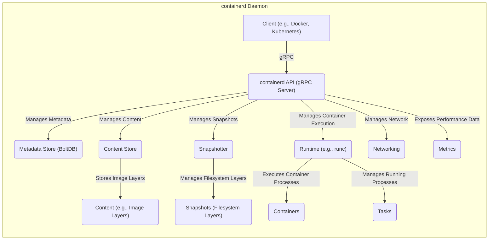
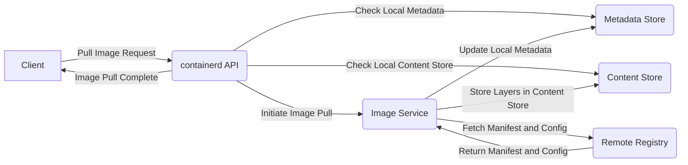
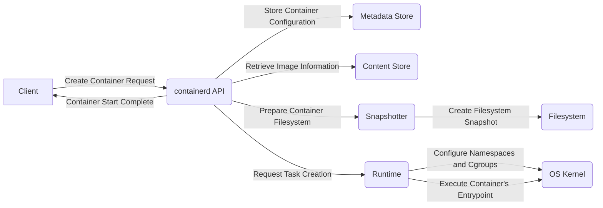

## Project Design Document: containerd

**Version:** 1.1
**Date:** October 26, 2023
**Author:** AI Software Architect

### 1. Introduction

This document provides an enhanced architectural design of the containerd project, a foundational container runtime widely adopted in the industry. The purpose of this document is to offer a clear and detailed understanding of containerd's internal structure, component interactions, and critical data flows. This comprehensive design serves as the essential groundwork for subsequent threat modeling activities, enabling a thorough security analysis.

### 2. Goals and Objectives

The core objectives driving the development of containerd are:

* **Lightweight and Efficient Core:** To deliver a minimal and performant container runtime, optimizing resource utilization.
* **Stable and Reliable Execution Platform:** To provide a dependable environment for executing containerized applications.
* **Embeddability:** To facilitate seamless integration into larger systems, notably Kubernetes and other orchestration platforms.
* **Adherence to Industry Standards:** To comply with established specifications, primarily the Open Container Initiative (OCI) standards for container images and runtime.
* **Well-Defined API:** To offer a robust and consistent Application Programming Interface for managing the complete lifecycle of containers.

### 3. High-Level Architecture

containerd employs a client-server model where external clients interact with the containerd daemon through gRPC. The daemon orchestrates the lifecycle management of containers, images, and associated resources.

### 4. Component Details

This section provides an in-depth description of the key components within the containerd architecture, outlining their responsibilities and functionalities.

* **containerd API (gRPC Server):**
    * Serves as the primary entry point for interacting with the containerd daemon.
    * Processes and manages requests related to containers, images, namespaces, and other resources.
    * Implements the Kubernetes Container Runtime Interface (CRI), enabling seamless integration with Kubernetes.
    * Exposes a comprehensive set of APIs for image management, including pulling, pushing, and inspecting container images.
    * Provides APIs for managing the container lifecycle, encompassing creation, starting, stopping, and deletion of containers.
    * Offers APIs for managing namespaces, providing a mechanism for resource isolation among different sets of containers.

* **Metadata Store (BoltDB):**
    * Functions as a persistent, embedded key-value database (using BoltDB) for storing metadata associated with containerd objects.
    * Retains critical information such as container configurations, image manifests, snapshot metadata, and the current state of running tasks.
    * Plays a vital role in maintaining the consistency and state of the container runtime across restarts and failures.

* **Content Store:**
    * Manages the storage and retrieval of content-addressable data, primarily focusing on container image layers.
    * Employs a content addressable storage (CAS) system, where each piece of content is uniquely identified by its cryptographic hash of its content.
    * Supports various content providers and mechanisms for importing content into the store.
    * Ensures the integrity of stored content through cryptographic verification, guaranteeing that retrieved data matches its expected hash.

* **Snapshotter:**
    * Responsible for managing the filesystem snapshots that form the basis of container root filesystems.
    * Offers pluggable snapshotter implementations (e.g., overlayfs, btrfs, zfs), allowing flexibility in how container filesystems are created and managed.
    * Efficiently manages the layering of filesystem changes, optimizing storage usage and enabling features like copy-on-write.

* **Runtime (e.g., runc):**
    * Represents the component that directly interfaces with the host operating system kernel to create and manage container processes.
    * Commonly implemented using a low-level, OCI-compliant container runtime such as runc.
    * Handles the crucial task of setting up the container environment, including the creation and configuration of namespaces (for isolation), cgroups (for resource management), and seccomp profiles (for security).
    * Executes the container's designated entrypoint process within the isolated environment.

* **Networking:**
    * Manages the networking configuration and connectivity for containers.
    * Integrates with Container Network Interface (CNI) plugins, providing a flexible and extensible mechanism for configuring network interfaces and network connectivity for containers.
    * Responsible for configuring network namespaces, assigning IP addresses, and setting up virtual network devices as required by the CNI plugins.

* **Metrics:**
    * Collects and exposes performance and resource utilization metrics related to containerd and the containers it manages.
    * Provides valuable insights into container resource consumption (CPU, memory, etc.) and the overall health and performance of the runtime.
    * Typically exposes metrics in a format compatible with monitoring systems like Prometheus, enabling integration with existing monitoring infrastructure.

### 5. Data Flow

This section illustrates the typical flow of data for key operations performed within containerd.

#### 5.1. Pulling an Image

#### 5.2. Creating and Starting a Container

### 6. Security Considerations

This section highlights critical security considerations within the containerd architecture that are essential for effective threat modeling.

* **API Security:**
    * **Authentication and Authorization:** Implementing robust mechanisms to verify the identity of clients and control their access to containerd API endpoints, preventing unauthorized actions.
    * **Secure Communication:** Utilizing TLS encryption for all gRPC communication channels to protect sensitive data exchanged between clients and the containerd daemon.
    * **Rate Limiting:** Implementing rate limiting to mitigate potential denial-of-service attacks targeting the API.

* **Metadata Store Security:**
    * **Access Control:** Restricting access to the metadata store to authorized containerd components and processes, preventing unauthorized modification or disclosure of sensitive information.
    * **Data Integrity:** Ensuring the integrity of the metadata store to prevent tampering with container configurations and states.
    * **Encryption at Rest (Consideration):** Exploring options for encrypting the metadata store at rest to protect sensitive information from unauthorized access if the underlying storage is compromised.

* **Content Store Security:**
    * **Content Verification:** Rigorously verifying the integrity and authenticity of container image layers using cryptographic signatures and checksums to prevent the introduction of malicious content.
    * **Tamper-Proof Storage:** Implementing measures to protect stored image layers from unauthorized modification or deletion.
    * **Access Control:** Controlling access to the content store to ensure only authorized components can retrieve or modify image data.

* **Snapshotter Security:**
    * **Filesystem Isolation:** Enforcing strong isolation between container filesystems to prevent containers from accessing or interfering with each other's data.
    * **Privilege Escalation Prevention:** Mitigating potential vulnerabilities that could allow containers to escalate privileges through filesystem manipulation.
    * **Underlying Filesystem Security:** Recognizing the importance of the security of the underlying filesystem used by the snapshotter (e.g., ensuring proper permissions and security features are enabled).

* **Runtime Security:**
    * **Kernel Namespaces and Cgroups:** Leveraging kernel namespaces and cgroups to provide strong isolation of container processes, resources, and network interfaces.
    * **Security Profiles (Seccomp, AppArmor):** Enforcing security profiles like seccomp and AppArmor to restrict the system calls and capabilities available to container processes, limiting their potential attack surface.
    * **Container Escape Prevention:** Implementing robust security measures to prevent containers from escaping their isolated environment and compromising the host system.

* **Networking Security:**
    * **Network Segmentation:** Utilizing network namespaces and network policies to segment container networks and control communication between containers.
    * **CNI Plugin Security:** Ensuring the security and integrity of the CNI plugins used for network configuration, as vulnerabilities in these plugins could compromise container networking.
    * **Firewall Rules:** Implementing appropriate firewall rules to restrict network traffic to and from containers.

* **Supply Chain Security:**
    * **Image Signature Verification:** Verifying the signatures of container images before pulling and running them to ensure their authenticity and prevent the use of tampered images.
    * **Secure Distribution Channels:** Utilizing secure and trusted channels for distributing containerd binaries and dependencies.
    * **Dependency Management:** Carefully managing and auditing dependencies to identify and mitigate potential vulnerabilities in third-party libraries.

### 7. Dependencies

containerd relies on the following key external libraries and components:

* **gRPC:** A high-performance, open-source universal RPC framework for inter-process communication.
* **Protocol Buffers:** A language-neutral, platform-neutral extensible mechanism for serializing structured data, used for defining the containerd API and data structures.
* **BoltDB:** A simple, fast, and reliable embedded key/value database for the metadata store.
* **runc (or a compatible OCI runtime):** A lightweight and portable implementation of the OCI container runtime specification, responsible for the actual creation and execution of containers.
* **CNI Plugins:** A set of specifications and libraries for configuring network interfaces in Linux containers.
* **Go Standard Library:** Provides core functionalities and libraries used throughout the containerd codebase.

### 8. Deployment Considerations

containerd can be deployed in various configurations and environments, each with its own security implications:

* **Standalone Container Runtime:** Deployed directly on a host for managing containers independently. Security considerations include securing the containerd daemon and its API.
* **Embedded within Kubernetes:** Integrated as the underlying container runtime for kubelet. Security considerations include the interaction between containerd and kubelet, as well as the overall security posture of the Kubernetes cluster.
* **Other Orchestration Platforms:** Utilized as a container runtime in other container orchestration systems. Security considerations depend on the specific integration and the security architecture of the orchestration platform.

The privilege level at which containerd is run (e.g., as root) significantly impacts the potential attack surface and requires careful consideration of security best practices.

### 9. Future Considerations

Potential future developments and enhancements that could influence the architecture and security of containerd include:

* **Support for emerging OCI specifications and features.**
* **Deeper integration with hardware security features (e.g., secure enclaves).**
* **Advanced security scanning and vulnerability management capabilities integrated directly into containerd.**
* **Enhanced observability and auditing features for improved security monitoring and incident response.**
* **Exploring alternative metadata storage options for scalability and resilience.**

### 10. Conclusion

This enhanced design document provides a comprehensive and detailed architectural overview of the containerd project. It clarifies the roles and interactions of key components, elaborates on critical data flows, and highlights essential security considerations. This document serves as a robust foundation for conducting thorough threat modeling exercises, enabling the identification and mitigation of potential security vulnerabilities within the containerd ecosystem. A strong understanding of this design is crucial for ensuring the secure and reliable operation of containerized workloads.
