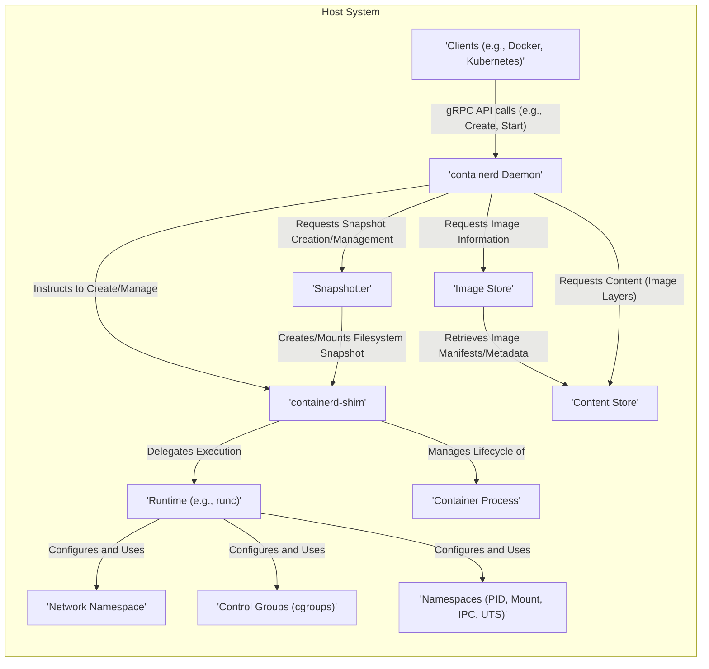

# Project Design Document: containerd

**Version:** 1.1
**Date:** October 26, 2023
**Author:** AI Software Architect

## 1. Introduction

This document provides an enhanced and more detailed architectural design of the containerd project, a core container runtime. This document is intended to serve as a robust basis for threat modeling activities, providing a comprehensive understanding of the system's components, interactions, and data flow. This revision aims to provide greater clarity and depth for security analysis.

### 1.1. Purpose

The primary purpose of this document is to outline the architecture of containerd in significant detail to facilitate effective and granular threat modeling. It aims to identify key components, their relationships, potential attack surfaces, and trust boundaries within the system.

### 1.2. Scope

This document covers the core functionalities and architecture of the containerd daemon and its primary interactions with other components and the operating system. It focuses on the aspects most relevant to security considerations, including data flow and component responsibilities.

### 1.3. Audience

This document is intended for:

*   Security engineers responsible for threat modeling, security architecture reviews, and penetration testing.
*   Software developers working on the containerd project or integrating with it.
*   DevOps engineers responsible for the secure deployment and management of containerized environments using containerd.

## 2. Overview

containerd is a foundational container runtime that manages the complete container lifecycle on a host system. Its design emphasizes simplicity, robustness, and portability, making it suitable for embedding within larger systems like Kubernetes. containerd handles image transfer, storage, container execution, supervision, and networking setup.

## 3. Architectural Design

The containerd architecture is composed of several distinct components that collaborate to manage containers. Understanding these components and their interactions is crucial for identifying potential security vulnerabilities.

### 3.1. Key Components

*   **`containerd` Daemon:** The central, long-running process responsible for managing the lifecycle of containers. It exposes a well-defined gRPC API for clients to interact with, providing functionalities like image management, container creation, and execution. It orchestrates the actions of other components.
*   **Clients:** External processes that communicate with the `containerd` daemon via its gRPC API. These clients initiate actions such as pulling images, creating containers, starting, stopping, and deleting them. Examples include Docker Engine (using containerd as its runtime), Kubernetes (through the CRI interface), and command-line tools like `ctr`.
*   **`containerd-shim`:** A lightweight, per-container process that acts as an agent for a specific container. It is responsible for the actual execution of the container process, managing its lifecycle, and reporting its status back to the `containerd` daemon. This isolation improves stability as a crash in a shim doesn't necessarily bring down the daemon.
*   **Image Store:** Manages container images stored on the host. It handles the storage and retrieval of image manifests, configurations, and layer metadata. It provides an abstraction over the underlying storage mechanism.
*   **Content Store:** A content-addressable store for immutable content, primarily container image layers (blobs). Content is addressed by its cryptographic hash, ensuring integrity. This store is shared by multiple images and containers, optimizing storage.
*   **Snapshotter:** Responsible for creating and managing filesystem snapshots for containers. It provides an abstraction for different snapshotting technologies (e.g., overlayfs, btrfs, zfs). When a container is created, the snapshotter creates a read-write layer on top of the image layers.
*   **Runtime:** The component responsible for the actual execution of the container process. The most common runtime used with containerd is runc (the reference implementation of the Open Container Initiative (OCI) runtime specification), but others can be configured. The runtime interacts directly with the operating system kernel to create namespaces and cgroups.
*   **Network Namespace:** A Linux kernel feature that provides network isolation for containers, giving each container its own network stack, interfaces, and routing table.
*   **Control Groups (cgroups):** A Linux kernel feature used to limit and monitor the resource usage (CPU, memory, I/O, etc.) of containers. containerd uses cgroups to enforce resource constraints and prevent resource starvation.
*   **Namespaces (PID, Mount, IPC, UTS):** Linux kernel features that provide isolation for various system resources. containerd leverages these namespaces to isolate processes, mount points, inter-process communication, and hostname/domain name.

### 3.2. Component Interactions

### 3.3. Data Flow

The following outlines the typical data flow during key container operations, highlighting the movement of data and the components involved:

*   **Pulling an Image:**
    1. A client sends a request to the `'containerd Daemon'` via the gRPC API to pull a container image.
    2. The `'containerd Daemon'` interacts with the `'Image Store'` to check for existing image information.
    3. The `'Image Store'` retrieves image metadata (manifest, configuration, layer descriptors) from a remote registry or local cache.
    4. The `'containerd Daemon'` instructs the `'Content Store'` to download the image layers (blobs) referenced in the manifest.
    5. The `'Content Store'` fetches the layers, verifying their integrity using content-addressable identifiers (hashes).
    6. Downloaded layers are stored in the `'Content Store'`.
    7. The `'Image Store'` updates its metadata with the downloaded image information and layer locations in the `'Content Store'`.

*   **Creating a Container:**
    1. A client sends a request to the `'containerd Daemon'` via the gRPC API to create a container, specifying the image to use.
    2. The `'containerd Daemon'` retrieves image information from the `'Image Store'`.
    3. The `'containerd Daemon'` instructs the `'Snapshotter'` to create a filesystem snapshot for the container based on the image layers in the `'Content Store'`.
    4. The `'Snapshotter'` creates a read-write layer on top of the read-only image layers, making it available to the container.
    5. The `'containerd Daemon'` creates a `'containerd-shim'` process specifically for this container.

*   **Starting a Container:**
    1. A client sends a request to the `'containerd Daemon'` via the gRPC API to start a specific container.
    2. The `'containerd Daemon'` instructs the corresponding `'containerd-shim'` process to start the container.
    3. The `'containerd-shim'` configures the necessary isolation primitives:
        *   It requests the creation of new `'Network Namespace'` if required.
        *   It configures `'Control Groups (cgroups)'` to limit the container's resource usage.
        *   It sets up other `'Namespaces (PID, Mount, IPC, UTS)'` for process, filesystem, inter-process communication, and hostname isolation.
    4. The `'containerd-shim'` uses the configured `'Runtime (e.g., runc)'` to execute the container's main process within the isolated environment, using the snapshot created by the `'Snapshotter'`.

## 4. Security Considerations

This section outlines key security considerations for the containerd architecture, providing a foundation for threat modeling.

*   **`containerd` Daemon Security:**
    *   **API Access Control:** The gRPC API is a critical attack surface. Proper authentication and authorization mechanisms are essential to prevent unauthorized access and control.
    *   **Process Isolation:** The daemon itself should be isolated from other processes on the host to limit the impact of potential vulnerabilities.
    *   **Dependency Management:** Secure management of dependencies to prevent the introduction of known vulnerabilities.
    *   **Configuration Security:** Secure default configurations and the ability to enforce secure configuration options.
*   **Client Security:**
    *   **Client Authentication:**  The daemon needs to authenticate clients to ensure only authorized entities can interact with it.
    *   **Secure Communication:** Communication between clients and the daemon should be encrypted (e.g., using TLS).
*   **`containerd-shim` Security:**
    *   **Limited Privileges:** Shims should operate with the minimum necessary privileges to reduce the impact of a compromise.
    *   **Isolation:** Shims should be isolated from each other to prevent cross-container attacks.
    *   **Secure Communication with Daemon:** Communication between the shim and the daemon should be secure.
*   **Image Store Security:**
    *   **Image Verification:** Mechanisms to verify the integrity and authenticity of container images (e.g., signature verification).
    *   **Access Control:** Controlling access to stored images to prevent unauthorized modification or deletion.
*   **Content Store Security:**
    *   **Content Integrity:** The content-addressable nature helps ensure integrity, but protection against tampering is still important.
    *   **Storage Security:** Secure storage of image layers to prevent unauthorized access.
*   **Snapshotter Security:**
    *   **Snapshot Integrity:** Ensuring the integrity of filesystem snapshots.
    *   **Protection Against Symlink Attacks:**  Mitigating potential vulnerabilities related to symbolic links within snapshots.
    *   **Storage Security:** Secure storage of snapshot data.
*   **Runtime Security:**
    *   **Runtime Vulnerabilities:** Keeping the runtime (e.g., runc) updated to patch known vulnerabilities.
    *   **Namespace and Cgroup Configuration:** Proper configuration of namespaces and cgroups is crucial for effective container isolation.
    *   **Seccomp and AppArmor/SELinux:** Leveraging security profiles to restrict the syscalls and capabilities available to containers.
*   **Network Security:**
    *   **Network Namespace Isolation:** Ensuring proper isolation between container network namespaces.
    *   **Firewall Rules:** Configuring appropriate firewall rules to control network traffic to and from containers.
*   **Host System Security:**
    *   **Kernel Security:** The security of the underlying Linux kernel is paramount.
    *   **Operating System Hardening:** Implementing general operating system hardening practices.
*   **Resource Management Security:**
    *   **Cgroup Limits:** Properly configuring and enforcing cgroup limits to prevent resource exhaustion and denial-of-service attacks.

## 5. Trust Boundaries

Understanding trust boundaries is critical for threat modeling. Here are some key trust boundaries within the containerd architecture:

*   **Between Clients and the `containerd` Daemon:** Clients are generally considered less trusted than the daemon. The gRPC API acts as the boundary, requiring authentication and authorization.
*   **Between the `containerd` Daemon and `containerd-shim`:** While the daemon manages the shim, the shim executes container processes and interacts directly with the kernel. This represents a trust boundary where the daemon delegates execution but needs to trust the shim's integrity.
*   **Between the Host System and Containers:** Containers are isolated from the host system using namespaces and cgroups. This boundary aims to prevent containers from compromising the host.
*   **Between Containers:**  While namespaces provide isolation, vulnerabilities in the runtime or kernel could potentially allow containers to break out of their isolation and affect other containers.
*   **Between the `containerd` Daemon and External Image Registries:**  The daemon trusts the integrity of images pulled from configured registries. Image verification mechanisms are crucial at this boundary.

## 6. Assumptions and Constraints

*   It is assumed that the underlying host operating system provides functional and secure implementations of kernel features like namespaces and cgroups.
*   This design document focuses on the core containerd functionality. Extensions and plugins may introduce additional security considerations not explicitly covered here.
*   The security of the chosen container runtime (e.g., runc) is considered a critical dependency.
*   Network configuration and security policies are assumed to be managed and enforced by external systems or administrators.

## 7. Future Considerations

*   Detailed analysis of specific attack vectors targeting each component and interaction.
*   Evaluation of different authentication and authorization mechanisms for the gRPC API.
*   Exploration of security enhancements offered by different snapshotter and runtime implementations.
*   Integration with security scanning tools for vulnerability detection in images and the runtime environment.
*   Consideration of confidential computing technologies and their integration with containerd.