# Project Design Document: containerd - Version 2.0 (Threat Modeling Focus)

**Version:** 2.0
**Date:** 2023-10-27 (Revised)
**Author:** AI Software Architecture Expert
**Project:** containerd - An industry-standard container runtime

## 1. Introduction

This document provides a refined and enhanced design overview of containerd, a core container runtime, specifically tailored for threat modeling activities. It builds upon the previous version, focusing on clarity, detail, and actionable security insights. This document serves as a comprehensive resource for security professionals and developers to understand containerd's architecture, components, and data flow in the context of identifying and mitigating potential security threats.

### 1.1. Purpose of containerd

containerd is a graduated project under the Cloud Native Computing Foundation (CNCF). It functions as a robust and streamlined container runtime, managing the complete lifecycle of containers on a host system. This includes image management (transfer, storage), container execution, supervision, and networking. Designed for embedding, containerd provides a stable and efficient foundation for higher-level container orchestration platforms and tools.

### 1.2. Scope of this Document

This document aims to provide a security-centric design overview of containerd, covering:

*   **Refined High-Level Architecture:** An updated overview of core components and their interactions, emphasizing security boundaries.
*   **Detailed Component Descriptions (Security Focused):** In-depth descriptions of key components, explicitly highlighting security functionalities, vulnerabilities, and attack vectors.
*   **Enhanced Data Flow Diagrams (Security Annotated):** Clear data flow diagrams illustrating critical operations with security annotations at each stage.
*   **Actionable Security Considerations for Threat Modeling:** A structured breakdown of security considerations, categorized for effective threat identification and mitigation planning.
*   **Deployment Scenario Security Implications:** Analysis of security implications across common containerd deployment scenarios.

This document focuses on the core `containerd` daemon and its immediate operational environment. Interactions with external orchestrators like Kubernetes are considered at a high level but are not the primary focus.

## 2. Refined High-Level Architecture (Security Boundaries)

The architecture of containerd is designed with modularity and extensibility in mind, using a plugin-based system. This diagram highlights the security boundaries and key interaction points relevant for threat modeling.

```mermaid
graph LR
    subgraph "Client (e.g., Docker, Kubernetes)"
        C["'Client Application'"]
    end
    subgraph "containerd Daemon (User: containerd)"
        direction TB
        A["'containerd API (gRPC)'"]:::api --> B["'Namespaces'"]:::core;
        B --> D["'Plugins' (Image, Content, Snapshotter, Runtime, Task, Metadata, etc.)"]:::plugin;
        D --> E["'containerd-shim' (Per Container)"]:::shim;
    end
    subgraph "Runtime (User: root)"
        F["'runc (OCI Runtime)'"]:::runtime;
    end
    subgraph "Container (Isolated Environment)"
        G["'Container Process(es)'"]:::container;
    end

    C -- gRPC API Calls --> A;
    E -- OCI Runtime Calls --> F;
    F -- Container Execution --> G;

    classDef api fill:#f9f,stroke:#333,stroke-width:2px,textColor:#000,fontStyle:bold
    classDef core fill:#e6f7ff,stroke:#333,stroke-width:2px,textColor:#000
    classDef plugin fill:#fffbe6,stroke:#333,stroke-width:2px,textColor:#000
    classDef shim fill:#ffe8e8,stroke:#333,stroke-width:2px,textColor:#000
    classDef runtime fill:#f0f0f0,stroke:#333,stroke-width:2px,textColor:#000
    classDef container fill:#e0f7fa,stroke:#333,stroke-width:2px,textColor:#000

    class A api
    class B core
    class D plugin
    class E shim
    class F runtime
    class G container
    class C component
```

**Diagram Description (Security Focused):**

*   **"'Client Application'"**: External clients operate with their own privileges and interact with containerd via the gRPC API. *Threats:* Malicious or compromised clients could attempt to exploit API vulnerabilities or bypass authorization.
*   **"'containerd API (gRPC)'"**:  The primary attack surface.  *Security Focus:* API authentication, authorization, rate limiting, input validation are critical. gRPC itself needs to be securely configured.
*   **"'Namespaces'"**: Logical isolation mechanism within containerd. *Security Focus:* Namespace isolation must be robust to prevent cross-tenant or cross-user information leakage or resource manipulation.
*   **"'Plugins'"**:  Extension points that can introduce vulnerabilities. *Security Focus:* Plugin security is paramount. Plugin isolation, secure plugin loading, and vulnerability scanning of plugins are important.
*   **"'containerd-shim'"**:  A per-container process running with reduced privileges compared to `containerd`. *Security Focus:* Shim vulnerabilities could lead to container escapes or denial of service.  Shim must correctly manage container lifecycle and resource isolation.
*   **"'runc (OCI Runtime)'"**: Runs with root privileges and directly interacts with the kernel. *Security Focus:*  OCI runtime is the most critical security component. Vulnerabilities here can lead to complete host compromise. Kernel security and runtime security are paramount.
*   **"'Container Process(es)'"**:  The isolated environment for application execution. *Security Focus:* Container isolation relies on namespaces, cgroups, and security profiles enforced by the runtime. Escapes from the container environment are a primary threat.

## 3. Detailed Component Descriptions (Security Focused)

### 3.1. containerd Daemon (Security Perspective)

The `containerd` daemon operates with specific user privileges (typically `containerd` user) and is the central control point.

*   **API Server (gRPC - Security Critical):**
    *   *Functionality:* Handles all client requests.
    *   *Security:*  **Authentication (Mutual TLS, API Keys, etc.) and Authorization (RBAC or similar) are MANDATORY.** Input validation must be rigorous to prevent injection attacks. Rate limiting can mitigate DoS attacks. gRPC endpoint security (TLS configuration) is essential.
    *   *Threats:* Unauthorized API access, API abuse, injection attacks, DoS attacks, information disclosure through API vulnerabilities.
*   **Namespace Management (Isolation Boundary):**
    *   *Functionality:* Provides logical isolation.
    *   *Security:*  **Robust namespace isolation is fundamental.** Resource quotas and limits per namespace can prevent resource exhaustion attacks. Access control policies per namespace are needed.
    *   *Threats:* Namespace escape, cross-namespace resource access, information leakage between namespaces, resource exhaustion affecting other namespaces.
*   **Plugin Management (Extension Risk):**
    *   *Functionality:* Loads and manages plugins.
    *   *Security:*  **Plugin verification and secure loading are crucial.**  A mechanism to control which plugins are allowed to be loaded is recommended. Plugin updates and vulnerability patching must be managed. Plugin permissions should be restricted.
    *   *Threats:* Malicious plugins, vulnerable plugins compromising the daemon, plugin conflicts leading to instability, privilege escalation through plugin vulnerabilities.
*   **Event Management (Auditing & Monitoring):**
    *   *Functionality:* Generates and dispatches events.
    *   *Security:*  **Events are valuable for security auditing and monitoring.**  Ensure events are securely logged and accessible for security analysis. Event tampering should be prevented.
    *   *Threats:* Event log tampering, insufficient event logging hindering security investigations, information leakage through overly verbose events.
*   **Metadata Store (Confidentiality & Integrity):**
    *   *Functionality:* Stores metadata about containerd objects.
    *   *Security:*  **Metadata integrity and confidentiality are important.** Access control to the metadata store is needed. Encryption of sensitive metadata at rest might be considered.
    *   *Threats:* Metadata corruption, unauthorized access to sensitive metadata, data breaches through metadata store vulnerabilities.

### 3.2. containerd-shim (Security Perspective)

`containerd-shim` runs per container, typically with a less privileged user than the `containerd` daemon.

*   **Container Process Supervision (Reliability & Security):**
    *   *Functionality:* Monitors container processes.
    *   *Security:*  **Shim must reliably supervise processes and handle signals securely.**  Preventing signal injection or manipulation is important. Resource monitoring and enforcement are crucial.
    *   *Threats:* Shim crashes leading to container instability, signal injection attacks, resource exhaustion due to shim failures, vulnerabilities in shim leading to container escape.
*   **Resource Isolation Enforcement (Secondary Layer):**
    *   *Functionality:* Maintains resource isolation post-runtime setup.
    *   *Security:*  **Shim reinforces resource limits and isolation.**  It should prevent resource leaks and ensure consistent resource enforcement throughout the container's lifecycle.
    *   *Threats:* Resource leaks due to shim bugs, inconsistent resource enforcement, DoS attacks by resource-hungry containers exploiting shim weaknesses.
*   **Standard I/O Handling (Potential Information Leakage):**
    *   *Functionality:* Manages container I/O streams.
    *   *Security:*  **I/O streams can be a vector for information leakage if not handled securely.**  Access control to container logs and I/O streams is necessary.
    *   *Threats:* Unauthorized access to container logs, information leakage through verbose logging, log injection attacks, denial of service through log flooding.

### 3.3. OCI Runtime (e.g., runc) (Security Critical - Kernel Interaction)

`runc` operates with root privileges and directly interacts with the Linux kernel.

*   **Namespace & Cgroup Creation (Primary Isolation):**
    *   *Functionality:* Creates namespaces and cgroups.
    *   *Security:*  **Correct and secure namespace and cgroup creation is the foundation of container isolation.** Kernel vulnerabilities related to namespaces and cgroups are critical threats.
    *   *Threats:* Namespace escape vulnerabilities in the kernel or runtime, cgroup escape vulnerabilities, insufficient isolation leading to cross-container interference.
*   **Filesystem Setup (Image Security & Integrity):**
    *   *Functionality:* Sets up the container filesystem.
    *   *Security:*  **Filesystem setup must be secure and prevent image tampering.**  Read-only root filesystems, secure mounting, and preventing privilege escalation through filesystem manipulation are important.
    *   *Threats:* Image layer tampering, vulnerabilities in filesystem mounting leading to container escape, privilege escalation through setuid/setgid binaries in the image.
*   **Process Execution & Security Features (Enforcement Layer):**
    *   *Functionality:* Executes container processes and applies security features.
    *   *Security:*  **Enforcement of security profiles (seccomp, AppArmor/SELinux) is crucial to limit container capabilities.**  Correct implementation and application of these features are vital.
    *   *Threats:* Bypassing security profiles, vulnerabilities in security profile enforcement, insufficient restriction of container capabilities, privilege escalation within the container.

### 3.4. Plugins (Security Extension Points & Risks)

Plugins extend containerd's functionality but also expand the attack surface.

*   **Image Store & Content Store (Image Supply Chain Security):**
    *   *Security:*  **Image verification (signatures), content integrity checks, and access control are essential.** Vulnerabilities in image handling can lead to image poisoning or denial of service. Securely managing access to image data is important.
    *   *Threats:* Image poisoning, malicious image injection, image layer tampering, denial of service through image download vulnerabilities, unauthorized access to image data.
*   **Snapshotter (Snapshot Isolation & Integrity):**
    *   *Security:*  **Snapshot isolation must be maintained to prevent cross-container filesystem access.** Snapshot integrity is important to prevent data corruption or manipulation. Access control to snapshots is needed.
    *   *Threats:* Snapshot escape, cross-snapshot access, snapshot corruption, unauthorized snapshot manipulation, vulnerabilities in snapshotter implementation.
*   **Runtime Plugin (Runtime Security Choice):**
    *   *Security:*  **The security of the chosen runtime is paramount.**  Using trusted and well-vetted runtimes is crucial. Runtime vulnerabilities directly impact container security.
    *   *Threats:* Runtime vulnerabilities leading to container escape, insecure runtime configurations, compatibility issues with security features.
*   **Task Plugin (Task Management Security):**
    *   *Security:*  **Task plugin must securely manage container tasks and processes.**  Similar security considerations to `containerd-shim` and runtime security apply.
    *   *Threats:* Task management vulnerabilities leading to container instability or escape, insecure task lifecycle management, vulnerabilities in task plugin implementation.
*   **Metadata Store Plugin (Metadata Security):**
    *   *Security:*  **Security of the metadata store plugin is crucial for overall containerd security.**  Protecting metadata integrity and confidentiality is important.
    *   *Threats:* Metadata store vulnerabilities, unauthorized access to metadata, metadata corruption, data breaches through metadata store plugin.

## 4. Enhanced Data Flow Diagrams (Security Annotated)

### 4.1. Image Pull (Security Annotations)

```mermaid
graph LR
    A["'Client Request (Image Pull)'"]:::client --> B["'containerd API'"]:::api;
    B -- Authenticate & Authorize --> C["'Image Service Plugin'"]:::plugin;
    C --> D["'Content Store Plugin'"]:::plugin;
    D -- Registry Auth (Credentials) --> E["'Registry (Remote)'"]:::registry;
    E -- TLS Connection, Image Data --> D;
    D -- Verify Checksum & Signature --> C;
    C --> B;
    B -- Response (Success/Failure) --> A;

    classDef client fill:#ccf,stroke:#333,stroke-width:2px,textColor:#000
    classDef api fill:#f9f,stroke:#333,stroke-width:2px,textColor:#000,fontStyle:bold
    classDef plugin fill:#fffbe6,stroke:#333,stroke-width:2px,textColor:#000
    classDef registry fill:#f0f0f0,stroke:#333,stroke-width:2px,textColor:#000

    class A client
    class B api
    class C plugin
    class D plugin
    class E registry
```

**Data Flow Description (Security Annotated):**

1.  **"'Client Request (Image Pull)'"**: Client initiates image pull. *Security:* Client authentication and authorization at the API level are the first line of defense.
2.  **"'containerd API'"**: API receives request. *Security:* API performs authentication and authorization checks to ensure the client is permitted to pull the image.
3.  **"'Image Service Plugin'"**: Handles image operations. *Security:* May enforce image access policies based on namespaces or other criteria.
4.  **"'Content Store Plugin'"**: Manages content. *Security:* Responsible for secure communication with the registry, including credential management and TLS usage.
5.  **"'Registry (Remote)'"**: Remote registry. *Security:* Registry security is external dependency. Ensure secure registry configuration and access.
6.  **Data Transfer**: Image layers are downloaded. *Security:* TLS encryption protects data in transit. Integrity checks (checksums) are crucial to detect corruption during transfer.
7.  **"'Content Store Plugin'"**: Stores image layers. *Security:* Verifies checksums and potentially image signatures to ensure integrity and authenticity.
8.  **Completion**: Image pull complete. *Security:*  Successful verification of image integrity and authenticity should be confirmed.

### 4.2. Container Creation and Start (Security Annotations)

```mermaid
graph LR
    A["'Client Request (Create & Start Container)'"]:::client --> B["'containerd API'"]:::api;
    B -- Authenticate & Authorize --> C["'Task Service Plugin'"]:::plugin;
    C --> D["'Image Service Plugin'"]:::plugin;
    D --> E["'Snapshotter Plugin'"]:::plugin;
    E --> F["'Content Store Plugin'"]:::plugin;
    F --> G["'Local Storage'"]:::storage;
    E -- Snapshot Creation & Isolation --> H["'containerd-shim'"]:::shim;
    H -- OCI Runtime Config & Execution --> I["'Runtime Plugin (runc)'"]:::runtime;
    I -- Namespace, Cgroup, Security Profiles --> J["'Container Process(es)'"]:::container;

    classDef client fill:#ccf,stroke:#333,stroke-width:2px,textColor:#000
    classDef api fill:#f9f,stroke:#333,stroke-width:2px,textColor:#000,fontStyle:bold
    classDef plugin fill:#fffbe6,stroke:#333,stroke-width:2px,textColor:#000
    classDef shim fill:#ffe8e8,stroke:#333,stroke-width:2px,textColor:#000
    classDef runtime fill:#f0f0f0,stroke:#333,stroke-width:2px,textColor:#000
    classDef container fill:#e0f7fa,stroke:#333,stroke-width:2px,textColor:#000
    classDef storage fill:#f0fff0,stroke:#333,stroke-width:2px,textColor:#000

    class A client
    class B api
    class C plugin
    class D plugin
    class E plugin
    class F plugin
    class G storage
    class H shim
    class I runtime
    class J container
```

**Data Flow Description (Security Annotated):**

1.  **"'Client Request (Create & Start Container)'"**: Client requests container creation. *Security:* API authentication and authorization to control who can create containers.
2.  **"'containerd API'"**: API receives request. *Security:* API authorization checks to ensure client is allowed to create container in the target namespace.
3.  **"'Task Service Plugin'"**: Manages container lifecycle. *Security:* Enforces container creation policies and resource limits.
4.  **"'Image Service Plugin'"**: Retrieves image information. *Security:* Image validation (e.g., vulnerability scanning, signature verification) should ideally happen before container creation.
5.  **"'Snapshotter Plugin'"**: Creates snapshot. *Security:* Ensures snapshot isolation between containers. Prevents unauthorized access to snapshots.
6.  **"'Content Store Plugin'"**: Accesses image layers. *Security:* Local storage should be securely configured and accessed.
7.  **"'containerd-shim'"**: Spawns shim. *Security:* Shim isolation from the daemon and other shims is important.
8.  **"'Runtime Plugin (runc)'"**: Executes runtime. *Security:* Runtime is responsible for setting up namespaces, cgroups, and applying security profiles (seccomp, AppArmor/SELinux). Correct configuration and secure runtime are critical.
9.  **"'Container Process(es)'"**: Container starts. *Security:* Container isolation and security depend on the successful setup by the runtime and enforcement by the shim.

## 5. Actionable Security Considerations for Threat Modeling

This section categorizes security considerations to facilitate structured threat modeling.

**5.1. API & Control Plane Threats:**

*   **Threat:** Unauthorized API Access. *Mitigation:* Strong authentication (mTLS, API Keys), robust authorization (RBAC), API rate limiting, network segmentation.
*   **Threat:** API Injection Attacks (e.g., command injection, path traversal). *Mitigation:* Rigorous input validation, parameterized API calls, principle of least privilege.
*   **Threat:** API DoS Attacks. *Mitigation:* Rate limiting, resource quotas, network-level DoS protection.
*   **Threat:** Information Disclosure through API. *Mitigation:* Principle of least information, careful API design, secure logging practices.

**5.2. Container Isolation & Runtime Threats:**

*   **Threat:** Container Escape (Runtime Vulnerabilities). *Mitigation:* Use latest stable runtime versions, vulnerability scanning of runtime, kernel hardening, security profiles (seccomp, AppArmor/SELinux).
*   **Threat:** Namespace Escape. *Mitigation:* Kernel security patches, runtime security hardening, regular security audits.
*   **Threat:** Cgroup Escape/Abuse. *Mitigation:* Kernel security patches, cgroup hardening, resource quotas and limits.
*   **Threat:** Resource Exhaustion (Container DoS). *Mitigation:* Resource quotas and limits (CPU, memory, I/O), monitoring and alerting, network policies.

**5.3. Image & Supply Chain Threats:**

*   **Threat:** Malicious Images (Image Poisoning). *Mitigation:* Image signature verification (Content Trust), vulnerability scanning of images, trusted image registries, image access control.
*   **Threat:** Image Layer Tampering. *Mitigation:* Image checksum verification, Content Trust, secure image registries.
*   **Threat:** Vulnerable Base Images. *Mitigation:* Regularly update base images, vulnerability scanning, use minimal base images.
*   **Threat:** Compromised Container Registries. *Mitigation:* Secure registry infrastructure, access control to registries, registry vulnerability scanning.

**5.4. Plugin & Extension Threats:**

*   **Threat:** Malicious Plugins. *Mitigation:* Plugin verification, plugin signing, curated plugin repositories, plugin allowlisting, security audits of plugins.
*   **Threat:** Vulnerable Plugins. *Mitigation:* Plugin vulnerability scanning, plugin update management, plugin isolation.
*   **Threat:** Plugin Privilege Escalation. *Mitigation:* Principle of least privilege for plugins, plugin sandboxing (if feasible), regular security audits.

**5.5. Host & Infrastructure Threats:**

*   **Threat:** Host OS Compromise. *Mitigation:* Host OS hardening, regular patching, intrusion detection systems, security monitoring.
*   **Threat:** Kernel Vulnerabilities. *Mitigation:* Kernel patching, security updates, kernel hardening.
*   **Threat:** Insecure Storage Backend. *Mitigation:* Secure storage configuration, access control to storage, encryption at rest (for sensitive data).
*   **Threat:** Network Segmentation Issues. *Mitigation:* Network policies, firewalls, micro-segmentation to isolate containerd components and containers.

## 6. Deployment Scenario Security Implications

*   **Standalone Container Runtime:**  Security relies heavily on securing the containerd daemon, API, host OS, and runtime. Host-based security controls are paramount.
*   **Kubernetes CRI Runtime:** Security is a shared responsibility with Kubernetes. Kubernetes network policies, RBAC, security contexts, and pod security standards complement containerd's security features. Kubernetes adds an extra layer of abstraction and control.
*   **Embedded Systems/IoT:** Resource constraints may limit security feature deployment. Attack surface reduction, secure boot, and physical security become more critical. Consider minimal containerd configurations and hardened OS.
*   **Cloud Platforms:** Cloud provider security services (identity management, network security groups, key management) can be leveraged. Multi-tenancy security and isolation are key concerns. Shared responsibility model applies.

## 7. Conclusion

This enhanced design document provides a security-focused perspective on containerd architecture, components, and data flow. By leveraging the detailed component descriptions, security-annotated data flow diagrams, and actionable threat modeling considerations, security professionals and developers can conduct more effective threat modeling exercises. This document aims to facilitate the identification of potential vulnerabilities and the design of robust security mitigations for containerd deployments across various environments, ultimately contributing to a more secure container ecosystem. Continuous review and updates of this document are recommended as containerd evolves and new threats emerge.