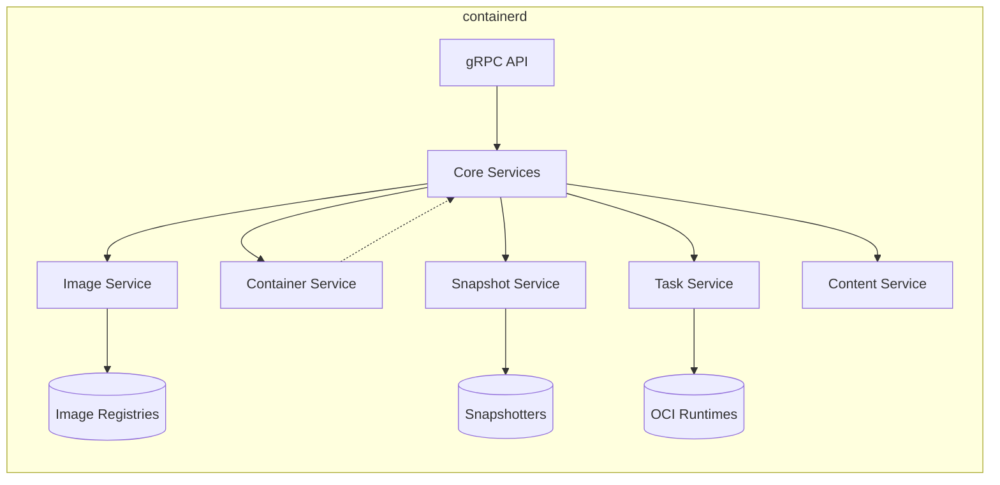
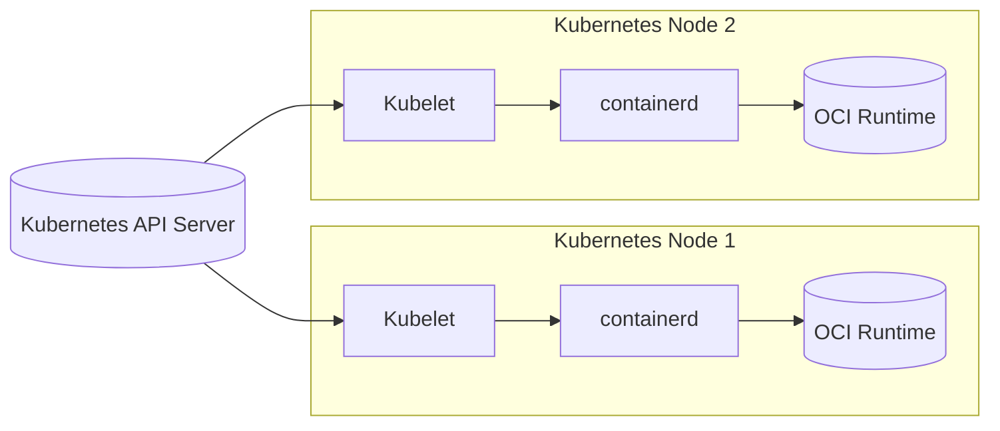

# Project Design Document: containerd

## BUSINESS POSTURE

containerd is a core container runtime, initially developed by Docker and later donated to the Cloud Native Computing Foundation (CNCF). Its primary goal is to provide a stable, performant, and secure foundation for running containers. It's designed to be embedded into larger systems, rather than being used directly by end-users.

Business priorities:

- Reliability: As a core component of container orchestration systems (like Kubernetes), containerd must be highly reliable. Downtime or instability directly impacts all applications running on top of it.
- Performance: Container startup time and overall runtime performance are critical for many use cases, especially in serverless and high-density environments.
- Security: containerd must provide a secure environment for running containers, isolating them from each other and the host system.
- Extensibility: The ability to integrate with different container ecosystems and support various plugins (for networking, storage, etc.) is crucial.
- Maintainability: As an open-source project, maintainability and a clear codebase are essential for long-term sustainability and community contributions.
- Compliance: Meeting industry standards and compliance requirements (e.g., OCI specifications) is necessary for broad adoption.

Most important business risks:

- Security vulnerabilities in containerd could lead to container escapes or other exploits, compromising the entire system.
- Performance bottlenecks could impact application performance and scalability.
- Incompatibility with evolving container standards or orchestration tools could limit adoption.
- Lack of maintainability could hinder future development and bug fixes.

## SECURITY POSTURE

Existing security controls:

- security control: Namespaces: containerd leverages Linux namespaces extensively to isolate containers from each other and the host system (process, network, mount, IPC, UTS, user). Described in the core code and design documentation.
- security control: Cgroups: Control groups (cgroups) are used to limit and monitor resource usage (CPU, memory, I/O) by containers. Described in the core code and design documentation.
- security control: Seccomp: Secure Computing Mode (seccomp) profiles are used to restrict the system calls that containers can make, reducing the attack surface. Described in the core code and design documentation. Configurable via CRI.
- security control: AppArmor/SELinux: Support for mandatory access control systems like AppArmor and SELinux provides an additional layer of security. Described in the core code and design documentation. Configurable via CRI.
- security control: Rootless containers: containerd supports running containers as non-root users, further enhancing security. Described in documentation and implemented in the codebase.
- security control: Image signature verification: containerd can verify the signatures of container images to ensure they haven't been tampered with. Implemented via plugins and described in documentation.
- security control: Regular security audits: The CNCF and the containerd community conduct regular security audits and penetration testing. Reports are typically published publicly.
- security control: Secure development practices: The project follows secure coding guidelines and uses static analysis tools to identify potential vulnerabilities. Described in contribution guidelines.
- security control: OCI Compliance: Adherence to the Open Container Initiative (OCI) specifications ensures interoperability and a baseline level of security.

Accepted risks:

- accepted risk: Complexity: The inherent complexity of container runtimes introduces a large attack surface.
- accepted risk: Plugin security: The security of containerd relies partly on the security of its plugins (e.g., for networking, storage).
- accepted risk: Kernel vulnerabilities: containerd is ultimately dependent on the security of the underlying Linux kernel.

Recommended security controls:

- Implement a robust vulnerability management process, including regular scanning of dependencies.
- Enhance fuzzing efforts to identify potential vulnerabilities proactively.
- Provide more detailed security documentation and best practices guides for users and integrators.

Security requirements:

- Authentication:
  - Authentication is typically handled by the higher-level system that embeds containerd (e.g., Kubernetes API server).
  - containerd itself primarily deals with authorization based on pre-authenticated requests.
- Authorization:
  - containerd uses a gRPC API with authorization checks to ensure that only authorized clients can perform specific actions (e.g., creating containers, pulling images).
  - Authorization policies can be configured to restrict access based on user roles or other attributes.
- Input Validation:
  - All inputs to the containerd API (e.g., container configurations, image names) should be strictly validated to prevent injection attacks or other vulnerabilities.
  - Image names and references should be parsed and validated according to the OCI specification.
- Cryptography:
  - TLS should be used to secure communication between containerd and its clients.
  - Image signatures should be verified using cryptographic algorithms (e.g., RSA, ECDSA).
  - Sensitive data (e.g., secrets) should be encrypted at rest and in transit.

## DESIGN

### C4 CONTEXT

```mermaid
graph LR
    subgraph "Container Ecosystem"
        User((User)) --> Kubernetes[Kubernetes]
        Kubernetes --> containerd[containerd]
        containerd --> OCI_Runtimes[(OCI Runtimes\n(runC, crun))]
        containerd --> Image_Registries[(Image Registries\n(Docker Hub, Quay.io))]
        containerd --> Snapshotters[(Snapshotters\n(overlayfs, zfs))]
        containerd --> Network_Plugins[(Network Plugins\n(CNI))]
    end
```

Element descriptions:

-   Name: User
    -   Type: Person
    -   Description: Represents users interacting with the container ecosystem, typically through higher-level tools like Kubernetes.
    -   Responsibilities: Deploying and managing applications, configuring container deployments.
    -   Security controls: Authentication and authorization are typically handled by higher-level systems (e.g., Kubernetes).

-   Name: Kubernetes
    -   Type: Software System
    -   Description: A container orchestration system that uses containerd as its container runtime.
    -   Responsibilities: Scheduling and managing containers, providing a high-level API for users.
    -   Security controls: RBAC, network policies, pod security policies, API server authentication/authorization.

-   Name: containerd
    -   Type: Software System
    -   Description: The core container runtime; the focus of this document.
    -   Responsibilities: Managing the complete container lifecycle, including image pulling, storage, execution, and networking.
    -   Security controls: Namespaces, cgroups, seccomp, AppArmor/SELinux, rootless containers, image signature verification.

-   Name: OCI Runtimes
    -   Type: Software System
    -   Description: Low-level container runtimes (like runC or crun) that actually create and run containers.
    -   Responsibilities: Creating and managing container processes, interacting with the kernel.
    -   Security controls: Rely on kernel-level security features (namespaces, cgroups, seccomp).

-   Name: Image Registries
    -   Type: External System
    -   Description: Repositories for storing and distributing container images (e.g., Docker Hub, Quay.io).
    -   Responsibilities: Storing container images, providing access control, and potentially scanning for vulnerabilities.
    -   Security controls: Authentication, authorization, image signing, vulnerability scanning.

-   Name: Snapshotters
    -   Type: Software System
    -   Description: Plugins that manage container filesystems (e.g., overlayfs, zfs).
    -   Responsibilities: Creating and managing container filesystems, providing efficient storage.
    -   Security controls: Filesystem-level security features, potentially data integrity checks.

-   Name: Network Plugins
    -   Type: Software System
    -   Description: Plugins that provide networking for containers (typically CNI plugins).
    -   Responsibilities: Configuring container network interfaces, managing IP addresses, providing network connectivity.
    -   Security controls: Network policies, firewall rules, potentially encryption.

### C4 CONTAINER



Element descriptions:

-   Name: gRPC API
    -   Type: API
    -   Description: The main interface for interacting with containerd.
    -   Responsibilities: Exposing functionality to clients, handling requests, and returning responses.
    -   Security controls: TLS encryption, authentication, authorization.

-   Name: Core Services
    -   Type: Component
    -   Description: Orchestrates the various services within containerd.
    -   Responsibilities: Managing the lifecycle of containers and images, coordinating interactions between services.
    -   Security controls: Internal authorization checks.

-   Name: Image Service
    -   Type: Component
    -   Description: Manages container images.
    -   Responsibilities: Pulling images from registries, storing images, managing image metadata.
    -   Security controls: Image signature verification.

-   Name: Container Service
    -   Type: Component
    -   Description: Manages container metadata.
    -   Responsibilities: Storing and retrieving container configuration, tracking container state.
    -   Security controls: Data validation.

-   Name: Snapshot Service
    -   Type: Component
    -   Description: Manages container filesystems using snapshotters.
    -   Responsibilities: Creating and managing container root filesystems.
    -   Security controls: Relies on the security of the chosen snapshotter.

-   Name: Task Service
    -   Type: Component
    -   Description: Manages container execution.
    -   Responsibilities: Creating and managing container processes using OCI runtimes.
    -   Security controls: Namespaces, cgroups, seccomp, AppArmor/SELinux, rootless containers.

-   Name: Content Service
    -   Type: Component
    -   Description: Manages content addressable storage.
    -   Responsibilities: Storing and retrieving content by its cryptographic hash.
    -   Security controls: Data integrity checks.

-   Name: Image Registries
    -   Type: External System
    -   Description: Repositories for storing and distributing container images.
    -   Responsibilities: Storing container images, providing access control.
    -   Security controls: Authentication, authorization, image signing.

-   Name: Snapshotters
    -   Type: External System
    -   Description: Plugins that manage container filesystems.
    -   Responsibilities: Creating and managing container filesystems.
    -   Security controls: Filesystem-level security features.

-   Name: OCI Runtimes
    -   Type: External System
    -   Description: Low-level container runtimes that actually create and run containers.
    -   Responsibilities: Creating and managing container processes.
    -   Security controls: Rely on kernel-level security features.

### DEPLOYMENT

containerd can be deployed in various ways, depending on the environment and the orchestration system used. Here are a few common scenarios:

1.  **As part of Kubernetes:** This is the most common deployment model. containerd is typically installed on each node of a Kubernetes cluster and configured as the container runtime via the CRI (Container Runtime Interface).
2.  **Standalone:** containerd can be deployed as a standalone daemon on a single machine, without Kubernetes. This is useful for development, testing, or specialized use cases.
3.  **Embedded in other systems:** containerd is designed to be embedded into other systems, such as cloud platforms or IoT devices.

We'll describe the Kubernetes deployment model in detail:



Element descriptions:

-   Name: Kubernetes Node 1, Kubernetes Node 2
    -   Type: Server
    -   Description: Physical or virtual machines that are part of the Kubernetes cluster.
    -   Responsibilities: Running containerized workloads.
    -   Security controls: Node-level security hardening, network security.

-   Name: Kubelet
    -   Type: Software Component
    -   Description: The Kubernetes agent that runs on each node.
    -   Responsibilities: Communicating with the API server, managing containers on the node via containerd.
    -   Security controls: TLS communication with the API server, authentication, authorization.

-   Name: containerd
    -   Type: Software Component
    -   Description: The container runtime, as described previously.
    -   Responsibilities: Managing the complete container lifecycle.
    -   Security controls: As described in the SECURITY POSTURE and C4 CONTAINER sections.

-   Name: OCI Runtime
    -   Type: Software Component
    -   Description: The low-level container runtime (e.g., runC).
    -   Responsibilities: Creating and managing container processes.
    -   Security controls: Relies on kernel-level security features.

-   Name: Kubernetes API Server
    -   Type: Software Component
    -   Description: The central control plane component of Kubernetes.
    -   Responsibilities: Exposing the Kubernetes API, managing cluster state.
    -   Security controls: TLS, authentication, authorization, RBAC.

### BUILD

containerd's build process is automated using Go build tools and Makefiles. The build process includes several security checks:

1.  **Code linting:** Static analysis tools (like `go vet`, `golint`) are used to identify potential code quality issues and style violations.
2.  **Dependency management:** Go modules are used to manage dependencies, and tools like `dependabot` are used to track and update vulnerable dependencies.
3.  **Static analysis:** Static analysis security testing (SAST) tools are used to scan the codebase for potential vulnerabilities.
4.  **Fuzzing:** Fuzz testing is used to identify potential vulnerabilities by providing random inputs to the system.
5.  **Unit and integration tests:** A comprehensive suite of unit and integration tests ensures that the code behaves as expected and helps prevent regressions.
6.  **Release signing:** Official releases of containerd are signed with a cryptographic key to ensure their authenticity and integrity.

```mermaid
graph LR
    Developer[Developer] --> Git_Repository[(Git Repository)]
    Git_Repository --> CI_System[CI System\n(GitHub Actions)]
    CI_System --> Linting[Linting\n(go vet, golint)]
    CI_System --> SAST[SAST]
    CI_System --> Unit_Tests[Unit Tests]
    CI_System --> Integration_Tests[Integration Tests]
    CI_System --> Fuzzing[Fuzzing]
    CI_System --> Build[Build\n(go build)]
    Build --> Artifacts[(containerd Binaries\n& Images)]
    Artifacts --> Signing[Signing]
    Signing --> Release[(Signed Release)]
```

## RISK ASSESSMENT

Critical business processes to protect:

-   Container orchestration: containerd is a critical component of container orchestration systems like Kubernetes. Its failure or compromise would disrupt the operation of all applications running on the cluster.
-   Image management: containerd is responsible for pulling, storing, and managing container images. Compromise of this process could lead to the execution of malicious images.
-   Container execution: containerd is responsible for creating and running containers. Vulnerabilities in this area could lead to container escapes or other exploits.

Data to protect and their sensitivity:

-   Container images: Container images may contain sensitive data, such as application code, configuration files, or secrets. Sensitivity: High.
-   Container metadata: Container metadata (e.g., environment variables, labels) may contain sensitive information. Sensitivity: Medium to High.
-   Runtime data: Data processed by running containers may be highly sensitive, depending on the application. Sensitivity: Varies, potentially High.
-   containerd configuration: containerd's configuration files may contain sensitive information, such as credentials for accessing image registries. Sensitivity: High.

## QUESTIONS & ASSUMPTIONS

Questions:

-   What specific compliance requirements (e.g., PCI DSS, HIPAA) must containerd meet in different deployment scenarios?
-   What are the specific threat models used by the containerd security team?
-   What are the performance targets for containerd in different use cases (e.g., container startup time, resource overhead)?
-   What is the process for reporting and handling security vulnerabilities in containerd?

Assumptions:

-   BUSINESS POSTURE: We assume that the primary users of containerd are organizations deploying containerized applications at scale, often using Kubernetes.
-   SECURITY POSTURE: We assume that containerd is deployed in a secure environment, with appropriate network security controls and host-level hardening. We also assume that users follow best practices for securing their container images and applications.
-   DESIGN: We assume that the deployment model is primarily Kubernetes-based, although we acknowledge other deployment options. We assume that the build process is automated and includes security checks.