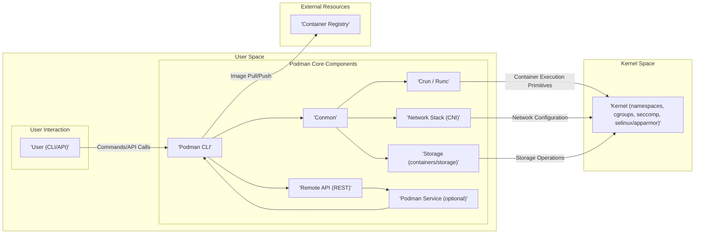

## Project Design Document: Podman for Threat Modeling (Improved)

**1. Introduction**

This document provides an enhanced architectural overview of the Podman project, specifically tailored for comprehensive threat modeling. Building upon the foundational understanding of Podman's components and interactions, this version delves deeper into security-relevant details, data flows, and potential vulnerabilities. The aim is to equip security professionals with the necessary information to conduct thorough threat analysis and identify potential attack vectors within Podman deployments.

**2. Project Overview**

Podman (POD MANager) is a daemonless, open-source container engine designed for developing, managing, and executing Open Container Initiative (OCI) containers and pods on Linux systems. Its key differentiator is the daemonless architecture, which enhances security by reducing the attack surface associated with a persistent, privileged daemon. Podman offers a command-line interface (CLI) largely compatible with Docker, facilitating a smoother transition for users familiar with Docker workflows. The focus on rootless execution further strengthens its security profile.

**3. System Architecture**

Podman's architecture emphasizes direct interaction with the operating system kernel, minimizing reliance on intermediary processes. The following diagram illustrates the core components and their interactions, highlighting potential trust boundaries:

**4. Component Description (Detailed)**

* **User (CLI/API):** Represents the entity interacting with Podman. This could be a human user executing commands via the CLI or an automated system interacting through the REST API. Security considerations here involve user authentication, authorization, and the potential for malicious commands.
* **Podman CLI:** The primary interface for managing containers. It parses user commands, performs authorization checks, and orchestrates the underlying components. Vulnerabilities here could allow command injection or privilege escalation if not carefully implemented.
* **Remote API (REST):**  Provides a programmatic interface for managing Podman remotely. Security is paramount, requiring robust authentication (e.g., TLS, client certificates) and authorization mechanisms to prevent unauthorized access and control.
* **Podman Service (optional):** A systemd service that listens for remote API requests. If compromised, it could provide an attacker with control over the local Podman instance. Secure configuration and access control are crucial.
* **Conmon:**  A container monitor process spawned for each running container. It directly interacts with the container runtime and the kernel. Its security is critical as it manages the container's lifecycle and resource usage. Vulnerabilities could lead to container escapes or denial of service.
* **Crun / Runc:** Low-level, OCI-compliant container runtimes responsible for the actual creation and management of container processes within isolated namespaces and cgroups. These are highly privileged processes, and any vulnerabilities could have severe security implications, potentially leading to host compromise.
* **Network Stack (CNI):**  Manages container networking using CNI plugins. Misconfigured or vulnerable CNI plugins can lead to network segmentation issues, allowing unauthorized communication between containers or with the host.
* **Storage (containers/storage):** Handles the management of container image layers and the container's writable layer. Vulnerabilities in this component could lead to image tampering, data corruption, or unauthorized access to container data.
* **Kernel (namespaces, cgroups, seccomp, selinux/apparmor):** The foundation of container isolation and resource management. Exploiting kernel vulnerabilities could bypass container security measures. Seccomp profiles and SELinux/AppArmor policies provide additional layers of security by restricting system calls and access permissions.
* **Container Registry:** Stores and distributes container images. Security concerns include image tampering, malware injection, and unauthorized access to private images. Image signature verification is crucial for ensuring image integrity.

**5. Key Data Flows (Detailed)**

* **Image Pull (Threat Perspective):**
    * User initiates `podman pull <image_name>`. Potential threats: Man-in-the-middle attacks during download, pulling malicious images from compromised registries, registry account compromise.
    * Podman CLI contacts the specified container registry. Potential threats: DNS spoofing, insecure communication protocols (lack of TLS).
    * The registry authenticates the request (if required). Potential threats: Brute-force attacks on registry credentials, weak authentication mechanisms.
    * The image layers are downloaded and stored by the storage component. Potential threats:  Tampering of image layers during download, vulnerabilities in the storage component leading to data corruption.
* **Container Run (Threat Perspective):**
    * User initiates `podman run <image_name>`. Potential threats: Running images with known vulnerabilities, misconfiguration of security options.
    * Podman CLI instructs the storage component to prepare the container filesystem. Potential threats: Exploiting vulnerabilities in the storage driver to gain access to host filesystem.
    * Podman CLI invokes `conmon`. Potential threats:  Exploiting vulnerabilities in `conmon` to gain control over the container process or the host.
    * `Conmon` utilizes `crun`/`runc` to create the container namespaces and cgroups. Potential threats: Container escapes due to vulnerabilities in the runtime, insufficient isolation leading to cross-container attacks.
    * `Crun`/`runc` starts the container's entrypoint process. Potential threats:  Exploiting vulnerabilities in the containerized application itself.
    * The network stack (CNI) configures the container's network interface. Potential threats:  Misconfigured network policies allowing unauthorized network access, vulnerabilities in CNI plugins.
* **Container Exec (Threat Perspective):**
    * User initiates `podman exec <container_id> <command>`. Potential threats: Executing malicious commands within the container, privilege escalation within the container.
    * Podman CLI connects to the `conmon` process. Potential threats: Unauthorized access to the `conmon` process.
    * `Conmon` uses `crun`/`runc` to execute the command. Potential threats:  Escaping the container context through vulnerabilities in the runtime during command execution.
* **Remote API Interaction (Threat Perspective):**
    * User or a remote system sends a request to the Podman Service. Potential threats: Unauthorized access due to weak authentication, replay attacks.
    * The Podman Service authenticates and authorizes the request. Potential threats:  Bypassing authentication or authorization checks, vulnerabilities in the API implementation.
    * The service interacts with the Podman CLI or directly with other components. Potential threats:  Exploiting vulnerabilities in the communication between the service and other components.

**6. Key Security Considerations (Elaborated)**

* **Rootless Mode:** While enhancing security, rootless mode still relies on user namespaces. Potential threats include vulnerabilities in user namespace implementations or misconfigurations that could lead to privilege escalation within the user namespace.
* **Namespace Isolation:**  While providing isolation, vulnerabilities in the kernel's namespace implementation could allow containers to break out of their isolated environments.
* **Cgroup Resource Limits:**  Improperly configured cgroup limits could lead to denial-of-service attacks by allowing a container to consume excessive resources.
* **Image Security:**  Unverified images can contain malware or vulnerabilities. Reliance on trusted registries and image signing is crucial. Supply chain attacks targeting image creation processes are a significant concern.
* **Network Security:**  Default CNI configurations might not be secure. Implementing network policies, firewalls, and network segmentation is essential.
* **Storage Security:**  Permissions on the storage backend must be carefully managed to prevent unauthorized access to container data and images. Vulnerabilities in storage drivers could be exploited.
* **Remote API Security:**  Exposing the remote API without proper authentication and authorization is a major security risk. TLS encryption is mandatory to protect communication.
* **Container Runtime Security:**  Keeping the container runtime updated is critical to patch known vulnerabilities. Security auditing of the runtime configuration is also important.
* **Host System Security:**  A compromised host can undermine all container security measures. Regular patching, strong access controls, and security monitoring are essential. Kernel vulnerabilities are a primary concern.

**7. Dependencies (Detailed Security Implications)**

* **runc/crun:** Vulnerabilities in these low-level runtimes can directly lead to container escapes and host compromise. Regular updates and security audits are crucial.
* **containers/storage:**  Vulnerabilities could allow for image tampering, data corruption, or unauthorized access to container data.
* **containers/image:**  Vulnerabilities could be exploited during image pulling or pushing, potentially leading to the introduction of malicious images.
* **netavark/CNI plugins:**  Vulnerabilities in CNI plugins can compromise container networking, allowing for unauthorized communication or network segmentation bypass.
* **Go programming language:**  While Go has built-in security features, vulnerabilities in the Go runtime or libraries used by Podman could be exploited.
* **systemd (optional):**  Vulnerabilities in systemd could be exploited to gain control over the Podman service or the host system.
* **SELinux/AppArmor (optional):**  While enhancing security, misconfigured policies can create vulnerabilities or hinder legitimate operations. Bypassing these mandatory access control systems is a potential attack vector.

**8. Deployment Model (Security Context)**

* **Local Development:**  Security risks are often lower but still present, especially if running containers with sensitive data or connecting to external networks.
* **CI/CD Pipelines:**  Security is critical. Compromised CI/CD pipelines can be used to inject malicious code into container images. Secure credential management and pipeline isolation are essential.
* **Server Environments:**  Requires robust security measures, including network segmentation, firewalls, intrusion detection systems, and regular security audits.
* **Edge Computing:**  Often involves deployments in less secure environments. Physical security of the devices and secure remote management are crucial. Resource constraints may limit the ability to run comprehensive security tools.

**9. Future Considerations (Security Challenges)**

* **Improved Security Scanning Integration:**  Ensuring seamless and reliable integration with vulnerability scanning tools to identify and mitigate risks early in the development lifecycle. Addressing false positives and negatives is a challenge.
* **Enhanced Seccomp Profiles:**  Developing and maintaining comprehensive and effective seccomp profiles to minimize the attack surface without hindering container functionality.
* **Improved User Namespace Support:**  Addressing potential vulnerabilities and complexities associated with user namespace remapping to ensure robust rootless security.
* **Integration with Hardware Security Features:**  Exploring and implementing technologies like Intel SGX or AMD SEV to provide stronger container isolation and protect sensitive data within containers. Complexity and performance overhead are challenges.
* **Supply Chain Security:**  Developing mechanisms to ensure the integrity and provenance of all components involved in the container lifecycle, from base images to dependencies.

**10. Conclusion**

This enhanced design document provides a more detailed and security-focused overview of the Podman project. By understanding the intricacies of its architecture, data flows, and dependencies, security professionals can conduct more effective threat modeling exercises. This document highlights potential vulnerabilities and attack vectors, enabling the development of robust security strategies to protect Podman deployments across various environments. Continuous monitoring, regular security assessments, and staying updated with the latest security best practices are crucial for maintaining a secure containerized environment with Podman.
