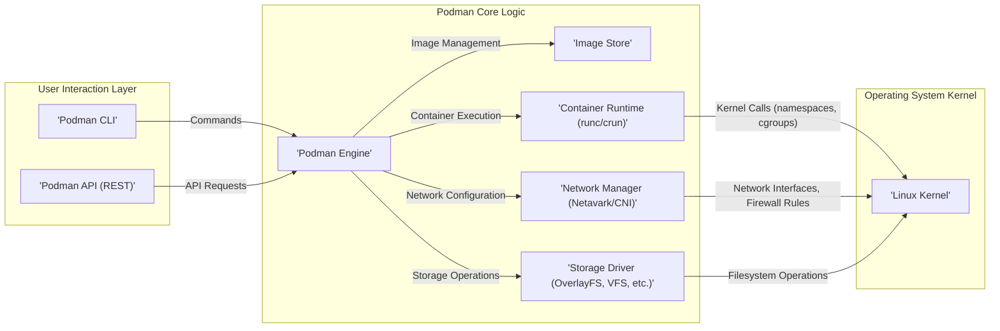
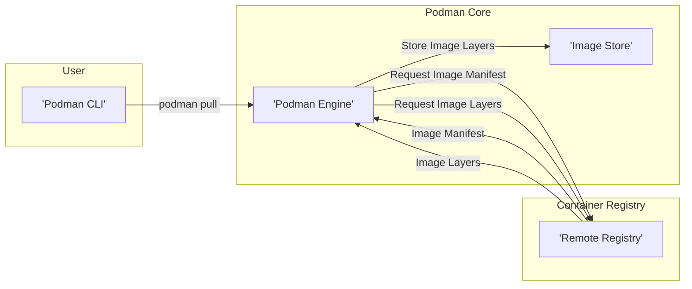
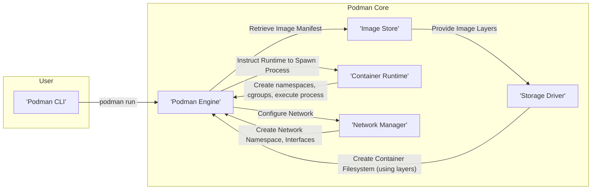
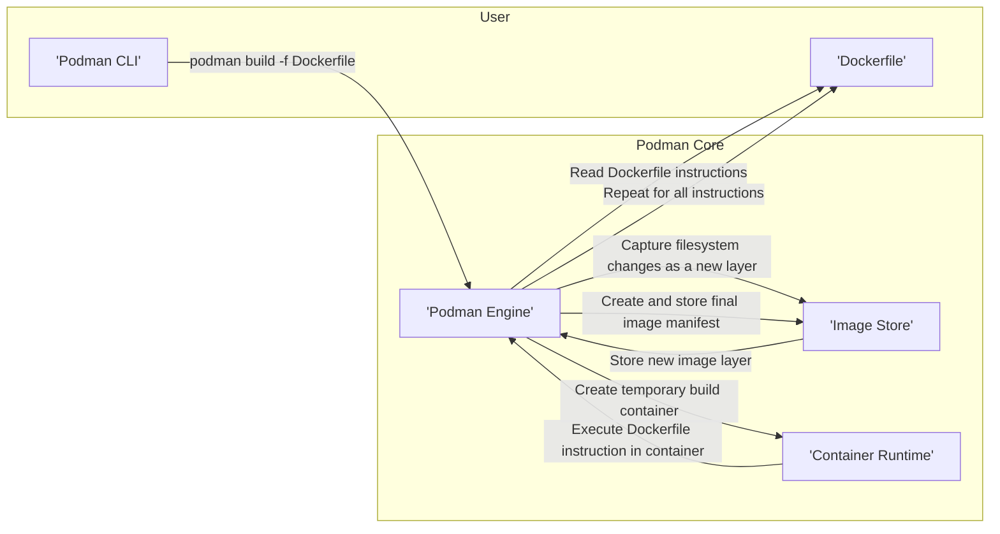

# Project Design Document: Podman

**Version:** 1.1
**Date:** October 26, 2023
**Author:** Gemini (Expert in Software, Cloud, and Cybersecurity Architecture)

## 1. Introduction

This document provides an enhanced and more detailed design overview of the Podman project. It aims to clearly outline the system's architecture, key components, and data flow, making it suitable for subsequent threat modeling activities. This document focuses on the core functionalities and interactions within Podman, elaborating on key aspects for a deeper understanding.

## 2. Project Overview

Podman (POD Manager) is a daemonless, open-source, Linux-native tool designed to develop, manage, and run Open Container Initiative (OCI) containers and pods. It provides a command-line interface (CLI) that is largely compatible with the Docker CLI, facilitating a smoother transition for users familiar with Docker. A significant advantage of Podman is its ability to operate containers without requiring a central, privileged daemon, which enhances security, reduces resource consumption, and simplifies deployment. Podman directly leverages the containerization features provided by the Linux kernel, such as namespaces and cgroups. It supports both rootful and rootless modes of operation, catering to different security and privilege requirements.

## 3. System Architecture

The following diagram illustrates the high-level architecture of Podman, highlighting the key interactions between components:

### 3.1. Key Components

*   **Podman CLI:** The primary command-line interface through which users interact with Podman. It parses user commands, validates them, and translates them into corresponding API calls to the Podman Engine or directly invokes engine functionalities.
*   **Podman API (REST):** Provides a programmatic interface, adhering to RESTful principles, for interacting with Podman. This allows external applications, orchestration tools, and other services to manage containers and pods programmatically. The API exposes endpoints for various container management operations.
*   **Podman Engine:** The central component orchestrating the lifecycle of containers and pods. It receives requests from the CLI or API and manages the interactions between other components. Key responsibilities include:
    *   Handling image pull, push, and management requests.
    *   Creating and configuring container storage.
    *   Interacting with the chosen container runtime to execute container processes.
    *   Configuring container networking using the network manager.
    *   Managing container state and metadata.
*   **Image Store:** Responsible for managing container images locally. This includes:
    *   Pulling images from remote container registries.
    *   Storing image layers efficiently (often using content-addressable storage).
    *   Managing image metadata and manifests.
    *   Providing image layers to the storage driver for container creation.
*   **Container Runtime (runc/crun):** An OCI (Open Container Initiative) compliant runtime responsible for the actual execution and lifecycle management of container processes. Podman supports multiple runtimes; `runc` and `crun` are commonly used. The runtime interacts directly with the Linux kernel to create namespaces, cgroups, and other kernel primitives necessary for containerization.
*   **Network Manager (Netavark/CNI):** Manages the networking configuration for containers and pods.
    *   **Netavark:** Podman's native network stack, offering flexibility and control over network configuration.
    *   **CNI (Container Network Interface):** Allows Podman to integrate with various third-party network plugins, providing a standardized way to configure container networks. The network manager is responsible for creating virtual network interfaces, assigning IP addresses, and configuring network namespaces and firewall rules.
*   **Storage Driver (OverlayFS, VFS, etc.):** Manages the filesystem layers for containers, implementing the copy-on-write mechanism. Different storage drivers offer varying performance characteristics and storage efficiency. Common drivers include:
    *   **OverlayFS:** A widely used driver that efficiently layers filesystem changes.
    *   **VFS (Virtual File System):** A simpler driver that copies files, generally less performant for production environments.
    *   Other drivers like `btrfs` and `zfs` can also be used depending on the system configuration.
*   **Linux Kernel:** The foundation upon which Podman operates. It provides the core containerization features:
    *   **Namespaces:** Isolate various system resources (process IDs, network, mount points, etc.) for containers.
    *   **Control Groups (cgroups):** Limit and track the resource usage of containers.
    *   **Seccomp:** Allows filtering of system calls made by container processes.
    *   **SELinux/AppArmor:** Provide mandatory access control for enhanced security.

## 4. Data Flow

This section details the typical data flow for common Podman operations, providing a more granular view of the interactions.

### 4.1. Pulling an Image

*   The user initiates an image pull using the `podman pull` command via the CLI.
*   The Podman CLI forwards the pull request to the Podman Engine.
*   The Podman Engine contacts the specified remote container registry to request the image manifest.
*   The remote registry sends the image manifest back to the Podman Engine.
*   The Podman Engine parses the manifest and requests the individual image layers from the remote registry.
*   The remote registry streams the image layers to the Podman Engine.
*   The Podman Engine stores the downloaded image layers in the Image Store, often utilizing content-addressable storage.

### 4.2. Running a Container

*   The user initiates container execution using the `podman run` command via the CLI.
*   The Podman CLI sends the run request to the Podman Engine.
*   The Podman Engine retrieves the image manifest from the Image Store to understand the image structure.
*   The Image Store provides the necessary image layers to the Storage Driver.
*   The Storage Driver creates the container's filesystem by layering the image layers, implementing a copy-on-write mechanism.
*   The Podman Engine instructs the Network Manager to configure the container's network namespace, create virtual interfaces, and assign IP addresses.
*   The Network Manager interacts with the Linux kernel to create the necessary network resources.
*   The Podman Engine then instructs the Container Runtime (e.g., `runc` or `crun`) to spawn the container process within the configured namespaces and cgroups.
*   The Container Runtime interacts directly with the Linux kernel to create the namespaces and cgroups and execute the container's entrypoint command.

### 4.3. Building an Image

*   The user initiates an image build using the `podman build` command, providing a Dockerfile.
*   The Podman CLI sends the build request and the Dockerfile content to the Podman Engine.
*   The Podman Engine parses the instructions in the Dockerfile.
*   For each instruction (e.g., `RUN`, `COPY`), the Podman Engine instructs the Container Runtime to create and start a temporary container based on a base image or a previous stage.
*   The Container Runtime executes the command specified in the Dockerfile instruction within the temporary container.
*   After the instruction is executed, the Podman Engine captures the filesystem changes made within the temporary container as a new image layer.
*   The new image layer is stored in the Image Store.
*   This process repeats for each instruction in the Dockerfile.
*   Finally, the Podman Engine creates and stores the final image manifest, which describes the order and content of the image layers.

## 5. Key Security Considerations

Podman's design prioritizes security through several key features and architectural choices:

*   **Daemonless Architecture:** By eliminating the need for a central, privileged daemon, Podman reduces the attack surface and the potential impact of vulnerabilities. Container management is delegated to the user's process, operating with the user's privileges (in rootless mode).
*   **Rootless Mode:** A significant security enhancement, allowing containers to run without requiring root privileges. This is achieved through the use of user namespaces, mapping user and group IDs inside the container to unprivileged IDs on the host, mitigating privilege escalation risks.
*   **Namespace Isolation:** Podman leverages Linux namespaces (PID, network, mount, UTS, IPC, user) to provide strong isolation between containers and the host, as well as between different containers. This prevents containers from interfering with each other's processes, network configurations, and filesystem mounts.
*   **Control Groups (cgroups):** Used to enforce resource limits (CPU, memory, I/O) for containers, preventing resource exhaustion and denial-of-service scenarios.
*   **SELinux and AppArmor Integration:** Podman integrates with Security-Enhanced Linux (SELinux) and AppArmor to provide mandatory access control policies for containers, further restricting their capabilities and limiting the damage from potential container escapes.
*   **Seccomp Profiles:** Podman allows the application of seccomp profiles to restrict the set of system calls that a container can make. This significantly reduces the attack surface by preventing containers from invoking potentially dangerous kernel functions.
*   **Capabilities Management:** Podman provides fine-grained control over the Linux capabilities granted to containers. By default, containers run with a reduced set of capabilities, and users can selectively add or remove capabilities as needed, following the principle of least privilege.
*   **Image Verification and Trust:** Podman supports verifying the signatures of container images using technologies like Sigstore and Notation, ensuring the authenticity and integrity of the images being used. This helps prevent the deployment of compromised or malicious images.
*   **User Namespaces Remapping (in Rootless Mode):**  As mentioned earlier, this is crucial for rootless operation, preventing containers from gaining root privileges on the host system.

## 6. Out of Scope

This document focuses on the core architectural design of Podman. The following aspects are considered outside the scope of this document:

*   Specific implementation details of individual container runtimes (e.g., the internal workings of `runc` or `crun`).
*   Detailed implementation specifics of network backend plugins within Netavark or CNI.
*   In-depth analysis of the internal algorithms and data structures used by specific storage drivers (e.g., the intricacies of OverlayFS).
*   Platform-specific configurations and deployment strategies for Podman on different Linux distributions or operating systems beyond the core functionalities.
*   The detailed code-level implementation of Podman components and their internal APIs.
*   Performance benchmarking and comparisons with other containerization technologies.
*   The specifics of interacting with remote container registries and their security mechanisms (though image verification is mentioned as a Podman feature).

## 7. Future Considerations

Areas for future development and potential enhancements include:

*   Further strengthening security features, such as more granular control over resource isolation and enhanced vulnerability scanning integration.
*   Improved integration and interoperability with container orchestration platforms like Kubernetes and related ecosystems.
*   Expanding the functionality and features of the Podman API to provide more comprehensive programmatic control.
*   Adapting to and incorporating new containerization features and security enhancements in the Linux kernel.
*   Exploring alternative container image formats and distribution mechanisms.

This enhanced design document provides a more comprehensive understanding of Podman's architecture, components, and data flow, making it a more robust foundation for conducting thorough and effective threat modeling activities. The detailed explanations and diagrams facilitate the identification of potential vulnerabilities and attack vectors within the system.