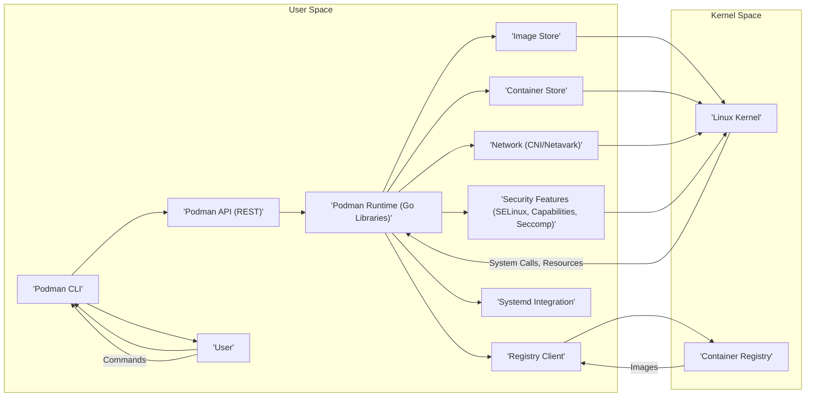
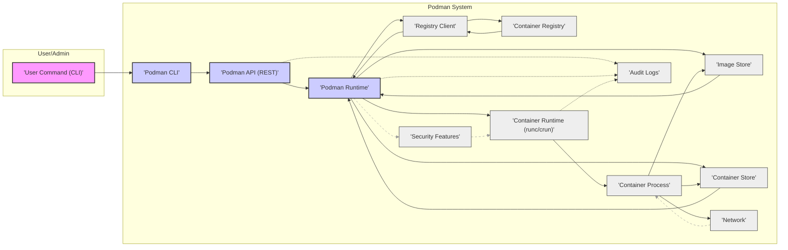

# Project Design Document: Podman Container Engine for Threat Modeling (Improved)

**Project Name:** Podman Container Engine

**Project Repository:** [https://github.com/containers/podman](https://github.com/containers/podman)

**Version:** 1.1

**Date:** 2023-10-27

**Author:** Gemini (AI Expert in Software, Cloud and Cybersecurity Architecture)

## 1. Introduction

This document provides an enhanced design overview of the Podman container engine project, specifically tailored for comprehensive threat modeling activities. Building upon the initial design document, this version offers greater detail and clarity, focusing on security-relevant aspects and potential threat vectors. It outlines the key components, their interactions, data flows, and security considerations within the Podman ecosystem. This document serves as a robust foundation for identifying, analyzing, and mitigating potential threats and vulnerabilities.

Podman is a daemonless, open-source, Linux-native tool designed for developing, managing, and running OCI containers and pods. It distinguishes itself by its daemonless architecture, enhanced security posture, and robust support for rootless container execution, aiming to be a secure and efficient alternative to traditional container engines.

## 2. System Architecture Overview

Podman's architecture is centered around a client-server model, but uniquely, it can operate without a persistent daemon. This daemonless nature is a key security feature, reducing the attack surface.  The architecture leverages standard Linux kernel features for containerization and focuses on minimizing privileges and maximizing isolation.

### 2.1. High-Level Architecture Diagram

### 2.2. Component Description (Enhanced for Threat Modeling)

*   **"'Podman CLI'"**: The command-line interface is the primary user interaction point. It parses commands, validates input, and communicates with the Podman API.
    *   **Security Relevance & Threat Vectors:**
        *   **Input Validation Vulnerabilities:** Susceptible to command injection if input validation is insufficient. Maliciously crafted commands could be executed with Podman CLI privileges.
        *   **Privilege Escalation (Rootful Mode):** In rootful mode, vulnerabilities in CLI parsing or handling could lead to privilege escalation if an attacker can manipulate Podman to perform actions with root privileges.
        *   **Denial of Service:**  Malformed commands or excessive requests could potentially lead to resource exhaustion and denial of service.
*   **"'Podman API (REST)'"**:  A RESTful API provides programmatic access to Podman functionalities. It's used by the CLI and can be accessed by other applications.
    *   **Security Relevance & Threat Vectors:**
        *   **Authentication and Authorization Bypass:** Weak or missing authentication/authorization could allow unauthorized access to the API, enabling malicious container management.
        *   **API Endpoint Vulnerabilities:**  Standard web API vulnerabilities like injection flaws (SQL, command), insecure deserialization, or broken access control could be exploited.
        *   **Man-in-the-Middle Attacks:** Unencrypted API communication (without TLS) exposes sensitive data and API keys to interception.
        *   **Denial of Service:** API endpoints could be targeted for DoS attacks through excessive requests or resource-intensive operations.
*   **"'Podman Runtime (Go Libraries)'"**: The core logic of Podman, implemented in Go. It manages container lifecycle, images, networking, storage, and interacts with the kernel.
    *   **Security Relevance & Threat Vectors:**
        *   **Code Vulnerabilities (Go):**  Vulnerabilities in the Go codebase itself (memory safety, concurrency issues, logic errors) could be exploited to compromise Podman's functionality or gain unauthorized access.
        *   **Resource Management Issues:** Improper resource management (memory leaks, CPU exhaustion) could lead to DoS or allow containers to impact host system stability.
        *   **Kernel Interaction Flaws:**  Vulnerabilities in the interaction with Linux kernel features (namespaces, cgroups, security modules) could lead to container escapes or privilege escalation.
        *   **Image Handling Vulnerabilities:**  Flaws in image manifest parsing, layer extraction, or image storage could be exploited to inject malicious content or compromise image integrity.
*   **"'Image Store'"**: Manages local storage of container images, including layers, manifests, and metadata using `containers/storage`.
    *   **Security Relevance & Threat Vectors:**
        *   **Image Tampering:**  Unauthorized modification of stored images could lead to the execution of compromised containers.
        *   **Storage Access Control Issues:**  Insufficient access controls on the image store directory could allow unauthorized users to read or modify images.
        *   **Image Corruption:**  Data corruption in the image store could lead to container failures or unpredictable behavior.
        *   **Vulnerability in `containers/storage`:** Underlying vulnerabilities in the `containers/storage` library could directly impact the security of the image store.
*   **"'Container Store'"**: Manages storage and metadata for containers (running and stopped), including configurations, volumes, and state, also using `containers/storage`.
    *   **Security Relevance & Threat Vectors:**
        *   **Container Configuration Tampering:**  Modification of container configurations could alter container behavior or introduce vulnerabilities.
        *   **Volume Data Exposure:**  Insecurely configured volumes or vulnerabilities in volume management could expose sensitive container data to the host or other containers.
        *   **Container State Manipulation:**  Tampering with container state information could lead to unexpected container behavior or denial of service.
        *   **Vulnerability in `containers/storage`:** Similar to the Image Store, vulnerabilities in `containers/storage` can affect the Container Store.
*   **"'Network (CNI/Netavark)'"**: Handles container networking using CNI plugins or Netavark, configuring network namespaces, interfaces, and IP management.
    *   **Security Relevance & Threat Vectors:**
        *   **Network Isolation Bypasses:**  Vulnerabilities in CNI plugins or Netavark could lead to breaches in network isolation between containers, or between containers and the host.
        *   **Network Policy Evasion:**  Weaknesses in network policy enforcement could allow containers to bypass intended network restrictions.
        *   **CNI Plugin Vulnerabilities:**  Security flaws in specific CNI plugins could be exploited to compromise container networking or the host system.
        *   **Netavark Vulnerabilities:**  Security vulnerabilities within the Netavark implementation itself.
        *   **Denial of Service (Network):**  Network misconfigurations or vulnerabilities could be exploited to launch network-based DoS attacks against containers or the host.
*   **"'Security Features (SELinux, Capabilities, Seccomp)'"**:  Leverages Linux security features for container isolation and security.
    *   **Security Relevance & Threat Vectors:**
        *   **SELinux Policy Weaknesses:**  Insufficiently restrictive SELinux policies or policy bypasses could weaken container isolation.
        *   **Capability Misconfiguration:**  Granting excessive capabilities to containers or failing to drop unnecessary capabilities increases the attack surface.
        *   **Seccomp Profile Bypasses:**  Incomplete or poorly designed seccomp profiles could allow containers to execute restricted system calls.
        *   **Configuration Errors:**  Misconfiguration of these security features could inadvertently weaken container security.
        *   **Kernel Vulnerabilities:** Underlying kernel vulnerabilities in the implementation of these security features could be exploited.
*   **"'Registry Client'"**:  Communicates with container registries to pull and push images, supporting various protocols and authentication mechanisms using `containers/image`.
    *   **Security Relevance & Threat Vectors:**
        *   **Man-in-the-Middle Attacks (Registry Communication):**  Unencrypted communication with registries (without TLS) exposes image data and credentials to interception.
        *   **Image Signature Verification Bypass:**  Failure to properly verify image signatures allows for the potential execution of tampered or malicious images.
        *   **Registry Authentication Credential Theft:**  Insecure storage or handling of registry credentials could lead to their compromise.
        *   **Vulnerability in `containers/image`:**  Vulnerabilities in the `containers/image` library could affect the security of registry interactions.
        *   **Dependency Confusion:**  If relying on external registries, potential for dependency confusion attacks if not properly configured to only pull from trusted sources.
*   **"'Systemd Integration'"**: Integrates with systemd to manage containers and pods as systemd units for service management, logging, and monitoring.
    *   **Security Relevance & Threat Vectors:**
        *   **Systemd Unit File Vulnerabilities:**  Insecurely configured systemd unit files could introduce vulnerabilities or weaken container isolation.
        *   **Systemd Privilege Escalation:**  Vulnerabilities in systemd itself could potentially be exploited to gain elevated privileges from container management.
        *   **Access Control Issues (Systemd):**  Insufficient access control to systemd managed containers could allow unauthorized users to control or interfere with containers.
        *   **Logging and Monitoring Data Exposure:**  If logging or monitoring data is not securely handled, it could be exposed to unauthorized access.
*   **"'Linux Kernel'"**: The foundation providing containerization features (namespaces, cgroups, security modules).
    *   **Security Relevance & Threat Vectors:**
        *   **Kernel Vulnerabilities:**  Kernel vulnerabilities are a primary concern, as they can directly impact container isolation and security, potentially leading to container escapes or host compromise.
        *   **Kernel Configuration Weaknesses:**  Insecure kernel configurations can weaken container security and increase the attack surface.
        *   **Exploitation of Containerization Features:**  Vulnerabilities in the implementation of namespaces, cgroups, or security modules within the kernel could be exploited to break container isolation.
*   **"'Container Registry'"**: External service for storing and distributing container images.
    *   **Security Relevance & Threat Vectors:**
        *   **Compromised Images:**  Registries can host compromised or malicious images, which, if pulled and run, can directly compromise the Podman environment and potentially the host.
        *   **Registry Vulnerabilities:**  Vulnerabilities in the registry service itself could lead to data breaches, image tampering, or denial of service.
        *   **Supply Chain Attacks:**  Compromised registries or image supply chains can introduce malicious code into container images.
        *   **Lack of Image Provenance:**  Without proper image provenance and verification, it's difficult to trust the source and integrity of images from public registries.
*   **"'User'"**: Represents the human user interacting with Podman.
    *   **Security Relevance & Threat Vectors:**
        *   **Social Engineering:** Users can be tricked into running malicious containers or providing credentials to attackers.
        *   **Weak Passwords/Credentials:**  Users might use weak passwords for registry authentication or expose credentials insecurely.
        *   **Misconfiguration:**  Users can misconfigure Podman or containers, inadvertently weakening security.
        *   **Insider Threats:** Malicious users with legitimate access to Podman systems can intentionally compromise security.

## 3. Data Flow Diagram (Enhanced for Security)

This diagram highlights data flows with a focus on security and potential data exposure points.

**Data Flow Description (Enhanced for Security):**

1.  **"'User Command (CLI)'" -> "'Podman CLI'"**: User commands initiate data flow. Security starts with validating these commands at the CLI level.
2.  **"'Podman CLI'" -> "'Podman API (REST)'"**: Commands are translated to API requests. Secure communication (TLS) is crucial here to protect API requests and responses.
3.  **"'Podman API (REST)'" -> "'Podman Runtime'"**: API requests are processed by the Runtime. Authorization checks should occur here to ensure the user has permissions.
4.  **"'Podman Runtime'" <-> "'Registry Client'" <-> "'Container Registry'"**: Image data flows between the Registry and Image Store. Image signature verification happens in this flow to ensure image integrity. Credentials for registry access are also transmitted and must be secured.
5.  **"'Podman Runtime'" <-> "'Image Store'"**: Image data is stored and retrieved. Access control to the Image Store is vital to prevent unauthorized image modification.
6.  **"'Podman Runtime'" <-> "'Container Store'"**: Container configurations and state are managed. Secure storage and access control are needed to protect sensitive container data.
7.  **"'Podman Runtime'" -> "'Container Runtime (runc/crun)'"**: Runtime instructs the Container Runtime. Security features are configured and passed to the Container Runtime.
8.  **"'Container Runtime (runc/crun)'" -> "'Container Process'"**: Container process execution. Security features (SELinux, Capabilities, Seccomp) are enforced by the Container Runtime and Kernel.
9.  **"'Container Process'" <-> "'Container Store'" & "'Image Store'"**: Container processes access data. Access control within the container and to the host filesystem (volumes) is critical.
10. **"'Container Process'" <-> "'Network'"**: Container network communication. Network policies and isolation are enforced to control traffic and prevent lateral movement.
11. **"'Podman Runtime'" -> "'Security Features'" -> "'Container Runtime (runc/crun)'"**: Security feature configuration flow. Correct configuration is essential for effective security.
12. **"'Podman CLI'", "'Podman Runtime'", "'Container Runtime (runc/crun)'" -.-> "'Audit Logs'"**: Audit logs capture security-relevant events. Secure logging and monitoring are important for incident detection and response.

## 4. Security Considerations (Expanded and Categorized)

This section provides a more detailed and categorized breakdown of security considerations, aligned with common security principles.

**4.1. Confidentiality**

*   **API Communication (REST API):** Ensure TLS encryption for all API traffic to protect sensitive data like credentials and container configurations in transit.
*   **Registry Communication:** Enforce TLS for communication with container registries to protect image data and authentication tokens.
*   **Container Data at Rest:** Consider encrypting sensitive container data at rest in the Image Store and Container Store to protect against unauthorized access to storage media.
*   **Audit Logs:** Securely store and manage audit logs to prevent unauthorized access to sensitive event information.
*   **Volume Security:** Implement access controls and potentially encryption for container volumes to protect sensitive data stored in volumes.

**4.2. Integrity**

*   **Image Signature Verification:** Mandate and enforce image signature verification to ensure the authenticity and integrity of container images pulled from registries.
*   **Image Store Integrity:** Implement mechanisms to detect and prevent tampering with stored container images in the Image Store.
*   **Container Configuration Integrity:** Protect container configurations in the Container Store from unauthorized modification.
*   **Audit Log Integrity:** Ensure the integrity of audit logs to prevent tampering or deletion of security-relevant events.
*   **Secure Boot and Supply Chain Security:**  Consider secure boot processes for the host system and implement supply chain security measures for Podman dependencies to ensure the integrity of the entire system.

**4.3. Availability**

*   **Resource Management (Runtime):** Implement robust resource limits and quotas for containers to prevent resource exhaustion and denial-of-service attacks.
*   **API Rate Limiting:** Implement rate limiting on the Podman API to prevent DoS attacks targeting the API endpoints.
*   **Systemd Integration Stability:** Ensure stable and secure systemd integration to prevent systemd-related issues from impacting container availability.
*   **Fault Tolerance and Redundancy:** Design for fault tolerance and consider redundancy for critical Podman components to enhance availability.
*   **Regular Security Updates and Patching:**  Maintain up-to-date Podman installations and apply security patches promptly to address known vulnerabilities that could impact availability.

**4.4. Authentication and Authorization**

*   **API Authentication and Authorization:** Implement strong authentication and authorization mechanisms for the Podman API to control access to API functionalities. Consider role-based access control (RBAC).
*   **Registry Authentication:** Securely manage and store registry credentials and authentication tokens. Use strong authentication methods for registry access.
*   **User Access Control (CLI):** Implement appropriate user access controls for the Podman CLI, especially in shared environments.
*   **Systemd Access Control:** Leverage systemd's access control mechanisms to manage access to systemd-managed containers and pods.

**4.5. Security Hardening and Best Practices**

*   **Principle of Least Privilege:** Apply the principle of least privilege throughout the Podman system, minimizing privileges granted to containers, Podman components, and users.
*   **Daemonless Architecture:** Leverage Podman's daemonless architecture to reduce the attack surface and minimize the impact of potential vulnerabilities.
*   **Rootless Container Execution:**  Prioritize rootless container execution whenever possible to enhance security and reduce the risk of host compromise.
*   **Security Profiles (SELinux, Capabilities, Seccomp):**  Utilize and properly configure SELinux policies, capability dropping, and seccomp profiles to enforce strong container isolation and restrict container capabilities.
*   **Regular Security Audits and Vulnerability Scanning:** Conduct regular security audits and vulnerability scanning of the Podman codebase, dependencies, and configurations.
*   **Security Monitoring and Logging:** Implement comprehensive security monitoring and logging to detect and respond to security incidents.
*   **Stay Updated:** Keep Podman and its dependencies up-to-date with the latest security patches and updates.

## 5. Assumptions and Constraints (No Change)

*   **Target Environment:** This design document assumes a Linux-based operating system environment, as Podman is primarily designed for Linux.
*   **OCI Standards:** Podman is designed to be compliant with Open Container Initiative (OCI) standards for container images and runtime.
*   **Rootless and Rootful Modes:** Podman supports both rootless and rootful container execution. Security considerations may differ between these modes. This document generally considers both modes.
*   **External Dependencies:** Podman relies on external components like container registries, CNI plugins, and the Linux kernel. The security of these external components is also relevant to the overall security of Podman.

## 6. Target Audience (No Change)

This document is intended for the following audiences:

*   **Security Engineers:** To understand the architecture of Podman for threat modeling, vulnerability analysis, and security assessments.
*   **Software Developers:** To understand the security aspects of Podman and incorporate security considerations into applications running in containers managed by Podman.
*   **DevOps Engineers/System Administrators:** To securely deploy and manage Podman in production environments and configure security settings effectively.

## 7. Future Work (No Change)

*   **Detailed Threat Model:** This document serves as a basis for creating a detailed threat model for Podman, identifying specific threats, vulnerabilities, and attack vectors.
*   **Security Testing Plan:** Develop a comprehensive security testing plan based on the threat model to validate the security of Podman.
*   **Security Hardening Guide:** Create a security hardening guide for Podman users and administrators, providing best practices for secure configuration and deployment.

This improved document provides a more detailed and security-focused design overview of Podman, enhancing its utility for threat modeling and security analysis. It emphasizes potential threat vectors, categorizes security considerations, and promotes a proactive security approach for Podman deployments.