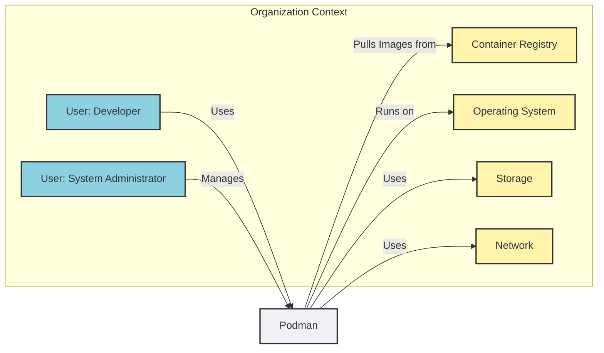
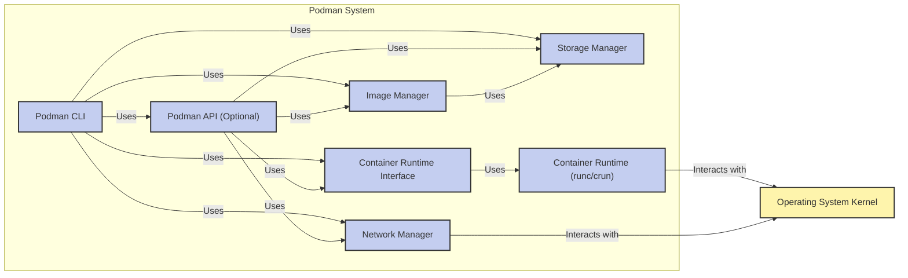
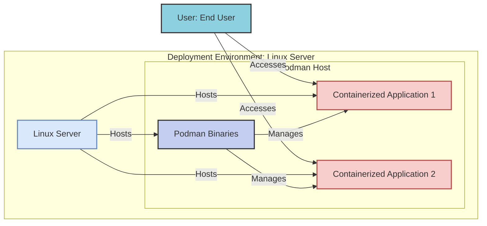

# BUSINESS POSTURE

The Podman project aims to provide a secure, efficient, and daemonless container management solution for Linux systems. It addresses the need for containerization in environments where traditional daemon-based container engines might be considered less secure or less suitable due to architectural constraints. The primary business priorities and goals are focused on:

- Security: Enhancing container security through a daemonless architecture, rootless container execution, and integration with Linux security features like namespaces, seccomp, and SELinux/AppArmor.
- Daemonless Architecture: Eliminating the need for a central daemon, reducing the attack surface and improving system stability.
- OCI Compliance: Adhering to Open Container Initiative standards to ensure compatibility and interoperability within the container ecosystem.
- Docker Compatibility: Providing a command-line interface and functionalities that are largely compatible with Docker, easing the transition for users familiar with Docker.
- Developer and System Administrator Friendliness: Offering a user-friendly tool for building, running, and managing containers, catering to both developers and system administrators.

The most important business risks associated with the Podman project include:

- Security Vulnerabilities: Potential vulnerabilities in the Podman codebase, container runtime, or dependencies that could be exploited to compromise containerized applications or the host system.
- Misconfiguration Risks: Improper configuration of Podman or container settings by users, leading to security weaknesses and potential breaches.
- Compatibility Issues: Incompatibilities with certain Docker features, container images, or workflows, which could hinder adoption and user experience.
- Supply Chain Risks: Vulnerabilities introduced through dependencies or build processes if not properly secured.
- Performance Bottlenecks: Performance issues arising from the daemonless architecture or specific features, impacting application performance and scalability.

# SECURITY POSTURE

## Existing Security Controls

- security control: Namespace isolation is used to isolate containers from each other and the host system, limiting the impact of container breaches. Implemented by the Linux kernel and utilized by Podman.
- security control: seccomp profiles are used to restrict the system calls available to containers, reducing the attack surface. Implemented by the container runtime (runc/crun) and configured by Podman.
- security control: SELinux/AppArmor integration provides mandatory access control, further isolating containers and limiting their capabilities. Implemented by the Linux kernel and integrated with Podman.
- security control: Rootless mode allows containers to be run without root privileges, significantly reducing the risk of host system compromise in case of container escape. Implemented by Podman and the container runtime.
- security control: Image signing and verification mechanisms (like Sigstore, cosign) can be used to ensure the integrity and authenticity of container images. Potentially integrated or can be integrated with Podman workflows.
- security control: Regular security audits and vulnerability scanning of the Podman codebase and dependencies are likely performed by the open-source community and maintainers (though specific details need verification). Described in project's security policies and practices (if publicly available).
- security control: Secure software development lifecycle practices are generally followed in open-source projects, including code reviews and testing. Implemented by the Podman development team and community.
- security control: Deployment model typically involves installing Podman binaries from trusted repositories or building from source, relying on OS-level package management security. Described in Podman installation documentation.

## Accepted Risks

- accepted risk: Kernel vulnerabilities affecting containers are a general risk for all container technologies, including Podman. Mitigation relies on timely kernel patching and security updates.
- accepted risk: Vulnerabilities in dependencies used by Podman can introduce security risks. Mitigation involves dependency management and regular updates.
- accepted risk: User misconfiguration of Podman or containers can lead to security weaknesses. Mitigation relies on clear documentation, secure defaults, and user education.
- accepted risk: Supply chain attacks targeting container images or build pipelines are a general risk in the container ecosystem. Mitigation involves image signing and verification, and secure build processes.

## Recommended Security Controls

- security control: Implement automated vulnerability scanning of container images used with Podman, both during development and runtime, to identify and mitigate known vulnerabilities.
- security control: Implement runtime security monitoring and anomaly detection for containers managed by Podman to detect and respond to suspicious activities.
- security control: Conduct regular penetration testing and security audits specifically targeting Podman and its integration with the underlying system to identify and address potential weaknesses.
- security control: Enhance supply chain security by implementing measures to verify the integrity and authenticity of dependencies and build artifacts used in Podman development and distribution.
- security control: Provide and promote security hardening guidelines and best practices for Podman users to minimize misconfiguration risks.

## Security Requirements

- Authentication: If remote management capabilities are exposed (e.g., via an API), strong authentication mechanisms are required to verify the identity of clients accessing Podman.
- Authorization: Robust authorization controls are necessary to ensure that only authorized users or processes can perform specific actions on containers and Podman itself. Role-Based Access Control (RBAC) should be considered.
- Input Validation: All inputs to Podman, including CLI commands, API requests, and configuration files, must be thoroughly validated to prevent injection attacks and other input-related vulnerabilities.
- Cryptography: Cryptographic mechanisms should be used to protect sensitive data, such as container image signatures, secrets management within containers, and secure communication channels if remote management is enabled. Secure storage of cryptographic keys is also essential.

# DESIGN

## C4 CONTEXT

### Context Diagram Elements

- Name: User: Developer
  - Type: Person
  - Description: Software developers who use Podman to build, test, and run containerized applications during development.
  - Responsibilities: Develops and tests applications in containers using Podman.
  - Security controls: User authentication to developer workstations, access control to development environments.

- Name: User: System Administrator
  - Type: Person
  - Description: System administrators who deploy, manage, and maintain containerized applications and infrastructure using Podman in production or staging environments.
  - Responsibilities: Manages container deployments, monitors containerized applications, ensures system security and stability.
  - Security controls: Strong authentication and authorization for system administrator accounts, access control to production environments, audit logging.

- Name: Container Registry
  - Type: External System
  - Description: A repository for storing and distributing container images, such as Docker Hub, Quay.io, or a private registry.
  - Responsibilities: Stores and serves container images.
  - Security controls: Access control to the registry, image scanning for vulnerabilities, image signing and verification.

- Name: Operating System
  - Type: External System
  - Description: The Linux operating system on which Podman is installed and runs. Provides the kernel, system libraries, and security features that Podman relies on.
  - Responsibilities: Provides the runtime environment for Podman and containers, enforces security policies (namespaces, seccomp, SELinux/AppArmor).
  - Security controls: Kernel security features, OS hardening, regular security updates and patching.

- Name: Storage
  - Type: External System
  - Description: The storage subsystem used by Podman to store container images, container layers, and container data volumes. Can be local storage or network storage.
  - Responsibilities: Provides persistent storage for container-related data.
  - Security controls: Access control to storage volumes, encryption of sensitive data at rest, storage quotas and limits.

- Name: Network
  - Type: External System
  - Description: The network infrastructure used by Podman to provide network connectivity to containers and allow communication between containers and external systems.
  - Responsibilities: Provides network connectivity for containers.
  - Security controls: Network segmentation, firewalls, network policies, network monitoring.

- Name: Podman
  - Type: Software System
  - Description: A daemonless container engine for developing, managing, and running OCI Containers on Linux systems.
  - Responsibilities: Builds, pulls, runs, and manages containers, provides a command-line interface and API for container management, integrates with OS security features.
  - Security controls: Rootless mode, namespace isolation, seccomp profiles, SELinux/AppArmor integration, input validation, authorization controls.

## C4 CONTAINER

### Container Diagram Elements

- Name: Podman CLI
  - Type: Container
  - Description: The command-line interface for interacting with Podman. Provides commands for building, running, managing containers and images.
  - Responsibilities: Accepts user commands, validates input, interacts with other Podman components to execute commands.
  - Security controls: Input validation, authorization checks based on user permissions, logging of commands.

- Name: Podman API (Optional)
  - Type: Container
  - Description: An optional API that allows programmatic interaction with Podman. Enables integration with other tools and systems.
  - Responsibilities: Provides a programmatic interface for container management, handles API requests, authenticates and authorizes clients.
  - Security controls: API authentication (if enabled), API authorization, input validation, rate limiting, secure communication channels (HTTPS).

- Name: Image Manager
  - Type: Container
  - Description: Manages container images, including pulling images from registries, storing images locally, and managing image layers.
  - Responsibilities: Image pulling, image storage, image layer management, image signature verification.
  - Security controls: Image signature verification, access control to image storage, vulnerability scanning of images.

- Name: Container Runtime Interface
  - Type: Container
  - Description: Provides an interface to interact with the underlying container runtime (runc or crun). Abstracts the details of the container runtime.
  - Responsibilities: Translates Podman's container management requests into runtime-specific commands, manages container lifecycle.
  - Security controls: Input validation for runtime commands, enforcement of security policies configured by Podman.

- Name: Storage Manager
  - Type: Container
  - Description: Manages container storage, including image storage, container layers, and container volumes. Interacts with the storage subsystem.
  - Responsibilities: Storage allocation, volume management, image layer storage, interacts with storage drivers.
  - Security controls: Access control to storage volumes, encryption of sensitive data at rest, storage quotas and limits.

- Name: Network Manager
  - Type: Container
  - Description: Manages container networking, including creating network namespaces, configuring container interfaces, and managing network connections. Interacts with the operating system kernel for networking.
  - Responsibilities: Network namespace creation, network interface configuration, network policy enforcement.
  - Security controls: Network namespace isolation, network policy enforcement, integration with network security tools (firewalls).

- Name: Container Runtime (runc/crun)
  - Type: Container
  - Description: The actual container runtime that creates and runs containers. Executes the low-level operations to set up namespaces, cgroups, and other container isolation mechanisms.
  - Responsibilities: Container creation, container execution, resource isolation, enforcement of security profiles (seccomp, AppArmor/SELinux).
  - Security controls: seccomp profiles, AppArmor/SELinux enforcement, cgroup limits, namespace isolation.

- Name: Operating System Kernel
  - Type: External Container
  - Description: The Linux kernel provides the core functionalities for containerization, including namespaces, cgroups, seccomp, and security modules like SELinux/AppArmor.
  - Responsibilities: Provides container isolation, resource management, enforces security policies.
  - Security controls: Kernel security features, security modules (SELinux/AppArmor), kernel hardening.

## DEPLOYMENT

Podman itself is typically deployed as a set of binaries on a Linux host. There isn't a complex deployment architecture for Podman itself, as it is designed to be daemonless and run directly on the host. However, we can consider the deployment of applications *using* Podman.

A common deployment scenario is to use Podman on individual Linux servers or virtual machines to run containerized applications.

### Deployment Diagram Elements

- Name: Linux Server
  - Type: Node
  - Description: A physical or virtual Linux server that hosts Podman and containerized applications.
  - Responsibilities: Provides the infrastructure for running Podman and containers, including compute, memory, storage, and network resources.
  - Security controls: Server hardening, operating system security updates, access control to the server, network security controls.

- Name: Podman Binaries
  - Type: Software
  - Description: The Podman executable and related binaries installed on the Linux server.
  - Responsibilities: Manages containers on the server, provides the container runtime environment.
  - Security controls: Secure installation from trusted sources, regular updates to the latest stable version.

- Name: Containerized Application 1, Containerized Application 2
  - Type: Container
  - Description: Example containerized applications running on Podman. These represent the actual applications deployed using Podman.
  - Responsibilities: Provides application functionality, processes user requests, stores and manages application data.
  - Security controls: Application-level security controls, container security best practices, input validation, secure configuration.

- Name: User: End User
  - Type: Person
  - Description: End users who access and use the containerized applications running on Podman.
  - Responsibilities: Uses the applications to perform tasks, interacts with application interfaces.
  - Security controls: User authentication to applications, authorization within applications, data privacy controls.

## BUILD

The build process for Podman involves compiling the Go source code, building binaries for different architectures and operating systems, and creating distribution packages. A typical build process might involve:

```mermaid
flowchart LR
    A["Developer"]:::person --> B["Source Code Repository (GitHub)"]:::code_repo
    B --> C["CI/CD System (GitHub Actions, Jenkins)"]:::ci_cd
    C --> D{"Build Environment"}:::build_env
    D --> E["Build Tools (Go Compiler, Make)"]:::build_tools
    E --> F["Security Checks (SAST, Linters, Dependency Scan)"]:::security_checks
    F --> G["Build Artifacts (Binaries, Packages)"]:::artifacts
    G --> H["Artifact Repository (e.g., Package Registry)"]:::artifact_repo

    classDef person fill:#8dd1e1,stroke:#333,stroke-width:2px
    classDef code_repo fill:#ccf0da,stroke:#333,stroke-width:2px
    classDef ci_cd fill:#c4cef0,stroke:#333,stroke-width:2px
    classDef build_env fill:#fef4ac,stroke:#333,stroke-width:2px
    classDef build_tools fill:#f8cecc,stroke:#b85450,stroke-width:2px
    classDef security_checks fill:#f8cecc,stroke:#b85450,stroke-width:2px
    classDef artifacts fill:#ccf0da,stroke:#333,stroke-width:2px
    classDef artifact_repo fill:#fef4ac,stroke:#333,stroke-width:2px
```

### Build Diagram Elements

- Name: Developer
  - Type: Person
  - Description: Software developers who contribute code to the Podman project.
  - Responsibilities: Writes code, submits code changes, participates in code reviews.
  - Security controls: Secure development workstations, code review process, access control to code repository.

- Name: Source Code Repository (GitHub)
  - Type: Code Repository
  - Description: A version control system (GitHub) that stores the Podman source code.
  - Responsibilities: Stores and manages source code, tracks changes, facilitates collaboration.
  - Security controls: Access control to the repository, branch protection, audit logging.

- Name: CI/CD System (GitHub Actions, Jenkins)
  - Type: CI/CD
  - Description: An automated CI/CD system (e.g., GitHub Actions, Jenkins) that builds, tests, and packages Podman.
  - Responsibilities: Automates the build process, runs tests, performs security checks, creates build artifacts.
  - Security controls: Secure CI/CD pipeline configuration, access control to CI/CD system, secrets management for build credentials.

- Name: Build Environment
  - Type: Build Environment
  - Description: The environment where the Podman build process takes place. Can be a dedicated build server or a containerized build environment.
  - Responsibilities: Provides the necessary tools and dependencies for building Podman.
  - Security controls: Secure build environment configuration, access control to build environment, regular security updates for build tools and dependencies.

- Name: Build Tools (Go Compiler, Make)
  - Type: Build Tools
  - Description: Software tools used to compile and build Podman, such as the Go compiler, Make, and other build utilities.
  - Responsibilities: Compiles source code, links libraries, creates executable binaries.
  - Security controls: Use of trusted and verified build tools, regular updates to build tools.

- Name: Security Checks (SAST, Linters, Dependency Scan)
  - Type: Security Checks
  - Description: Automated security checks performed during the build process, including Static Application Security Testing (SAST), linters, and dependency vulnerability scanning.
  - Responsibilities: Identifies potential security vulnerabilities in the code and dependencies, enforces code quality standards.
  - Security controls: Configuration of security scanning tools, integration with CI/CD pipeline, vulnerability reporting and remediation process.

- Name: Build Artifacts (Binaries, Packages)
  - Type: Artifacts
  - Description: The output of the build process, including Podman binaries, distribution packages (e.g., RPM, DEB), and container images.
  - Responsibilities: Represents the distributable components of Podman.
  - Security controls: Signing of build artifacts, integrity checks, secure storage of artifacts.

- Name: Artifact Repository (e.g., Package Registry)
  - Type: Artifact Repository
  - Description: A repository for storing and distributing build artifacts, such as package registries or container registries.
  - Responsibilities: Stores and serves build artifacts for distribution.
  - Security controls: Access control to the artifact repository, integrity checks of artifacts, secure distribution channels.

# RISK ASSESSMENT

- Critical Business Processes: For Podman itself, the critical process is providing a secure and reliable container management platform. For users of Podman, the critical business processes are the applications they run inside containers managed by Podman. Protecting the integrity and availability of these applications is paramount.
- Data Sensitivity: The data being protected includes:
  - Container Images: These can contain sensitive application code and configurations. Integrity and confidentiality of images are important. Sensitivity depends on the content of the images.
  - Container Data Volumes: These volumes can store application data, which can be highly sensitive (e.g., user data, financial information, secrets). Sensitivity depends on the applications using Podman.
  - Podman Configuration: Configuration files and settings can contain sensitive information and impact security. Confidentiality and integrity are important.
  - Build Artifacts and Source Code: Source code and build artifacts represent the intellectual property and functionality of Podman. Integrity and confidentiality are important to prevent tampering and unauthorized access.

# QUESTIONS & ASSUMPTIONS

## Questions

- What specific authentication and authorization mechanisms are implemented in Podman API (if enabled)?
- What are the details of the automated security checks (SAST, linters, dependency scanning) performed in the Podman build pipeline?
- Are container images built and distributed by the Podman project signed and verified? If so, what signing mechanism is used?
- What are the procedures for handling security vulnerabilities reported in Podman or its dependencies?
- Is there a formal security audit or penetration testing plan for Podman?
- What are the recommended security hardening guidelines for deploying and using Podman in production environments?

## Assumptions

- BUSINESS POSTURE: Security is a primary concern for users choosing Podman. Daemonless architecture is considered a security advantage. Docker compatibility is important for adoption.
- SECURITY POSTURE: Podman leverages Linux kernel security features effectively. Rootless mode is a key security feature. The open-source nature of Podman allows for community scrutiny and security contributions. Regular security updates are expected.
- DESIGN: Podman is primarily used on Linux systems. Users interact with Podman mainly through the CLI. The container runtime (runc/crun) is a critical component for security. The build process is automated and includes some level of security checks.