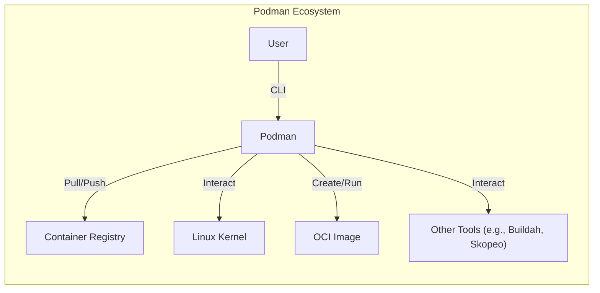
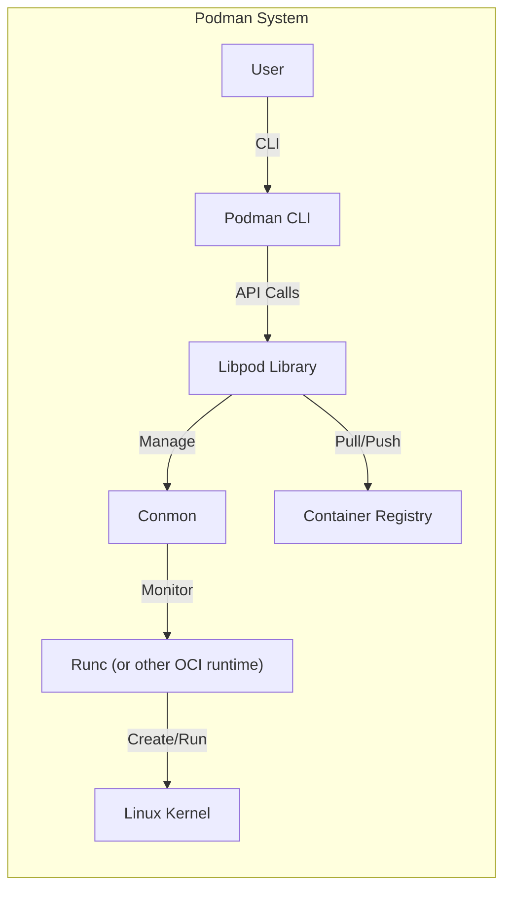
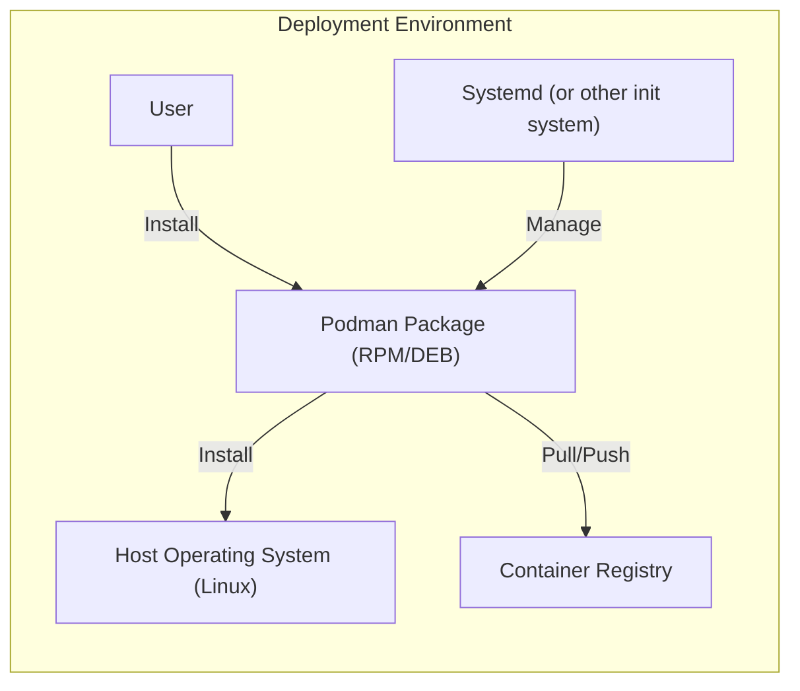
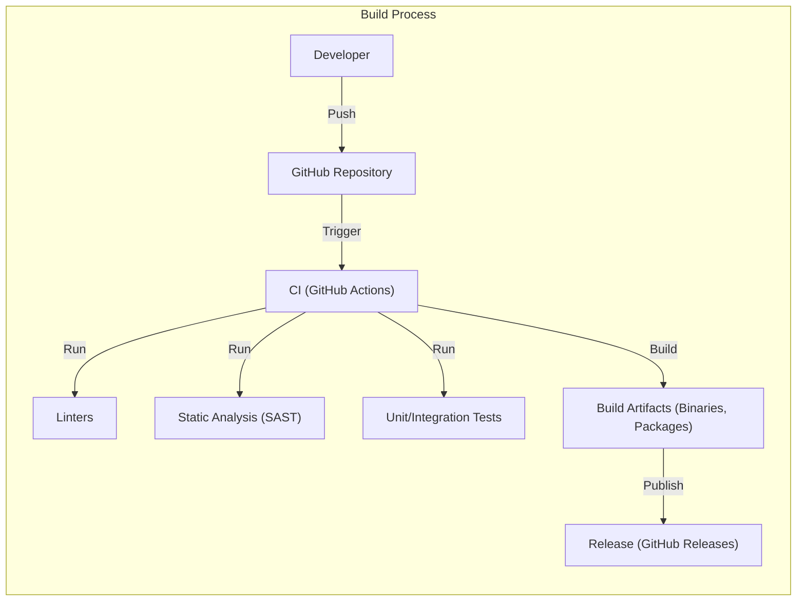

Okay, let's create a design document for the Podman project, focusing on aspects relevant for threat modeling.

# BUSINESS POSTURE

Podman is a daemonless container engine for developing, managing, and running OCI Containers on your Linux System. Containers can either be run as root or in rootless mode.  It's a core component of many containerized environments, particularly those aiming for a more secure and lightweight alternative to Docker.

Business Priorities and Goals:

*   Provide a secure and efficient container runtime.
*   Offer a daemonless architecture to reduce the attack surface.
*   Maintain compatibility with the OCI (Open Container Initiative) standards.
*   Enable rootless container execution for enhanced security.
*   Offer a command-line interface (CLI) compatible with Docker, easing migration.
*   Support a wide range of Linux distributions.
*   Provide a robust and reliable platform for containerized workloads.
*   Foster a strong open-source community and ecosystem.

Most Important Business Risks:

*   Compromise of the host system due to container escape vulnerabilities.
*   Unauthorized access to sensitive data within containers.
*   Denial of service attacks targeting the container runtime or host.
*   Supply chain attacks compromising container images or Podman itself.
*   Incompatibility with critical container orchestration tools or platforms.
*   Reputational damage due to security incidents or instability.
*   Failure to keep pace with evolving container standards and technologies.

# SECURITY POSTURE

Existing Security Controls:

*   security control: Daemonless architecture: Podman operates without a central daemon, reducing the attack surface compared to Docker. Implemented in the core design of Podman.
*   security control: Rootless execution: Podman allows containers to be run without root privileges, limiting the potential damage from container escapes. Implemented in the core design of Podman.
*   security control: User namespaces: Podman leverages user namespaces to isolate container processes from the host system. Implemented in the core design of Podman, leveraging Linux kernel features.
*   security control: SELinux/AppArmor support: Podman integrates with SELinux and AppArmor for mandatory access control. Described in Podman documentation and configuration.
*   security control: Seccomp profiles: Podman uses seccomp profiles to restrict the system calls available to containers. Described in Podman documentation and configuration.
*   security control: Image signing and verification: Podman supports image signing and verification using tools like Skopeo and GPG. Described in Podman documentation.
*   security control: Regular security audits and updates: The Podman project undergoes regular security audits and releases updates to address vulnerabilities.  Evidenced by the project's release history and vulnerability disclosures.
*   security control: Community involvement: A large and active open-source community contributes to security by identifying and reporting vulnerabilities. Evidenced by the project's GitHub activity.

Accepted Risks:

*   accepted risk: Complexity of container security: Container security is inherently complex, and complete isolation is difficult to achieve.
*   accepted risk: Reliance on underlying Linux kernel security: Podman's security relies on the security of the underlying Linux kernel.
*   accepted risk: Potential for misconfiguration: Incorrect configuration of Podman or container images can lead to security vulnerabilities.
*   accepted risk: Zero-day vulnerabilities:  Like all software, Podman is susceptible to zero-day vulnerabilities.

Recommended Security Controls:

*   Implement a comprehensive vulnerability management program, including regular penetration testing.
*   Provide detailed security hardening guides and best practices documentation.
*   Integrate with security scanning tools for container images and running containers.
*   Explore the use of additional security technologies, such as gVisor or Kata Containers, for enhanced isolation.

Security Requirements:

*   Authentication:
    *   Podman itself does not handle user authentication for container execution. It relies on the underlying operating system's user authentication mechanisms.
    *   When interacting with container registries, Podman supports standard authentication methods (e.g., username/password, token-based authentication).
*   Authorization:
    *   Podman leverages Linux user permissions and capabilities to control access to resources.
    *   Rootless containers inherently have limited privileges.
    *   SELinux/AppArmor provide additional mandatory access control.
*   Input Validation:
    *   Podman validates command-line input and configuration parameters.
    *   Image manifests and configurations are parsed and validated.
    *   Input validation is crucial to prevent injection attacks and other vulnerabilities.
*   Cryptography:
    *   Podman supports cryptographic signing and verification of container images.
    *   TLS/SSL is used for secure communication with container registries.
    *   Cryptographic libraries are used for secure random number generation and other security-sensitive operations.

# DESIGN

## C4 CONTEXT

Element Descriptions:

*   Element:
    *   Name: User
    *   Type: Person
    *   Description: A person interacting with Podman via the command-line interface.
    *   Responsibilities: Issue commands to Podman to manage containers and images.
    *   Security controls: Relies on OS-level user authentication and authorization.

*   Element:
    *   Name: Podman
    *   Type: Software System
    *   Description: The daemonless container engine.
    *   Responsibilities: Manage containers, images, and pods; interact with the Linux kernel; handle user commands.
    *   Security controls: Daemonless architecture, rootless execution, user namespaces, SELinux/AppArmor integration, seccomp profiles, image signing/verification.

*   Element:
    *   Name: Container Registry
    *   Type: External System
    *   Description: A remote registry storing container images (e.g., Docker Hub, Quay.io).
    *   Responsibilities: Store and serve container images.
    *   Security controls: Registry-specific security controls (e.g., authentication, authorization, vulnerability scanning).

*   Element:
    *   Name: Linux Kernel
    *   Type: External System
    *   Description: The underlying operating system kernel.
    *   Responsibilities: Provide core system functionality, including process isolation, resource management, and security features.
    *   Security controls: Kernel-level security features (e.g., namespaces, cgroups, capabilities, SELinux/AppArmor, seccomp).

*   Element:
    *   Name: OCI Image
    *   Type: Data
    *   Description: A standardized container image format.
    *   Responsibilities: Package application code and dependencies.
    *   Security controls: Image signing, vulnerability scanning.

*   Element:
    *   Name: Other Tools (e.g., Buildah, Skopeo)
    *   Type: External System
    *   Description: Tools that integrate with Podman for building and managing images.
    *   Responsibilities: Build container images (Buildah), inspect and manage images (Skopeo).
    *   Security controls: Tool-specific security controls, integration with Podman's security features.

## C4 CONTAINER

Since Podman is a relatively simple application from an architectural perspective, the container diagram is very similar to the context diagram. The main "container" is the Podman process itself.

Element Descriptions:

*   Element:
    *   Name: User
    *   Type: Person
    *   Description: A person interacting with Podman via the command-line interface.
    *   Responsibilities: Issue commands to Podman to manage containers and images.
    *   Security controls: Relies on OS-level user authentication and authorization.

*   Element:
    *   Name: Podman CLI
    *   Type: Component
    *   Description: The command-line interface for Podman.
    *   Responsibilities: Parse user commands, interact with the Libpod library.
    *   Security controls: Input validation.

*   Element:
    *   Name: Libpod Library
    *   Type: Library
    *   Description: The core library providing Podman's functionality.
    *   Responsibilities: Manage containers, images, and pods; interact with the OCI runtime; handle registry interactions.
    *   Security controls: Core implementation of Podman's security features (daemonless, rootless, namespaces, etc.).

*   Element:
    *   Name: Conmon
    *   Type: Component
    *   Description: A small utility for monitoring container processes.
    *   Responsibilities: Monitor container processes, handle I/O streams.
    *   Security controls: Runs with limited privileges.

*   Element:
    *   Name: Runc (or other OCI runtime)
    *   Type: Component
    *   Description: The low-level container runtime that creates and runs containers.
    *   Responsibilities: Create and manage container processes using kernel features.
    *   Security controls: Relies on kernel-level security features.

*   Element:
    *   Name: Container Registry
    *   Type: External System
    *   Description: A remote registry storing container images (e.g., Docker Hub, Quay.io).
    *   Responsibilities: Store and serve container images.
    *   Security controls: Registry-specific security controls (e.g., authentication, authorization, vulnerability scanning).

*   Element:
    *   Name: Linux Kernel
    *   Type: External System
    *   Description: The underlying operating system kernel.
    *   Responsibilities: Provide core system functionality, including process isolation, resource management, and security features.
    *   Security controls: Kernel-level security features (e.g., namespaces, cgroups, capabilities, SELinux/AppArmor, seccomp).

## DEPLOYMENT

Podman can be deployed in various ways, but the most common is as a system package on a Linux distribution.

Deployment Solutions:

1.  System Package (RPM, DEB, etc.):  Installed directly on the host operating system.
2.  Static Binary:  Downloaded and executed as a standalone binary.
3.  Within a Container:  Less common, but Podman can be run inside a container (with appropriate privileges).
4.  As part of a Kubernetes distribution (e.g., CRI-O with Podman).

Chosen Solution (System Package):

Element Descriptions:

*   Element:
    *   Name: Host Operating System (Linux)
    *   Type: Operating System
    *   Description: The underlying Linux distribution.
    *   Responsibilities: Provide the base environment for running Podman.
    *   Security controls: Kernel-level security features, system hardening.

*   Element:
    *   Name: Podman Package (RPM/DEB)
    *   Type: Software Package
    *   Description: The Podman installation package.
    *   Responsibilities: Install Podman binaries and configuration files.
    *   Security controls: Package signing, integrity checks.

*   Element:
    *   Name: Systemd (or other init system)
    *   Type: System Service
    *   Description: The system and service manager.
    *   Responsibilities: Manage system services, including (potentially) Podman-related services.
    *   Security controls: Service configuration, resource limits.

*   Element:
    *   Name: Container Registry
    *   Type: External System
    *   Description: A remote registry storing container images.
    *   Responsibilities: Store and serve container images.
    *   Security controls: Registry-specific security controls.

*   Element:
    *   Name: User
    *   Type: Person
    *   Description: The system administrator or user installing and managing Podman.
    *   Responsibilities: Install and configure Podman.
    *   Security controls: OS-level user authentication and authorization.

## BUILD

Podman's build process is managed through its GitHub repository and involves multiple stages and security checks.

Build Process Description:

1.  Developers contribute code to the Podman GitHub repository.
2.  Pull requests trigger automated builds and tests using GitHub Actions.
3.  Linters (e.g., shellcheck, gofmt) check code style and formatting.
4.  Static analysis tools (e.g., gosec) scan for potential security vulnerabilities.
5.  Unit and integration tests verify the functionality of Podman components.
6.  If all checks pass, build artifacts (binaries, packages) are created.
7.  Releases are published on GitHub, including signed binaries and packages.

Security Controls in Build Process:

*   Code review: All code changes are reviewed by other developers before merging.
*   Automated testing: Comprehensive test suite to catch bugs and regressions.
*   Static analysis: SAST tools identify potential security vulnerabilities.
*   Dependency management: Dependencies are carefully managed and scanned for vulnerabilities.
*   Signed releases: Build artifacts are signed to ensure authenticity and integrity.
*   Supply chain security: Efforts are made to secure the build pipeline and prevent tampering.

# RISK ASSESSMENT

Critical Business Processes:

*   Running containerized workloads reliably and securely.
*   Managing container images and registries.
*   Providing a stable and secure platform for container orchestration.

Data to Protect:

*   Container images (including application code and dependencies): Sensitivity varies depending on the application.  Could range from public open-source code to highly sensitive proprietary code and data.
*   Container runtime configuration:  Potentially sensitive, as misconfiguration can lead to vulnerabilities.
*   Data accessed or processed by containers:  Sensitivity varies greatly depending on the application.  Could include personal data, financial data, intellectual property, etc.
*   Host system data:  Highly sensitive, as compromise of the host can lead to complete system takeover.

# QUESTIONS & ASSUMPTIONS

Questions:

*   What specific Linux distributions are the primary targets for Podman deployments?  This impacts the choice of security features and configurations.
*   What are the most common container orchestration platforms used with Podman (e.g., Kubernetes, Nomad, Docker Swarm)?
*   What are the specific threat models or attack scenarios that are of greatest concern?
*   Are there any specific compliance requirements (e.g., PCI DSS, HIPAA) that need to be considered?
*   What level of detail is required for the threat modeling exercise? (e.g., high-level overview vs. detailed analysis of specific components)
*   What is the expected lifetime of containers managed by Podman? (Short-lived vs. long-running)
*   Are there any specific integrations with other security tools (e.g., vulnerability scanners, intrusion detection systems) that should be considered?

Assumptions:

*   BUSINESS POSTURE: The primary goal is to provide a secure and reliable container runtime, prioritizing security over features or performance.
*   SECURITY POSTURE: The development team follows secure coding practices and addresses reported vulnerabilities promptly.
*   DESIGN: The underlying Linux kernel is properly configured and secured. Users are familiar with basic container security concepts. The system administrator has sufficient expertise to configure and manage Podman securely.