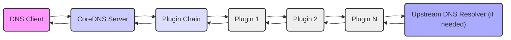
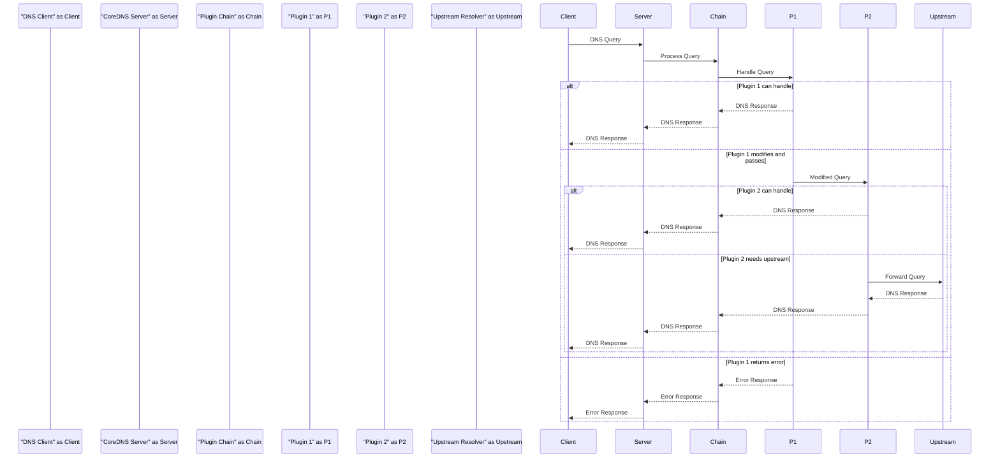

# Project Design Document: CoreDNS

**Version:** 1.1
**Date:** October 26, 2023
**Author:** AI Software Architect

## 1. Introduction

This document provides a detailed architectural design of CoreDNS, a fast and flexible DNS server. This document aims to provide a comprehensive understanding of CoreDNS's components, interactions, and data flow, which will be crucial for subsequent threat modeling activities. This document is based on the information available at [https://github.com/coredns/coredns](https://github.com/coredns/coredns). This revised version includes more detail and emphasizes aspects relevant to security analysis.

## 2. Goals

*   Provide a clear and concise overview of the CoreDNS architecture.
*   Identify key components and their responsibilities, with a focus on security implications.
*   Describe the data flow within the system, highlighting potential points of vulnerability.
*   Elaborate on security-relevant aspects of the design, providing concrete examples.
*   Serve as a robust foundation for future threat modeling exercises.

## 3. Non-Goals

*   Detailed code-level analysis of specific plugins.
*   Specific deployment configurations beyond general considerations (e.g., detailed Kubernetes manifest specifications).
*   Performance benchmarking metrics or analysis.
*   A comparative analysis with other DNS server implementations.

## 4. Architectural Overview

CoreDNS employs a modular architecture where core functionality is minimal, and most features are implemented as plugins arranged in a chain. When a DNS query arrives, it is processed sequentially by this chain of plugins, as defined in the Corefile. Each plugin can inspect, modify, or respond to the query. This architecture provides significant flexibility but also introduces complexities regarding plugin interactions and potential security vulnerabilities within individual plugins or their combinations.

## 5. High-Level Architecture Diagram

## 6. Detailed Component Description

*   **CoreDNS Server:**
    *   Listens for DNS requests on configured network interfaces and ports (typically UDP/53 and TCP/53). This is a primary entry point for potential attacks.
    *   Manages the lifecycle and execution of the plugin chain, orchestrating the processing of each incoming request. Errors in this orchestration could lead to vulnerabilities.
    *   Handles the initial parsing of raw DNS query packets. Vulnerabilities in the parsing logic could be exploited.
    *   Formats and sends DNS response packets. Incorrect formatting could lead to client-side issues or be exploited.
    *   Provides a configuration mechanism via the Corefile. The Corefile itself is a potential target for malicious modification.
    *   Manages server lifecycle events such as startup, graceful shutdown, and reloading of configuration. Improper handling of these events could introduce vulnerabilities.

*   **Plugin Chain:**
    *   A linearly ordered sequence of plugins defined in the Corefile. The order is critical as it dictates the processing flow.
    *   Each plugin in the chain receives the DNS request context and can perform actions based on the query and its own logic.
    *   Plugins can choose to:
        *   Fully resolve the query and return a response, halting further processing in the chain.
        *   Modify the query and pass it to the next plugin.
        *   Perform an action (e.g., logging, metrics) and pass the query to the next plugin.
        *   Return an error, halting processing.
    *   The interaction and dependencies between plugins are important areas for security analysis.

*   **Plugins (Examples with Security Relevance):**
    *   **`forward`:** Forwards queries to configured upstream DNS resolvers.
        *   **Security Relevance:**  Misconfigured or compromised upstream resolvers can lead to incorrect or malicious responses. Lack of DNSSEC validation on forwarded responses can be a vulnerability.
    *   **`cache`:** Caches DNS responses to reduce latency and upstream load.
        *   **Security Relevance:** Cache poisoning vulnerabilities could allow attackers to inject false information. Improper cache eviction policies could lead to stale or incorrect data.
    *   **`file`:** Serves authoritative DNS records from local zone files.
        *   **Security Relevance:** Zone files are sensitive data. Unauthorized access or modification of these files can have significant impact. Incorrectly formatted zone files could lead to parsing vulnerabilities.
    *   **`auto`:** Provides automatic reverse DNS (PTR) records based on configured IP ranges.
        *   **Security Relevance:** Incorrect configuration could expose internal network information.
    *   **`kubernetes`:** Integrates with Kubernetes to resolve service names within the cluster.
        *   **Security Relevance:**  Improperly secured access to the Kubernetes API or misconfigured service accounts could be exploited.
    *   **`prometheus`:** Exposes internal metrics in Prometheus format.
        *   **Security Relevance:**  Sensitive information might be exposed through metrics if not properly secured.
    *   **`rewrite`:** Modifies DNS queries or responses based on defined rules.
        *   **Security Relevance:**  Incorrectly written rewrite rules could introduce vulnerabilities or bypass security measures.
    *   **`errors`:** Provides error logging functionality.
        *   **Security Relevance:**  Insufficient or overly verbose logging can hinder security analysis or expose sensitive information.
    *   **`health`:** Provides a health check endpoint for monitoring.
        *   **Security Relevance:**  Exposure of the health endpoint without proper authentication could reveal information about the server's status.
    *   **`loop`:** Detects and prevents DNS resolution loops.
        *   **Security Relevance:** Failure to detect loops can lead to resource exhaustion and denial of service.
    *   **`trace`:** Provides request tracing capabilities for debugging.
        *   **Security Relevance:**  Exposure of trace information could reveal sensitive data about DNS queries.

*   **Plugin Interface:**
    *   Defines the API and data structures that plugins use to interact with the CoreDNS server and each other.
    *   **Security Relevance:** Vulnerabilities in the plugin interface itself could affect all plugins. Improperly designed interfaces could make it easier to introduce vulnerabilities in plugins.

*   **Corefile:**
    *   The primary configuration file for CoreDNS, typically named `Corefile`.
    *   Defines server blocks, listening addresses/ports, and the ordered list of plugins for each server block.
    *   Uses a simple, human-readable syntax.
    *   **Security Relevance:** The Corefile is a critical security component. Unauthorized modification can completely alter the behavior of the DNS server. Parsing vulnerabilities in the Corefile reader could be exploited.

*   **Upstream DNS Resolvers:**
    *   External DNS servers that CoreDNS can forward queries to when it cannot resolve them locally.
    *   Configured via the `forward` plugin.
    *   **Security Relevance:** The security posture of upstream resolvers directly impacts CoreDNS. Compromised upstream resolvers can provide malicious responses.

## 7. Data Flow

The typical data flow for a DNS query in CoreDNS involves the following steps:

1. A DNS client initiates a DNS query and sends it to the configured address and port of the CoreDNS server.
2. The CoreDNS server receives the raw DNS query packet.
3. The server parses the DNS query to extract relevant information (e.g., query name, type, class). Errors during parsing can be a point of failure.
4. The parsed query is passed to the first plugin in the configured plugin chain.
5. Each plugin in the chain processes the query sequentially. A plugin can:
    *   **Handle the query and generate a response:** The plugin constructs a DNS response and returns it. Processing typically stops here for this query.
    *   **Modify the query and pass it to the next plugin:** The plugin alters the query (e.g., rewriting the name) and passes the modified query to the subsequent plugin.
    *   **Perform an action and pass the query:** The plugin performs an action (e.g., logging the query) and then passes the original query to the next plugin.
    *   **Return an error:** The plugin encounters an error and returns an error response, halting further processing.
6. If a plugin (like `forward`) needs to query an upstream resolver, it constructs a new DNS query and sends it to the configured upstream server. The response from the upstream resolver is then processed by the `forward` plugin.
7. Once a response is generated (either by a plugin or an upstream resolver), it may traverse the plugin chain in reverse order, allowing plugins to perform actions on the response (e.g., the `cache` plugin might cache the response).
8. The CoreDNS server formats the final DNS response and sends it back to the originating DNS client.

## 8. Security Considerations

*   **Input Validation and Sanitization:** CoreDNS must rigorously validate and sanitize incoming DNS queries to prevent exploitation of parsing vulnerabilities or injection attacks. This includes checking for malformed packets, excessively long names, and other anomalies.
*   **Corefile Security:** The Corefile is a critical configuration file.
    *   **Threat:** Unauthorized modification of the Corefile can lead to complete compromise of the DNS server's functionality.
    *   **Mitigation:** Secure file permissions, access control mechanisms, and potentially using configuration management tools with audit trails.
    *   **Threat:** Parsing vulnerabilities in the Corefile reader could allow attackers to inject malicious configurations.
    *   **Mitigation:** Thorough testing and security audits of the Corefile parsing logic.
*   **Plugin Security:** The security of CoreDNS is heavily dependent on the security of individual plugins.
    *   **Threat:** Vulnerabilities in plugins (e.g., buffer overflows, injection flaws) can be exploited.
    *   **Mitigation:** Regular security audits of plugins, using trusted and well-maintained plugins, and potentially sandboxing or isolating plugins.
    *   **Threat:** Malicious or compromised plugins could be introduced into the plugin chain.
    *   **Mitigation:**  Mechanisms for verifying the integrity and authenticity of plugins.
*   **Upstream Resolver Security:**
    *   **Threat:**  Compromised or malicious upstream resolvers can provide incorrect or malicious DNS responses.
    *   **Mitigation:** Enabling DNSSEC validation when forwarding queries, using trusted public resolvers, and potentially implementing response policy zones (RPZ).
*   **Denial of Service (DoS) Attacks:**
    *   **Threat:** CoreDNS is susceptible to various DoS attacks, such as query floods.
    *   **Mitigation:** Implementing rate limiting, connection limits, and potentially using techniques like response rate limiting (RRL).
*   **Zone Data Security (for authoritative servers):**
    *   **Threat:** Unauthorized access, modification, or disclosure of zone files.
    *   **Mitigation:** Secure file permissions, access control, and potentially using DNSSEC to ensure the integrity and authenticity of zone data.
*   **Protocol Security (UDP and TCP):**
    *   **Threat:** Exploitation of vulnerabilities in the UDP or TCP handling within CoreDNS.
    *   **Mitigation:** Keeping the underlying operating system and libraries up-to-date.
*   **DNS over TLS (DoT) and DNS over HTTPS (DoH):**
    *   **Security Benefit:** Encrypt DNS traffic, protecting against eavesdropping and manipulation.
    *   **Consideration:** Proper configuration and management of TLS certificates are crucial.
*   **Access Control:** While CoreDNS itself has limited built-in access control, the underlying operating system and network infrastructure provide mechanisms to restrict access to the server.
*   **Monitoring and Logging:**
    *   **Importance:** Comprehensive logging of DNS queries, responses, and errors is essential for security monitoring, incident response, and identifying potential attacks.
    *   **Consideration:** Secure storage and access control for log files are necessary.

## 9. Deployment Considerations

*   CoreDNS can be deployed as a standalone service on various operating systems.
*   It is widely adopted as the default cluster DNS provider in Kubernetes environments.
*   Deployment can be facilitated through containerization technologies like Docker.
*   Configuration management tools (e.g., Ansible, Chef) can be used to automate the deployment and management of CoreDNS configurations.
*   Consideration should be given to network segmentation and firewall rules to restrict access to the DNS server.

## 10. Future Considerations (for Threat Modeling)

*   **In-depth Analysis of Common Plugin Vulnerabilities:** A focused analysis of known vulnerabilities and common attack vectors for frequently used plugins (e.g., `forward`, `cache`, `file`).
*   **Security Implications of Plugin Interactions:**  A detailed examination of how the order and configuration of plugins can create unexpected security vulnerabilities or bypass intended security measures.
*   **Resource Exhaustion Vulnerabilities:**  Analyzing how specific plugins or combinations of plugins might be exploited to cause excessive resource consumption (CPU, memory, network), leading to denial of service.
*   **Corefile Injection Vulnerabilities:**  A deeper investigation into potential vulnerabilities in the Corefile parsing logic that could allow for the injection of malicious configurations.
*   **Impact of External Dependencies:**  Analyzing the security of external libraries and dependencies used by CoreDNS and its plugins.
*   **Side-Channel Attacks:**  Consideration of potential side-channel attacks that might leak information (e.g., timing attacks on cache lookups).

This improved design document provides a more detailed and security-focused overview of CoreDNS's architecture. The enhanced descriptions of components, data flow, and security considerations should serve as a valuable resource for conducting thorough and effective threat modeling activities.