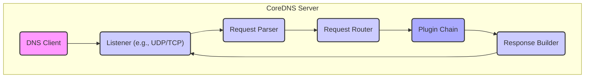
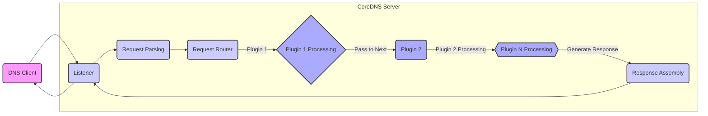

# Project Design Document: CoreDNS

**Version:** 1.1
**Date:** October 26, 2023
**Author:** AI Software Architect

## 1. Introduction

This document outlines the design of the CoreDNS project, an open-source, modular, and pluggable DNS server. This document serves as a foundation for understanding the system's architecture, components, and interactions, and will be used as a basis for subsequent threat modeling activities. The information presented here is derived from the official CoreDNS documentation and general understanding of its functionality. This revision aims to provide more granular detail and explicitly highlight aspects relevant to security analysis.

## 2. Goals

The primary goals of CoreDNS are:

- **Authoritative and Recursive DNS Server:**  To serve as both an authoritative source of DNS records for configured zones and a recursive resolver for queries outside of those zones.
- **Modularity and Extensibility:** To allow users to easily extend and customize its functionality through a well-defined plugin architecture, enabling integration with various systems and services.
- **Service Discovery Integration:** To seamlessly integrate with service discovery platforms like Kubernetes, enabling DNS-based service lookup within those environments.
- **Performance and Scalability:** To efficiently handle a large volume of DNS queries with minimal latency and resource consumption.
- **Ease of Configuration:** To provide a straightforward and flexible configuration mechanism that is easy to understand and manage.
- **Observability:** To offer comprehensive metrics and logging capabilities for effective monitoring, debugging, and performance analysis.

## 3. High-Level Architecture

CoreDNS employs a plugin-based architecture where incoming DNS requests are processed sequentially through a chain of plugins. Each plugin is responsible for a specific aspect of request handling.

- **"DNS Client"**: Any system or application initiating a DNS query to CoreDNS. This represents an external interaction point and a potential source of malicious queries.
- **"Listener (e.g., UDP/TCP)"**:  The component responsible for accepting incoming DNS requests on configured network interfaces and ports using protocols like UDP, TCP, or gRPC. This is a critical entry point and a target for denial-of-service attacks.
- **"Request Parser"**:  Analyzes the raw DNS request data to extract relevant information like the query type, domain name, and flags. Errors in parsing could lead to vulnerabilities.
- **"Request Router"**: Determines the specific plugin chain to be used for processing the request based on the domain name, query type, and configuration rules defined in the Corefile. Incorrect routing can lead to unexpected behavior or bypass security measures.
- **"Plugin Chain"**: An ordered sequence of plugins defined in the Corefile. Each plugin in the chain processes the request, potentially modifying it, generating a response, or forwarding it to the next plugin. The order and configuration of this chain are crucial for functionality and security.
- **"Response Builder"**: Constructs the final DNS response based on the actions of the plugins in the chain. This involves formatting the response according to DNS protocol specifications.

## 4. Key Components

- **"CoreDNS Server"**: The main Go executable that initializes and manages the DNS server, including the listener, request router, and plugin infrastructure. It's responsible for reading and interpreting the Corefile.
- **"Configuration File (Corefile)"**: A text-based configuration file that dictates CoreDNS's behavior. It defines:
    - Listening addresses and ports.
    - Enabled plugins and their order in the processing chain.
    - Plugin-specific configurations, including backend data store credentials and access policies. This file contains sensitive information and its integrity is paramount.
- **"Plugins"**: Independent, modular components that extend CoreDNS functionality. They operate within the CoreDNS process and have access to the request and response data.
    - **"Standard Plugins"**: Built-in plugins providing core DNS features (e.g., `"forward"`, `"cache"`, `"file"`, `"kubernetes"`). These are generally well-vetted but can still contain vulnerabilities.
    - **"Third-Party Plugins"**: Plugins developed by the community to add specialized features. The security of these plugins is the responsibility of their developers, and their use introduces a potential risk if not properly vetted.
- **"Plugin Chain"**: A specifically ordered list of plugins defined within a server block in the Corefile. This order determines the sequence of processing for DNS requests matching the block's criteria.
- **"Listeners"**:  Handle incoming network connections on specified interfaces and ports. They are responsible for accepting and passing DNS requests to the request processing pipeline.
- **"Cache"**: A component (typically implemented by the `"cache"` plugin) that stores recently resolved DNS records to improve performance and reduce load on upstream servers. Cache poisoning is a significant security concern.
- **"Forwarder"**: A component (implemented by the `"forward"` plugin) that sends unresolved queries to configured upstream DNS servers. The security of communication with upstream servers is important.
- **"Backend Data Stores"**: Some plugins interact with external data sources to retrieve or manage DNS records:
    - **"File Plugin"**: Reads zone information from local zone files. Access control to these files is crucial.
    - **"Kubernetes Plugin"**: Retrieves service discovery information from the Kubernetes API server. Authentication and authorization to the Kubernetes API are critical.
    - **"etcd Plugin"**: Retrieves zone data from an etcd key-value store. Secure access to etcd is necessary.
    - **"Other Database Plugins"**: Plugins can integrate with various databases, each with its own security considerations.
- **"Metrics Endpoint"**: An HTTP endpoint (often provided by the `"prometheus"` plugin) that exposes performance and operational metrics in Prometheus format. Access to this endpoint should be restricted to authorized monitoring systems to prevent information disclosure.
- **"Logging"**: CoreDNS provides configurable logging capabilities, allowing administrators to track DNS queries, errors, and other events. Log data can contain sensitive information and should be secured.

## 5. Data Flow

A typical DNS query flow within CoreDNS involves the following steps, highlighting potential trust boundaries and data transformations:

- **"DNS Client" sends a DNS query.** This is the initial untrusted input.
- **"Listener" receives the query.** This is the entry point where network security controls are applied.
- **"Request Parsing"**: The raw bytes of the DNS query are parsed into a structured format. Errors here could lead to vulnerabilities.
- **"Request Router"**:  The router examines the parsed request and determines the appropriate `"Plugin Chain"` based on the Corefile configuration. This decision point is crucial for security policies.
- **"Plugin Chain Processing"**:
    - The request is passed sequentially through the configured plugins.
    - **"Plugin 1 Processing"**: The first plugin in the chain operates on the request. This might involve:
        - Accessing backend data stores (trust boundary crossing).
        - Modifying the request.
        - Generating a partial or complete response.
        - Forwarding the query to an upstream server (trust boundary crossing).
    - **"Plugin 2 Processing"**: Subsequent plugins in the chain process the (potentially modified) request.
    - **"Plugin N Processing"**: The final plugin in the chain, or a plugin that short-circuits the chain, prepares the response.
- **"Response Assembly"**: The final DNS response is constructed based on the actions of the plugins.
- **"Listener" sends the response back to the "DNS Client".** The response is the output of the CoreDNS process.

## 6. Deployment Model

CoreDNS can be deployed in various environments, each with its own security implications:

- **Standalone Server:** Deployed as a single instance on a virtual machine or physical server. Security relies on OS-level security and network firewalls.
- **Containerized Deployment (e.g., Docker, Kubernetes):** Commonly deployed within containerized environments. Container security best practices are essential, including image scanning and resource limits.
- **As a DaemonSet in Kubernetes:** Deployed on every node in a Kubernetes cluster to provide local DNS resolution. This increases the attack surface but provides resilience. Node security becomes paramount.
- **Cloud-Based DNS Service:** Managed CoreDNS instances offered by cloud providers. Security is a shared responsibility model.

## 7. Security Considerations

This section provides a more detailed overview of security considerations, expanding on the initial overview.

- **External Interfaces:**
    - **"DNS Clients"**: Untrusted sources sending DNS queries. Potential for malicious queries, DDoS attacks. Input validation and rate limiting are crucial.
    - **"Upstream DNS Servers"**: External DNS resolvers. Communication should be secured (DoT, DoH) to prevent eavesdropping and tampering. Trust in upstream resolvers is assumed.
    - **"Backend Data Stores"**:  Databases, APIs, or file systems storing zone data. Authentication, authorization, and secure communication are essential. This represents a significant trust boundary.
    - **"Metrics Endpoint"**:  Exposes operational data. Access should be restricted to authorized monitoring systems to prevent information disclosure.
    - **"Logging Destinations"**:  Where logs are sent. Secure transport and storage are necessary to protect sensitive information.
- **Authentication and Authorization:**
    - **CoreDNS Server Access:** Controlled by network firewalls and OS-level security.
    - **Plugin Access to Backends:** Plugins interacting with data stores (e.g., Kubernetes API) require appropriate authentication and authorization. Misconfigured permissions can lead to data breaches.
- **Data Validation:** Rigorous validation of incoming DNS requests is necessary to prevent malformed queries from crashing the server or exploiting vulnerabilities.
- **Denial of Service (DoS) Protection:** CoreDNS needs to be resilient against DoS attacks targeting its listeners. Rate limiting, connection limits, and resource management are important.
- **Configuration Security:** The `"Corefile"` contains sensitive information (credentials, API keys) and must be protected from unauthorized access and modification. Secure storage and access controls are critical.
- **Plugin Security:** The security of CoreDNS is heavily dependent on the security of its plugins. Using untrusted or vulnerable third-party plugins can introduce significant risks. Regular auditing and vetting of plugins are necessary.
- **DNS Spoofing/Cache Poisoning:**  Mechanisms to prevent cache poisoning attacks are crucial, especially when interacting with untrusted upstream resolvers. DNSSEC validation helps mitigate this.
- **Information Disclosure:**  Care must be taken to avoid exposing sensitive information through DNS responses, error messages, or metrics.
- **Transport Security:**  Communication with upstream DNS servers should use secure protocols like DNS-over-TLS (DoT) or DNS-over-HTTPS (DoH). Connections to backend data stores should also be encrypted.
- **Trust Boundaries:** Key trust boundaries exist between:
    - CoreDNS and external DNS clients.
    - CoreDNS and upstream DNS servers.
    - CoreDNS and backend data stores.
    - CoreDNS and third-party plugins.

## 8. Technology Stack

- **Programming Language:** Go (memory safety and concurrency features are relevant for security).
- **Networking Libraries:** Standard Go networking libraries (potential vulnerabilities in underlying libraries need to be considered).
- **Configuration Format:** `"Corefile"` (text-based, human-readable but requires careful parsing).
- **Supported Protocols:** UDP, TCP, gRPC (for DNS). Security implications of each protocol need to be considered.
- **Metrics:** Prometheus (standard format, but access control is needed).
- **Logging:** Standard output or configurable logging backends (security of log storage is important).

## 9. Assumptions and Constraints

- This design document describes the general architecture of CoreDNS. Specific implementations and configurations may vary significantly, impacting the threat landscape.
- The focus is on core functionality and common deployment scenarios. Less common or highly specialized plugins are not detailed here, but their use should be considered during threat modeling.
- Security considerations are presented to inform the threat modeling process. A comprehensive threat model will require deeper analysis.
- The information is based on the current understanding of CoreDNS as of the document creation date. Future versions may introduce changes that affect security.
