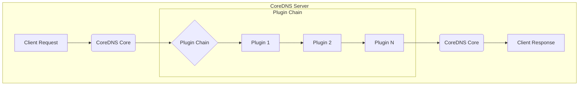

# Project Design Document: CoreDNS

**Version:** 1.1
**Date:** October 26, 2023
**Author:** AI Software Architect

## 1. Introduction

This document provides an enhanced and detailed design overview of the CoreDNS project, an open-source, modular, and extensible DNS server. This document is specifically tailored to serve as a robust foundation for subsequent threat modeling activities. It meticulously outlines the key architectural components, data flows, configuration mechanisms, and functionalities of CoreDNS, providing the necessary context for identifying potential security vulnerabilities.

## 2. Goals and Objectives

The fundamental goals driving the development and adoption of CoreDNS are:

* **Comprehensive DNS Service:** To function as both an authoritative name server for specific domains and a recursive resolver for general DNS queries.
* **Highly Modular Architecture:** To enable flexible customization and extension of DNS functionality through a well-defined plugin architecture. This allows users to tailor CoreDNS to their specific needs.
* **High Performance and Scalability:** To efficiently handle a large volume of DNS requests with low latency, ensuring reliable service under heavy load.
* **Simplified Configuration:** To offer a user-friendly and declarative configuration approach, minimizing complexity and the potential for errors.
* **Native Cloud Integration:** To seamlessly integrate with modern cloud-native environments, particularly Kubernetes, providing dynamic service discovery and DNS resolution.

## 3. Architectural Overview

CoreDNS is built upon a plugin-based architecture, where core DNS functionalities and extensions are implemented as independent plugins. The central "Core" component acts as a request router and orchestrator, managing the execution of these plugins in a defined chain. This modular design promotes flexibility, maintainability, and extensibility.



## 4. Key Components

* **CoreDNS Core:**
    *  **Request Reception and Dispatch:**  Responsible for listening on configured network interfaces and ports (typically UDP/53 and TCP/53) and receiving incoming DNS requests. It parses the DNS request and prepares it for processing by the plugin chain.
    *  **Plugin Chain Management:**  Maintains the ordered list of configured plugins for each server block. It iterates through this chain, passing the DNS request (or intermediate results) to each plugin in sequence.
    *  **Configuration Loading and Parsing:** Reads and interprets the `Corefile`, the central configuration file for CoreDNS. It parses the server blocks and plugin directives, setting up the plugin chain accordingly.
    *  **Server Lifecycle Management:** Handles the startup and shutdown of the CoreDNS server process.
    *  **Basic DNS Protocol Handling:** Implements fundamental DNS protocol logic, such as message parsing and response formatting.

* **Plugins:**
    *  **Modular Functionality:** Each plugin encapsulates a specific DNS function or extension. This allows for a highly customizable DNS server.
    *  **Configurable Order:** The order in which plugins are listed in the `Corefile` is crucial, as it determines the processing order of DNS requests.
    *  **Diverse Functionality Examples:**
        *  `forward`:  Directs DNS queries to upstream resolvers (e.g., public DNS servers or internal resolvers). It can be configured with specific upstream servers and retry policies.
        *  `cache`:  Stores recently resolved DNS records in memory to reduce latency and load on upstream servers. It supports configurable TTLs and cache sizes.
        *  `file`:  Serves authoritative DNS records from a local zone file, enabling CoreDNS to act as an authoritative name server.
        *  `auto`:  Automatically generates reverse DNS (PTR) records based on forward records, simplifying reverse lookup configurations.
        *  `kubernetes`:  Dynamically resolves DNS queries based on Kubernetes service definitions, enabling service discovery within a Kubernetes cluster.
        *  `prometheus`:  Exposes internal CoreDNS metrics in Prometheus format, facilitating monitoring and alerting.
        *  `tls`:  Encrypts DNS communication using TLS (DNS over TLS - DoT), enhancing privacy and security.
        *  `grpc`:  Encrypts DNS communication using gRPC (DNS over gRPC), offering an alternative secure transport.
        *  `errors`:  Provides detailed error logging and reporting for debugging and troubleshooting.
        *  `health`:  Exposes health check endpoints (typically HTTP) that can be used by monitoring systems to verify the server's availability.
        *  `rewrite`:  Allows for rewriting DNS queries or responses based on configurable rules.
        *  `proxy`:  Acts as a DNS proxy, forwarding requests to other DNS servers.

* **Configuration (Corefile):**
    *  **Text-Based Configuration:**  A human-readable text file that defines the behavior of the CoreDNS server.
    *  **Server Blocks:**  Organizes configuration into distinct server blocks, each representing a separate DNS server instance listening on specific addresses and ports. This allows for running multiple independent DNS servers within a single CoreDNS process.
    *  **Plugin Directives:**  Within each server block, plugins are declared along with their specific configuration parameters. The order of these directives defines the plugin chain.
    *  **Flexibility and Control:**  Provides granular control over DNS server behavior, allowing administrators to tailor CoreDNS to their specific requirements.

* **DNS Request/Response Handling:**
    *  **Protocol Support:** CoreDNS supports standard DNS protocols, including UDP and TCP, for receiving and sending DNS messages.
    *  **Request Processing Pipeline:**  Incoming DNS requests are processed sequentially by the plugins defined in the active server block's configuration.
    *  **Plugin Interaction:**  Plugins can modify the DNS request, generate a response, or pass the request to the next plugin in the chain.
    *  **Response Construction:**  The plugin that ultimately handles the request constructs the DNS response.
    *  **Response Transmission:**  The CoreDNS core transmits the generated response back to the requesting client.

## 5. Data Flow

The typical flow of a DNS request through CoreDNS involves the following stages:

```mermaid
sequenceDiagram
    participant "Client" as Client
    participant "CoreDNS Core" as Core
    participant "Plugin: Rewrite" as Rewrite
    participant "Plugin: Cache" as Cache
    participant "Plugin: Forward" as Forward
    participant "Upstream DNS" as Upstream

    Client->>Core: DNS Request
    Core->>Rewrite: Process Request (Rewrite Rules)
    alt Rewrite modifies the request
        Rewrite-->>Core: Modified Request
        Core->>Cache: Process Request (Cache Lookup)
    else No modification
        Core->>Cache: Process Request (Cache Lookup)
    end
    alt Cache Hit
        Cache-->>Core: DNS Response from Cache
        Core-->>Client: DNS Response
    else Cache Miss
        Cache->>Forward: Forward Request
        Forward->>Upstream: DNS Request
        Upstream-->>Forward: DNS Response
        Forward-->>Cache: Store Response in Cache
        Forward-->>Core: DNS Response
        Core-->>Client: DNS Response
    end
```

**Detailed Breakdown:**

1. **Client Query Initiation:** A DNS client initiates a DNS query and sends it to the configured CoreDNS server address and port.
2. **Core Reception:** The CoreDNS core component receives the incoming DNS request.
3. **Plugin Chain Iteration:** The core begins iterating through the configured plugin chain for the relevant server block.
4. **Plugin-Specific Processing:** Each plugin in the chain receives the request and performs its designated function. For example:
    *   The `rewrite` plugin might modify the query name or type based on predefined rules.
    *   The `cache` plugin checks its local cache for a matching record. If found (cache hit), it returns the cached response.
    *   The `forward` plugin, if the cache misses or the request needs external resolution, forwards the query to configured upstream DNS servers.
    *   Authoritative plugins like `file` would attempt to resolve the query based on their configured zone data.
5. **Response Generation or Further Processing:** A plugin might generate a final DNS response, or it might modify the request and pass it to the next plugin.
6. **Upstream Resolution (if needed):** If a plugin like `forward` is used, CoreDNS communicates with upstream DNS servers to resolve the query.
7. **Response Caching (if applicable):** The `cache` plugin typically stores successful responses for future queries.
8. **Response Transmission:** The CoreDNS core sends the final DNS response back to the originating client.

## 6. Configuration Details

* **Corefile Structure:** The `Corefile` is organized into server blocks, each starting with the listening address and port followed by plugin directives enclosed in curly braces `{}`.
* **Plugin Syntax:** Plugin directives consist of the plugin name followed by any necessary parameters. Parameters can be simple values or nested blocks.
* **Directive Order Significance:** The order of plugin directives within a server block is critical, as it dictates the order of processing.
* **Comments:**  Lines starting with `#` are treated as comments and are ignored by the parser.
* **Placeholders:** CoreDNS supports placeholders within the `Corefile` to represent dynamic values, such as the client IP address or the requested domain name.

**Example Corefile Snippet with Explanation:**

```
.:53 {  # Server block listening on all interfaces, port 53
    errors   # Enable error logging
    log      # Enable general query logging
    cache 30 # Enable caching for 30 seconds
    forward . 8.8.8.8 8.8.4.4  # Forward all other queries to Google Public DNS
    file /etc/coredns/db.example.com example.com # Serve authoritative records for example.com from the specified file
    prometheus :9153 # Expose Prometheus metrics on port 9153
    health :8080 # Expose health endpoint on port 8080
}
```

## 7. Deployment Considerations

* **Operating System Compatibility:** CoreDNS is designed to be cross-platform and can be deployed on various operating systems, including Linux, Windows, and macOS.
* **Containerization Best Practices:**  Deployment within containers (like Docker) is a common and recommended practice, facilitating portability and scalability.
* **Kubernetes Integration:** CoreDNS is the default DNS provider for Kubernetes, offering seamless service discovery and integration.
* **High Availability and Redundancy:** Deploying multiple instances of CoreDNS behind a load balancer ensures high availability and fault tolerance.
* **Resource Management:**  Properly allocating CPU and memory resources to CoreDNS instances is crucial for performance and stability.
* **Security Hardening:**  Implementing security best practices for the deployment environment, such as network segmentation and access control, is essential.

## 8. Security Considerations (Detailed)

This section provides a more detailed overview of potential security considerations relevant for threat modeling:

* **DNS Spoofing/Cache Poisoning:**
    *   **Risk:** Attackers could inject false DNS records into the CoreDNS cache, leading clients to connect to malicious servers.
    *   **Mitigation:** Employ DNSSEC validation to verify the authenticity of DNS responses from upstream servers. Use secure upstream resolvers. Implement rate limiting to mitigate potential poisoning attempts.
* **Denial of Service (DoS) Attacks:**
    *   **Risk:** CoreDNS, like any DNS server, is susceptible to various DoS attacks, such as UDP floods or TCP SYN floods, overwhelming the server and making it unavailable.
    *   **Mitigation:** Implement rate limiting, connection limits, and utilize infrastructure-level protection mechanisms (e.g., firewalls, DDoS mitigation services).
* **DNS Amplification Attacks:**
    *   **Risk:** Attackers can leverage publicly accessible DNS resolvers like CoreDNS to amplify their attacks by sending small queries with spoofed source addresses, resulting in large responses being sent to the victim.
    *   **Mitigation:** Configure CoreDNS to only respond to queries from known and trusted networks. Disable recursion if the server is intended to be authoritative only. Implement response rate limiting.
* **Plugin Vulnerabilities:**
    *   **Risk:** Security vulnerabilities in individual plugins could be exploited to compromise the CoreDNS server or the network it serves.
    *   **Mitigation:** Regularly update CoreDNS and its plugins to the latest versions. Carefully review and understand the functionality of any third-party plugins before deployment. Implement security scanning and vulnerability management practices.
* **Configuration Errors (Corefile):**
    *   **Risk:** Misconfigurations in the `Corefile` can introduce security weaknesses, such as allowing open recursion or exposing sensitive information.
    *   **Mitigation:** Implement a rigorous configuration management process with peer reviews and validation. Follow security best practices when configuring plugins. Avoid using wildcard forwarders without careful consideration.
* **Access Control:**
    *   **Risk:** Unauthorized access to the CoreDNS server or its configuration could allow attackers to manipulate DNS records or disrupt service.
    *   **Mitigation:** Restrict access to the CoreDNS server and its configuration files using appropriate operating system and network security controls. Implement authentication and authorization mechanisms where applicable.
* **Data Privacy:**
    *   **Risk:** CoreDNS processes DNS queries, which may contain sensitive information about user activity. Logging these queries without proper safeguards can pose a privacy risk.
    *   **Mitigation:** Implement appropriate logging policies, anonymize or redact sensitive information in logs, and securely store and manage log data. Consider using DNS over HTTPS (DoH) or DNS over TLS (DoT) to encrypt client queries.
* **DNSSEC Implementation Issues:**
    *   **Risk:** Incorrectly configured DNSSEC validation can lead to legitimate domains being incorrectly marked as invalid, causing service disruptions.
    *   **Mitigation:** Thoroughly test DNSSEC configurations. Monitor DNSSEC validation status. Ensure proper key management practices.
* **Transport Security (DoT/DoH):**
    *   **Risk:** If DoT or DoH is not properly configured or if the TLS certificates are invalid or compromised, the security benefits of encrypted DNS traffic are lost.
    *   **Mitigation:** Ensure that TLS certificates are valid and properly configured. Enforce the use of secure TLS protocols and cipher suites. Regularly renew certificates.

## 9. Future Considerations

* **Advanced Observability Tools:** Integration with more sophisticated monitoring and tracing tools for deeper insights into CoreDNS performance and behavior.
* **Enhanced Plugin Security Framework:**  Developing a more robust framework for plugin security, including standardized security testing and auditing procedures.
* **Improved Dynamic Configuration:** Exploring mechanisms for dynamic configuration updates without requiring server restarts.
* **Integration with Service Mesh Technologies:**  Deeper integration with service mesh platforms for enhanced service discovery and traffic management.
* **Further Performance Optimizations:**  Continuous efforts to optimize CoreDNS performance and resource utilization.

This enhanced design document provides a more in-depth understanding of the CoreDNS project, specifically tailored for threat modeling purposes. It elaborates on the architecture, components, data flow, and configuration, while also providing a more comprehensive overview of potential security considerations and mitigation strategies. This detailed information will be invaluable for identifying and assessing potential threats to the CoreDNS system.