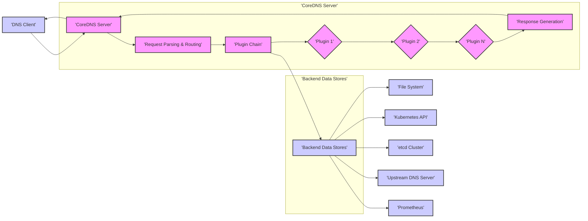

# CoreDNS Project Design Document for Threat Modeling - Improved Version

## 1. Project Overview

**Project Name:** CoreDNS

**Project URL:** [https://github.com/coredns/coredns](https://github.com/coredns/coredns)

**Description:** CoreDNS is a cloud-native, modular, and extensible DNS server written in Go. It leverages a plugin architecture, allowing for flexible configuration and feature extension. CoreDNS can function as an authoritative DNS server, a DNS resolver, and a forwarder. Its primary use cases include service discovery within containerized environments like Kubernetes, general-purpose DNS resolution, and acting as a building block for more complex DNS solutions. The plugin-based design enables integration with diverse backend systems and the implementation of custom DNS logic.

**Purpose of this Document:** This document provides a detailed design overview of CoreDNS, specifically tailored for threat modeling activities. It focuses on architectural components, data flow, trust boundaries, and security-relevant aspects of the system. This document will serve as the foundation for identifying potential security threats, vulnerabilities, and risks associated with CoreDNS deployments. It is intended to be used in conjunction with threat modeling methodologies like STRIDE or PASTA to systematically analyze and mitigate security concerns.

## 2. System Architecture

### 2.1. High-Level Architecture Diagram

### 2.2. Component Description

*   **"'DNS Client'"**: Represents any entity initiating DNS queries to CoreDNS. This includes applications, operating systems, other DNS resolvers, and users. DNS Clients are considered external and potentially untrusted, operating outside the security perimeter of the CoreDNS server. They can be sources of malicious queries or vectors for attacks if CoreDNS is vulnerable.

*   **"'CoreDNS Server'"**: The central CoreDNS instance, responsible for processing DNS queries. It encompasses several key internal components:

    *   **"'Request Parsing & Routing'"**: The initial entry point for all incoming DNS queries. This component is critical for security as it handles untrusted input from the network. Its functions include:
        *   **Receiving DNS Queries**: Listens for DNS requests on configured ports (UDP/53, TCP/53, and potentially DNS-over-TLS/HTTPS ports).  This involves network socket handling, which can be a source of vulnerabilities if not implemented securely (e.g., buffer overflows, socket exhaustion).
        *   **Parsing DNS Queries**: Decodes the raw DNS query data into a structured format. This parsing process must be robust to handle malformed or malicious DNS packets designed to exploit parsing vulnerabilities.  Proper validation of DNS message format and fields is essential to prevent attacks like DNS injection or buffer overflows.
        *   **Query Validation**: Performs initial validation of the DNS query, such as checking for protocol compliance, valid query types, and potentially basic sanity checks on the query name.
        *   **Server Block Routing**:  Determines which server block (defined in the Corefile) should handle the query based on the query name and configured zones. This routing logic must be secure to prevent bypassing intended configurations or accessing unauthorized zones.

    *   **"'Plugin Chain'"**: The core of CoreDNS's functionality and extensibility. It's an ordered sequence of plugins defined in the Corefile, executed sequentially for each DNS query. Each plugin can inspect, modify, or respond to the query. Security implications arise from:
        *   **Plugin Order and Interaction**: The order of plugins is crucial. Misconfiguration or unexpected interactions between plugins can introduce vulnerabilities or bypass security measures. For example, a logging plugin placed *after* a security plugin might log sensitive information even if the security plugin intended to block the request.
        *   **Individual Plugin Vulnerabilities**: Each plugin is a separate piece of code and can contain its own vulnerabilities (e.g., buffer overflows, injection flaws, logic errors).  The security of CoreDNS depends on the security of all plugins in the chain.
        *   **Plugin Functionality**: Plugins perform diverse functions, including:
            *   **Authoritative Serving (e.g., `file`, `auto`):**  Serving DNS records from configured zones. Vulnerabilities here could lead to serving incorrect or malicious DNS records.
            *   **Recursive Resolution/Forwarding (e.g., `forward`, `proxy`):** Forwarding queries to upstream resolvers.  This introduces trust dependencies on upstream resolvers and potential vulnerabilities related to DNS spoofing or man-in-the-middle attacks if not secured with DNSSEC or TLS.
            *   **Service Discovery (e.g., `kubernetes`, `etcd`):**  Integrating with backend services for dynamic DNS records.  Security depends on secure access to these backends and proper authorization.
            *   **Traffic Control and Security (e.g., `acl`, `ratelimit`, `cache`):** Implementing access control, rate limiting, and caching. Misconfigurations in these plugins can weaken security or create denial-of-service vulnerabilities.
            *   **Monitoring and Logging (e.g., `prometheus`, `log`):**  Exposing metrics and logs.  Sensitive information in logs or insecure metric endpoints can be vulnerabilities.
            *   **Record Manipulation (e.g., `rewrite`, `template`):** Modifying DNS records.  Misconfigurations can lead to unintended DNS behavior or security bypasses.

    *   **"'Response Generation'"**:  Constructs the final DNS response message to be sent back to the DNS Client. This component must:
        *   **Format DNS Response**:  Correctly format the DNS response according to DNS protocol specifications. Incorrect formatting could lead to client-side parsing issues or vulnerabilities.
        *   **Include Data from Plugins**: Incorporate the DNS records and response codes provided by the Plugin Chain.  Ensuring the integrity and correctness of data passed from plugins to the response is crucial.
        *   **Handle Errors**:  Properly handle errors that may occur during plugin processing or response generation and return appropriate DNS error codes to the client.

*   **"'Backend Data Stores'"**: External systems or data sources that CoreDNS plugins interact with. The security of these backends directly impacts CoreDNS security.

    *   **"'File System'"**: Used by plugins like `file` and `auto` to load zone data from files. Security considerations:
        *   **File Permissions**: Incorrect file permissions on zone files can allow unauthorized modification or disclosure of DNS records.
        *   **Path Traversal**: Vulnerabilities in file handling within plugins could potentially allow path traversal attacks to access or modify arbitrary files on the system.
        *   **Zone File Integrity**:  Compromised zone files can lead to serving malicious DNS records. Integrity checks and secure storage of zone files are important.

    *   **"'Kubernetes API'"**: Used by the `kubernetes` plugin for service discovery in Kubernetes. Security considerations:
        *   **Authentication and Authorization**: CoreDNS must authenticate and authorize correctly with the Kubernetes API. Weak credentials or overly permissive RBAC roles can lead to unauthorized access and manipulation of Kubernetes resources.
        *   **API Server Security**:  Vulnerabilities in the Kubernetes API server itself can be exploited through CoreDNS if CoreDNS is compromised or misconfigured.
        *   **Data Injection**:  If CoreDNS can be manipulated to query the Kubernetes API in unintended ways, it could potentially be used to extract sensitive information or even modify Kubernetes resources.

    *   **"'etcd Cluster'"**: Used by the `etcd` plugin for dynamic DNS and distributed configuration. Security considerations:
        *   **etcd Access Control**: Secure access to the etcd cluster is paramount. Weak authentication or authorization on etcd can allow unauthorized modification of DNS records.
        *   **etcd Security**:  Vulnerabilities in the etcd cluster itself can be exploited through CoreDNS if CoreDNS is compromised or misconfigured.
        *   **Data Integrity and Confidentiality**:  Sensitive DNS data stored in etcd should be protected for integrity and confidentiality.

    *   **"'Upstream DNS Server'"**: External DNS resolvers used by the `forward` and `proxy` plugins. Security considerations:
        *   **Trust in Upstream Resolvers**:  Forwarding queries to untrusted or compromised upstream resolvers can lead to DNS spoofing, man-in-the-middle attacks, or information leakage.
        *   **DNSSEC Validation**:  Enabling DNSSEC validation when forwarding queries can mitigate some risks associated with untrusted upstream resolvers.
        *   **Privacy Concerns**:  Forwarding queries to public resolvers may raise privacy concerns as client queries are exposed to third parties.

    *   **"'Prometheus'"**: Used by the `prometheus` plugin to expose metrics. Security considerations:
        *   **Metric Endpoint Security**:  The Prometheus metrics endpoint should be secured to prevent unauthorized access to potentially sensitive operational data.  Consider using authentication and authorization for the metrics endpoint, especially if exposed to external networks.
        *   **Information Disclosure in Metrics**:  Ensure that exposed metrics do not inadvertently reveal sensitive information about the DNS infrastructure or the queries being processed.

## 3. Data Flow Description

The data flow for a DNS query in CoreDNS, emphasizing security aspects:

1.  **"'DNS Query Reception'"**: A "'DNS Client'" sends a DNS query to the "'CoreDNS Server'". This is the initial point of untrusted input. Network security measures (firewalls, network segmentation) should be in place to control access to the CoreDNS server.
2.  **"'Request Parsing & Validation'"**: The "'Request Parsing & Routing'" component receives the raw DNS query data.  Crucially, it performs parsing and validation to ensure the query is well-formed and conforms to DNS protocol standards. This step is vital to prevent exploitation of parsing vulnerabilities.
3.  **"'Server Block Routing'"**: Based on the validated query, the request is routed to the appropriate server block defined in the Corefile. Secure routing logic prevents unauthorized access to zones or configurations.
4.  **"'Plugin Chain Processing'"**: The routed request enters the "'Plugin Chain'". Each plugin in the chain processes the request sequentially.
    *   **Plugin-Specific Actions**: Each plugin performs its configured function. For example:
        *   `cache` plugin checks the cache for a response. If found, it returns a cached response, potentially bypassing further plugin processing. Cache poisoning vulnerabilities are relevant here.
        *   `kubernetes` plugin queries the Kubernetes API. Secure API access and authorization are critical.
        *   `forward` plugin forwards the query to an upstream DNS server. DNSSEC validation (if enabled) is performed on the response from the upstream server to prevent spoofing.
        *   `acl` plugin checks access control lists. Misconfigured ACLs can lead to security bypasses or denial of service.
    *   **Data Transformation and Modification**: Plugins may modify the DNS query or response.  Ensure that these transformations are secure and do not introduce vulnerabilities.
5.  **"'Response Generation'"**: Once a plugin provides a definitive answer or the chain is exhausted, the "'Response Generation'" component constructs the final DNS response.  It ensures the response is correctly formatted and includes the appropriate data from the plugins.
6.  **"'DNS Response Transmission'"**: The "'CoreDNS Server'" sends the generated DNS response back to the "'DNS Client'".  Network security measures should also protect the response path.

## 4. Trust Boundaries

Trust boundaries in CoreDNS highlight areas where different levels of trust and security controls are required.

*   **Boundary 1: "'DNS Client'" <-> "'CoreDNS Server'"**: This is the most significant external trust boundary.
    *   **Trust Level**: DNS Clients are generally considered untrusted, especially in public-facing deployments.
    *   **Threats**:  Malicious DNS queries, DoS attacks, protocol exploitation, information gathering attempts.
    *   **Security Controls**: Firewalls, rate limiting (using `ratelimit` plugin), input validation in "'Request Parsing & Routing'", secure listening ports (DNS-over-TLS/HTTPS), access control lists (`acl` plugin).

*   **Boundary 2: "'CoreDNS Server'" <-> "'Backend Data Stores'"**: Trust level varies depending on the backend.
    *   **"'File System'"**: Relatively higher trust within the server's local environment, but still requires careful access control.
        *   **Threats**:  Local file access vulnerabilities, zone file tampering, information disclosure if zone files are not properly secured.
        *   **Security Controls**: File system permissions, secure storage of zone files, input validation in file parsing plugins.
    *   **"'Kubernetes API'"**: Moderate trust, requires authentication and authorization.
        *   **Threats**: Unauthorized access to Kubernetes API, information disclosure of Kubernetes resources, potential for manipulation of Kubernetes resources if CoreDNS is compromised.
        *   **Security Controls**: Kubernetes RBAC, secure service account for CoreDNS, network policies to restrict CoreDNS's access to the API server.
    *   **"'etcd Cluster'"**: Moderate trust, requires authentication and authorization.
        *   **Threats**: Unauthorized access to etcd, modification of DNS records in etcd, information disclosure of DNS data stored in etcd.
        *   **Security Controls**: etcd access control mechanisms (authentication, authorization), TLS encryption for etcd communication, network segmentation.
    *   **"'Upstream DNS Server'"**: Lower trust, especially for public resolvers.
        *   **Threats**: DNS spoofing, man-in-the-middle attacks, reliance on the security posture of external entities.
        *   **Security Controls**: DNSSEC validation (using `dnssec` plugin), DNS-over-TLS/HTTPS for upstream communication, careful selection of trusted upstream resolvers.
    *   **"'Prometheus'"**: Lower trust if exposed externally, moderate trust internally.
        *   **Threats**: Information disclosure through metrics, potential for DoS if metrics endpoint is overwhelmed.
        *   **Security Controls**: Authentication and authorization for metrics endpoint, network segmentation, careful selection of exposed metrics.

*   **Boundary 3: Within the "'Plugin Chain'"**: Internal trust boundary between plugins.
    *   **Trust Level**: Plugins are generally assumed to be trusted code within the CoreDNS server process, but vulnerabilities in individual plugins can still pose risks. Third-party plugins should be treated with caution.
    *   **Threats**: Plugin vulnerabilities, unexpected plugin interactions, malicious plugins (especially third-party or custom plugins).
    *   **Security Controls**: Code reviews for custom plugins, careful selection of plugins, regular updates of CoreDNS and plugins, security scanning of plugin code, principle of least privilege for plugin functionalities.

## 5. Security Considerations (Detailed)

Expanding on the high-level considerations, here are more detailed security aspects:

*   **DNS Spoofing and Cache Poisoning**:
    *   **Threat**: Attackers attempt to inject false DNS records into CoreDNS's cache or directly spoof responses to clients.
    *   **Mitigation**: Enable DNSSEC validation (using `dnssec` plugin) for forwarded queries. Use DNS-over-TLS/HTTPS for upstream resolvers where possible. Implement robust cache management and consider cache invalidation strategies.

*   **Denial of Service (DoS) Attacks**:
    *   **Threat**: Attackers overwhelm CoreDNS with a flood of DNS queries, exhausting resources and making the server unavailable.
    *   **Mitigation**: Implement rate limiting (using `ratelimit` plugin) to restrict the number of queries from specific sources. Configure appropriate resource limits for CoreDNS (CPU, memory, connections). Use load balancing and redundancy for high availability. Employ network-level DoS mitigation techniques (e.g., SYN cookies, traffic shaping).

*   **Plugin Vulnerabilities**:
    *   **Threat**: Vulnerabilities in CoreDNS plugins can be exploited to compromise the server, gain unauthorized access, or cause denial of service.
    *   **Mitigation**: Regularly update CoreDNS and all plugins to patch known vulnerabilities. Perform security audits and code reviews of custom or third-party plugins. Use plugins from trusted sources. Employ vulnerability scanning tools.

*   **Access Control to Backend Data Stores**:
    *   **Threat**: Unauthorized access to backend data stores (Kubernetes API, etcd, file system) can lead to data breaches, data manipulation, or service disruption.
    *   **Mitigation**: Implement strong authentication and authorization mechanisms for accessing backend data stores. Follow the principle of least privilege. Use secure communication channels (TLS) for backend connections. Regularly review and audit access controls.

*   **Configuration Vulnerabilities (Corefile Misconfigurations)**:
    *   **Threat**: Insecure or poorly configured Corefile settings can introduce vulnerabilities, expose sensitive information, or weaken security posture.
    *   **Mitigation**: Follow security best practices when configuring CoreDNS. Regularly review and audit the Corefile configuration. Use configuration validation tools. Avoid exposing sensitive information in the Corefile. Implement version control for Corefile changes.

*   **Information Disclosure**:
    *   **Threat**: Sensitive information (e.g., internal network names, service details, user data) can be unintentionally disclosed through DNS responses, logs, or metrics.
    *   **Mitigation**: Carefully review DNS records and ensure they do not expose sensitive information unnecessarily. Sanitize logs and metrics to remove sensitive data. Secure access to logs and metrics.

*   **DNS Query Amplification Attacks**:
    *   **Threat**: Attackers can leverage publicly accessible DNS servers like CoreDNS to amplify the volume of traffic in a DoS attack against a third-party target.
    *   **Mitigation**: Configure CoreDNS to limit recursion and restrict access to authorized clients. Implement rate limiting. Monitor DNS query patterns for suspicious amplification activity.

*   **Logging and Monitoring Security**:
    *   **Threat**: Insecure logging and monitoring practices can lead to information disclosure, unauthorized access to logs, or failure to detect security incidents.
    *   **Mitigation**: Securely store and manage logs. Implement access controls for log files and monitoring systems. Monitor logs for security-relevant events. Use secure protocols for log transmission.

## 6. Conclusion

This improved design document provides a more detailed and security-focused overview of CoreDNS architecture for threat modeling. It elaborates on component functionalities, data flow, and trust boundaries, highlighting key security considerations and potential threats. This document serves as a robust foundation for conducting comprehensive threat modeling exercises using methodologies like STRIDE or PASTA. Security teams can use this document to identify specific threats relevant to their CoreDNS deployments, assess associated risks, and develop appropriate mitigation strategies to enhance the overall security posture of their DNS infrastructure. Further threat modeling activities should involve deeper dives into specific plugins, configuration options, deployment environments, and attack scenarios to create a comprehensive and actionable security plan for CoreDNS.