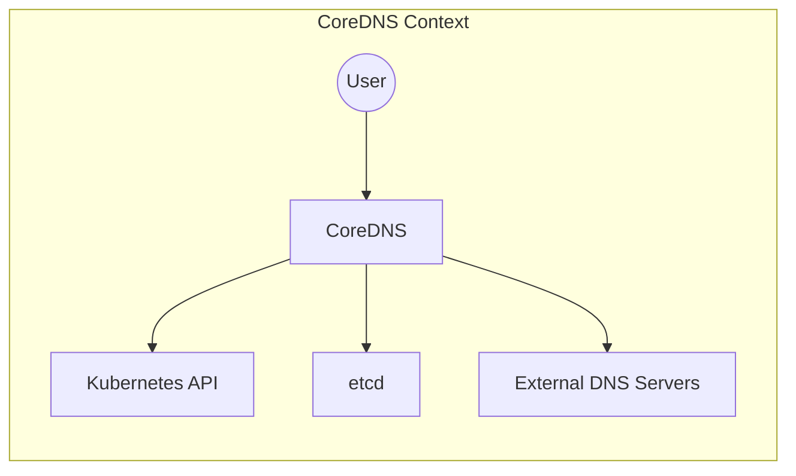
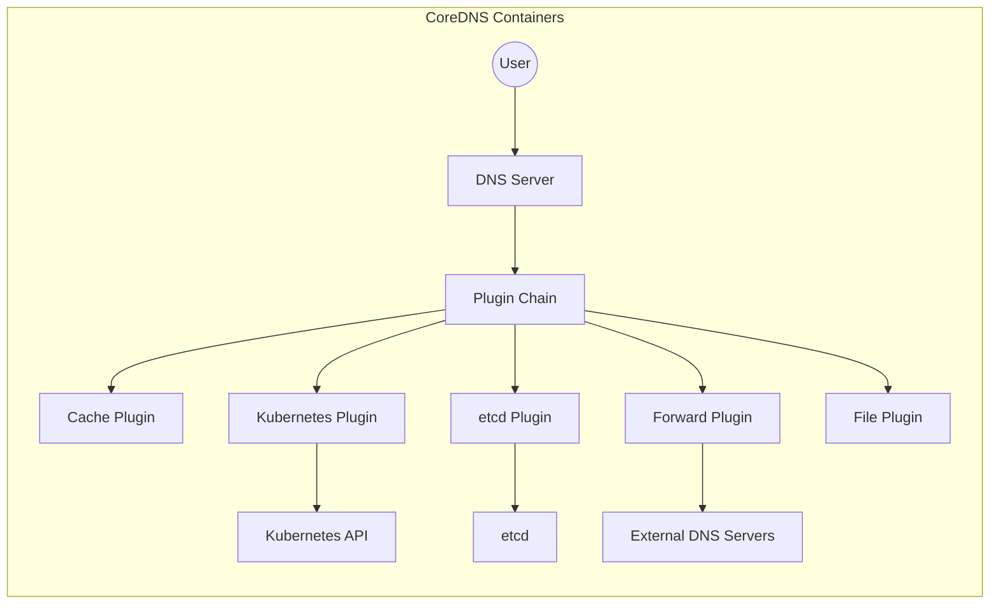
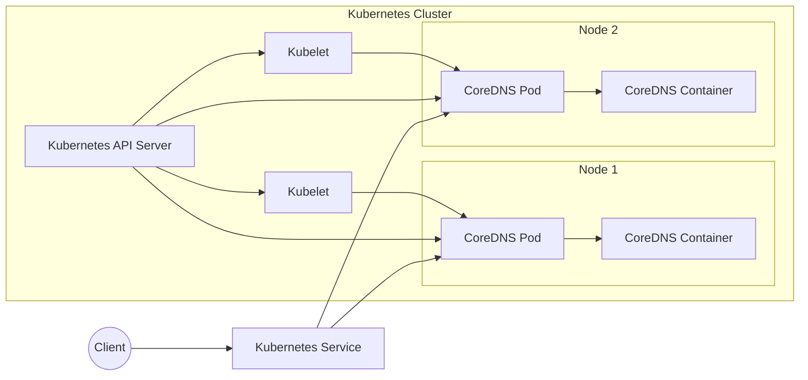

# BUSINESS POSTURE

CoreDNS is a critical piece of infrastructure for many organizations, particularly those using Kubernetes. Its primary business purpose is to provide fast, flexible, and reliable DNS resolution within a cluster or network. It also aims to be easily extensible and customizable through plugins.

Business Priorities:

*   Reliability: CoreDNS must be highly available and resilient to failures. Downtime or errors in DNS resolution can have cascading effects on the entire infrastructure.
*   Performance: DNS resolution needs to be fast. Slow DNS lookups can impact application performance and user experience.
*   Extensibility: The ability to easily add new features and integrate with other systems via plugins is a key differentiator for CoreDNS.
*   Security: As a critical infrastructure component, CoreDNS must be secure and protect against attacks that could compromise the entire network.
*   Maintainability: The project should be easy to maintain and update, with a clear and well-documented codebase.
*   Scalability: CoreDNS should be able to handle a large number of requests and scale to meet the needs of growing infrastructure.

Business Risks:

*   DNS Outages: If CoreDNS fails, applications may be unable to communicate, leading to service disruptions.
*   DNS Spoofing/Cache Poisoning: Attackers could manipulate DNS records to redirect traffic to malicious sites, leading to data breaches or malware infections.
*   Denial of Service (DoS): Attackers could flood CoreDNS with requests, making it unavailable to legitimate users.
*   Data Exfiltration: If CoreDNS is compromised, attackers could potentially access sensitive information contained in DNS queries or responses.
*   Supply Chain Attacks: Vulnerabilities in CoreDNS dependencies or build process could be exploited to compromise the software.
*   Misconfiguration: Incorrectly configured CoreDNS instances could expose sensitive information or create security vulnerabilities.

# SECURITY POSTURE

Existing Security Controls:

*   security control: Secure Development Practices: The CoreDNS project appears to follow secure development practices, including code reviews, static analysis (as evidenced by the use of linters and tools like `go vet`), and dependency management. (Described in project documentation and visible in the GitHub repository).
*   security control: Plugin Architecture: The plugin-based architecture allows for modularity and separation of concerns, which can improve security by limiting the impact of vulnerabilities in individual plugins. (Described in project documentation).
*   security control: Regular Updates: The project is actively maintained, with frequent releases that include security fixes. (Visible in the GitHub repository).
*   security control: Community Scrutiny: As an open-source project, CoreDNS benefits from community scrutiny, which can help identify and address security vulnerabilities. (Visible in the GitHub repository).
*   security control: Use of Go: Go is a memory-safe language, which helps prevent common vulnerabilities like buffer overflows.

Accepted Risks:

*   accepted risk: Complexity: The plugin architecture, while beneficial for extensibility, also introduces complexity, which can increase the risk of security vulnerabilities.
*   accepted risk: Third-Party Dependencies: CoreDNS relies on third-party libraries, which could introduce vulnerabilities.
*   accepted risk: DNS Protocol Limitations: The DNS protocol itself has inherent security limitations, such as a lack of encryption (although DNSSEC and DoH/DoT mitigate this).

Recommended Security Controls:

*   security control: Implement a comprehensive security testing strategy, including fuzzing, penetration testing, and dynamic analysis.
*   security control: Implement robust monitoring and alerting for CoreDNS instances to detect and respond to security incidents.
*   security control: Provide clear security guidance and best practices for configuring and deploying CoreDNS.
*   security control: Conduct regular security audits of the codebase and dependencies.
*   security control: Implement a vulnerability disclosure program to encourage responsible reporting of security issues.
*   security control: Consider implementing DNSSEC, DoH (DNS over HTTPS), and/or DoT (DNS over TLS) to encrypt DNS traffic and protect against eavesdropping and tampering.

Security Requirements:

*   Authentication:
    *   CoreDNS itself does not typically handle authentication for DNS queries. However, plugins could be used to implement authentication mechanisms if required.
    *   If CoreDNS is configured to use an external data source (e.g., a database), it should authenticate securely to that source.
*   Authorization:
    *   CoreDNS should restrict access to administrative interfaces and configuration settings.
    *   Plugins can be used to implement fine-grained authorization policies for DNS queries, such as restricting access to certain zones or records.
*   Input Validation:
    *   CoreDNS must validate all inputs, including DNS queries and configuration settings, to prevent injection attacks and other vulnerabilities.
    *   Plugins should also perform input validation to ensure they are not vulnerable to malicious inputs.
*   Cryptography:
    *   CoreDNS should use strong cryptography for any sensitive data it handles, such as passwords or API keys.
    *   As mentioned above, consider implementing DNSSEC, DoH, and/or DoT to encrypt DNS traffic.

# DESIGN

## C4 CONTEXT

Element Descriptions:

*   Element:
    *   Name: User
    *   Type: Person
    *   Description: Represents a user or application that makes DNS queries.
    *   Responsibilities: Initiates DNS queries to resolve domain names to IP addresses.
    *   Security controls: None (client-side security is outside the scope of CoreDNS).

*   Element:
    *   Name: CoreDNS
    *   Type: Software System
    *   Description: The CoreDNS DNS server.
    *   Responsibilities: Receives DNS queries, resolves them (either from its cache, by querying other servers, or by using plugins), and returns responses.
    *   Security controls: Input validation, plugin security, secure development practices.

*   Element:
    *   Name: Kubernetes API
    *   Type: Software System
    *   Description: The Kubernetes API server.
    *   Responsibilities: Provides an interface for managing Kubernetes resources, including services and endpoints, which CoreDNS uses for service discovery.
    *   Security controls: Kubernetes RBAC, TLS encryption, authentication.

*   Element:
    *   Name: etcd
    *   Type: Software System
    *   Description: A distributed key-value store used by Kubernetes (and optionally by CoreDNS directly).
    *   Responsibilities: Stores configuration data and state for Kubernetes and potentially for CoreDNS.
    *   Security controls: etcd's built-in security features, TLS encryption, authentication.

*   Element:
    *   Name: External DNS Servers
    *   Type: Software System
    *   Description: External DNS servers that CoreDNS may forward queries to.
    *   Responsibilities: Resolve DNS queries that CoreDNS cannot resolve locally.
    *   Security controls: Dependent on the configuration and security of the external DNS servers.

## C4 CONTAINER

Element Descriptions:

*   Element:
    *   Name: DNS Server
    *   Type: Container
    *   Description: The main CoreDNS server process.
    *   Responsibilities: Listens for DNS queries, parses them, passes them to the plugin chain, and sends responses.
    *   Security controls: Input validation, resource limits.

*   Element:
    *   Name: Plugin Chain
    *   Type: Container
    *   Description: The ordered sequence of plugins that process DNS queries.
    *   Responsibilities: Executes plugins in order, allowing each plugin to modify the query or response.
    *   Security controls: Plugin isolation (limited), plugin-specific security controls.

*   Element:
    *   Name: Cache Plugin
    *   Type: Container
    *   Description: A plugin that caches DNS responses.
    *   Responsibilities: Stores and retrieves DNS responses from a cache to improve performance.
    *   Security controls: Cache poisoning protection (limited).

*   Element:
    *   Name: Kubernetes Plugin
    *   Type: Container
    *   Description: A plugin that integrates with Kubernetes for service discovery.
    *   Responsibilities: Queries the Kubernetes API to resolve service names to IP addresses.
    *   Security controls: Secure communication with the Kubernetes API (TLS, authentication).

*   Element:
    *   Name: etcd Plugin
    *   Type: Container
    *   Description: A plugin that uses etcd as a backend for DNS data.
    *   Responsibilities: Reads and writes DNS data to etcd.
    *   Security controls: Secure communication with etcd (TLS, authentication).

*   Element:
    *   Name: Forward Plugin
    *   Type: Container
    *   Description: A plugin that forwards queries to other DNS servers.
    *   Responsibilities: Sends DNS queries to upstream DNS servers and returns the responses.
    *   Security controls: Validation of responses from upstream servers (limited).

*   Element:
    *   Name: File Plugin
    *   Type: Container
    *   Description: Reads zone data from a file.
    *   Responsibilities: Parses and loads DNS records from a standard zone file.
    *   Security controls: File permissions, input validation of zone file contents.

*   Element:
    *   Name: Kubernetes API
    *   Type: Software System
    *   Description: The Kubernetes API server.
    *   Responsibilities: Provides an interface for managing Kubernetes resources.
    *   Security controls: Kubernetes RBAC, TLS encryption, authentication.

*   Element:
    *   Name: etcd
    *   Type: Software System
    *   Description: A distributed key-value store.
    *   Responsibilities: Stores configuration data and state.
    *   Security controls: etcd's built-in security features, TLS encryption, authentication.

*   Element:
    *   Name: External DNS Servers
    *   Type: Software System
    *   Description: External DNS servers.
    *   Responsibilities: Resolve DNS queries.
    *   Security controls: Dependent on the configuration and security of the external DNS servers.

## DEPLOYMENT

CoreDNS can be deployed in several ways:

1.  As a standalone binary on a virtual machine or bare-metal server.
2.  As a container within a container orchestration platform like Kubernetes, Docker Swarm, or Nomad.
3.  As a managed service from a cloud provider (e.g., using a cloud provider's Kubernetes service).

The most common and recommended deployment method is within Kubernetes. We will describe this deployment in detail.

Element Descriptions:

*   Element:
    *   Name: Kubernetes Cluster
    *   Type: Deployment Environment
    *   Description: The Kubernetes cluster where CoreDNS is deployed.
    *   Responsibilities: Provides the orchestration and management of containers.
    *   Security controls: Kubernetes security features (RBAC, network policies, pod security policies, etc.).

*   Element:
    *   Name: Node 1, Node 2
    *   Type: Infrastructure Node
    *   Description: Worker nodes in the Kubernetes cluster.
    *   Responsibilities: Run containerized workloads.
    *   Security controls: Node-level security hardening, OS-level security controls.

*   Element:
    *   Name: CoreDNS Pod (CoreDNSPod1, CoreDNSPod2)
    *   Type: Container Group
    *   Description: Kubernetes Pods running the CoreDNS container. Typically, at least two Pods are deployed for high availability.
    *   Responsibilities: Run the CoreDNS container.
    *   Security controls: Kubernetes pod security policies, resource limits.

*   Element:
    *   Name: CoreDNS Container (CoreDNSContainer1, CoreDNSContainer2)
    *   Type: Container
    *   Description: The CoreDNS container running within the Pod.
    *   Responsibilities: Run the CoreDNS application.
    *   Security controls: Container image security, minimal base image, no unnecessary tools.

*   Element:
    *   Name: Kubelet (Kubelet1, Kubelet2)
    *   Type: Software System
    *   Description: The Kubernetes agent running on each node.
    *   Responsibilities: Manages Pods and containers on the node.
    *   Security controls: Secure communication with the Kubernetes API server (TLS, authentication).

*   Element:
    *   Name: Kubernetes API Server (kube-apiserver)
    *   Type: Software System
    *   Description: The central control plane component of Kubernetes.
    *   Responsibilities: Provides the API for managing Kubernetes resources.
    *   Security controls: Kubernetes RBAC, TLS encryption, authentication, audit logging.

*   Element:
    *   Name: Kubernetes Service (Service)
    *   Type: Software System
    *   Description: A Kubernetes Service that provides a stable IP address and DNS name for accessing the CoreDNS Pods.
    *   Responsibilities: Load balances traffic across the CoreDNS Pods.
    *   Security controls: Network policies can restrict access to the Service.

*   Element:
    *   Name: Client
    *   Type: Person/Software System
    *   Description: A client application or user making DNS requests.
    *   Responsibilities: Initiates DNS queries.
    *   Security controls: Client-side security is outside the scope of CoreDNS deployment.

## BUILD

CoreDNS build process is automated using GitHub Actions. The process can be described as follows:

1.  Developer pushes code changes to the CoreDNS GitHub repository.
2.  GitHub Actions triggers a workflow based on the defined events (e.g., push, pull request).
3.  The workflow checks out the code.
4.  The workflow sets up the Go environment.
5.  The workflow runs linters and static analysis tools (e.g., `go vet`, `golangci-lint`).
6.  The workflow runs unit tests and integration tests.
7.  If all tests pass, the workflow builds the CoreDNS binaries for different platforms.
8.  The workflow creates container images.
9.  The workflow pushes the container images to a container registry (e.g., Docker Hub, Quay.io).
10. The workflow creates a GitHub release and attaches the built binaries.

```mermaid
graph LR
    Developer((Developer)) --> GitHub[GitHub Repository]
    GitHub --> GitHubActions[GitHub Actions]
    GitHubActions --> Checkout[Checkout Code]
    Checkout --> SetupGo[Setup Go]
    SetupGo --> Lint[Run Linters]
    Lint --> Tests[Run Tests]
    Tests --> Build[Build Binaries]
    Build --> CreateImage[Create Container Image]
    CreateImage --> PushImage[Push Image to Registry]
    PushImage --> CreateRelease[Create GitHub Release]
```

Security Controls:

*   security control: Automated Build: The build process is fully automated, reducing the risk of manual errors and ensuring consistency.
*   security control: Static Analysis: Linters and static analysis tools are used to identify potential security vulnerabilities and code quality issues.
*   security control: Testing: Unit tests and integration tests are run to verify the correctness of the code and prevent regressions.
*   security control: Dependency Management: Go modules are used to manage dependencies and ensure that the correct versions are used.
*   security control: Container Image Security: The build process creates container images, which should be based on minimal base images and scanned for vulnerabilities.
*   security control: Signed Commits: Developers should sign their commits to ensure the integrity of the codebase. (Not explicitly enforced, but good practice).

# RISK ASSESSMENT

Critical Business Processes:

*   DNS Resolution: The primary business process is providing reliable and fast DNS resolution. Any disruption to this process can have significant consequences.
*   Service Discovery (in Kubernetes environments): CoreDNS is critical for service discovery within Kubernetes. Failure of service discovery can lead to application outages.

Data Sensitivity:

*   DNS Query Data: DNS queries can reveal information about the websites and services that users are accessing. While not always highly sensitive, this data can be used for tracking or profiling.  Sensitivity: Low to Medium.
*   DNS Response Data: DNS responses contain IP addresses, which are generally considered low-sensitivity data. However, in some cases, they could reveal information about internal network infrastructure. Sensitivity: Low.
*   Configuration Data (e.g., etcd contents, zone files): This data can contain sensitive information, such as API keys, hostnames, and internal network details. Sensitivity: Medium to High.
*   Kubernetes API Data: If CoreDNS is configured to access the Kubernetes API, it may have access to sensitive information about the cluster. Sensitivity: Medium to High.

# QUESTIONS & ASSUMPTIONS

Questions:

*   What specific plugins are being used in the CoreDNS configuration? This is crucial for understanding the attack surface and potential vulnerabilities.
*   What is the expected query volume and performance requirements for CoreDNS? This will influence the deployment architecture and resource allocation.
*   Are there any specific compliance requirements (e.g., GDPR, HIPAA) that need to be considered?
*   What is the threat model for the environment where CoreDNS is deployed? (e.g., public cloud, private cloud, on-premises)
*   What monitoring and logging capabilities are in place for CoreDNS?
*   What is the process for updating CoreDNS and its plugins?
*   Is DNSSEC, DoH, or DoT being used or considered?

Assumptions:

*   BUSINESS POSTURE: The organization prioritizes availability, performance, and security for its DNS infrastructure.
*   BUSINESS POSTURE: The organization has a basic understanding of DNS and its security implications.
*   SECURITY POSTURE: The organization has a process for managing vulnerabilities and applying security updates.
*   SECURITY POSTURE: The organization is using Kubernetes for container orchestration (as this is the most common deployment method).
*   DESIGN: CoreDNS is deployed as a Kubernetes Deployment with at least two replicas for high availability.
*   DESIGN: CoreDNS is using the `kubernetes` plugin for service discovery within the cluster.
*   DESIGN: CoreDNS is using a caching plugin to improve performance.
*   DESIGN: CoreDNS may be using other plugins, but we don't have specific information about them.
*   DESIGN: The build process uses GitHub Actions and follows best practices for secure software development.
*   DESIGN: The deployment environment is reasonably secure, with basic security controls in place (e.g., firewalls, network segmentation).