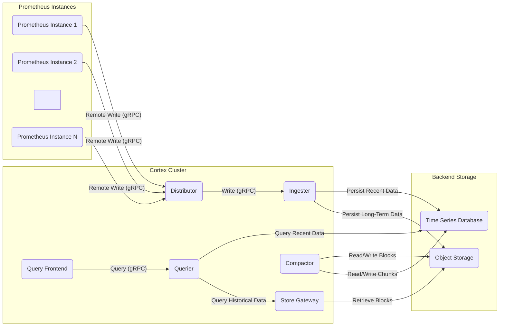

## Project Design Document: Cortex - Horizontally Scalable Prometheus (Improved)

**Document Version:** 1.1
**Date:** October 26, 2023
**Author:** AI Software Architecture Expert

**1. Introduction**

This document provides an enhanced design overview of the Cortex project, an open-source solution enabling horizontally scalable, multi-tenant, and durable long-term storage for Prometheus metrics. This detailed design aims to offer a clear understanding of Cortex's architecture, its constituent components, and the flow of data within the system. This document serves as a crucial foundation for subsequent threat modeling exercises.

**2. Goals and Objectives**

The core goals driving the design of Cortex are:

*   **Horizontal Scalability:** To facilitate the storage and querying of Prometheus metrics at scales exceeding the capacity of a single Prometheus instance.
*   **Data Durability:** To ensure the reliable and persistent storage of Prometheus data over extended periods.
*   **Multi-tenancy Support:** To allow multiple independent users or organizations (tenants) to share a single Cortex cluster while maintaining strict data isolation and security.
*   **High Availability:** To guarantee continuous access to metrics data, even in the event of individual component failures.
*   **Prometheus Compatibility:** To maintain full compatibility with the Prometheus query language (PromQL) and its remote write API, ensuring a seamless transition for users.

**3. High-Level Architecture**

Cortex is built upon a microservices architecture, distributing responsibilities across several independent and scalable components. These components communicate primarily over gRPC. The following diagram illustrates the high-level architecture and data flow:

**4. Component Breakdown**

This section provides a detailed breakdown of each Cortex component, outlining its purpose, functionality, and key security considerations:

*   **Distributor:**
    *   **Purpose:** Acts as the entry point for incoming time series data from Prometheus instances via the Prometheus remote write API (typically over gRPC).
    *   **Functionality:**
        *   Receives and validates incoming time series data.
        *   Authenticates remote write requests (e.g., using API keys or mutual TLS).
        *   Enforces rate limiting to prevent abuse and overload.
        *   Hashes time series based on their labels to determine the appropriate Ingester instances for storage.
        *   Forwards the data to the selected Ingesters using gRPC.
        *   Implements consistent hashing to ensure even data distribution across Ingesters.
        *   Manages retries and backoff mechanisms for failed write attempts.
    *   **Key Security Considerations:** Input validation to prevent malformed data injection, robust authentication and authorization of remote write requests, protection against denial-of-service attacks through rate limiting, secure handling of authentication credentials.

*   **Ingester:**
    *   **Purpose:**  Responsible for the temporary storage of incoming time series data in memory and the subsequent flushing of this data to the backend storage layers.
    *   **Functionality:**
        *   Receives time series data from Distributors via gRPC.
        *   Builds in-memory chunks of time series data, optimizing for write performance.
        *   Implements a write-ahead log (WAL) on persistent storage for durability before in-memory data is flushed.
        *   Periodically persists (flushes) these chunks to the Time Series Database (TSDB) for recent data and Object Storage for long-term storage.
        *   Manages the lifecycle of in-memory chunks, including compaction and flushing strategies.
    *   **Key Security Considerations:** Secure management of in-memory data, protection of the WAL against corruption and unauthorized access, secure communication channels for data transfer, access control mechanisms for internal data structures.

*   **Time Series Database (TSDB):**
    *   **Purpose:** Provides a scalable and performant storage layer optimized for querying recent time series data.
    *   **Functionality:**
        *   Stores compressed time series data in a columnar format for efficient querying.
        *   Supports efficient retrieval of recent data based on time range and series selectors.
        *   Examples of suitable TSDBs include Cassandra, DynamoDB, and Bigtable.
    *   **Key Security Considerations:** Implementation of data encryption at rest and in transit, robust access control mechanisms to restrict data access, adherence to database security best practices, regular security patching and updates.

*   **Object Storage:**
    *   **Purpose:** Offers cost-effective and durable long-term storage for less frequently queried historical time series data.
    *   **Functionality:**
        *   Stores compressed and indexed blocks of time series data.
        *   Examples of suitable object storage solutions include AWS S3, Google Cloud Storage, and Azure Blob Storage.
    *   **Key Security Considerations:**  Enforcement of data encryption at rest and in transit, implementation of strong access control policies (e.g., IAM roles, bucket policies), consideration of object immutability for data integrity, secure lifecycle management of stored objects.

*   **Store Gateway:**
    *   **Purpose:** Acts as an intermediary, providing Queriers with access to time series data stored in Object Storage.
    *   **Functionality:**
        *   Receives query requests from Queriers via gRPC.
        *   Identifies the relevant blocks in Object Storage based on the query's time range and series selectors.
        *   Retrieves and decompresses the necessary blocks from Object Storage.
        *   Returns the retrieved data to the Querier.
        *   Caches metadata about blocks in Object Storage to optimize lookup performance.
    *   **Key Security Considerations:** Secure access to Object Storage using appropriate credentials, secure caching mechanisms to prevent data leaks, protection against unauthorized data retrieval, validation of query requests.

*   **Querier:**
    *   **Purpose:** Executes PromQL queries against the stored time series data, retrieving data from both the TSDB (via Ingesters) and Object Storage (via the Store Gateway).
    *   **Functionality:**
        *   Receives PromQL queries from the Query Frontend via gRPC.
        *   Queries Ingesters for recent data residing in memory and the TSDB.
        *   Queries the Store Gateway for historical data stored in Object Storage.
        *   Merges and deduplicates the results retrieved from different sources.
        *   Executes the PromQL query logic and returns the final results to the Query Frontend.
    *   **Key Security Considerations:**  Secure communication with Ingesters and the Store Gateway, prevention of query injection vulnerabilities through careful parsing and validation of PromQL queries, implementation of resource limits to prevent query-related denial-of-service, access control based on the requesting user or tenant.

*   **Query Frontend:**
    *   **Purpose:** Provides an API endpoint for receiving PromQL queries from users or applications and optimizes query execution.
    *   **Functionality:**
        *   Receives PromQL queries via HTTP(S).
        *   Authenticates and authorizes query requests.
        *   Caches query results to improve performance and reduce load on backend components.
        *   Splits large queries into smaller sub-queries for parallel execution by Queriers.
        *   Merges the results from sub-queries before returning the final result.
        *   Implements rate limiting to protect against abuse.
    *   **Key Security Considerations:** Robust authentication and authorization mechanisms, secure caching practices to prevent unauthorized access to cached data, protection against query injection attacks, implementation of rate limiting and other measures to prevent denial-of-service, secure handling of user credentials.

*   **Compactor:**
    *   **Purpose:** Optimizes the data stored in Object Storage for improved query performance and storage efficiency.
    *   **Functionality:**
        *   Periodically downloads blocks of data from Object Storage.
        *   Merges and compacts overlapping blocks to reduce storage footprint and improve query efficiency.
        *   Creates new index files for the compacted blocks.
        *   Uploads the compacted blocks and new index files back to Object Storage.
        *   Deletes the original, uncompacted blocks from Object Storage.
    *   **Key Security Considerations:** Ensuring data integrity during the compaction process, secure access to Object Storage for reading and writing data, preventing unauthorized modification or deletion of data blocks, proper handling of temporary files and resources.

**5. Data Flow**

This section details the typical flow of data within the Cortex system for ingestion, querying, and compaction:

*   **Metric Ingestion:**
    *   Prometheus instances scrape metrics from target applications.
    *   These metrics are sent to the Cortex Distributor via the remote write API (gRPC).
    *   The Distributor validates the incoming data, authenticates the request, and applies rate limiting.
    *   Based on consistent hashing, the Distributor forwards the metrics to the appropriate Ingester instances via gRPC.
    *   Ingesters store the received metrics in memory and append them to their write-ahead log (WAL).
    *   Periodically, Ingesters flush the in-memory data to the Time Series Database (TSDB) for recent data and to Object Storage for long-term storage.

*   **Query Execution (Recent Data):**
    *   A user or application sends a PromQL query to the Query Frontend via HTTP(S).
    *   The Query Frontend authenticates and authorizes the request.
    *   The Query Frontend checks its cache for the query results.
    *   If the results are not cached, the Query Frontend forwards the query to available Queriers via gRPC.
    *   Queriers identify the relevant Ingesters holding recent data and query them via gRPC.
    *   Ingesters retrieve the requested data from their memory or the TSDB.
    *   Queriers merge and process the retrieved data.
    *   The Querier returns the processed results to the Query Frontend.
    *   The Query Frontend caches the results (if configured) and returns them to the user or application.

*   **Query Execution (Historical Data):**
    *   A user or application sends a PromQL query to the Query Frontend via HTTP(S).
    *   The Query Frontend authenticates and authorizes the request.
    *   The Query Frontend checks its cache for the query results.
    *   If the results are not cached, the Query Frontend forwards the query to available Queriers via gRPC.
    *   Queriers determine the time range of the query and identify if historical data from Object Storage is needed.
    *   For historical data, Queriers query the Store Gateway via gRPC.
    *   The Store Gateway retrieves the necessary data blocks from Object Storage.
    *   Queriers merge the results from the Store Gateway (historical data) and potentially Ingesters (recent data).
    *   The Querier processes the merged data and returns the results to the Query Frontend.
    *   The Query Frontend caches the results (if configured) and returns them to the user or application.

*   **Compaction Process:**
    *   The Compactor periodically scans Object Storage for blocks that are candidates for compaction.
    *   The Compactor downloads these blocks from Object Storage.
    *   The Compactor merges and compacts the downloaded blocks, creating new, optimized blocks and index files.
    *   The Compactor uploads the new compacted blocks and index files to Object Storage.
    *   Once the upload is successful, the Compactor deletes the original, uncompacted blocks from Object Storage.

**6. Security Considerations**

This section outlines key security considerations for the Cortex project, categorized for clarity:

*   **Authentication and Authorization:**
    *   **Inter-Component Communication:** Secure all communication between Cortex components using mutual TLS (mTLS) to verify the identity of each component.
    *   **Remote Write API:** Implement robust authentication for the remote write API, such as API keys, OAuth 2.0, or mutual TLS, to ensure only authorized Prometheus instances can send data.
    *   **Query API:** Secure the query API with authentication mechanisms like basic authentication, OAuth 2.0, or other identity providers to control access to metrics data. Implement granular authorization to restrict access based on user roles or tenant affiliations.
    *   **Backend Storage Access:** Secure access to the Time Series Database and Object Storage using strong authentication credentials and appropriate IAM roles with the principle of least privilege.

*   **Data Encryption:**
    *   **Encryption in Transit:** Enforce TLS encryption for all network communication, including external APIs and internal gRPC calls.
    *   **Encryption at Rest:** Implement encryption at rest for data stored in the Time Series Database and Object Storage. Utilize platform-provided encryption features or consider application-level encryption. Encrypt the write-ahead logs (WALs) in Ingesters.

*   **Input Validation and Sanitization:**
    *   **Remote Write Data:** Implement strict validation of incoming metrics data in the Distributor to prevent injection of malicious or malformed data.
    *   **PromQL Queries:** Thoroughly validate and sanitize PromQL queries in the Query Frontend to prevent query injection attacks that could expose sensitive data or cause denial of service.

*   **Rate Limiting and Denial of Service Prevention:**
    *   **Distributor:** Implement rate limiting on the Distributor to prevent abuse from excessive remote write requests.
    *   **Query Frontend:** Implement rate limiting on the Query Frontend to protect against denial-of-service attacks targeting the query API.

*   **Multi-tenancy Security:**
    *   **Data Isolation:** Ensure strong data isolation between tenants at all levels of the architecture, preventing unauthorized access to other tenants' data.
    *   **Resource Quotas:** Implement resource quotas per tenant to prevent a single tenant from consuming excessive resources and impacting other tenants.

*   **Secret Management:**
    *   Securely manage sensitive information such as database credentials, API keys, and TLS certificates using dedicated secret management solutions (e.g., HashiCorp Vault, AWS Secrets Manager).

*   **Auditing and Logging:**
    *   Implement comprehensive logging of security-related events, including authentication attempts, authorization decisions, and data access, for auditing and incident response purposes.

*   **Dependency Management:**
    *   Maintain an up-to-date inventory of all dependencies and regularly scan for and address known vulnerabilities.

*   **Network Security:**
    *   Implement network segmentation to isolate Cortex components and restrict network access based on the principle of least privilege. Utilize firewalls and network policies to control traffic flow.

**7. Assumptions and Constraints**

*   The underlying infrastructure (network, compute resources) is assumed to be reasonably secure.
*   The backend storage systems (TSDB and Object Storage) are assumed to provide the necessary scalability, reliability, and security features.
*   Deployment and operational aspects, such as infrastructure provisioning and monitoring, are outside the scope of this design document.
*   Specific security configurations for the chosen backend storage solutions are assumed to be implemented and managed separately.

**8. Future Considerations**

*   Explore integration with more advanced authentication and authorization providers (e.g., OpenID Connect).
*   Enhance observability and monitoring capabilities for security-related events and metrics.
*   Investigate further optimizations for query performance and storage efficiency while maintaining security.
*   Consider incorporating anomaly detection mechanisms to identify potential security threats based on metric patterns.
*   Evaluate the use of hardware security modules (HSMs) for enhanced key management.

This improved design document provides a more detailed and refined overview of the Cortex project, emphasizing security considerations relevant for threat modeling activities.