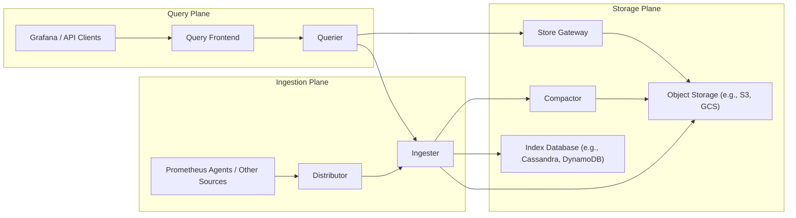
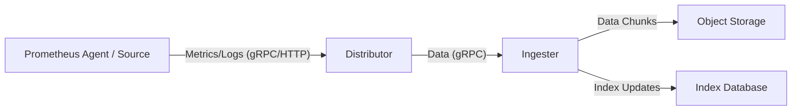
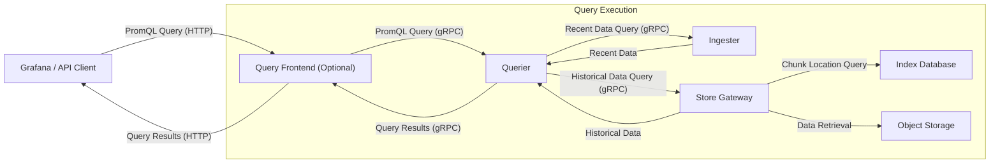

# Project Design Document: Cortex - Scalable Monitoring System

**Version:** 1.1
**Date:** October 26, 2023
**Author:** AI Software Architect

## 1. Introduction

This document provides an enhanced architectural design for the Cortex project, an open-source, horizontally scalable, multi-tenant log aggregation and metrics monitoring system. This revised document aims to offer a more refined and comprehensive understanding of Cortex's components, their interactions, and data flow, serving as a robust foundation for subsequent threat modeling activities.

This design is based on the information available in the official Cortex GitHub repository: [https://github.com/cortexproject/cortex](https://github.com/cortexproject/cortex).

## 2. Goals and Objectives

The primary goals of Cortex are:

*   **Scalability:** To efficiently handle ingestion, storage, and querying of large volumes of time-series data and logs.
*   **High Availability:** To ensure continuous operation and data availability even in the face of individual component failures.
*   **Multi-tenancy:** To provide secure and isolated data and resource management for multiple independent users or organizations within a shared infrastructure.
*   **Cost-Effectiveness:** To leverage cloud-native technologies and efficient storage mechanisms for optimal resource utilization and cost management.
*   **Prometheus Compatibility:** To function as a long-term, scalable storage backend for Prometheus metrics, supporting the PromQL query language.
*   **Loki Compatibility:** To serve as a scalable backend for Loki log aggregation, enabling efficient log storage and querying.

## 3. High-Level Architecture

Cortex employs a microservices architecture, with distinct, specialized components. The core components and their interactions are visualized below:

## 4. Component Details

This section provides an in-depth description of each major component within the Cortex architecture, detailing their functionality, responsibilities, dependencies, data storage mechanisms, and communication protocols.

### 4.1. Ingestion Plane Components

*   **Prometheus Agents / Other Sources:**
    *   Functionality: Responsible for collecting metrics from applications, infrastructure, and other sources.
    *   Responsibilities:
        *   Scraping metrics endpoints exposed by applications.
        *   Pushing metrics data to the Distributor.
        *   Formatting metrics data according to the Prometheus exposition format.
    *   Communication: Sends metrics data to the Distributor via gRPC or HTTP.

*   **Distributor:**
    *   Functionality: Acts as the entry point for incoming metrics and log data, responsible for distributing this data across the Ingesters.
    *   Responsibilities:
        *   Receiving incoming data streams from various sources.
        *   Hashing incoming data based on the tenant ID and series labels to ensure consistent distribution.
        *   Forwarding data to the appropriate Ingesters based on the hashing strategy.
        *   Implementing write path rate limiting and admission control to prevent overload.
    *   Dependencies: Relies on the Index Database for consistent hashing and knowledge of Ingester availability.
    *   Communication: Receives data from agents (gRPC/HTTP), sends data to Ingesters (gRPC).

*   **Ingester:**
    *   Functionality: Responsible for the temporary storage of incoming time-series data and log data in memory and periodically flushing it to long-term storage.
    *   Responsibilities:
        *   Receiving and storing data chunks in memory, organized by tenant and series.
        *   Building an in-memory index to facilitate efficient querying of recent data.
        *   Periodically flushing data chunks to object storage and index updates to the index database.
        *   Serving read requests for recently ingested data to the Queriers.
    *   Dependencies: Requires access to Object Storage for persistent data storage and the Index Database for index updates.
    *   Data Storage: Stores recent data in memory.
    *   Communication: Receives data from Distributors (gRPC), sends data chunks to Object Storage, updates the Index Database. Serves read requests to Queriers (gRPC).

### 4.2. Query Plane Components

*   **Querier:**
    *   Functionality: Executes PromQL queries across both in-memory data held by Ingesters and historical data stored in object storage.
    *   Responsibilities:
        *   Receiving PromQL queries from the Query Frontend.
        *   Querying the Ingesters for recent data matching the query.
        *   Querying the Store Gateway for historical data matching the query.
        *   Merging and deduplicating results retrieved from Ingesters and the Store Gateway.
    *   Dependencies: Requires connectivity to Ingesters for recent data and the Store Gateway for historical data.
    *   Communication: Receives queries from the Query Frontend (gRPC), sends queries to Ingesters (gRPC) and the Store Gateway (gRPC).

*   **Query Frontend:**
    *   Functionality: An optional but highly recommended component that sits in front of the Queriers to enhance query performance, reliability, and manageability.
    *   Responsibilities:
        *   Query caching to reduce load on Queriers and improve response times for repeated queries.
        *   Query splitting and merging to distribute large queries across multiple Queriers.
        *   Request deduplication to prevent redundant query execution.
        *   Rate limiting to protect the query path from overload.
    *   Dependencies: Interacts with Queriers and may utilize a caching layer (e.g., Redis).
    *   Communication: Receives queries from clients (HTTP), sends queries to Queriers (gRPC).

*   **Grafana / API Clients:**
    *   Functionality: Represents user interfaces or programmatic clients that interact with Cortex to visualize metrics and logs or retrieve data programmatically.
    *   Responsibilities: Constructing and sending PromQL queries to the Query Frontend or directly to the Queriers.
    *   Communication: Sends queries via HTTP.

### 4.3. Storage Plane Components

*   **Compactor:**
    *   Functionality: Periodically compacts and merges smaller chunks in object storage into larger, more efficient chunks to improve query performance and reduce storage costs.
    *   Responsibilities:
        *   Downloading smaller, overlapping chunks from object storage.
        *   Merging and compacting these chunks into larger blocks.
        *   Uploading the compacted chunks back to object storage.
        *   Updating the Index Database with the locations of the new, compacted chunks and removing references to the old chunks.
    *   Dependencies: Requires access to Object Storage and the Index Database.

*   **Store Gateway:**
    *   Functionality: Provides an interface for the Queriers to efficiently query historical data stored in object storage.
    *   Responsibilities:
        *   Receiving queries for historical data from Queriers.
        *   Querying the Index Database to identify the relevant chunks in object storage for the requested data.
        *   Downloading the necessary chunks from object storage.
        *   Filtering and returning the requested data to the Queriers.
    *   Dependencies: Requires access to Object Storage and the Index Database.
    *   Communication: Receives queries from Queriers (gRPC), interacts with Object Storage and the Index Database.

*   **Object Storage (e.g., S3, GCS):**
    *   Functionality: Provides durable and scalable long-term storage for the actual time-series data and log data chunks.
    *   Responsibilities:
        *   Storing data chunks uploaded by Ingesters and Compactors.
        *   Providing access to data chunks for the Compactor and Store Gateway.
    *   Dependencies: Utilized by Ingesters, Compactor, and Store Gateway.

*   **Index Database (e.g., Cassandra, DynamoDB):**
    *   Functionality: Stores the index that maps series labels to the location of data chunks in object storage, enabling efficient retrieval of historical data.
    *   Responsibilities:
        *   Storing and providing fast lookups for the index data.
        *   Maintaining consistency of the index.
    *   Dependencies: Utilized by the Distributor, Ingesters, Compactor, and Store Gateway.

## 5. Data Flow

The data flow within Cortex can be categorized into two primary paths: the write path for ingesting data and the read path for querying data.

### 5.1. Write Path (Metrics/Logs Ingestion)

*   Metrics or logs are collected by agents or other sources and formatted.
*   The data is sent to the Distributor via gRPC or HTTP.
*   The Distributor hashes the data based on tenant and series labels and forwards it to the appropriate Ingester(s).
*   Ingesters store the data in memory and periodically flush data chunks to Object Storage.
*   Ingesters update the Index Database with the location of the flushed chunks in Object Storage.

### 5.2. Read Path (Querying)

*   A user or application sends a PromQL query to the Query Frontend (optional) or directly to a Querier.
*   The Query Frontend (if present) can cache the query, split it into smaller parts, and deduplicate requests.
*   The Querier receives the query and determines the time range, identifying which Ingesters hold recent data and which historical data needs to be retrieved from the Store Gateway.
*   The Querier queries the relevant Ingesters for recent data within the query time range.
*   The Querier queries the Store Gateway for historical data within the query time range.
*   The Store Gateway queries the Index Database to find the location of relevant data chunks in Object Storage.
*   The Store Gateway retrieves the necessary chunks from Object Storage.
*   The Querier merges and deduplicates the results received from the Ingesters and the Store Gateway.
*   The Querier returns the consolidated results to the Query Frontend (if present).
*   The Query Frontend returns the results to the client.

## 6. Deployment Architecture

Cortex is designed for deployment in a distributed environment, commonly within a Kubernetes cluster, to leverage its scalability and high availability features. Key deployment considerations include:

*   **Statelessness:** Most Cortex components (Distributor, Querier, Query Frontend, Store Gateway, Compactor) are designed to be stateless, facilitating horizontal scaling by adding more instances.
*   **Stateful Sets for Ingesters:** Ingesters, being stateful, are typically deployed using Kubernetes StatefulSets to ensure stable network identities and persistent storage volume claims.
*   **Replication:** Replication is crucial for data durability and high availability, particularly within the Ingesters (replicating in-memory data) and the Index Database.
*   **Load Balancing:** Load balancers (e.g., Kubernetes Services) are used to distribute traffic evenly across instances of stateless components.
*   **Service Discovery:** Mechanisms like Kubernetes service discovery enable seamless communication and coordination between different Cortex components.
*   **Configuration Management:** Configuration is typically managed through configuration files, command-line flags, or environment variables, often managed by Kubernetes ConfigMaps and Secrets.
*   **Persistent Storage:** Ingesters require persistent storage volumes for storing data before it's flushed to object storage.

## 7. Security Considerations (Initial)

This section outlines initial security considerations relevant to the Cortex architecture, which will be further analyzed during the threat modeling process.

*   **Authentication and Authorization:**
    *   Mechanisms for authenticating users and services interacting with Cortex APIs (e.g., API keys, OAuth 2.0).
    *   Role-Based Access Control (RBAC) for authorizing access to data and administrative functions.
    *   Secure multi-tenancy implementation to ensure data isolation and prevent cross-tenant access.

*   **Data Encryption:**
    *   Encryption in transit using TLS (Transport Layer Security) for all communication between components and with external clients.
    *   Encryption at rest for data stored in object storage and the index database (e.g., using server-side encryption provided by cloud providers).
    *   Secure management and rotation of encryption keys.

*   **Network Security:**
    *   Network segmentation and firewall rules to restrict communication between components and limit external access.
    *   Utilizing network policies in Kubernetes to enforce network isolation.

*   **Input Validation:**
    *   Rigorous validation of incoming metrics and log data to prevent injection attacks.
    *   Sanitization and validation of PromQL queries to mitigate potential malicious queries.

*   **Rate Limiting and Denial of Service (DoS) Protection:**
    *   Implementation of rate limiting on both the write and read paths to prevent abuse and resource exhaustion.
    *   Strategies for mitigating distributed denial-of-service (DDoS) attacks.

*   **Secrets Management:**
    *   Secure storage and management of sensitive credentials (e.g., database passwords, API keys, access tokens) using secrets management tools (e.g., HashiCorp Vault, Kubernetes Secrets).
    *   Avoiding hardcoding secrets in configuration files or code.

*   **Auditing:**
    *   Comprehensive audit logging of important actions, access attempts, and configuration changes for security monitoring and compliance.

## 8. Future Considerations

*   **Enhanced Observability:** Implementing more granular metrics and distributed tracing for internal Cortex operations to aid in debugging and performance analysis.
*   **Improved Query Performance:** Exploring advanced query optimization techniques and data indexing strategies for faster query execution.
*   **Cost Optimization:** Continuously evaluating and implementing strategies for reducing storage costs, compute resource utilization, and network bandwidth consumption.
*   **Integration with other Observability Tools:** Expanding integrations with other tools in the observability ecosystem, such as tracing systems and anomaly detection platforms.
*   **Support for New Data Sources and Formats:**  Adding capabilities to ingest data from a wider range of sources and support additional data formats.

This improved document provides a more detailed and refined understanding of the Cortex architecture, offering a solid foundation for conducting thorough threat modeling and implementing robust security measures.