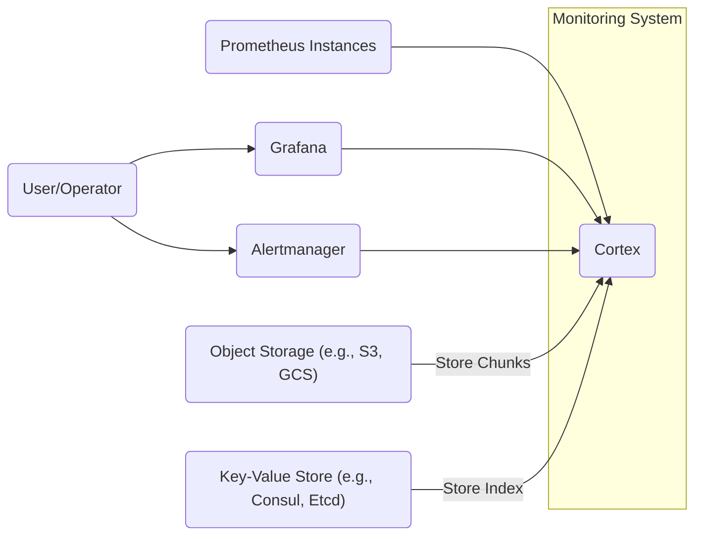
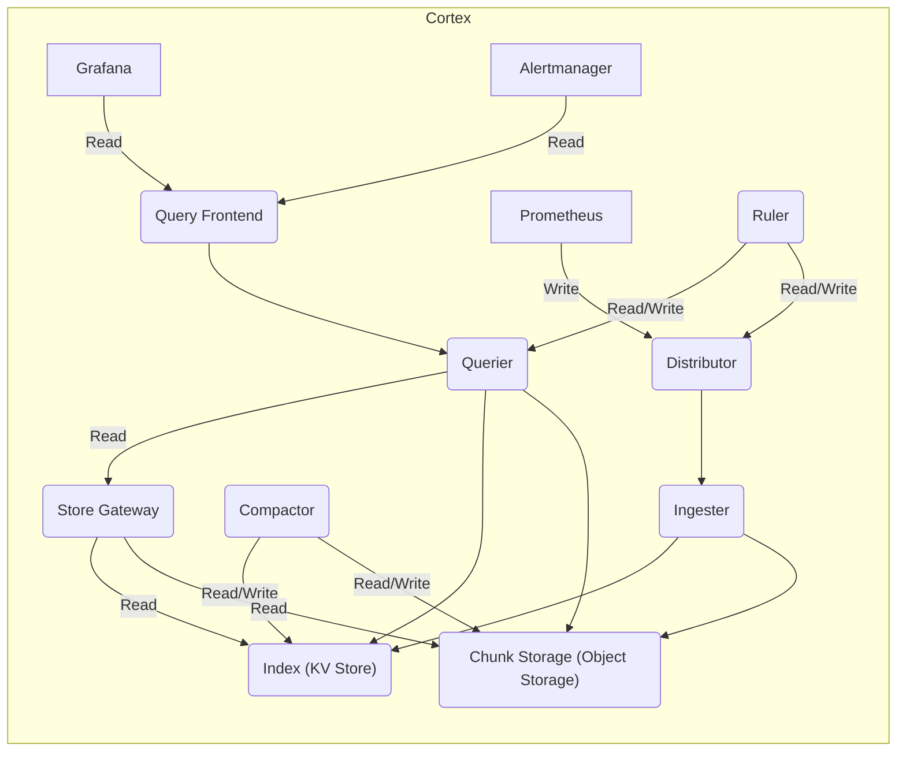
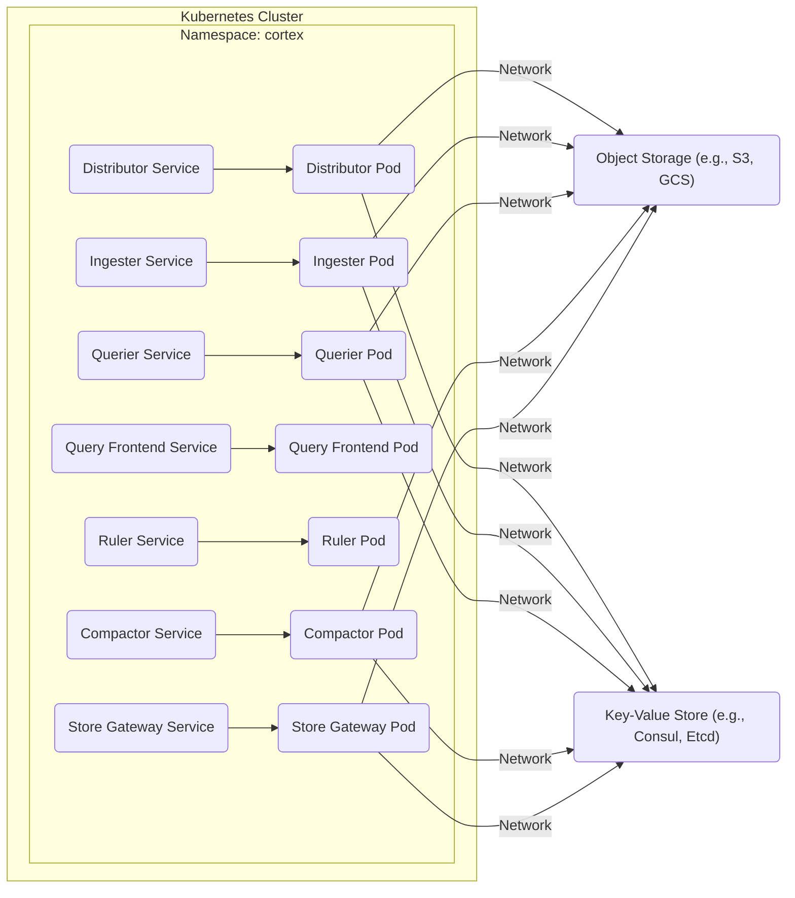
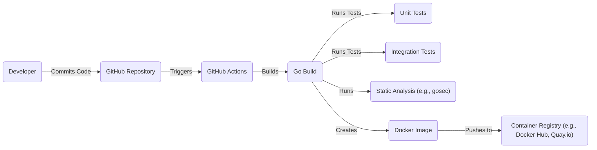

Okay, let's create a design document for the Cortex project, focusing on aspects relevant to threat modeling.

# BUSINESS POSTURE

Cortex provides horizontally scalable, highly available, multi-tenant, long-term storage for Prometheus metrics.  It's designed to be a crucial component for organizations that rely heavily on Prometheus for monitoring and alerting, especially in large, dynamic environments.

Business Priorities:

*   Reliability and Availability:  Ensure continuous monitoring data availability, even in the face of infrastructure failures or scaling events.  Downtime means lost visibility into the monitored systems.
*   Scalability:  Handle increasing volumes of metrics data as the monitored infrastructure grows.  The system must scale horizontally to accommodate growth without performance degradation.
*   Multi-tenancy:  Isolate data and access between different teams or users within the same organization, preventing unauthorized access and ensuring fair resource usage.
*   Cost-Effectiveness:  Optimize resource utilization to minimize operational costs, particularly in cloud environments.
*   Operational Efficiency:  Simplify deployment, management, and maintenance of the long-term storage solution.

Business Risks:

*   Data Loss:  Loss of historical metrics data due to storage failures, misconfiguration, or malicious activity. This is a critical risk, as historical data is essential for trend analysis, capacity planning, and post-incident review.
*   Data Breach:  Unauthorized access to sensitive metrics data, potentially exposing confidential information about the monitored systems or the organization.
*   Service Disruption:  Outages or performance degradation of Cortex, leading to gaps in monitoring coverage and delayed alerting.
*   Resource Exhaustion:  Insufficient resources (CPU, memory, storage) to handle the incoming metrics volume, leading to performance issues or data loss.
*   Configuration Errors:  Mistakes in configuring Cortex, leading to data loss, security vulnerabilities, or operational problems.
*   Dependency Failures:  Problems with underlying dependencies (e.g., object storage, key-value store) impacting Cortex's functionality.
*   Supply Chain Attacks: Vulnerabilities introduced via compromised third-party libraries or build processes.

# SECURITY POSTURE

Existing Security Controls (based on the GitHub repository and common practices):

*   security control: Authentication: Cortex supports authentication using various methods, including HTTP basic auth, JWT, and TLS client certificates. (Described in Cortex documentation and configuration options).
*   security control: Authorization: Cortex provides role-based access control (RBAC) to restrict access to specific tenants and resources. (Described in Cortex documentation and configuration options).
*   security control: Encryption in transit: Communication between Cortex components and with external systems (e.g., Prometheus, object storage) can be secured using TLS. (Described in Cortex documentation and configuration options).
*   security control: Encryption at rest: Data stored in object storage can be encrypted using server-side encryption provided by the storage provider (e.g., AWS S3 SSE). (Configurable via object storage provider settings).
*   security control: Input validation: Cortex performs input validation on incoming data to prevent common attacks like injection vulnerabilities. (Implemented in Cortex code).
*   security control: Rate limiting: Cortex can be configured to limit the rate of incoming requests to prevent denial-of-service attacks. (Described in Cortex documentation and configuration options).
*   security control: Auditing: Cortex logs various events, which can be used for auditing and security monitoring. (Implemented in Cortex code and configurable via logging settings).
*   security control: Dependency management: Cortex uses Go modules to manage dependencies and track versions. (Visible in go.mod and go.sum files).
*   security control: Secure Development Practices: The Cortex project appears to follow secure development practices, including code reviews and static analysis. (Inferred from project activity and community guidelines).

Accepted Risks:

*   accepted risk: Complexity of Configuration: Cortex has a complex configuration, and misconfiguration could lead to security vulnerabilities or operational issues. This is mitigated by providing comprehensive documentation and examples.
*   accepted risk: Reliance on External Services: Cortex relies on external services like object storage and key-value stores. The security of Cortex is partially dependent on the security of these external services. This is mitigated by choosing reputable providers and following their security best practices.
*   accepted risk: Potential for Data Exfiltration: While encryption and access controls are in place, a sophisticated attacker with sufficient privileges could potentially exfiltrate data. This is mitigated by implementing strong authentication, authorization, and monitoring.

Recommended Security Controls:

*   Implement regular vulnerability scanning and penetration testing.
*   Implement a robust secrets management solution.
*   Enforce strong password policies and multi-factor authentication.
*   Implement network segmentation to isolate Cortex components.
*   Implement a Web Application Firewall (WAF) to protect against common web attacks.

Security Requirements:

*   Authentication:
    *   Support for strong authentication mechanisms (e.g., multi-factor authentication).
    *   Integration with existing identity providers (e.g., LDAP, OAuth 2.0).
    *   Secure storage and management of credentials.
*   Authorization:
    *   Fine-grained access control based on roles and permissions.
    *   Ability to restrict access to specific tenants and resources.
    *   Regular review and auditing of access permissions.
*   Input Validation:
    *   Strict validation of all incoming data, including headers and payloads.
    *   Protection against common injection vulnerabilities (e.g., SQL injection, cross-site scripting).
    *   Regular updates to input validation rules to address new threats.
*   Cryptography:
    *   Use of strong, industry-standard cryptographic algorithms and protocols.
    *   Secure key management practices.
    *   Regular review and updates to cryptographic configurations.

# DESIGN

## C4 CONTEXT

C4 Context Element Descriptions:

*   1.  Name: Prometheus Instances
    *   Type: External System
    *   Description: Prometheus servers that scrape metrics from various targets.
    *   Responsibilities: Collect metrics, perform short-term storage, and send data to Cortex.
    *   Security controls: Authentication and encryption (TLS) when communicating with Cortex.
*   2.  Name: Grafana
    *   Type: External System
    *   Description: Visualization and dashboarding tool.
    *   Responsibilities: Query data from Cortex and display it to users.
    *   Security controls: Authentication, authorization, and encryption (TLS) when communicating with Cortex.
*   3.  Name: Alertmanager
    *   Type: External System
    *   Description: Handles alerts sent by Prometheus.
    *   Responsibilities: Deduplicate, group, and route alerts to various receivers.
    *   Security controls: Authentication and encryption (TLS) when communicating with Cortex.
*   4.  Name: User/Operator
    *   Type: User
    *   Description: Individuals who interact with the monitoring system.
    *   Responsibilities: View dashboards, configure alerts, and manage Cortex.
    *   Security controls: Authentication and authorization within Grafana and Alertmanager.
*   5.  Name: Cortex
    *   Type: System
    *   Description: Horizontally scalable, highly available, multi-tenant, long-term storage for Prometheus metrics.
    *   Responsibilities: Ingest, store, and query Prometheus metrics.
    *   Security controls: Authentication, authorization, encryption in transit, encryption at rest, input validation, rate limiting, auditing.
*   6.  Name: Object Storage (e.g., S3, GCS)
    *   Type: External System
    *   Description: Cloud-based object storage service.
    *   Responsibilities: Store chunks of metrics data.
    *   Security controls: Server-side encryption, access control policies, and network security controls provided by the cloud provider.
*   7.  Name: Key-Value Store (e.g., Consul, Etcd)
    *   Type: External System
    *   Description: Distributed key-value store.
    *   Responsibilities: Store the index of chunks and other metadata.
    *   Security controls: Authentication, authorization, and encryption (TLS) provided by the key-value store.

## C4 CONTAINER

C4 Container Element Descriptions:

*   1.  Name: Distributor
    *   Type: Container
    *   Description: Handles incoming samples from Prometheus.
    *   Responsibilities: Validate samples, distribute samples to ingesters based on consistent hashing.
    *   Security controls: Input validation, rate limiting, authentication.
*   2.  Name: Ingester
    *   Type: Container
    *   Description: Writes incoming samples to long-term storage.
    *   Responsibilities: Build chunks of data, store chunks in object storage, update the index.
    *   Security controls: Authentication, authorization, encryption (TLS).
*   3.  Name: Chunk Storage (Object Storage)
    *   Type: External System (represented within Cortex for clarity)
    *   Description: See C4 Context description.
    *   Responsibilities: Store chunks of metrics data.
    *   Security controls: Server-side encryption, access control policies.
*   4.  Name: Index (KV Store)
    *   Type: External System (represented within Cortex for clarity)
    *   Description: See C4 Context description.
    *   Responsibilities: Store the index of chunks and other metadata.
    *   Security controls: Authentication, authorization, and encryption (TLS).
*   5.  Name: Querier
    *   Type: Container
    *   Description: Handles queries from Grafana and Alertmanager.
    *   Responsibilities: Fetch data from chunk storage and the index, execute queries.
    *   Security controls: Authentication, authorization, encryption (TLS).
*   6.  Name: Query Frontend
    *   Type: Container
    *   Description: Provides a caching and parallelization layer for queries.
    *   Responsibilities: Cache query results, split large queries into smaller queries.
    *   Security controls: Authentication, authorization, encryption (TLS).
*   7.  Name: Ruler
    *   Type: Container
    *   Description: Evaluates recording and alerting rules.
    *   Responsibilities: Execute PromQL queries, generate new time series or trigger alerts.
    *   Security controls: Authentication, authorization, encryption (TLS).
*   8.  Name: Compactor
    *   Type: Container
    *   Description: Optimizes data storage by merging and deduplicating chunks.
    *   Responsibilities: Read chunks from storage, compact them, and write them back.
    *   Security controls: Authentication, authorization, encryption (TLS).
*   9. Name: Store Gateway
    *   Type: Container
    *   Description: Provides an interface for querying chunks directly from object storage.
    *   Responsibilities: Fetch chunks from object storage based on index lookups.
    *   Security controls: Authentication, authorization, encryption (TLS).

## DEPLOYMENT

Possible Deployment Solutions:

1.  Kubernetes: Using Kubernetes manifests (Deployments, Services, ConfigMaps, etc.) to deploy Cortex components as pods. This is the most common and recommended approach.
2.  Docker Compose: Using a Docker Compose file to define and run Cortex components as containers. Suitable for development and testing.
3.  Virtual Machines: Deploying Cortex components directly on virtual machines. Less common and more complex to manage.

Chosen Solution: Kubernetes

Deployment Element Descriptions:

*   1.  Name: Distributor Pod
    *   Type: Kubernetes Pod
    *   Description: Instance of the Distributor container.
    *   Responsibilities: See Container description.
    *   Security controls: Network policies, resource limits, pod security policies.
*   2.  Name: Ingester Pod
    *   Type: Kubernetes Pod
    *   Description: Instance of the Ingester container.
    *   Responsibilities: See Container description.
    *   Security controls: Network policies, resource limits, pod security policies.
*   3.  Name: Querier Pod
    *   Type: Kubernetes Pod
    *   Description: Instance of the Querier container.
    *   Responsibilities: See Container description.
    *   Security controls: Network policies, resource limits, pod security policies.
*   4.  Name: Query Frontend Pod
    *   Type: Kubernetes Pod
    *   Description: Instance of the Query Frontend container.
    *   Responsibilities: See Container description.
    *   Security controls: Network policies, resource limits, pod security policies.
*   5.  Name: Ruler Pod
    *   Type: Kubernetes Pod
    *   Description: Instance of the Ruler container.
    *   Responsibilities: See Container description.
    *   Security controls: Network policies, resource limits, pod security policies.
*   6.  Name: Compactor Pod
    *   Type: Kubernetes Pod
    *   Description: Instance of the Compactor container.
    *   Responsibilities: See Container description.
    *   Security controls: Network policies, resource limits, pod security policies.
*   7.  Name: Store Gateway Pod
    *   Type: Kubernetes Pod
    *   Description: Instance of the Store Gateway container.
    *   Responsibilities: See Container description.
    *   Security controls: Network policies, resource limits, pod security policies.
*   8.  Name: Distributor Service
    *   Type: Kubernetes Service
    *   Description: Exposes the Distributor pods.
    *   Responsibilities: Load balancing, service discovery.
    *   Security controls: Network policies.
*   9.  Name: Ingester Service
    *   Type: Kubernetes Service
    *   Description: Exposes the Ingester pods.
    *   Responsibilities: Load balancing, service discovery.
    *   Security controls: Network policies.
*   10. Name: Querier Service
    *   Type: Kubernetes Service
    *   Description: Exposes the Querier pods.
    *   Responsibilities: Load balancing, service discovery.
    *   Security controls: Network policies.
*   11. Name: Query Frontend Service
    *   Type: Kubernetes Service
    *   Description: Exposes the Query Frontend pods.
    *   Responsibilities: Load balancing, service discovery.
    *   Security controls: Network policies.
*   12. Name: Ruler Service
    *   Type: Kubernetes Service
    *   Description: Exposes the Ruler pods.
    *   Responsibilities: Load balancing, service discovery.
    *   Security controls: Network policies.
*   13. Name: Compactor Service
    *   Type: Kubernetes Service
    *   Description: Exposes the Compactor pods.
    *   Responsibilities: Load balancing, service discovery.
    *   Security controls: Network policies.
*   14. Name: Store Gateway Service
    *   Type: Kubernetes Service
    *   Description: Exposes the Store Gateway pods.
    *   Responsibilities: Load balancing, service discovery.
    *   Security controls: Network policies.
*   15. Name: Object Storage Node
    *   Type: External System
    *   Description: See C4 Context description.
    *   Responsibilities: Store chunks of metrics data.
    *   Security controls: Server-side encryption, access control policies, network security controls.
*   16. Name: KV Store Node
    *   Type: External System
    *   Description: See C4 Context description.
    *   Responsibilities: Store the index of chunks and other metadata.
    *   Security controls: Authentication, authorization, and encryption (TLS).

## BUILD

The Cortex project uses Go modules for dependency management and a Makefile for building and testing.  GitHub Actions are used for CI/CD.

Build Process Security Controls:

*   security control: Dependency Management: Go modules (go.mod and go.sum) ensure consistent and reproducible builds, reducing the risk of using vulnerable dependencies.
*   security control: Static Analysis:  Tools like `gosec` are used to identify potential security vulnerabilities in the code.
*   security control: Unit and Integration Tests: Automated tests help ensure code quality and prevent regressions.
*   security control: Signed Commits:  Encouraging or requiring signed commits helps verify the authenticity of code changes.
*   security control: Build Automation: GitHub Actions provides a consistent and automated build process, reducing the risk of manual errors.
*   security control: Containerization: Docker images provide a consistent and isolated runtime environment.
*   security control: Container Registry: Using a secure container registry (e.g., with vulnerability scanning) helps prevent the deployment of vulnerable images.

# RISK ASSESSMENT

Critical Business Processes:

*   Continuous Monitoring:  Providing uninterrupted visibility into the health and performance of monitored systems.
*   Alerting:  Promptly notifying operators of critical issues.
*   Capacity Planning:  Using historical data to predict future resource needs.
*   Incident Response:  Providing data for post-incident analysis and troubleshooting.

Data Sensitivity:

*   Metrics Data:  The sensitivity of metrics data varies depending on the specific metrics being collected.  Some metrics may contain sensitive information about the monitored systems or the organization, such as internal IP addresses, usernames, or business-specific data.  Generally, metrics data should be treated as confidential.
*   Configuration Data:  Cortex configuration files may contain sensitive information, such as credentials for accessing external services.  This data should be treated as highly confidential.
*   Logs: Cortex logs may contain sensitive information, such as IP addresses, usernames, and error messages. This data should be treated as confidential.

# QUESTIONS & ASSUMPTIONS

Questions:

*   What specific compliance requirements (e.g., PCI DSS, HIPAA) apply to the organization using Cortex?
*   What is the organization's risk tolerance for data loss and service disruption?
*   What are the specific security policies and procedures of the organization?
*   What are the existing security controls in the surrounding infrastructure (e.g., network firewalls, intrusion detection systems)?
*   What is the expected scale and growth rate of the monitored infrastructure?
*   Are there any specific security concerns or threats that the organization is particularly worried about?
*   What level of access will different users/teams have to Cortex and its data?
*   What are the specific object storage and key-value store solutions being used?
*   What is the retention policy for metrics data?

Assumptions:

*   BUSINESS POSTURE: The organization has a moderate to low risk appetite. They prioritize reliability and availability but also need to consider cost-effectiveness.
*   SECURITY POSTURE: The organization has basic security controls in place, but there is room for improvement. They are willing to invest in additional security measures.
*   DESIGN: The deployment will be on Kubernetes. The object storage and key-value store are managed services with appropriate security configurations. The organization follows secure development practices.