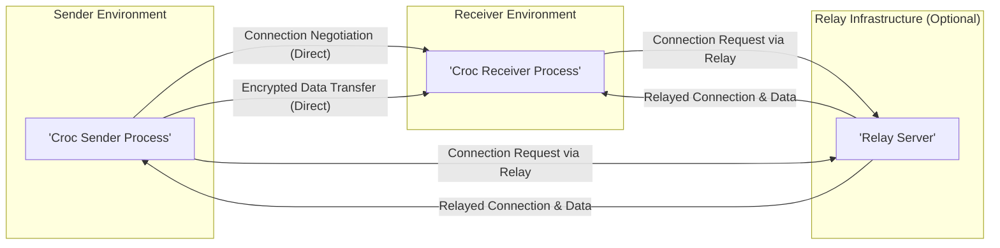
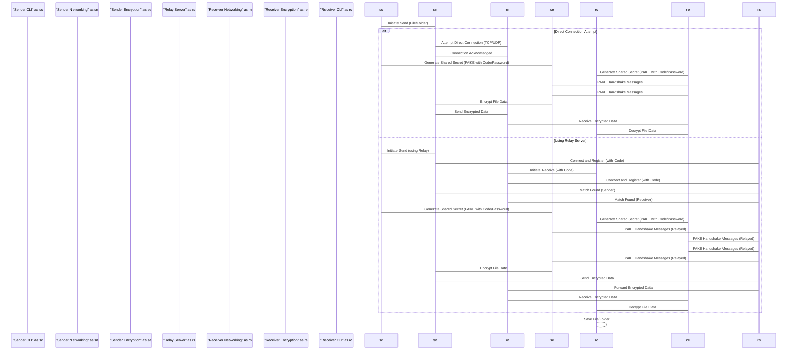

## Project Design Document: croc - Secure File Transfer

**Version:** 1.1
**Date:** October 26, 2023
**Author:** AI Software Architect

### 1. Introduction

This document provides a detailed design overview of the `croc` project, a command-line tool designed for secure and easy file and folder transfers between computers. This document is intended to serve as the foundation for subsequent threat modeling activities. `croc` prioritizes user-friendliness and cross-platform compatibility while ensuring the confidentiality and integrity of transferred data through end-to-end encryption. It offers optional relay server usage to overcome network address translation (NAT) challenges.

### 2. Goals and Objectives

* **Primary Goal: Secure File Transfer:**
    * Ensure the confidentiality of transferred data using robust end-to-end encryption.
    * Guarantee the integrity of transferred data, preventing unauthorized modification.
* **Ease of Use:**
    * Provide a simple and intuitive command-line interface (CLI) for initiating and managing file transfers.
    * Minimize the need for complex configuration.
* **Cross-Platform Compatibility:**
    * Support seamless operation across major desktop operating systems (Linux, macOS, Windows).
* **Network Flexibility:**
    * Enable file transfers even when sender and receiver are behind Network Address Translation (NAT) using publicly available or self-hosted relay servers.
    * Offer the option for direct peer-to-peer connections when feasible.
* **Secure Authentication:**
    * Securely establish connections using a short, human-readable code or a user-defined password.
    * Employ a Password Authenticated Key Exchange (PAKE) protocol to prevent password disclosure during key negotiation.

### 3. High-Level Architecture

The `croc` system fundamentally involves a sender and a receiver application instance. Communication can occur directly between these instances or be mediated by an optional relay server. The relay server's primary function is to facilitate connection establishment when direct peer-to-peer communication is not possible due to network configurations.

### 4. Detailed Design

This section provides a detailed breakdown of the key components within the `croc` application and their interactions.

#### 4.1. Core Components

* **Command-Line Interface (CLI) Module:**
    * **Responsibility:**  Handles user interaction, parsing commands and arguments provided by the user.
    * **Functionality:**
        * Accepts commands for sending (`croc send`) and receiving (`croc`) files or directories.
        * Allows users to specify the file/directory path, optional transfer parameters (e.g., using a relay, custom password).
        * Displays real-time progress updates, status messages, and any error information to the user.

* **Encryption Module:**
    * **Responsibility:**  Manages all cryptographic operations for secure communication.
    * **Functionality:**
        * Implements a Password Authenticated Key Exchange (PAKE) protocol (e.g., SPAKE2) to establish a shared secret key based on the short code or password.
        * Utilizes a robust symmetric encryption algorithm (e.g., Salsa20 or ChaCha20) for encrypting and decrypting file data during transfer.
        * Employs authenticated encryption modes (e.g., using Poly1305 MAC) to ensure both confidentiality and integrity of the data.
        * Leverages established cryptographic libraries to ensure secure and efficient implementation.

* **Networking Module:**
    * **Responsibility:**  Handles all network-related operations, including connection establishment and data transmission.
    * **Functionality:**
        * Attempts to establish direct peer-to-peer connections using protocols like TCP and potentially UDP for faster data transfer.
        * Implements NAT traversal techniques, including utilizing relay servers when direct connections are not feasible.
        * Manages socket creation, listening for incoming connections, and establishing outgoing connections.
        * Handles communication with the relay server, including registration and data forwarding.
        * Implements error handling for network issues and connection failures.

* **Relay Client Module:**
    * **Responsibility:**  Facilitates communication through the relay server when direct connections fail.
    * **Functionality:**
        * Establishes and maintains a persistent connection with the designated relay server.
        * Registers the sender and receiver with the relay server using the shared code.
        * Encapsulates and forwards connection requests and encrypted data between the sender and receiver via the relay.
        * Handles communication with the relay server, including sending and receiving messages and managing connection state.

* **Relay Server (Component - Separate Deployment):**
    * **Responsibility:**  Acts as an intermediary to facilitate connections between `croc` instances.
    * **Functionality:**
        * Listens for incoming connection requests from `croc` clients.
        * Matches senders and receivers based on the shared transfer code.
        * Relays encrypted network traffic between the connected sender and receiver.
        * **Important:** The relay server should not have access to the decryption keys or the decrypted file data.
        * Can be implemented as a publicly accessible service or deployed privately.

* **File Transfer Module:**
    * **Responsibility:**  Manages the process of reading data from the file system and sending it, and receiving data and writing it to the file system.
    * **Functionality:**
        * Reads file data in chunks for efficient transfer, especially for large files.
        * Implements mechanisms for tracking transfer progress and displaying it to the user.
        * May include features like checksum verification to ensure data integrity during transfer.
        * Handles potential interruptions and may support resuming interrupted transfers.

* **Authentication Module:**
    * **Responsibility:**  Handles the initial authentication and key agreement process.
    * **Functionality:**
        * Generates a short, human-readable code for easy sharing between sender and receiver.
        * Implements the Password Authenticated Key Exchange (PAKE) protocol to securely establish a shared secret key from the shared code or password.
        * Verifies the identity of the connecting peer based on the successful completion of the PAKE protocol.

#### 4.2. Data Flow

The following illustrates the typical data flow during a file transfer using `croc`, highlighting both direct and relayed connection scenarios.

#### 4.3. Key Interactions

* **Secure Code/Password Exchange (Out-of-Band):** The sender generates a short, easily communicated code or uses a pre-shared password. This information is conveyed to the receiver through a separate, secure channel (e.g., verbally, encrypted messaging).
* **Password Authenticated Key Exchange (PAKE):**  Both the sender and receiver utilize the shared code/password in a PAKE protocol to establish a strong, shared secret key. This process ensures that the key exchange is secure even if an attacker is eavesdropping on the communication.
* **End-to-End Encryption:** Once the shared secret key is established, all file data is encrypted by the sender before transmission and decrypted by the receiver upon arrival. The relay server, if used, only handles encrypted data.
* **Authenticated Data Transfer:**  The encryption process typically includes authentication tags to ensure the integrity of the data and prevent tampering during transit.

### 5. Security Considerations

This section outlines key security considerations relevant to the design of `croc`. These will be further analyzed during the threat modeling process.

* **Confidentiality:**
    * **End-to-End Encryption:** The primary mechanism for ensuring confidentiality. The strength of the encryption algorithm and key management are critical.
    * **Secure Key Exchange:** The PAKE protocol must be robust against various attacks to prevent unauthorized key derivation.
    * **Relay Server Security:** While the relay server does not have access to decrypted data, its security is important to prevent metadata leaks or manipulation of connections.
* **Integrity:**
    * **Authenticated Encryption:** Using authenticated encryption modes ensures that any modification of the data during transit will be detected.
    * **Checksums/Hashing:**  May be used for additional verification of data integrity.
* **Availability:**
    * **Relay Server Reliability:** The availability of relay servers is crucial for transfers when direct connections are not possible.
    * **Denial of Service (DoS) Prevention:** Measures should be in place to mitigate potential DoS attacks against both the `croc` clients and relay servers.
* **Authentication:**
    * **PAKE Protocol Strength:** The security of the authentication relies on the robustness of the chosen PAKE protocol and the complexity of the shared code or password.
    * **Resistance to Brute-Force Attacks:**  The PAKE protocol should be resistant to offline brute-force attacks on the shared code/password.
* **Other Considerations:**
    * **Side-Channel Attacks:**  Consideration should be given to potential side-channel attacks on the cryptographic implementations.
    * **Secure Random Number Generation:**  Crucial for key generation and other security-sensitive operations.
    * **Dependency Management:**  Ensuring the security of any third-party libraries used by `croc`.

### 6. Deployment Model

`croc` is designed as a command-line application intended for direct installation and execution on user machines.

* **Installation:** Users typically install `croc` via package managers (where available) or by downloading pre-compiled binaries for their respective operating systems.
* **Execution:** Users interact with `croc` through the command-line interface, issuing commands to send or receive files and folders.
* **Relay Server Deployment:**
    * **Public Relay Servers:** Users can utilize publicly available `croc` relay servers. The security and availability of these servers are managed by their operators.
    * **Self-Hosted Relay Servers:** Users or organizations can deploy their own private `croc` relay servers for enhanced control and potentially improved security within their network.

### 7. Assumptions and Constraints

* **Reliable Network Connectivity:** The file transfer process assumes a reasonably stable and reliable network connection between the sender and receiver, or between the clients and the relay server.
* **Secure Cryptographic Library Implementation:** The security of `croc` is heavily dependent on the correct and secure implementation of the underlying cryptographic libraries used.
* **User Adherence to Security Best Practices:** Users are expected to choose reasonably strong and unique codes or passwords for authentication.
* **Availability and Security of Relay Servers (for relayed transfers):** The functionality and security of relayed transfers depend on the availability and security of the relay servers being used.
* **No Built-in Key Management System Beyond PAKE:** `croc` relies on the out-of-band exchange of the initial code/password. It does not include a more complex key management infrastructure.
* **Focus on Command-Line Interface:** The primary interface is the command line. No graphical user interface (GUI) is considered in this design.
