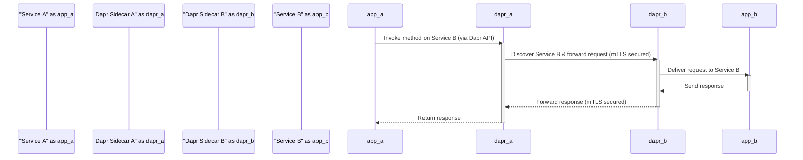
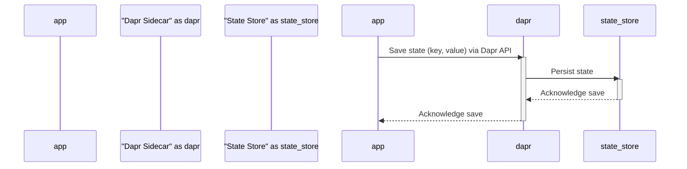

# Project Design Document: Dapr (Distributed Application Runtime)

**Version:** 1.1
**Date:** October 26, 2023
**Author:** AI Software Architect

## 1. Introduction

This document provides an enhanced architectural overview of the Dapr (Distributed Application Runtime) project, specifically tailored for threat modeling. Dapr is a portable, event-driven runtime that simplifies the development of resilient, microservice-based stateless and stateful applications across cloud and edge environments. It abstracts the complexities of distributed systems by offering building blocks accessible through HTTP or gRPC APIs. This revised document offers a clearer articulation of key components, their interactions, data flows, and deployment models to facilitate a more effective and targeted threat modeling process.

## 2. Project Overview

Dapr's primary goal is to streamline microservice development by providing a suite of building blocks that address common distributed system challenges. These building blocks are exposed as readily accessible APIs, allowing applications to interact with them without needing to manage the underlying infrastructure complexities.

**Key Objectives:**

* **Simplified Microservice Development:** Offering pre-built solutions for common distributed patterns.
* **Language and Platform Independence:** Enabling development in diverse programming languages and deployment across various platforms.
* **Enhanced Portability:** Facilitating application migration between different cloud providers and on-premise infrastructure.
* **Improved Observability:** Providing mechanisms for monitoring application behavior and performance.
* **Integrated Security:** Offering built-in security features for inter-service communication and data protection.

**Fundamental Concepts:**

* **Sidecar Pattern:** Dapr operates as a separate process (sidecar) co-located with the application instance.
* **Modular Building Blocks:**  Providing distinct APIs for common distributed functionalities.
* **Pluggable Components:** Allowing for interchangeable implementations of building blocks (e.g., various state stores).
* **Centralized Control Plane:** Managing the configuration and lifecycle of Dapr instances.

## 3. Architectural Design

Dapr's architecture is centered around the sidecar pattern and a centralized control plane, enabling consistent and manageable distributed application behavior.

### 3.1. Core Components

* **Dapr Sidecar ("daprd"):**
    * Runs as a dedicated process alongside each application instance.
    * Intercepts and manages all communication between services and external systems.
    * Implements the core Dapr building block APIs.
    * Facilitates service discovery and method invocation.
    * Manages state, pub/sub, secrets, bindings, actors, and observability concerns.
* **Dapr Control Plane:**
    * Responsible for the overall management and configuration of Dapr sidecars.
    * Composed of several specialized microservices:
        * **Placement Service:**  Manages the location and activation of virtual actors.
        * **Operator:**  Handles Kubernetes custom resource definitions (CRDs) and ensures the desired state for Dapr components and configurations within the cluster.
        * **Sentry:**  Provides certificate authority functionality for issuing and managing mutual TLS (mTLS) certificates.
        * **Configuration Service:**  Offers dynamic configuration capabilities for Dapr components and applications.
        * **Dashboard:**  A user interface for monitoring and managing Dapr applications and their components.
* **Dapr CLI:**
    * A command-line tool for interacting with and managing Dapr deployments.
    * Used for tasks such as deploying applications, configuring Dapr components, and inspecting the runtime.
* **Dapr SDKs:**
    * Language-specific libraries that simplify the interaction between applications and the Dapr sidecar APIs.
    * Provide a more idiomatic and developer-friendly way to utilize Dapr's functionalities.

### 3.2. Building Blocks

These are the fundamental capabilities offered by Dapr, simplifying common distributed application patterns:

* **Service Invocation:**
    * Enables applications to locate and invoke methods on other services through their respective Dapr sidecars.
    * Supports both HTTP and gRPC communication protocols.
    * Offers built-in features like retries, timeouts, and distributed tracing for resilient communication.
* **State Management:**
    * Provides a consistent and reliable mechanism for managing the state of applications.
    * Supports a variety of pluggable state stores (e.g., Redis, Azure Cosmos DB, AWS DynamoDB).
    * Offers features like optimistic concurrency control and transactional operations for data integrity.
* **Pub/Sub:**
    * Facilitates asynchronous communication between services using intermediary message brokers.
    * Supports various message brokers (e.g., Kafka, RabbitMQ, Redis Streams).
    * Provides features like message routing, filtering, and guaranteed delivery for reliable event-driven architectures.
* **Bindings:**
    * Allows applications to interact with external resources, both as triggers (input bindings) and targets (output bindings).
    * Supports interactions with databases, message queues, cloud services, and more.
* **Secrets Management:**
    * Provides a secure way for applications to access and manage sensitive information like API keys and passwords.
    * Integrates with various secret stores (e.g., HashiCorp Vault, Azure Key Vault, AWS Secrets Manager).
* **Actors:**
    * Offers a programming model for building stateful, single-threaded, and virtual actors, simplifying the development of concurrent and distributed applications.
    * Provides features like actor activation, deactivation, and scheduled reminders.
* **Observability:**
    * Provides insights into application behavior through the collection and export of metrics, traces, and logs.
    * Integrates with popular observability platforms (e.g., Prometheus, Jaeger, Zipkin) for monitoring and troubleshooting.
* **Configuration:**
    * Enables dynamic configuration of application behavior and features without requiring redeployment.
    * Supports various configuration providers for storing and retrieving configuration data.

### 3.3. Data Flow

Interactions within a Dapr-enabled application typically involve the application communicating with its local Dapr sidecar, which then handles the underlying distributed communication and coordination.

**Example: Secure Service Invocation with mTLS**



**Example: State Persistence**



## 4. Deployment Model

Dapr offers flexibility in deployment environments:

* **Kubernetes:**
    * The most prevalent deployment model for production environments.
    * Dapr control plane components are deployed as standard Kubernetes deployments and services within a dedicated namespace (typically `dapr-system`).
    * Dapr sidecars are injected as containers into application pods, often automatically via a mutating webhook.
    * The Dapr Operator simplifies the management and lifecycle of Dapr components within the cluster.
* **Self-Hosted Mode:**
    * Primarily used for local development, testing, and potentially edge scenarios.
    * Dapr sidecars and control plane components run as individual processes on the host machine.
    * Requires manual configuration and management of the Dapr runtime environment.

## 5. Key Security Considerations

Security is a fundamental aspect of Dapr's design. Understanding these considerations is crucial for effective threat modeling.

* **Mutual TLS (mTLS) for Inter-Service Communication:**
    * Dapr enforces mTLS by default for all communication between sidecars, ensuring both authentication and encryption of traffic.
    * The Sentry service acts as a certificate authority, issuing and managing certificates for Dapr sidecars.
    * **Threat Focus:** Compromise of the Sentry service or its signing key would have significant security implications. Vulnerabilities in the certificate rotation process could also be exploited.
* **Access Control Policies:**
    * Dapr allows the definition of fine-grained access control policies to authorize service invocations and access to building blocks.
    * Policies can be based on service identity, metadata, and other attributes, providing granular control over inter-service interactions.
    * **Threat Focus:** Misconfigured or overly permissive access control policies could allow unauthorized access to services and data. Vulnerabilities in the policy enforcement mechanism could be exploited to bypass controls.
* **Secrets Management Integration:**
    * Dapr's Secrets Management building block provides a secure way to access secrets from various secret stores without exposing them directly in application code.
    * **Threat Focus:** The security of the integrated secret stores is paramount. Vulnerabilities in the Dapr Secrets API or its integration with specific secret stores could lead to secret leakage.
* **Data Encryption:**
    * While Dapr enforces encryption in transit via mTLS, encryption at rest for state management and pub/sub is typically the responsibility of the underlying component implementations.
    * **Threat Focus:** Ensure that the chosen state stores and message brokers are configured with appropriate encryption at rest. Lack of encryption at rest exposes sensitive data to potential compromise.
* **Control Plane Security:**
    * Securing the Dapr control plane is critical as it manages the overall Dapr infrastructure.
    * This includes securing access to the Kubernetes API server and the control plane services themselves.
    * Authentication and authorization mechanisms for accessing the control plane APIs must be robust.
    * **Threat Focus:** Compromise of the control plane could allow attackers to manipulate Dapr configurations, inject malicious sidecars, or disrupt the entire Dapr infrastructure.
* **Sidecar Injection Security:**
    * In Kubernetes, the Dapr sidecar is typically injected automatically into application pods using a mutating webhook.
    * Ensuring the security and integrity of this injection process is crucial to prevent the injection of malicious sidecars.
    * **Threat Focus:** A compromised webhook or vulnerabilities in the injection process could allow attackers to inject malicious sidecars, potentially gaining access to application secrets and data.
* **Supply Chain Security:**
    * The security of the Dapr binaries, container images, and dependencies is an important consideration.
    * Verifying signatures and using trusted sources for Dapr components is recommended to mitigate supply chain attacks.
    * **Threat Focus:** Using compromised Dapr binaries or container images could introduce vulnerabilities and backdoors into the application environment.

## 6. External Dependencies

Dapr relies on various external services and infrastructure components for its functionality:

* **Container Runtime (e.g., Docker, containerd):** Required for running Dapr sidecars and control plane components.
* **Orchestration Platform (e.g., Kubernetes):**  Commonly used for managing and deploying Dapr in containerized environments.
* **State Stores (e.g., Redis, Cosmos DB, DynamoDB):** Used by the State Management building block for persistent storage.
* **Message Brokers (e.g., Kafka, RabbitMQ, Redis Streams):** Used by the Pub/Sub building block for asynchronous messaging.
* **Secret Stores (e.g., Vault, Key Vault, Secrets Manager):** Used by the Secrets Management building block for secure secret storage.
* **Monitoring and Logging Systems (e.g., Prometheus, Grafana, Jaeger, Zipkin):** Used for collecting and visualizing observability data.

## 7. Assumptions and Constraints

* **Secure Network Infrastructure:** It is assumed that the underlying network infrastructure is configured securely, with appropriate firewall rules and network segmentation to limit the attack surface.
* **Secure Component Configuration:** It is assumed that the chosen components (state stores, message brokers, etc.) are configured with their respective security best practices in mind.
* **Application-Level Security:** It is assumed that applications utilizing Dapr implement their own application-level authentication and authorization mechanisms as needed, complementing Dapr's security features.
* **Kubernetes Security Best Practices:** For Kubernetes deployments, it is assumed that standard Kubernetes security best practices are followed, including role-based access control (RBAC) and network policies.

## 8. Threat Modeling Focus Areas

Based on the architecture and security considerations, the following areas are prime targets for threat modeling activities:

* **Dapr Control Plane Components:**  Focus on potential vulnerabilities and attack vectors targeting the Operator, Placement Service, Sentry, and Configuration Service.
* **Sidecar Injection Process:** Analyze the security of the webhook and the process of injecting sidecars into application pods.
* **Mutual TLS Implementation:** Investigate potential weaknesses in the certificate issuance, rotation, and validation processes.
* **Access Control Policy Enforcement:** Examine the policy engine and potential bypasses or misconfigurations.
* **Secrets Management Integration:** Analyze the security of the integration with various secret stores and potential vulnerabilities in the Secrets API.
* **Data at Rest Encryption:**  While not directly managed by Dapr, ensure the security of the underlying state stores and message brokers.
* **External Dependencies:** Assess the security posture of the external services and components that Dapr relies on.

## 9. Diagrams

### 9.1. High-Level Architecture

```mermaid
graph LR
    subgraph "Kubernetes Cluster"
        direction LR
        subgraph "Namespace: dapr-system"
            direction TB
            "Dapr Operator" -- Manages --> "Placement Service"
            "Dapr Operator" -- Manages --> "Sentry"
            "Dapr Operator" -- Manages --> "Configuration Service"
            "Dapr Operator" -- Manages --> "Dashboard"
        end
        subgraph "Namespace: my-app"
            direction LR
            "Application A" -- "Dapr API (HTTP/gRPC)" --> "Dapr Sidecar A"
            "Dapr Sidecar A" -- "mTLS" --> "Dapr Sidecar B"
            "Dapr Sidecar B" -- "Dapr API (HTTP/gRPC)" --> "Application B"
        end
    end
```

### 9.2. Dapr Building Block Interactions

```mermaid
graph LR
    "Application" -- "Service Invocation API" --> "Dapr Sidecar"
    "Application" -- "State Management API" --> "Dapr Sidecar"
    "Application" -- "Pub/Sub API" --> "Dapr Sidecar"
    "Application" -- "Bindings API" --> "Dapr Sidecar"
    "Application" -- "Secrets API" --> "Dapr Sidecar"
    "Application" -- "Actors API" --> "Dapr Sidecar"
    "Dapr Sidecar" -- "mTLS, Service Discovery" --> "Other Dapr Sidecars"
    "Dapr Sidecar" -- "State Store Interaction" --> "State Store"
    "Dapr Sidecar" -- "Message Broker Interaction" --> "Message Broker"
    "Dapr Sidecar" -- "Secret Store Interaction" --> "Secret Store"
```

This improved document provides a more detailed and security-focused overview of the Dapr architecture, making it a more effective resource for conducting thorough threat modeling activities.