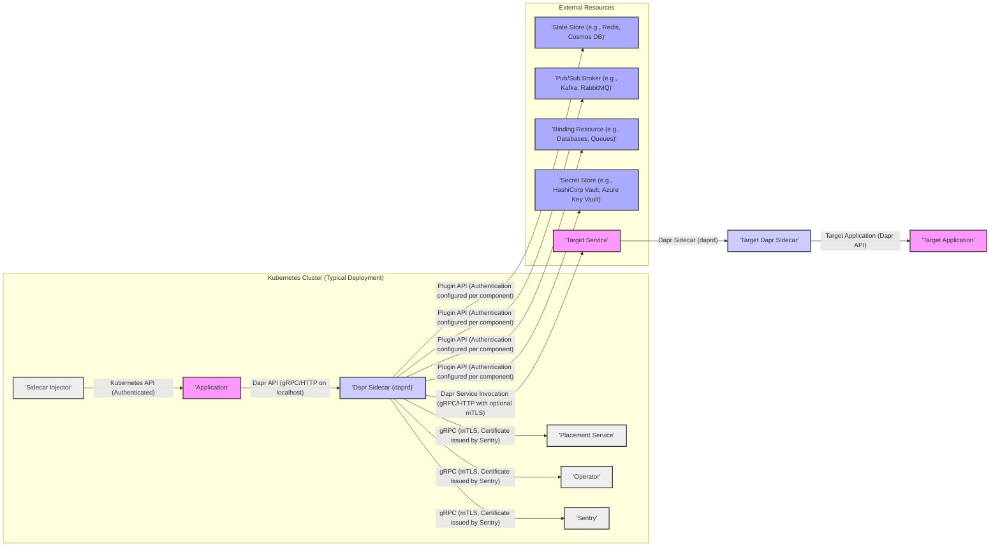

## Project Design Document: Dapr (Distributed Application Runtime) for Threat Modeling (Improved)

**1. Introduction**

This document provides an enhanced architectural overview of the Dapr (Distributed Application Runtime) project, specifically tailored for detailed threat modeling exercises. Building upon the foundational understanding, this version delves deeper into component interactions, security considerations, and data flows to facilitate a more comprehensive threat analysis. This document aims to provide security professionals with a granular understanding of the system's structure, trust boundaries, and potential attack vectors.

**2. Project Overview**

Dapr is a portable, event-driven runtime that simplifies the development of resilient, microservice-based applications for cloud and edge environments. Its core principle is the sidecar pattern, where a Dapr instance runs alongside each application instance, offering a suite of distributed building blocks accessible through well-defined APIs. This abstraction allows developers to concentrate on business logic, offloading the complexities of distributed systems management to Dapr.

**3. Goals of this Document**

*   Provide a detailed and refined architectural overview of Dapr, emphasizing security aspects.
*   Identify key components, their specific functionalities, and associated security mechanisms.
*   Illustrate the interactions and data flow between components with a focus on potential vulnerabilities.
*   Serve as a robust foundation for in-depth threat modeling activities, including STRIDE analysis.
*   Enable security professionals to clearly understand the system's boundaries, trust zones, and potential attack surfaces.

**4. Target Audience**

*   Security Architects
*   Threat Modeling Engineers
*   Security Engineers
*   Developers working with Dapr, particularly those responsible for security.

**5. System Architecture**

Dapr's architecture revolves around the sidecar pattern, with each application instance accompanied by a dedicated Dapr sidecar process. Communication between the application and its local sidecar occurs via gRPC or HTTP. The sidecars then manage the complexities of distributed operations and interact with the Dapr control plane for centralized services.

**5.1. Key Components (Detailed)**

*   **Dapr Sidecar (daprd):**
    *   A runtime process co-located with the application instance.
    *   Provides access to Dapr's building blocks through gRPC (default) or HTTP APIs.
    *   **Functionality:** Service discovery and invocation, state management (CRUD operations, transactions, concurrency control), pub/sub messaging (publish and subscribe), resource bindings (triggers and actions), secrets management (retrieval and potentially rotation), actor model implementation (virtual actors with state and methods), concurrency control (optimistic concurrency), and observability (metrics, tracing, logging).
    *   **Security Features:**  Authenticates with the control plane using mTLS certificates, enforces access control policies for service invocation, handles secret retrieval with appropriate permissions, and can be configured with network access restrictions.
    *   **Communication:** Communicates with the application via localhost (gRPC or HTTP), with other Dapr sidecars via network (typically gRPC with mTLS), and with the control plane via network (gRPC with mTLS).
*   **Dapr Control Plane:**
    *   A set of services that manage the Dapr cluster and provide centralized functionalities.
    *   **Placement Service:**
        *   Manages the distributed hash table for actor placement, determining the location of actor instances.
        *   **Security:** Secured by mTLS, access restricted to authenticated Dapr sidecars.
    *   **Operator:**
        *   Manages the lifecycle of Dapr components (creation, updates, deletion) within a Kubernetes environment.
        *   Interacts with the Kubernetes API.
        *   **Security:** Relies on Kubernetes RBAC for authorization, communicates with sidecars via mTLS.
    *   **Sentry:**
        *   A Certificate Authority (CA) that issues mTLS certificates to Dapr sidecars for secure inter-sidecar and control plane communication.
        *   **Security:**  Critical security component; its private key must be highly protected. Uses its own secure storage for keys.
    *   **Sidecar Injector:**
        *   A Kubernetes Mutating Admission Webhook that automatically injects the Dapr sidecar container into application pods during deployment.
        *   **Security:**  Relies on Kubernetes API authentication and authorization.
    *   **Dashboard (Optional):**
        *   A web-based UI for monitoring and managing Dapr applications and components.
        *   **Security:** Requires authentication and authorization to access sensitive information and perform actions.
*   **Application:**
    *   The user-developed business logic.
    *   Interacts exclusively with its local Dapr sidecar via the Dapr API (gRPC or HTTP).
    *   **Security:**  Responsible for its own internal security, but relies on Dapr for secure communication and access to distributed services.
*   **Building Blocks (Security Focus):**
    *   **Service Invocation:** Enforces access control policies defined in configuration files or through control plane APIs. Uses mTLS for secure communication between sidecars.
    *   **State Management:**  Relies on the security of the underlying state store. Dapr provides mechanisms for configuring authentication and authorization for state store access.
    *   **Pub/Sub:** Security depends on the underlying message broker's security features (e.g., authentication, authorization, encryption). Dapr facilitates the configuration of these features.
    *   **Bindings:** Security varies based on the specific binding resource. Dapr allows configuration of authentication credentials and connection details.
    *   **Secrets Management:** Integrates with external secret stores, leveraging their authentication and authorization mechanisms. Dapr itself does not store secrets.
    *   **Actors:**  Manages actor identity and placement. Security relies on the overall Dapr security framework.

**5.2. Component Interactions (Detailed)**

**6. Data Flow (Detailed)**

*   **Service Invocation (Example):**
    1. The "Order Service" application wants to call the "Payment Service". It sends a request to its local Dapr sidecar via HTTP on `localhost:3500/v1.0/invoke/payment-service/method/processPayment`.
    2. The "Order Service" sidecar resolves the location of the "Payment Service" sidecar using the Placement service.
    3. The "Order Service" sidecar initiates a gRPC call (with mTLS) to the "Payment Service" sidecar. The request includes metadata for tracing and potentially authorization checks.
    4. The "Payment Service" sidecar authenticates the request using the provided certificate. It might also enforce access control policies based on the caller's identity.
    5. The "Payment Service" sidecar forwards the request to the "Payment Service" application via HTTP on `localhost:3500/processPayment`.
    6. The "Payment Service" application processes the request and returns a response to its sidecar.
    7. The "Payment Service" sidecar sends the response back to the "Order Service" sidecar via gRPC (mTLS).
    8. The "Order Service" sidecar returns the response to the "Order Service" application.
*   **State Management (Example):**
    1. The "Inventory Service" application wants to save the current stock level. It sends a request to its local Dapr sidecar via gRPC to save state with key "product-x" and value "100".
    2. The sidecar uses the configured state store component (e.g., Redis) and its associated credentials (retrieved from a secret store).
    3. The sidecar interacts with the Redis API (e.g., `SET product-x 100`).
    4. Redis acknowledges the state update.
    5. The sidecar returns a success response to the "Inventory Service" application.
*   **Pub/Sub (Example):**
    1. The "Checkout Service" application publishes an "order_created" event. It sends the event payload to its local Dapr sidecar via HTTP on `localhost:3500/v1.0/publish/order-topic`.
    2. The sidecar uses the configured pub/sub broker component (e.g., Kafka) and its credentials.
    3. The sidecar publishes the message to the "order-topic" in Kafka.
    4. The "Shipping Service" has a subscription configured with its local Dapr sidecar for the "order-topic".
    5. The "Shipping Service" sidecar receives the "order_created" message from Kafka.
    6. The "Shipping Service" sidecar delivers the message to the "Shipping Service" application via a configured endpoint (e.g., HTTP POST to `/newOrder`).
*   **Secrets Management (Example):**
    1. The "Database Connector" application needs the database password. It sends a request to its local Dapr sidecar via gRPC to retrieve the secret named "db-password".
    2. The sidecar uses the configured secrets management component (e.g., Azure Key Vault) and its authentication details.
    3. The sidecar authenticates with Azure Key Vault and retrieves the value of the "db-password" secret.
    4. The sidecar returns the secret value to the "Database Connector" application.

**7. Security Considerations (In-Depth)**

This section expands on the security considerations, providing more specific potential threats and vulnerabilities.

*   **Mutual TLS (mTLS):**
    *   **Threats:** Compromise of the Sentry's private key would allow attackers to forge certificates and impersonate services. Improper certificate management or storage could lead to key exposure.
    *   **Mitigations:** Securely store and manage Sentry's private key. Implement certificate rotation policies. Regularly audit certificate usage.
*   **Authentication and Authorization:**
    *   **Service Invocation:**
        *   **Threats:**  Bypassing access control policies could allow unauthorized access to sensitive services. Misconfigured policies could lead to overly permissive access.
        *   **Mitigations:** Implement robust access control policies based on service identity. Regularly review and update policies. Utilize policy enforcement points within the sidecar.
    *   **Pub/Sub:**
        *   **Threats:**  Unauthorized publishing or subscribing to topics could lead to data breaches or denial of service.
        *   **Mitigations:**  Leverage the broker's authentication and authorization mechanisms. Configure Dapr components to enforce these policies.
    *   **Bindings:**
        *   **Threats:**  Compromised binding credentials could allow attackers to interact with external resources.
        *   **Mitigations:** Securely store and manage binding credentials using Dapr's secrets management integration. Implement least privilege principles for binding access.
*   **Secrets Management:**
    *   **Threats:**  Vulnerabilities in the integrated secret stores could expose secrets. Improperly configured access policies on the secret store could lead to unauthorized access.
    *   **Mitigations:** Choose reputable and secure secret stores. Implement strong authentication and authorization policies on the secret store. Follow best practices for secret management.
*   **Control Plane Security:**
    *   **Threats:**  Compromise of control plane components could have widespread impact, potentially allowing attackers to manipulate the entire Dapr cluster.
    *   **Mitigations:** Secure the Kubernetes cluster hosting the control plane. Implement strong RBAC policies. Restrict network access to control plane components. Regularly patch and update control plane services.
*   **Sidecar Security:**
    *   **Threats:**  A compromised sidecar could expose application secrets or allow attackers to intercept and manipulate communication.
    *   **Mitigations:**  Run sidecars with minimal privileges. Implement container security best practices. Regularly scan sidecar images for vulnerabilities.
*   **Network Security:**
    *   **Threats:**  Unrestricted network access could allow attackers to communicate directly with sidecars or control plane components.
    *   **Mitigations:** Implement network policies to restrict communication between namespaces and services. Utilize service meshes for enhanced network security.
*   **Input Validation:**
    *   **Threats:**  Applications not validating input received from the Dapr API could be vulnerable to injection attacks.
    *   **Mitigations:**  Implement robust input validation on all data received from the Dapr sidecar.
*   **Configuration Security:**
    *   **Threats:**  Misconfigured Dapr components could introduce security vulnerabilities. Storing configurations insecurely could expose sensitive information.
    *   **Mitigations:**  Securely manage Dapr component configurations. Use configuration management tools. Regularly review and audit configurations.
*   **Supply Chain Security:**
    *   **Threats:**  Compromised Dapr images or dependencies could introduce vulnerabilities into the system.
    *   **Mitigations:**  Use trusted Dapr image sources. Implement vulnerability scanning for container images. Verify the integrity of dependencies.

**8. Deployment Considerations (Security Implications)**

The deployment environment significantly influences Dapr's security posture.

*   **Kubernetes:** Offers features like Network Policies, RBAC, Secrets management, and Pod Security Policies (or Pod Security Admission) that can be leveraged to enhance Dapr security. Proper configuration of these features is crucial.
*   **Standalone/Self-Hosted:** Requires more manual configuration and management of security aspects, such as certificate management, network segmentation, and access control. The absence of Kubernetes' built-in security features necessitates implementing equivalent measures.

**9. Trust Boundaries**

Understanding the trust boundaries within Dapr is crucial for threat modeling:

*   **Boundary 1: Application and Sidecar:**  While co-located, the application trusts the sidecar to handle secure communication and access to distributed services. The sidecar trusts the application to adhere to the Dapr API contract.
*   **Boundary 2: Sidecar and Control Plane:** Sidecars trust the control plane components (Placement, Operator, Sentry) for providing core services and security infrastructure. The control plane trusts the sidecars to authenticate themselves correctly.
*   **Boundary 3: Dapr Cluster and External Resources:** Dapr relies on the security of external resources like state stores, message brokers, and secret stores. The trust depends on the configured authentication and authorization mechanisms for these resources.

**10. Conclusion**

This improved design document provides a more detailed and security-focused overview of the Dapr architecture. By understanding the intricacies of component interactions, data flows, and potential threats, security professionals can conduct more effective threat modeling exercises. This document serves as a valuable resource for identifying vulnerabilities and developing robust mitigation strategies to ensure the secure deployment and operation of Dapr-based applications. Further threat modeling activities should focus on specific use cases and deployment scenarios to uncover granular security risks and tailor mitigation efforts accordingly.
