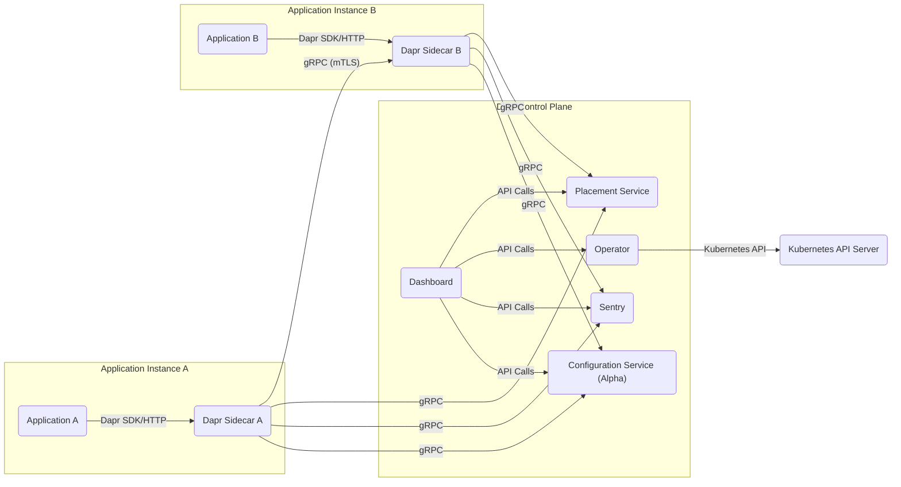
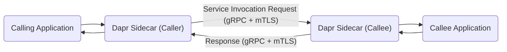

# Project Design Document: Dapr (Distributed Application Runtime) - Improved

**Version:** 1.1
**Date:** October 26, 2023
**Author:** AI Software Architect

## 1. Introduction

This document provides an enhanced architectural design overview of the Dapr (Distributed Application Runtime) project, specifically tailored for threat modeling activities. It offers a clear and detailed description of the system's components, their interactions, and data flows, with a strong emphasis on security considerations. This document serves as a foundational resource for identifying potential threats and vulnerabilities within Dapr-based applications.

## 2. Project Overview

Dapr is a portable, event-driven runtime designed to simplify the development of resilient, stateless, and stateful applications across cloud and edge environments. It promotes a microservices architecture by offering a suite of building blocks that abstract away the complexities of distributed systems. Dapr operates as a sidecar process alongside application code, facilitating communication through gRPC or HTTP.

**Key Goals of Dapr:**

*   Simplifying the development of microservices-based applications.
*   Providing a consistent programming model irrespective of the deployment environment.
*   Enabling the creation of resilient and highly scalable applications.
*   Offering a pluggable component model for enhanced extensibility and integration.

## 3. Architectural Overview

Dapr employs a sidecar architecture, where each application instance is accompanied by a dedicated Dapr sidecar process. Applications interact with their local Dapr sidecar via well-defined APIs, abstracting the underlying complexities of distributed communication and management.

**Key Architectural Components:**

*   **Dapr Sidecar:** The fundamental runtime process co-located with the application. It implements Dapr's building blocks and manages communication with other sidecars and Dapr control plane components.
*   **Dapr Control Plane:** A collection of system services responsible for managing the Dapr runtime environment. This includes:
    *   **Placement Service:** Manages actor placement and ensures even distribution across the cluster.
    *   **Operator:** Automates the deployment and management of Dapr components and configurations within Kubernetes.
    *   **Sentry:** Provides certificate management and enables mutual TLS for secure communication between sidecars.
    *   **Configuration Service (Alpha):** Offers dynamic configuration capabilities for Dapr applications and components.
    *   **Dashboard:** A web-based user interface for monitoring and managing Dapr applications and their components.
*   **Dapr CLI:** A command-line tool for interacting with Dapr, facilitating application deployment, component management, and runtime inspection.
*   **Dapr SDKs:** Language-specific libraries that simplify the integration and interaction of applications with the Dapr sidecar.

## 4. Detailed Component Description

This section provides a more granular examination of the core components and their respective functionalities, with a focus on security implications.

### 4.1. Dapr Sidecar

*   **Functionality:**
    *   Implements core Dapr building blocks: Service Invocation, State Management, Publish and Subscribe, Bindings, Actors, Secrets Management, Observability, and Configuration (Alpha).
    *   Handles inter-sidecar communication using gRPC (primarily) or HTTP.
    *   Presents a consistent API to applications for accessing distributed system capabilities.
    *   Manages service discovery, routing, and load balancing for service invocations.
    *   Enforces security policies, including access control rules for service invocation and resource access.
*   **Key Interfaces:**
    *   **gRPC API:** Used for communication between sidecars and interactions with certain control plane components. This interface is secured by mTLS.
    *   **HTTP API:** Primarily used by applications to interact with their local sidecar. Security depends on the underlying transport (e.g., TLS).
*   **Deployment:** Typically deployed as a container within the same pod as the application container in Kubernetes, or as a separate process alongside the application in other environments.
*   **Security Considerations:**
    *   Vulnerabilities in the sidecar code could allow attackers to compromise the application or the Dapr mesh.
    *   Misconfigured access control policies could lead to unauthorized service invocations or data access.
    *   Exposure of the sidecar's HTTP or gRPC ports without proper authentication and authorization could be exploited.

### 4.2. Dapr Control Plane Components

*   **Placement Service:**
    *   **Functionality:** Maintains a distributed hash table (DHT) to track the location and health of actor instances, enabling efficient routing of actor calls.
    *   **Communication:** Communicates with sidecars via gRPC.
    *   **Security Considerations:**
        *   Compromise could allow attackers to manipulate actor placement, potentially leading to denial-of-service or data breaches.
        *   Unauthorized access could reveal information about the distribution of actors.
*   **Operator:**
    *   **Functionality:** Manages the lifecycle of Dapr components (e.g., state stores, pub/sub brokers) within a Kubernetes environment by watching for custom resource definitions (CRDs) and reconciling the desired state.
    *   **Communication:** Interacts with the Kubernetes API server.
    *   **Security Considerations:**
        *   Requires appropriate Kubernetes RBAC permissions to prevent unauthorized modification of Dapr components.
        *   Compromise could allow attackers to deploy malicious components or alter existing configurations.
*   **Sentry:**
    *   **Functionality:** Acts as a certificate authority (CA), issuing and managing mTLS certificates for secure gRPC communication between Dapr sidecars.
    *   **Communication:** Sidecars request certificates from Sentry.
    *   **Security Considerations:**
        *   A critical security component. Compromise of Sentry's root CA private key would severely compromise the security of the entire Dapr mesh, allowing attackers to impersonate services.
        *   Secure storage and access control for the root CA key are paramount.
*   **Configuration Service (Alpha):**
    *   **Functionality:** Provides a mechanism for dynamically configuring application behavior and Dapr component settings.
    *   **Communication:** Sidecars retrieve configuration data from this service via gRPC.
    *   **Security Considerations:**
        *   Unauthorized access could allow attackers to modify application behavior or disable security features.
        *   Sensitive configuration data should be protected from unauthorized disclosure.
*   **Dashboard:**
    *   **Functionality:** Offers a graphical user interface for monitoring Dapr applications, inspecting component status, and viewing logs.
    *   **Communication:** Interacts with various Dapr components to retrieve monitoring data.
    *   **Security Considerations:**
        *   Requires robust authentication and authorization to prevent unauthorized access to potentially sensitive operational information.
        *   Vulnerabilities in the dashboard application itself could be exploited.

### 4.3. Dapr CLI

*   **Functionality:** Enables developers and operators to interact with Dapr for tasks such as initializing Dapr, running applications locally, deploying and managing components, and querying runtime status.
*   **Communication:** Interacts with Dapr sidecars and control plane components via their respective APIs (primarily gRPC and HTTP).
*   **Security Considerations:**
    *   Secure access to the machine running the CLI is crucial, as it can be used to manage and potentially compromise the Dapr environment.
    *   Credentials used by the CLI to interact with Dapr should be securely managed.

### 4.4. Dapr SDKs

*   **Functionality:** Provide language-specific libraries that simplify application interaction with the local Dapr sidecar, abstracting away the underlying HTTP or gRPC communication details.
*   **Communication:** Typically communicate with the local Dapr sidecar via HTTP or gRPC.
*   **Security Considerations:**
    *   SDKs should be regularly updated to address any potential security vulnerabilities.
    *   Improper use of SDK features could introduce security risks in the application code.

## 5. Data Flow and Interactions

This section illustrates common data flow patterns within a Dapr-enabled application, highlighting security considerations at each step.

*   **Service Invocation:**
    1. Application A intends to invoke a method on Application B.
    2. Application A's sidecar sends a service invocation request to Application B's sidecar via the Dapr service invocation API (typically gRPC).
    3. Application B's sidecar resolves the location of Application B.
    4. Mutual TLS (mTLS) is established between the sidecars, ensuring encrypted and authenticated communication.
    5. Application B's sidecar forwards the request to Application B.
    6. Application B processes the request and returns a response to its sidecar.
    7. Application B's sidecar returns the response to Application A's sidecar, again secured by mTLS.
    8. Application A's sidecar returns the response to Application A.

    ```mermaid
    graph LR
        subgraph "Application Instance A"
            A["Application A"] -- "Dapr SDK/HTTP" --> SA("Dapr Sidecar A");
        end
        subgraph "Application Instance B"
            B["Application B"] <-- SB("Dapr Sidecar B");
        end
        SA -- "Service Invocation Request (gRPC + mTLS)" --> SB;
    ```

*   **State Management:**
    1. An application needs to save its state.
    2. The application's sidecar sends a request to the configured state store component via the Dapr state management API (typically gRPC or HTTP).
    3. The sidecar interacts with the underlying state store (e.g., Redis, Cosmos DB), using credentials managed by Dapr Secrets Management.

    ```mermaid
    graph LR
        APP["Application"] --> SIDE("Dapr Sidecar");
        SIDE -- "State Save Request" --> SS["State Store Component"];
    ```

*   **Publish and Subscribe:**
    1. A publisher application wants to publish a message.
    2. The publisher's sidecar publishes the message to the configured pub/sub broker via the Dapr pub/sub API.
    3. The pub/sub broker distributes the message to subscribed applications.
    4. Subscriber applications' sidecars receive the message from the broker.
    5. Subscriber applications receive the message from their respective sidecars.

    ```mermaid
    graph LR
        Publisher["Publisher Application"] --> PSidecar("Publisher Sidecar");
        PSidecar -- "Publish Message" --> Broker["Pub/Sub Broker"];
        Broker -- "Deliver Message" --> SSidecar("Subscriber Sidecar");
        SSidecar --> Subscriber["Subscriber Application"];
    ```

## 6. Deployment Model

Dapr's flexibility allows for deployment in various environments. Common deployment models include:

*   **Kubernetes:** The most prevalent deployment model, where Dapr sidecars run as containers alongside application containers within Kubernetes pods. The Dapr control plane components are also typically deployed as Kubernetes deployments. This model leverages Kubernetes' orchestration and security features.
*   **Self-Hosted Mode:** Primarily used for local development and testing. Dapr sidecars and control plane components run as separate processes on a local machine, offering a simplified setup for experimentation.

## 7. Security Considerations

Dapr incorporates several security mechanisms to protect applications and infrastructure:

*   **Mutual TLS (mTLS):** Enabled by Sentry, providing strong authentication and encryption for gRPC communication between sidecars, preventing eavesdropping and man-in-the-middle attacks.
*   **Access Control Policies:** Allows defining fine-grained policies to control which applications can invoke specific services, preventing unauthorized access and potential abuse.
*   **Secrets Management:** Provides a secure way to retrieve secrets from configured secret stores (e.g., HashiCorp Vault, Kubernetes Secrets), preventing hardcoding of sensitive credentials in application code.
*   **Component Secrets:** Credentials required for accessing backing services (e.g., state stores, pub/sub brokers) can be securely managed as secrets, reducing the risk of exposure.
*   **Pluggable Security Components:** Dapr's architecture allows integration with various authentication and authorization providers, enabling organizations to leverage their existing security infrastructure.
*   **Input Validation:** While Dapr provides building blocks, applications are still responsible for validating input to prevent injection attacks.
*   **Secure Defaults:** Dapr aims to provide secure defaults, but it's crucial to review and configure security settings appropriately for the specific environment.

## 8. Threat Modeling Focus Areas

Based on the architectural design and security considerations, the following areas warrant focused attention during threat modeling:

*   **Inter-Service Communication Security:**
    *   **Spoofing:** Can an attacker impersonate a service to send malicious requests? (Mitigated by mTLS and access control).
    *   **Tampering:** Can an attacker intercept and modify requests or responses? (Mitigated by mTLS).
    *   **Eavesdropping:** Can an attacker intercept communication and read sensitive data? (Mitigated by mTLS).
    *   **Denial of Service:** Can an attacker overwhelm a service with requests? (Requires rate limiting and other defensive measures).
*   **Dapr Control Plane Security:**
    *   **Sentry Compromise:** What if the Sentry service or its root CA key is compromised? (Requires robust key management and access control).
    *   **Placement Service Manipulation:** Can an attacker influence actor placement for malicious purposes? (Requires secure access control to the Placement service).
    *   **Operator Abuse:** Can an attacker with compromised Kubernetes credentials manipulate Dapr components? (Requires strong Kubernetes RBAC).
    *   **Configuration Tampering:** Can an attacker modify configurations to disrupt services or weaken security? (Requires access control to the Configuration Service).
    *   **Dashboard Vulnerabilities:** Could vulnerabilities in the dashboard expose sensitive information or allow malicious actions? (Requires secure development practices and access control).
*   **Sidecar Security:**
    *   **Sidecar Vulnerabilities:** Are there known vulnerabilities in the Dapr sidecar itself? (Requires keeping Dapr updated).
    *   **Container Escape:** Could an attacker escape the sidecar container and access the host system? (Requires secure container configurations).
    *   **Misconfiguration:** Could misconfigured sidecar settings weaken security? (Requires careful configuration and security audits).
*   **Component Security:**
    *   **Backing Service Vulnerabilities:** Are the configured state stores, pub/sub brokers, etc., vulnerable? (Requires patching and secure configuration of these services).
    *   **Credential Exposure:** Are the credentials used to access these components securely managed? (Leverage Dapr Secrets Management).
*   **API Security:**
    *   **Unauthorized Access:** Can unauthorized users access Dapr's HTTP or gRPC APIs? (Requires authentication and authorization).
    *   **Injection Attacks:** Can attackers inject malicious payloads through Dapr's APIs? (Requires input validation in applications).
*   **Deployment Environment Security:**
    *   **Kubernetes Security:** Is the underlying Kubernetes cluster secure? (Requires following Kubernetes security best practices).
    *   **Network Segmentation:** Is network traffic properly segmented and firewalled? (Limits the impact of a potential breach).
*   **Secrets Management Security:**
    *   **Secure Storage:** Are secrets stored securely in the configured secret store? (Depends on the chosen secret store).
    *   **Access Control:** Is access to secrets properly controlled? (Leverage Dapr's secrets management features and the secret store's access controls).

## 9. Diagrams

### 9.1. High-Level Architecture



### 9.2. Service Invocation Flow



## 10. Conclusion

This improved design document provides a more detailed and security-focused architectural overview of the Dapr project. By clearly outlining the components, their interactions, and inherent security considerations, this document serves as a valuable resource for conducting comprehensive threat modeling exercises. Identifying and mitigating the potential threats outlined in this document is crucial for building secure and resilient applications using the Dapr runtime.