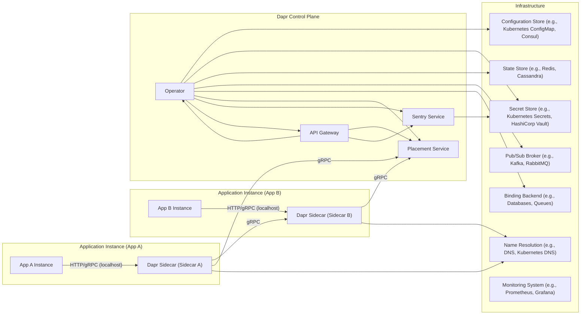
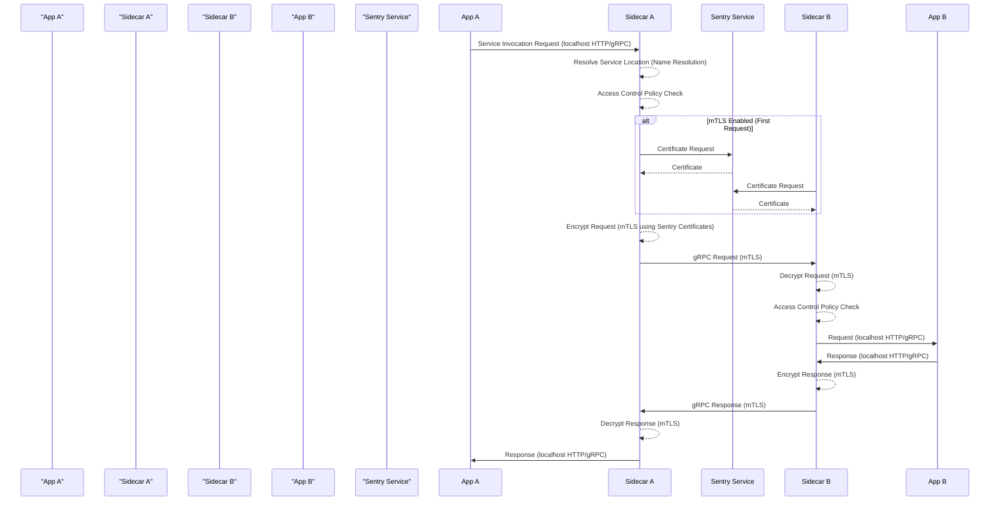
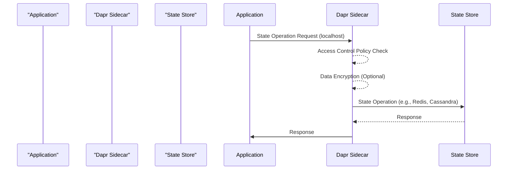
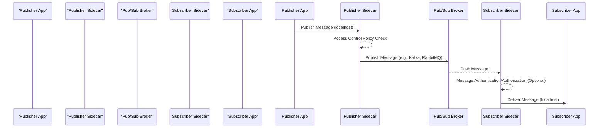

# Project Design Document: Dapr (Distributed Application Runtime) for Threat Modeling

**Project Name:** Dapr (Distributed Application Runtime)

**Project Repository:** [https://github.com/dapr/dapr](https://github.com/dapr/dapr)

**Document Version:** 1.1

**Date:** October 26, 2023

**Author:** Gemini (AI Expert in Software, Cloud, and Cybersecurity Architecture)

## 1. Introduction

This document provides an enhanced design overview of the Distributed Application Runtime (Dapr) project, specifically tailored for threat modeling. Building upon the previous version, this document aims for greater clarity, conciseness, and actionable insights for security analysis. It details the architecture, core components, data flows, and security features of Dapr, serving as a robust foundation for identifying potential threats and vulnerabilities within the Dapr ecosystem. This document will be the primary input for subsequent threat modeling exercises.

Dapr is a portable, event-driven runtime designed to simplify the development of resilient, microservice-based applications for cloud and edge environments.  It leverages the sidecar pattern and offers a suite of building block APIs addressing common distributed system challenges, including service invocation, state management, pub/sub messaging, resource bindings, secrets management, and actor model implementation.

## 2. System Architecture Overview

Dapr employs a sidecar architecture, where a Dapr sidecar instance runs alongside each application instance. Applications communicate with their local sidecar via standard HTTP or gRPC APIs over localhost. Sidecars, in turn, interact with each other and the Dapr control plane components across the network, typically using gRPC.

The following diagram illustrates the high-level architecture of Dapr:

**Diagram Components Explanation:**

* **Application Instance:**  Represents a microservice application leveraging Dapr.
* **Dapr Sidecar:**  The core runtime process that provides Dapr's building blocks to the application.
* **Dapr Control Plane:**  Manages the Dapr runtime environment and provides system-level services.
    * **Placement Service:**  Handles actor placement and distribution.
    * **Operator:**  Automates Dapr component management, especially in Kubernetes.
    * **Sentry Service:**  Provides certificate management for mTLS.
    * **API Gateway (Optional):**  An ingress point for external access to Dapr services and control plane.
* **Infrastructure:**  External services and systems that Dapr relies on.
    * **Configuration Store:**  Stores Dapr component configurations.
    * **Secret Store:**  Securely stores sensitive information.
    * **State Store:**  Persists application state for the State Management building block.
    * **Pub/Sub Broker:**  Facilitates asynchronous messaging for the Pub/Sub building block.
    * **Binding Backend:**  External systems integrated via Dapr Bindings.
    * **Name Resolution:**  Provides service discovery.
    * **Monitoring System:**  Collects telemetry data for monitoring and observability.

## 3. Component Details

### 3.1. Dapr Sidecar ( `daprd` )

* **Functionality:**
    * **Building Block APIs:** Exposes HTTP/gRPC APIs for applications to utilize Dapr's building blocks (Service Invocation, State Management, Pub/Sub, Bindings, Actors, Secrets Management, Configuration, Observability).
    * **Service Discovery & Invocation:** Resolves service addresses and facilitates secure service-to-service calls.
    * **Security Enforcement:** Enforces access control policies and manages mTLS for secure communication.
    * **Telemetry Collection:** Collects metrics, traces, and logs for observability.
    * **Component Interaction:** Communicates with Dapr control plane and infrastructure components.

* **Security Considerations & Potential Threats:**
    * **Attack Surface:** Exposed to the application via localhost (HTTP/gRPC) and to other sidecars and control plane components over the network (gRPC).
    * **Localhost Exploitation:**
        * **Threat:** Malicious application or compromised application dependency exploiting vulnerabilities in the sidecar via localhost interface.
        * **Example:**  Application sending crafted requests to bypass authorization checks or exploit input validation flaws in the sidecar.
    * **Service-to-Service Communication Vulnerabilities:**
        * **Threat:** Man-in-the-middle attacks, eavesdropping, or tampering with inter-sidecar communication.
        * **Example:**  Exploiting weaknesses in mTLS configuration or implementation to intercept or modify gRPC traffic between sidecars.
    * **Building Block Security Flaws:**
        * **Threat:** Vulnerabilities within specific building block implementations leading to data breaches, unauthorized access, or denial of service.
        * **Example:**  Exploiting insecure deserialization in the State Management building block to gain access to sensitive state data.
    * **Dependency Vulnerabilities:**
        * **Threat:** Exploiting known vulnerabilities in third-party libraries and dependencies used by the sidecar.
        * **Example:**  Compromising the sidecar by exploiting a vulnerability in a logging library or gRPC library.
    * **Sidecar Injection/Container Escape (Kubernetes):**
        * **Threat:**  In Kubernetes environments, if not properly secured, a malicious actor could potentially inject a rogue sidecar or escape the sidecar container to compromise the node.
        * **Mitigation:** Kubernetes Pod Security Policies/Admission Controllers, proper RBAC, and container security best practices.

### 3.2. Control Plane Components

#### 3.2.1. Placement Service ( `dapr-placement` )

* **Functionality:**
    * **Actor Placement:**  Distributes and manages actor instances across Dapr sidecars.
    * **Actor Location Lookup:** Provides a distributed hash table for resolving actor locations.
    * **Membership & Health Monitoring:** Tracks the health and membership of Dapr sidecar instances for actor placement decisions.

* **Security Considerations & Potential Threats:**
    * **Availability:** Critical for actor functionality.
        * **Threat:** Denial-of-service attacks targeting the Placement Service, disrupting actor availability and functionality.
        * **Example:**  Flooding the Placement Service with requests to overload it and prevent actor placement or lookup.
    * **Data Integrity:** Placement data integrity is crucial for correct actor routing.
        * **Threat:** Data poisoning or manipulation of placement information leading to misrouting of actor calls or data leaks.
        * **Example:**  Compromising the data store used by the Placement Service to alter actor location mappings, redirecting actor calls to malicious instances.
    * **Unauthorized Access:**
        * **Threat:** Unauthorized access to placement data or APIs allowing malicious actors to gain insights into application topology or manipulate actor placement.
        * **Example:**  Exploiting weak authentication or authorization to query the Placement Service API and discover service instance locations.

#### 3.2.2. Operator ( `dapr-operator` )

* **Functionality:**
    * **Component Lifecycle Management (Kubernetes):** Manages the deployment, updates, and deletion of Dapr components (e.g., state stores, pub/sub brokers) in Kubernetes.
    * **Configuration Reconciliation:** Watches for Dapr component custom resources and ensures the desired state is maintained in the cluster.
    * **Certificate Management (Integration with Sentry):**  May interact with Sentry for certificate provisioning for Dapr components.

* **Security Considerations & Potential Threats:**
    * **Privilege Escalation:** Operator runs with elevated Kubernetes cluster privileges.
        * **Threat:** Compromise of the Operator could lead to cluster-wide compromise due to its extensive permissions.
        * **Example:**  Exploiting a vulnerability in the Operator to gain control of its service account and escalate privileges to manage cluster resources.
    * **Configuration Tampering:**
        * **Threat:** Malicious modification of Dapr component configurations through the Operator, leading to disruption, data breaches, or introduction of vulnerabilities.
        * **Example:**  Modifying the configuration of a state store component via the Operator to point to a malicious database, allowing data exfiltration.
    * **Supply Chain Attacks:**
        * **Threat:** Compromise of the Operator image or dependencies in the supply chain, leading to malicious code execution within the cluster.
        * **Mitigation:**  Image signing and verification, dependency scanning, and secure build pipelines.
    * **Access Control:**
        * **Threat:** Unauthorized access to Operator APIs or configuration could allow malicious actors to manipulate Dapr components and infrastructure.
        * **Mitigation:**  RBAC in Kubernetes to restrict access to Operator resources and APIs.

#### 3.2.3. Sentry Service ( `dapr-sentry` )

* **Functionality:**
    * **Certificate Authority (CA):** Acts as the Certificate Authority for Dapr mTLS.
    * **Certificate Issuance:** Issues certificates to Dapr sidecars and control plane components for mTLS authentication and encryption.
    * **Certificate Management:** Handles certificate rotation and revocation.
    * **Secret Storage (Private Key):** Securely stores the private key of the CA.

* **Security Considerations & Potential Threats:**
    * **Private Key Compromise:** The Sentry service's private key is the root of trust for Dapr mTLS.
        * **Threat:** Compromise of the CA private key would completely undermine the mTLS infrastructure, allowing attackers to impersonate Dapr components and intercept/decrypt traffic.
        * **Mitigation:**  Hardware Security Modules (HSMs) for private key protection, strict access control to Sentry's storage, and robust key management practices.
    * **Certificate Forgery/Mis-issuance:**
        * **Threat:**  Exploiting vulnerabilities in Sentry to forge certificates or issue certificates to unauthorized entities, bypassing mTLS authentication.
        * **Example:**  Exploiting an API vulnerability in Sentry to request and obtain a valid certificate for a malicious service, allowing it to impersonate a legitimate Dapr component.
    * **Certificate Management Flaws:**
        * **Threat:** Improper certificate rotation or revocation processes leading to expired certificates or continued trust in compromised certificates.
        * **Mitigation:**  Automated certificate rotation and revocation mechanisms, robust monitoring of certificate validity.
    * **Denial of Service:**
        * **Threat:**  DoS attacks targeting the Sentry service, preventing certificate issuance and disrupting mTLS establishment, potentially impacting service communication.
        * **Mitigation:**  Rate limiting, resource management, and infrastructure resilience.

#### 3.2.4. API Gateway (Optional - e.g., using Ingress or dedicated Gateway)

* **Functionality:**
    * **External Ingress:** Provides an entry point for external traffic to Dapr applications and potentially control plane APIs.
    * **Routing & Load Balancing:** Routes external requests to appropriate Dapr services.
    * **Security Features:** Can implement authentication, authorization, rate limiting, TLS termination, and other gateway functionalities.

* **Security Considerations & Potential Threats:**
    * **Exposure to External Network:** Directly exposed to the internet, significantly increasing the attack surface.
        * **Threat:** Vulnerable to a wide range of internet-based attacks.
    * **Web Application Vulnerabilities (OWASP Top 10):**
        * **Threat:** Common web application vulnerabilities such as injection flaws (SQL, command, etc.), cross-site scripting (XSS), insecure deserialization, and broken authentication/authorization.
        * **Mitigation:**  Secure coding practices, input validation, output encoding, regular security scanning, and penetration testing.
    * **API Abuse & Rate Limiting:**
        * **Threat:**  API abuse, brute-force attacks, and denial-of-service attacks exploiting the API Gateway.
        * **Mitigation:**  Rate limiting, API authentication and authorization, input validation, and monitoring for suspicious activity.
    * **Authentication & Authorization Bypass:**
        * **Threat:**  Bypassing authentication or authorization mechanisms in the API Gateway to gain unauthorized access to Dapr services or control plane APIs.
        * **Mitigation:**  Robust authentication and authorization mechanisms, regular security audits of gateway configurations.
    * **TLS Termination & Configuration:**
        * **Threat:** Misconfiguration of TLS termination or weak TLS settings leading to vulnerabilities like protocol downgrade attacks or exposure of sensitive data in transit.
        * **Mitigation:**  Strong TLS configuration, regular security assessments of TLS settings.

### 3.3. SDKs (Dapr Client Libraries)

* **Functionality:**
    * **API Abstraction:** Provide language-specific libraries to simplify interaction with Dapr building block APIs.
    * **Developer Convenience:** Offer higher-level abstractions and helper functions for common Dapr operations.

* **Security Considerations & Potential Threats:**
    * **Dependency Vulnerabilities:** SDKs rely on third-party libraries.
        * **Threat:** Vulnerabilities in SDK dependencies could be exploited by malicious actors targeting applications using the SDK.
        * **Mitigation:**  Regularly update SDK dependencies, perform dependency scanning, and use Software Composition Analysis (SCA) tools.
    * **Insecure Usage by Developers:**
        * **Threat:** Developers may misuse SDKs in ways that introduce vulnerabilities into their applications (e.g., improper handling of secrets, insecure data serialization).
        * **Mitigation:**  Security training for developers, secure coding guidelines, and code reviews.
    * **Code Injection (Indirect):**
        * **Threat:**  Vulnerabilities in the SDK itself could potentially be exploited to inject malicious code into applications using the SDK (though less likely than direct application vulnerabilities).
        * **Mitigation:**  Rigorous SDK development practices, security audits of SDK code.

### 3.4. CLI (Command Line Interface - `dapr`)

* **Functionality:**
    * **Dapr Application Management:**  Commands for running, deploying, and managing Dapr applications.
    * **Component Management:**  Commands for creating, configuring, and managing Dapr components.
    * **Debugging & Diagnostics:**  Tools for troubleshooting and monitoring Dapr applications.

* **Security Considerations & Potential Threats:**
    * **Authentication & Authorization:** CLI access should be controlled.
        * **Threat:** Unauthorized use of the CLI to manage Dapr applications or components, potentially leading to disruption or data breaches.
        * **Mitigation:**  Role-Based Access Control (RBAC) for CLI access, authentication mechanisms.
    * **Privilege Escalation:** CLI commands can perform privileged operations.
        * **Threat:**  Exploiting vulnerabilities in the CLI or its usage to escalate privileges and gain unauthorized access to the system or Dapr infrastructure.
        * **Mitigation:**  Principle of least privilege for CLI users, secure coding practices in CLI development.
    * **Command Injection:**
        * **Threat:**  Vulnerabilities in the CLI that could allow command injection if user inputs are not properly sanitized.
        * **Mitigation:**  Input validation and sanitization in CLI command parsing and execution.
    * **Credential Theft/Exposure:**
        * **Threat:**  CLI potentially handling or storing credentials insecurely, leading to credential theft or exposure.
        * **Mitigation:**  Secure credential management practices, avoiding storing credentials in CLI history or configuration files, leveraging secure secret stores.

### 3.5. Dashboard (Optional - Dapr Dashboard UI)

* **Functionality:**
    * **Monitoring & Observability:** Provides a web-based UI for visualizing Dapr application metrics, logs, and traces.
    * **Configuration Management:**  May offer UI-based configuration management for Dapr components (depending on implementation).
    * **Status & Health Checks:** Displays the status and health of Dapr components and applications.

* **Security Considerations & Potential Threats:**
    * **Web Application Vulnerabilities (OWASP Top 10):**
        * **Threat:**  Vulnerable to common web application attacks like XSS, CSRF, injection flaws, and insecure authentication/authorization.
        * **Mitigation:**  Secure web development practices, input validation, output encoding, regular security scanning, and penetration testing.
    * **Authentication & Authorization Bypass:**
        * **Threat:**  Bypassing authentication or authorization to gain unauthorized access to the dashboard and sensitive Dapr information.
        * **Mitigation:**  Robust authentication and authorization mechanisms, regular security audits of dashboard security configurations.
    * **Data Exposure:**
        * **Threat:**  Dashboard potentially exposing sensitive information (metrics, logs, configurations) to unauthorized users.
        * **Mitigation:**  Role-based access control to dashboard features and data, data masking or sanitization where appropriate.

## 4. Data Flow Analysis (Enhanced)

**4.1. Service-to-Service Invocation (mTLS Enabled):**

**4.2. State Management (Simplified Data Flow):**

**4.3. Pub/Sub Messaging (Simplified Data Flow):**

## 5. Security Considerations and Features (Enhanced)

Dapr incorporates several security features, but their effectiveness depends on proper configuration and deployment.

* **Mutual TLS (mTLS):**
    * **Feature:**  Enabled by default for inter-sidecar and sidecar-to-control-plane communication. Provides encryption in transit and mutual authentication using X.509 certificates issued by the Sentry service.
    * **Security Benefit:** Protects against eavesdropping, man-in-the-middle attacks, and unauthorized service impersonation.
    * **Limitations:**  Relies on the security of the Sentry service and proper certificate management. Misconfiguration or compromise of Sentry can undermine mTLS. Performance overhead of encryption.
* **Access Control Policies:**
    * **Feature:**  Allows defining declarative access control policies (using YAML) to authorize service-to-service invocation and access to Dapr building blocks. Policies can be based on service identity, operations, and metadata.
    * **Security Benefit:** Enforces authorization, preventing unauthorized access to services and building blocks.
    * **Limitations:**  Policy enforcement relies on correct policy definition and deployment. Policy misconfigurations can lead to overly permissive or restrictive access. Policy management complexity can increase with the number of services and policies.
* **Secrets Management Integration:**
    * **Feature:** Integrates with external secret stores (e.g., Kubernetes Secrets, HashiCorp Vault, Azure Key Vault) to securely manage and access secrets. Dapr components and applications can reference secrets from these stores without hardcoding them.
    * **Security Benefit:** Prevents hardcoding secrets in code or configuration, reducing the risk of accidental exposure. Centralized secret management and auditing.
    * **Limitations:**  Security depends on the security of the integrated secret store. Proper configuration of secret store access and permissions is crucial.
* **Input Validation:**
    * **Feature:** Dapr sidecars perform input validation on requests from applications and other sidecars.
    * **Security Benefit:** Helps prevent common injection attacks (e.g., SQL injection, command injection) and other input-related vulnerabilities.
    * **Limitations:**  Input validation effectiveness depends on the comprehensiveness and correctness of validation rules.  Bypassable if validation is incomplete or flawed.
* **Secure Configuration:**
    * **Feature:** Dapr components load configurations from secure sources (e.g., ConfigMaps, Consul) and validate them.
    * **Security Benefit:** Prevents misconfiguration vulnerabilities and ensures components operate with expected settings.
    * **Limitations:**  Security relies on the security of the configuration store and proper access control to configuration data.
* **Auditing and Logging:**
    * **Feature:** Dapr components generate audit logs and telemetry data (metrics, traces, logs).
    * **Security Benefit:** Provides visibility into Dapr operations for security monitoring, incident response, and auditing.
    * **Limitations:**  Effectiveness depends on proper log aggregation, analysis, and alerting mechanisms. Logs themselves need to be securely stored and accessed.
* **Security Contexts (Kubernetes):**
    * **Feature:** When deployed in Kubernetes, Dapr components can leverage Kubernetes security contexts (e.g., Pod Security Policies, SecurityContext) to enforce security policies at the container level (e.g., restricting capabilities, setting user/group IDs).
    * **Security Benefit:**  Enhances container security and limits the impact of container compromise.
    * **Limitations:**  Requires proper configuration of Kubernetes security contexts. Can be bypassed if Kubernetes security features are not correctly implemented or misconfigured.
* **Principle of Least Privilege:**
    * **Feature:** Dapr components are designed to operate with the least privileges necessary.
    * **Security Benefit:** Reduces the potential impact of component compromise by limiting the attacker's capabilities.
    * **Limitations:**  Requires careful design and implementation to ensure components have only the necessary permissions.

## 6. Deployment Scenarios and Security Implications (Expanded)

* **Kubernetes Deployment:**
    * **Security Advantages:** Leverages Kubernetes' robust security features:
        * **Network Policies:**  Isolate Dapr components and applications at the network level.
        * **RBAC:** Control access to Dapr APIs and Kubernetes resources.
        * **Security Contexts:** Enforce container-level security policies.
        * **Secret Management:** Kubernetes Secrets for storing sensitive data.
    * **Security Implications:**
        * **Kubernetes Misconfiguration:**  Vulnerabilities can arise from misconfigured Kubernetes security features (e.g., overly permissive RBAC, weak network policies).
        * **Operator Security:**  Operator's elevated privileges require careful security considerations.
        * **Shared Responsibility:** Security is a shared responsibility between Dapr and Kubernetes administrators.

* **Self-hosted (Standalone) Deployment:**
    * **Security Advantages:**  More control over the entire environment.
    * **Security Implications:**
        * **Increased Responsibility:** User is responsible for all aspects of security, including infrastructure hardening, network security, access control, and certificate management.
        * **Manual Configuration:** Security features like mTLS and access control require manual configuration and management.
        * **Network Exposure:**  Risk of exposing Dapr components to public networks if not properly secured.
        * **Certificate Management Complexity:** Managing certificates for mTLS in self-hosted environments can be more complex than in Kubernetes.

* **Cloud and Edge Environments:**
    * **Security Advantages:** Cloud providers often offer managed security services and infrastructure security features. Edge environments can have specific security requirements and constraints.
    * **Security Implications:**
        * **Cloud Provider Security:**  Security relies on the security posture of the cloud provider.
        * **Edge Security Challenges:** Edge environments may have limited resources, intermittent connectivity, and physical security concerns.
        * **Environment-Specific Security:** Security considerations need to be tailored to the specific cloud or edge environment and infrastructure.

## 7. Threat Modeling Focus Areas (Refined & Actionable)

Based on the design and security analysis, threat modeling efforts should prioritize the following areas, focusing on specific threat categories and attack vectors:

* **Dapr Sidecar Security:**
    * **Localhost Interface Threats:**
        * **Threat Category:**  Exploitation of vulnerabilities via the localhost API.
        * **Specific Threats:**  Bypass authorization, input validation flaws, sidecar injection by malicious applications.
        * **Attack Vectors:** Crafted HTTP/gRPC requests from applications, compromised application dependencies.
    * **Inter-Sidecar Communication Threats:**
        * **Threat Category:**  Attacks targeting gRPC communication between sidecars.
        * **Specific Threats:**  mTLS bypass, man-in-the-middle attacks, eavesdropping, replay attacks, denial of service.
        * **Attack Vectors:** Network interception, exploiting mTLS weaknesses, DoS attacks on gRPC endpoints.
    * **Building Block Vulnerabilities:**
        * **Threat Category:**  Vulnerabilities within specific building block implementations.
        * **Specific Threats:**  Data breaches via state store access flaws, pub/sub message manipulation, binding security issues, secrets management vulnerabilities.
        * **Attack Vectors:** Exploiting API vulnerabilities in building blocks, insecure data handling, dependency vulnerabilities.

* **Dapr Control Plane Security:**
    * **Sentry Service Security:**
        * **Threat Category:**  Compromise of the Certificate Authority.
        * **Specific Threats:**  Private key theft, certificate forgery, DoS attacks on certificate issuance.
        * **Attack Vectors:**  Exploiting vulnerabilities in Sentry service, insider threats, physical access to Sentry infrastructure.
    * **Operator Security:**
        * **Threat Category:**  Exploitation of Operator's elevated privileges.
        * **Specific Threats:**  Privilege escalation, configuration tampering, supply chain attacks, unauthorized access to Operator APIs.
        * **Attack Vectors:**  Exploiting Operator vulnerabilities, compromised Operator image, malicious custom resources.
    * **Placement Service Security:**
        * **Threat Category:**  Disruption or manipulation of actor placement.
        * **Specific Threats:**  DoS attacks, data poisoning, unauthorized access to placement data.
        * **Attack Vectors:**  Flooding Placement Service, compromising placement data store, exploiting API vulnerabilities.

* **Infrastructure Security Dependencies:**
    * **Secret Store Security:**
        * **Threat Category:**  Compromise of secrets stored in external secret stores.
        * **Specific Threats:**  Unauthorized access to secret store, data breaches, credential theft.
        * **Attack Vectors:**  Exploiting vulnerabilities in secret store, misconfigured access policies, insider threats.
    * **State Store Security:**
        * **Threat Category:**  Unauthorized access or manipulation of application state data.
        * **Specific Threats:**  Data breaches, data integrity violations, denial of service.
        * **Attack Vectors:**  Exploiting vulnerabilities in state store, misconfigured access controls, SQL injection (if applicable).
    * **Pub/Sub Broker Security:**
        * **Threat Category:**  Compromise of pub/sub messaging infrastructure.
        * **Specific Threats:**  Message interception, message tampering, unauthorized publishing/subscribing, denial of service.
        * **Attack Vectors:**  Exploiting vulnerabilities in pub/sub broker, misconfigured access controls, network interception.

* **Configuration and Deployment Security:**
    * **Misconfiguration Vulnerabilities:**
        * **Threat Category:**  Security weaknesses due to incorrect or insecure configurations.
        * **Specific Threats:**  Overly permissive access control policies, disabled mTLS, insecure building block configurations, exposed APIs.
        * **Attack Vectors:**  Configuration errors, lack of security awareness, insufficient security testing.
    * **Insecure Deployment Practices:**
        * **Threat Category:**  Vulnerabilities introduced by insecure deployment procedures.
        * **Specific Threats:**  Exposing Dapr components to public networks without proper security, using default credentials, failing to apply security patches, insecure container images.
        * **Attack Vectors:**  Lack of secure deployment guidelines, automated deployment pipeline vulnerabilities, human error.

This enhanced design document provides a more detailed and actionable foundation for threat modeling Dapr. By focusing on these specific threat areas and attack vectors, security assessments can be more targeted and effective in identifying and mitigating potential risks within Dapr deployments. Continuous review and updates to this document are recommended as Dapr evolves and new threats emerge.