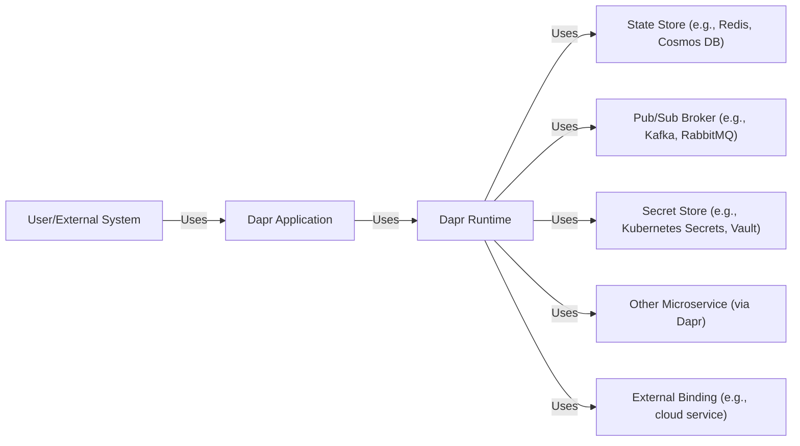
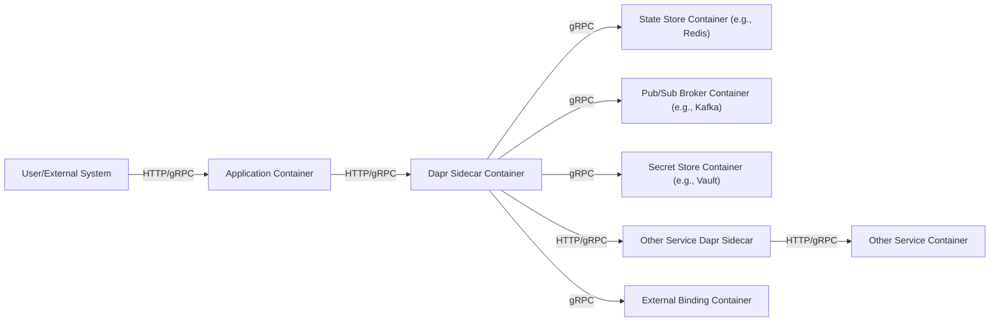
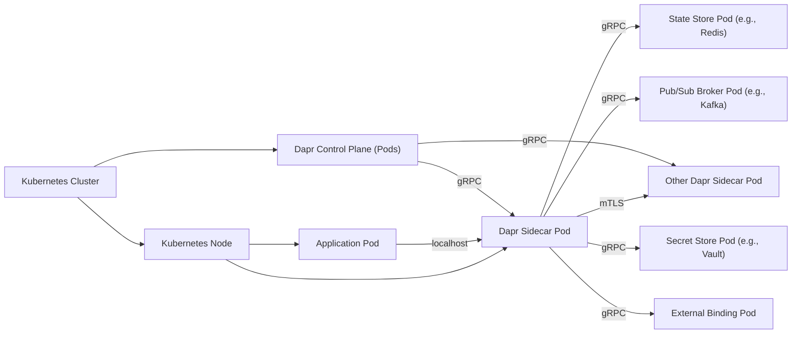
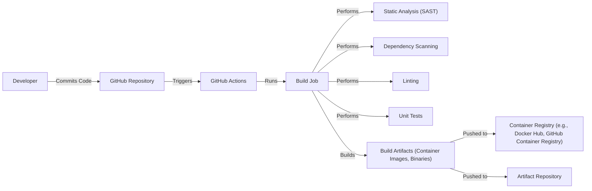

Okay, let's create a design document for the Dapr project, focusing on aspects relevant for threat modeling.

# BUSINESS POSTURE

Dapr (Distributed Application Runtime) aims to simplify the development of distributed applications, specifically microservices.  It addresses several key business priorities:

*   Faster Time to Market: By providing pre-built building blocks for common distributed system patterns (service invocation, pub/sub, state management, etc.), Dapr reduces the amount of custom code developers need to write, accelerating development.
*   Reduced Operational Complexity: Dapr abstracts away the underlying infrastructure, allowing developers to focus on business logic rather than the intricacies of specific cloud providers or technologies. This reduces operational overhead and makes applications more portable.
*   Increased Developer Productivity:  Developers can use any language or framework to build their applications and leverage Dapr's capabilities through standard HTTP or gRPC APIs. This increases flexibility and productivity.
*   Improved Application Resiliency and Scalability: Dapr's building blocks are designed to be resilient and scalable, helping developers build robust applications that can handle failures and scale to meet demand.
*   Vendor Neutrality: Dapr is platform-agnostic, meaning it can run on any cloud provider, on-premises, or even on edge devices. This avoids vendor lock-in and provides greater flexibility.

Based on these priorities, the most important business risks that need to be addressed are:

*   Security Vulnerabilities in Dapr Itself:  Since Dapr acts as a sidecar and handles critical functions like service communication and state management, any vulnerability in Dapr could be exploited to compromise the entire application or even the entire system.
*   Misconfiguration of Dapr: Incorrect configuration of Dapr components (e.g., insecure state stores, improperly configured access control) could expose sensitive data or allow unauthorized access.
*   Supply Chain Attacks:  Compromised dependencies or build processes for Dapr could introduce vulnerabilities into the runtime.
*   Denial of Service: Attacks targeting Dapr sidecars or the control plane could disrupt application functionality.
*   Data Breaches:  If Dapr's state stores or communication channels are compromised, sensitive data could be exposed.

# SECURITY POSTURE

Dapr incorporates several security controls, and also has some accepted risks.

Existing Security Controls:

*   security control: mTLS Communication: Dapr uses mutual TLS (mTLS) by default for communication between Dapr sidecars and between applications and Dapr sidecars. This encrypts traffic and provides authentication. Implemented in Dapr sidecar and control plane. Described in Dapr documentation.
*   security control: API Token Authentication: Applications authenticate to the Dapr sidecar using API tokens. Implemented in Dapr sidecar. Described in Dapr documentation.
*   security control: Access Control Policies: Dapr allows defining fine-grained access control policies to restrict which applications can invoke which services or access specific resources. Implemented in Dapr sidecar and control plane. Described in Dapr documentation.
*   security control: Secret Management: Dapr integrates with secret stores (like Kubernetes Secrets, HashiCorp Vault, cloud provider key vaults) to securely manage and access secrets. Implemented in Dapr components. Described in Dapr documentation.
*   security control: Component-Specific Security: Each Dapr component (state store, pub/sub broker, etc.) has its own security considerations and configuration options. Described in Dapr component documentation.
*   security control: Regular Security Audits and Penetration Testing: The Dapr project undergoes regular security audits and penetration testing. Described in Dapr community and security documentation.
*   security control: Secure Software Development Lifecycle (SSDLC): The Dapr project follows secure coding practices, including code reviews, static analysis, and vulnerability scanning. Described in Dapr community and contribution guidelines.

Accepted Risks:

*   accepted risk: Complexity of Configuration: Dapr's flexibility and extensive configuration options can lead to misconfigurations if not carefully managed. This risk is mitigated by providing clear documentation and best practices, but it remains a potential area of concern.
*   accepted risk: Reliance on Underlying Infrastructure Security: Dapr relies on the security of the underlying infrastructure (e.g., Kubernetes, cloud provider services). While Dapr provides its own security controls, vulnerabilities in the underlying infrastructure could impact Dapr's security.
*   accepted risk: Sidecar Overhead: The sidecar architecture introduces some performance overhead. This is generally accepted as a trade-off for the benefits Dapr provides, but it's a factor to consider in performance-sensitive applications.

Recommended Security Controls:

*   Network Policies: Implement network policies (e.g., Kubernetes Network Policies) to restrict network traffic between Dapr sidecars and applications, limiting the blast radius of potential attacks.
*   Regular Dependency Updates: Establish a process for regularly updating Dapr and its dependencies to address security vulnerabilities.
*   Security Hardening Guides: Develop and maintain security hardening guides for deploying Dapr in different environments.
*   Runtime Security Monitoring: Implement runtime security monitoring tools to detect and respond to suspicious activity within Dapr sidecars and applications.

Security Requirements:

*   Authentication:
    *   All communication between applications and Dapr sidecars must be authenticated using API tokens.
    *   All communication between Dapr sidecars must be authenticated using mTLS.
    *   Dapr control plane components must authenticate to each other using mTLS.

*   Authorization:
    *   Access control policies must be defined to restrict which applications can invoke which services.
    *   Access control policies must be defined to restrict access to Dapr resources (state stores, pub/sub topics, etc.).
    *   The principle of least privilege should be applied to all access control policies.

*   Input Validation:
    *   All input received by Dapr components must be validated to prevent injection attacks and other vulnerabilities.
    *   Input validation should be performed at the component level, based on the specific data types and formats expected.

*   Cryptography:
    *   mTLS must be used for all communication between Dapr sidecars and between applications and Dapr sidecars.
    *   Data at rest in state stores should be encrypted using appropriate encryption algorithms and key management practices.
    *   Secrets must be stored securely using a secret store.

# DESIGN

## C4 CONTEXT

Element Descriptions:

*   Element:
    *   Name: User/External System
    *   Type: External entity
    *   Description: Represents a user or an external system interacting with the Dapr application.
    *   Responsibilities: Initiates requests to the Dapr application.
    *   Security controls: Authentication and authorization are typically handled by the Dapr application or an external identity provider.

*   Element:
    *   Name: Dapr Application
    *   Type: Application
    *   Description: The application built using Dapr.
    *   Responsibilities: Contains the business logic. Interacts with Dapr sidecar for distributed system capabilities.
    *   Security controls: API token authentication to Dapr sidecar, application-level security logic.

*   Element:
    *   Name: Dapr Runtime
    *   Type: Runtime
    *   Description: The Dapr sidecar that provides the building blocks for distributed applications.
    *   Responsibilities: Handles service invocation, pub/sub messaging, state management, secret management, and other distributed system concerns.
    *   Security controls: mTLS, API token authentication, access control policies, secret management integration.

*   Element:
    *   Name: State Store
    *   Type: Database
    *   Description: A state store used by Dapr to persist application state (e.g., Redis, Cosmos DB, Cassandra).
    *   Responsibilities: Stores and retrieves application state.
    *   Security controls: Encryption at rest, access control, authentication, network security.

*   Element:
    *   Name: Pub/Sub Broker
    *   Type: Message Broker
    *   Description: A message broker used by Dapr for pub/sub messaging (e.g., Kafka, RabbitMQ, Azure Service Bus).
    *   Responsibilities: Handles message delivery between publishers and subscribers.
    *   Security controls: Authentication, authorization, encryption in transit, access control.

*   Element:
    *   Name: Secret Store
    *   Type: Secret Management System
    *   Description: A secret store used by Dapr to manage secrets (e.g., Kubernetes Secrets, HashiCorp Vault, cloud provider key vaults).
    *   Responsibilities: Securely stores and provides access to secrets.
    *   Security controls: Access control, encryption at rest, audit logging.

*   Element:
    *   Name: Other Microservice (via Dapr)
    *   Type: Application
    *   Description: Another microservice that the Dapr application interacts with via Dapr.
    *   Responsibilities: Provides specific functionality.
    *   Security controls: mTLS (via Dapr), API token authentication, application-level security logic.

*   Element:
    *   Name: Binding
    *   Type: External Service
    *   Description: Represents external service that Dapr application interacts using Dapr bindings.
    *   Responsibilities: Provides specific functionality (e.g. send email, store file).
    *   Security controls: Authentication, authorization, encryption in transit, access control.

## C4 CONTAINER

Element Descriptions:

*   Element:
    *   Name: User/External System
    *   Type: External entity
    *   Description: Represents a user or an external system interacting with the Dapr application.
    *   Responsibilities: Initiates requests to the application container.
    *   Security controls: Authentication and authorization are typically handled by the application container or an external identity provider.

*   Element:
    *   Name: Application Container
    *   Type: Container
    *   Description: The container running the application code.
    *   Responsibilities: Executes the business logic. Interacts with the Dapr sidecar container.
    *   Security controls: API token authentication to Dapr sidecar, application-level security logic.

*   Element:
    *   Name: Dapr Sidecar Container
    *   Type: Container
    *   Description: The container running the Dapr runtime.
    *   Responsibilities: Handles service invocation, pub/sub messaging, state management, secret management, and other distributed system concerns.
    *   Security controls: mTLS, API token authentication, access control policies, secret management integration.

*   Element:
    *   Name: State Store Container
    *   Type: Container
    *   Description: The container running the state store (e.g., Redis, Cosmos DB).
    *   Responsibilities: Stores and retrieves application state.
    *   Security controls: Encryption at rest, access control, authentication, network security.

*   Element:
    *   Name: Pub/Sub Broker Container
    *   Type: Container
    *   Description: The container running the message broker (e.g., Kafka, RabbitMQ).
    *   Responsibilities: Handles message delivery between publishers and subscribers.
    *   Security controls: Authentication, authorization, encryption in transit, access control.

*   Element:
    *   Name: Secret Store Container
    *   Type: Container
    *   Description: The container running the secret store (e.g., HashiCorp Vault).
    *   Responsibilities: Securely stores and provides access to secrets.
    *   Security controls: Access control, encryption at rest, audit logging.

*   Element:
    *   Name: Other Service Dapr Sidecar
    *   Type: Container
    *   Description: Dapr sidecar for another service.
    *   Responsibilities: Handles distributed system concerns for the other service.
    *   Security controls: mTLS (via Dapr), API token authentication, access control policies.

*   Element:
    *   Name: Other Service Container
    *   Type: Container
    *   Description: Container running another microservice.
    *   Responsibilities: Provides specific functionality.
    *   Security controls: Application-level security logic.

*   Element:
    *   Name: BindingContainer
    *   Type: Container
    *   Description: Container running external service.
    *   Responsibilities: Provides specific functionality.
    *   Security controls: Authentication, authorization, encryption in transit, access control.

## DEPLOYMENT

Dapr is most commonly deployed in a Kubernetes environment, although it can also be deployed in other environments like VMs or standalone processes. We'll focus on the Kubernetes deployment model.

Deployment Solutions:

1.  Kubernetes: Using Kubernetes manifests (YAML files) or Helm charts to deploy Dapr and applications.
2.  Standalone: Running Dapr as a self-hosted process alongside the application.
3.  Virtual Machines: Deploying Dapr and applications on virtual machines.

Chosen Solution (Kubernetes):

Element Descriptions:

*   Element:
    *   Name: Kubernetes Cluster
    *   Type: Infrastructure
    *   Description: The Kubernetes cluster where Dapr and applications are deployed.
    *   Responsibilities: Orchestrates container deployment, scaling, and management.
    *   Security controls: Kubernetes RBAC, network policies, pod security policies, node security.

*   Element:
    *   Name: Kubernetes Node
    *   Type: Infrastructure
    *   Description: A worker node in the Kubernetes cluster.
    *   Responsibilities: Runs pods.
    *   Security controls: Node-level security hardening, OS security.

*   Element:
    *   Name: Application Pod
    *   Type: Pod
    *   Description: The Kubernetes pod running the application container.
    *   Responsibilities: Executes the application code.
    *   Security controls: Container security, application-level security logic.

*   Element:
    *   Name: Dapr Sidecar Pod
    *   Type: Pod
    *   Description: The Kubernetes pod running the Dapr sidecar container.
    *   Responsibilities: Provides Dapr functionality to the application pod.
    *   Security controls: mTLS, API token authentication, access control policies.

*   Element:
    *   Name: Other Dapr Sidecar Pod
    *   Type: Pod
    *   Description: Dapr sidecar pod for another service.
    *   Responsibilities: Provides Dapr functionality to another application pod.
    *   Security controls: mTLS, API token authentication, access control policies.

*   Element:
    *   Name: State Store Pod
    *   Type: Pod
    *   Description: The pod running the state store (e.g., Redis).
    *   Responsibilities: Stores and retrieves application state.
    *   Security controls: Encryption at rest, access control, authentication, network security.

*   Element:
    *   Name: Pub/Sub Broker Pod
    *   Type: Pod
    *   Description: The pod running the message broker (e.g., Kafka).
    *   Responsibilities: Handles message delivery.
    *   Security controls: Authentication, authorization, encryption in transit, access control.

*   Element:
    *   Name: Secret Store Pod
    *   Type: Pod
    *   Description: The pod running the secret store (e.g., Vault).
    *   Responsibilities: Securely stores and provides access to secrets.
    *   Security controls: Access control, encryption at rest, audit logging.

*   Element:
    *   Name: Dapr Control Plane
    *   Type: Pods
    *   Description: The Dapr control plane components (dapr-operator, dapr-sidecar-injector, dapr-placement, dapr-sentry).
    *   Responsibilities: Manages Dapr sidecar injection, service discovery, and configuration.
    *   Security controls: mTLS, RBAC, Kubernetes security best practices.

*   Element:
    *   Name: BindingPod
    *   Type: Pod
    *   Description: Pod running external service.
    *   Responsibilities: Provides specific functionality.
    *   Security controls: Authentication, authorization, encryption in transit, access control.

## BUILD

Dapr uses GitHub Actions for its CI/CD pipeline. The build process includes several security checks.

Security Controls in Build Process:

*   Static Analysis (SAST):  Dapr uses static analysis tools (e.g., GoSec) to identify potential security vulnerabilities in the code.
*   Dependency Scanning:  Dapr uses dependency scanning tools to identify known vulnerabilities in third-party libraries.
*   Linting:  Dapr uses linters to enforce coding standards and identify potential errors.
*   Unit Tests:  Dapr has a comprehensive suite of unit tests to ensure code correctness.
*   Signed Commits: Dapr contributors are encouraged to sign their commits to ensure code integrity.
*   Automated Builds:  All builds are automated through GitHub Actions, reducing the risk of manual errors.
*   Container Image Scanning:  Container images built by Dapr are scanned for vulnerabilities before being pushed to a container registry.

# RISK ASSESSMENT

*   Critical Business Processes:
    *   Service-to-service communication: Dapr facilitates communication between microservices, which is critical for application functionality.
    *   State management: Dapr manages application state, which is essential for maintaining data consistency and supporting business operations.
    *   Pub/sub messaging: Dapr enables asynchronous communication between services, supporting event-driven architectures and business processes.
    *   Secret management: Dapr provides access to secrets, which are necessary for secure access to external resources and services.

*   Data Sensitivity:
    *   Application State: The sensitivity of application state depends on the specific application. It could range from non-sensitive data to highly sensitive data like PII, financial data, or healthcare information.
    *   Secrets: Secrets are highly sensitive and must be protected from unauthorized access.
    *   Communication Data: Data transmitted between services via Dapr may contain sensitive information, depending on the application.
    *   Configuration Data: Dapr configuration data may contain sensitive information, such as connection strings or API keys.

# QUESTIONS & ASSUMPTIONS

*   Questions:
    *   What specific compliance requirements (e.g., PCI DSS, HIPAA, GDPR) must Dapr deployments adhere to?
    *   What are the specific threat models for the applications that will be using Dapr?
    *   What are the existing security monitoring and incident response capabilities in the target deployment environment?
    *   What level of access do developers have to the production environment?
    *   Are there any specific performance requirements or limitations for Dapr deployments?

*   Assumptions:
    *   BUSINESS POSTURE: The organization prioritizes rapid development and deployment of microservices, with a focus on agility and scalability.
    *   SECURITY POSTURE: The organization has a moderate risk appetite and is willing to accept some risks in exchange for faster development and deployment. The organization has basic security controls in place (e.g., firewalls, access control), but may not have advanced security measures like runtime security monitoring.
    *   DESIGN: Dapr will be deployed in a Kubernetes environment. The organization will use a managed Kubernetes service (e.g., AKS, EKS, GKE). The organization will use Dapr's default security settings (e.g., mTLS enabled) unless there is a specific reason to change them.