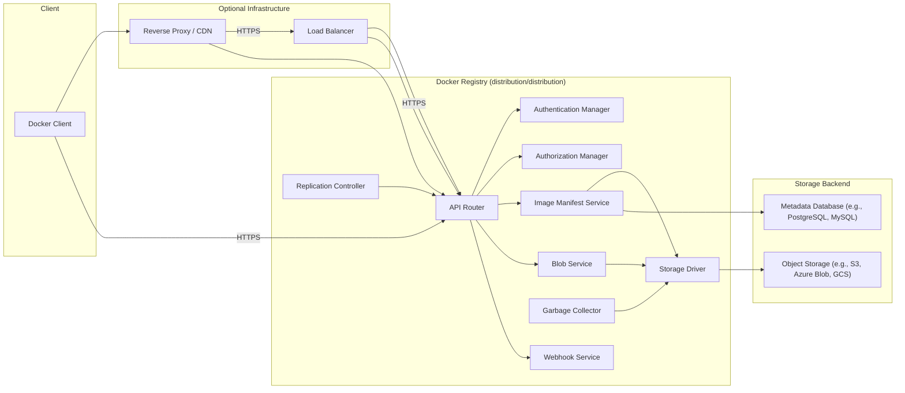
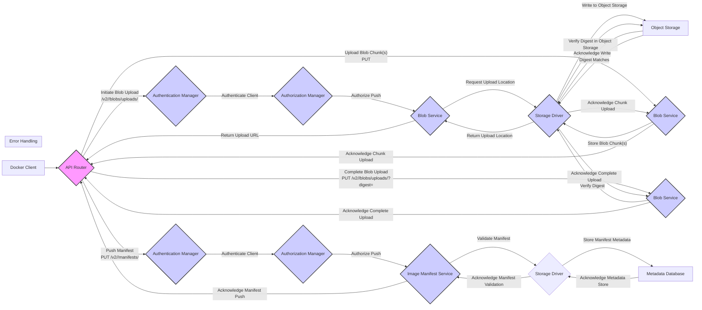

# Project Design Document: Docker Registry (distribution/distribution)

**Version:** 1.1
**Date:** October 26, 2023
**Author:** AI Software Architect

## 1. Introduction

This document provides an enhanced and detailed design overview of the Docker Registry project, with a specific focus on the `distribution/distribution` repository. This revised document aims to provide a more robust foundation for understanding the system's architecture, components, and data flow, making it even more suitable for subsequent threat modeling activities and general comprehension.

The Docker Registry is a mission-critical component within the container ecosystem, acting as the central repository for storing and distributing Docker images. A thorough understanding of its internal mechanisms is paramount for identifying potential security vulnerabilities, designing effective mitigation strategies, and ensuring the reliable operation of containerized applications.

## 2. Goals and Objectives

*   Deliver a comprehensive and easily understandable architectural overview of the Docker Registry.
*   Clearly define the responsibilities, functionalities, and interactions of all major components.
*   Illustrate the data flow within the system for key operational scenarios with enhanced clarity.
*   Serve as a robust and reliable foundational document for detailed threat modeling exercises.
*   Empower stakeholders with a deep understanding of the system's design, potential security implications, and operational characteristics.

## 3. Target Audience

*   Security engineers and architects tasked with performing threat modeling, security assessments, and penetration testing.
*   Development teams actively contributing to or integrating their applications with the Docker Registry.
*   Operations teams responsible for the deployment, configuration, maintenance, and monitoring of the Docker Registry infrastructure.
*   Technical leaders and decision-makers requiring a detailed understanding of the Docker Registry's internal architecture and security posture.
*   Anyone seeking an in-depth and accurate understanding of the Docker Registry's internal workings and design principles.

## 4. Scope

This document comprehensively covers the core architectural components and data flow of the `distribution/distribution` project, focusing on the server-side aspects of the registry. The scope includes:

*   Detailed explanation of API endpoints and their respective functionalities.
*   In-depth description of storage mechanisms for both image layers (blobs) and metadata.
*   Comprehensive overview of authentication and authorization processes and their underlying mechanisms.
*   Detailed explanation of image manifest handling, including schema versions and validation.
*   Thorough description of garbage collection mechanisms and their operational considerations.
*   Explanation of replication and mirroring features, including push and pull mirroring.
*   Consideration of security aspects within the described components and data flows.

This document explicitly excludes:

*   Detailed analysis of client-side interactions and the implementation of the Docker CLI.
*   Specific deployment configurations tailored to particular environments (e.g., detailed Kubernetes deployment manifests).
*   Granular code-level implementation details and specific algorithms used within the components.

## 5. High-Level Architecture

The Docker Registry is designed with a modular architecture, promoting separation of concerns and maintainability. Distinct components interact through well-defined APIs and interfaces.

**Components:**

*   **Docker Client:** The command-line interface (CLI) tool used by users and systems to interact with the registry (e.g., `docker push`, `docker pull`, `docker login`).
*   **Optional Infrastructure:**
    *   **Load Balancer:** Distributes incoming requests across multiple registry instances to ensure high availability and scalability.
    *   **Reverse Proxy / CDN:** Can provide caching, SSL termination, and other functionalities in front of the registry.
*   **Docker Registry (distribution/distribution):** The core server application responsible for managing and serving container images.
    *   **API Router:**  The entry point for all incoming HTTP requests. It routes requests to the appropriate handlers based on the URL path and HTTP method, implementing the Docker Registry HTTP API V2.
    *   **Authentication Manager:**  Verifies the identity of clients attempting to access the registry. It supports various authentication mechanisms and may integrate with external identity providers.
    *   **Authorization Manager:**  Determines if an authenticated client has the necessary permissions to perform the requested action on a specific resource (e.g., pushing to a specific repository, pulling an image).
    *   **Image Manifest Service:** Manages the storage, retrieval, and validation of image manifests, which describe the layers of an image and their configuration. It handles different manifest schema versions.
    *   **Blob Service:** Manages the storage and retrieval of image layer blobs (the actual file system layers of the container image). It handles chunked uploads and ensures data integrity through content addressable storage.
    *   **Storage Driver:** An abstraction layer that provides a consistent interface for interacting with various underlying storage backends, allowing the registry to be deployed with different storage solutions.
    *   **Garbage Collector:**  A background process that identifies and removes unreferenced or dangling image layers and manifests to reclaim storage space and maintain efficiency.
    *   **Replication Controller:** Manages the replication of images and metadata to other registries or storage locations, enabling scenarios like mirroring and geographically distributed deployments.
    *   **Webhook Service:** Allows the registry to trigger HTTP callbacks to external services upon certain events, such as image pushes or deletes, enabling integration with CI/CD pipelines and other systems.
*   **Storage Backend:** The persistent storage layer for image data and metadata.
    *   **Object Storage:** Stores the immutable image layer blobs, typically using content-addressable storage based on the blob's digest.
    *   **Metadata Database:** Stores metadata about repositories, manifests, tags, and other registry-related information.

## 6. Detailed Component Description

*   **API Router:**
    *   Acts as the central dispatcher for all incoming API requests.
    *   Implements the Docker Registry HTTP API V2 specification.
    *   Performs request parsing, validation, and response formatting.
    *   Often includes middleware for common tasks such as logging, request tracing, metrics collection, and rate limiting.

*   **Authentication Manager:**
    *   Responsible for verifying the identity of clients.
    *   Supports multiple authentication schemes, including:
        *   Basic Authentication (username and password).
        *   Token-based authentication (e.g., JWT tokens issued by an identity provider).
        *   OAuth 2.0 authorization flows.
        *   Bearer tokens.
    *   May integrate with external authentication providers like LDAP or Active Directory.
    *   Issues authentication challenges when necessary.

*   **Authorization Manager:**
    *   Enforces access control policies to determine if an authenticated user or service is authorized to perform a specific action on a given resource.
    *   Supports various authorization models, potentially including:
        *   Role-Based Access Control (RBAC).
        *   Attribute-Based Access Control (ABAC).
    *   May integrate with external authorization services or policy engines.
    *   Evaluates permissions based on the authenticated user, the requested action (e.g., push, pull, delete), and the target resource (e.g., a specific repository).

*   **Image Manifest Service:**
    *   Handles all operations related to image manifests.
    *   Supports different versions of the image manifest schema (e.g., OCI Image Manifest Specification, Docker Image Manifest V2 Schema 2).
    *   Performs validation of manifest structure and content.
    *   Manages manifest lists (also known as "fat manifests" or "multi-architecture manifests") which allow a single tag to point to different manifests for different architectures.
    *   Stores and retrieves manifest metadata in the metadata database.

*   **Blob Service:**
    *   Manages the storage and retrieval of immutable image layer blobs.
    *   Handles blob uploads, supporting chunked uploads for large layers.
    *   Implements content addressable storage (CAS), where each blob is uniquely identified by its cryptographic digest (typically SHA256).
    *   Verifies the integrity of uploaded blobs by comparing the calculated digest with the provided digest.
    *   Interacts with the configured Storage Driver to perform storage operations on the underlying object storage backend.

*   **Storage Driver:**
    *   Provides an abstraction layer, decoupling the Blob Service and Image Manifest Service from the specifics of the underlying storage backend.
    *   Supports a variety of storage options, including:
        *   Local filesystem.
        *   Amazon S3.
        *   Azure Blob Storage.
        *   Google Cloud Storage.
        *   OpenStack Swift.
        *   Other compatible storage solutions.
    *   Handles storage-specific operations such as put, get, delete, and list objects.

*   **Garbage Collector:**
    *   A background process responsible for reclaiming storage space by removing unreferenced data.
    *   Identifies and removes:
        *   Unreferenced blobs (blobs not referenced by any manifest).
        *   Unreferenced manifests (manifests not referenced by any tag).
    *   Relies on the metadata database to determine which blobs and manifests are currently in use.
    *   Requires careful configuration and execution to avoid accidental data loss.

*   **Replication Controller:**
    *   Manages the replication of images and metadata between different registry instances or storage locations.
    *   Supports both push and pull mirroring:
        *   **Push Mirroring:** Automatically pushes newly received images to a remote registry.
        *   **Pull Mirroring:**  When an image is requested and not found locally, attempts to pull it from a remote registry.
    *   Enables scenarios such as geographically distributed registries for improved pull performance and backup strategies for disaster recovery.
    *   Can be configured to replicate specific repositories or the entire registry.

*   **Webhook Service:**
    *   Allows the registry to send HTTP POST requests (webhooks) to configured endpoints when specific events occur.
    *   Common events include:
        *   `push`: When a new image or tag is pushed.
        *   `delete`: When an image or tag is deleted.
    *   Enables integration with CI/CD pipelines, security scanning tools, and other automation systems.

## 7. Data Flow

This section provides a more detailed explanation of the data flow for pushing and pulling images, including error handling considerations.

### 7.1. Pushing an Image

**Steps:**

1. The Docker client initiates a blob upload by sending a `POST` request to the `/v2/<name>/blobs/uploads/` endpoint.
2. The API Router forwards the request to the Authentication Manager for client authentication.
3. Upon successful authentication, the Authorization Manager verifies if the client is authorized to push to the specified repository.
4. The Blob Service requests an upload location from the Storage Driver.
5. The Storage Driver provides an upload location (potentially a pre-signed URL for direct upload to object storage).
6. The Blob Service returns the upload URL to the client.
7. The client uploads the blob content in one or more chunks using `PUT` requests to the provided upload URL.
8. The Blob Service (or potentially the object storage directly) stores the blob chunks via the Storage Driver.
9. The client completes the blob upload by sending a `PUT` request to `/v2/<name>/blobs/uploads/<uuid>?digest=<digest>`.
10. The Blob Service verifies the uploaded blob's digest against the provided digest by interacting with the Storage Driver and object storage.
11. The Docker client pushes the image manifest using a `PUT` request to the `/v2/<name>/manifests/<tag>` endpoint.
12. The API Router forwards the request for authentication and authorization.
13. The Image Manifest Service validates the manifest structure and content.
14. The manifest metadata is stored in the metadata database via the Storage Driver.

### 7.2. Pulling an Image

```mermaid
graph LR
    A["Docker Client"] --> B{"API Router"}
    B -- "Request Manifest\nGET /v2/<name>/manifests/<reference>" --> C{"Authentication Manager"}
    C -- "Authenticate Client" --> D{"Authorization Manager"}
    D -- "Authorize Pull" --> E{"Image Manifest Service"}
    E -- "Retrieve Manifest" --> F{"Storage Driver"}
    F -- "Fetch Manifest Metadata" --> G["Metadata Database"]
    G -- "Return Manifest Metadata" --> F
    F -- "Return Manifest" --> E
    E -- "Return Manifest" --> B
    B -- "Return Manifest" --> A
    subgraph "Download Blobs"
        direction LR
        H["Docker Client"] --> I{"API Router"}
        I -- "Request Blob\nGET /v2/<name>/blobs/<digest>" --> J{"Authentication Manager"}
        J -- "Authenticate Client" --> K{"Authorization Manager"}
        K -- "Authorize Pull" --> L{"Blob Service"}
        L -- "Retrieve Blob" --> M{"Storage Driver"}
        M -- "Fetch Blob from Object Storage" --> N["Object Storage"]
        N -- "Return Blob Data" --> M
        M -- "Return Blob Data" --> L
        L -- "Return Blob Data" --> I
        I -- "Return Blob Data" --> H
    end
    subgraph "Error Handling"
        style B fill:#f9f,stroke:#333,stroke-width:2px
        style C fill:#ccf,stroke:#333,stroke-width:2px
        style D fill:#ccf,stroke:#333,stroke-width:2px
        style E fill:#ccf,stroke:#333,stroke-width:2px
        style F fill:#ccf,stroke:#333,stroke-width:2px
        style L fill:#ccf,stroke:#333,stroke-width:2px
        style I fill:#ccf,stroke:#333,stroke-width:2px
        style J fill:#ccf,stroke:#333,stroke-width:2px
        style K fill:#ccf,stroke:#333,stroke-width:2px
        style M fill:#ccf,stroke:#333,stroke-width:2px
    end
```

**Steps:**

1. The Docker client requests the image manifest using a `GET` request to the `/v2/<name>/manifests/<reference>` endpoint (where `<reference>` can be a tag or a digest).
2. The API Router forwards the request for authentication and authorization.
3. The Image Manifest Service retrieves the manifest metadata from the metadata database via the Storage Driver.
4. The manifest is returned to the Docker client.
5. The Docker client then requests each layer (blob) of the image using `GET` requests to the `/v2/<name>/blobs/<digest>` endpoint.
6. The API Router forwards each request for authentication and authorization.
7. The Blob Service retrieves the blob data from the object storage via the Storage Driver.
8. The blob data is streamed back to the Docker client.

## 8. Security Considerations

This section expands on the initial security considerations, providing more specific examples and potential threats.

*   **Authentication and Authorization:**
    *   **Threats:** Brute-force attacks against authentication endpoints, credential stuffing, unauthorized access due to weak or default credentials, privilege escalation.
    *   **Mitigations:** Enforce strong password policies, implement multi-factor authentication (MFA), regularly rotate API keys and tokens, adhere to the principle of least privilege, and audit access logs.
*   **Transport Security (TLS):**
    *   **Threats:** Man-in-the-middle (MITM) attacks, eavesdropping on sensitive data (credentials, image data).
    *   **Mitigations:** Enforce HTTPS for all communication, use strong TLS configurations (disable weak ciphers), regularly update TLS certificates, and implement HTTP Strict Transport Security (HSTS).
*   **Content Trust:**
    *   **Threats:** Pulling and running tampered or malicious images, supply chain attacks.
    *   **Mitigations:** Implement Docker Content Trust (Notary), verify image signatures before pulling, and use trusted base images.
*   **Storage Security:**
    *   **Threats:** Unauthorized access to stored image data and metadata, data breaches, data corruption.
    *   **Mitigations:** Implement access control lists (ACLs) or IAM policies on the storage backend, enable encryption at rest for both object storage and the metadata database, and regularly back up data.
*   **Vulnerability Scanning:**
    *   **Threats:** Deploying and running images with known vulnerabilities.
    *   **Mitigations:** Integrate with vulnerability scanning tools to automatically scan images upon push, block the pulling of vulnerable images, and regularly update base images and dependencies.
*   **Rate Limiting:**
    *   **Threats:** Denial-of-service (DoS) attacks, abuse of registry resources.
    *   **Mitigations:** Implement rate limiting on API endpoints to restrict the number of requests from a single IP address or user within a given timeframe.
*   **Input Validation:**
    *   **Threats:** Injection attacks (e.g., SQL injection, command injection), cross-site scripting (XSS) if a web UI is present.
    *   **Mitigations:** Thoroughly validate all input data on the server-side, sanitize user-provided data, and use parameterized queries for database interactions.
*   **Access Control to Registry Infrastructure:**
    *   **Threats:** Unauthorized access to the underlying servers and infrastructure hosting the registry.
    *   **Mitigations:** Implement strong access controls (firewalls, security groups), regularly patch and update the operating system and software, and monitor system logs for suspicious activity.
*   **Garbage Collection Security:**
    *   **Threats:** Accidental deletion of actively used images due to misconfiguration or bugs in the garbage collection process.
    *   **Mitigations:** Carefully configure garbage collection policies, thoroughly test garbage collection procedures in non-production environments, and implement safeguards against accidental deletion.

## 9. Deployment Considerations

*   **Standalone Deployment:** A single instance of the registry server, suitable for development, testing, or small, non-critical deployments. Requires careful consideration of storage and data persistence.
*   **High Availability Deployment:** Multiple active registry instances deployed behind a load balancer. Requires a shared, highly available storage backend and metadata database. Essential for production environments.
*   **Read-Replica Deployment:** A primary registry instance for writes and one or more read-replica instances for handling pull requests, improving read scalability.
*   **Federated Registry:** Multiple independent registry instances, potentially geographically distributed, managed separately but potentially discoverable through a central catalog.
*   **Cloud-Based Deployment:** Leveraging managed services offered by cloud providers (e.g., AWS ECR, Azure Container Registry, Google Artifact Registry) for simplified deployment, scalability, and management.
*   **Hybrid Deployment:** Combining on-premises registry instances with cloud-based registries to meet specific requirements for data locality, compliance, or cost optimization.

## 10. Future Considerations

*   **Enhanced Web UI:** Developing a more comprehensive web-based user interface for managing repositories, images, access control policies, and monitoring registry health.
*   **Advanced Replication Strategies:** Implementing more sophisticated replication topologies, including multi-master replication and conflict resolution mechanisms, for increased resilience and global distribution.
*   **Improved Integration with Security Scanning Services:** Enhancing integration with a wider range of security scanning tools and platforms, providing more granular control over scanning policies and vulnerability reporting.
*   **Support for New Artifact Types:** Expanding the registry's capabilities to store and distribute other types of artifacts beyond Docker images, such as Helm charts, Singularity images, or other OCI artifacts.
*   **Performance Optimization:** Continuously improving the performance of the registry, particularly for large image pushes and pulls, through optimizations in storage access, data transfer, and metadata management.
*   **Enhanced Monitoring and Observability:** Implementing more robust monitoring and logging capabilities to provide deeper insights into registry performance, health, and security events.

This enhanced document provides a more detailed and comprehensive design overview of the Docker Registry. It serves as an improved resource for understanding the system's architecture, data flow, and security considerations, making it even more valuable for threat modeling and general understanding.