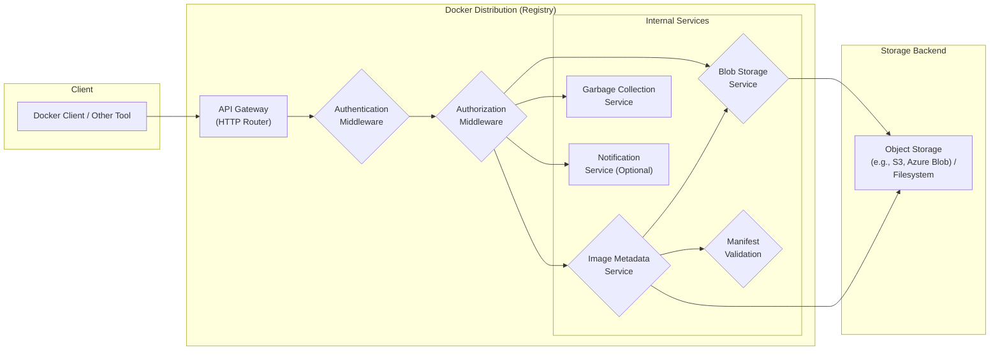

## Project Design Document: Docker Distribution (Registry v2) - Improved

**1. Introduction**

This document provides an enhanced and more detailed design overview of the Docker Distribution project (Registry v2), as found in the GitHub repository [https://github.com/distribution/distribution](https://github.com/distribution/distribution). This improved document aims to serve as a robust foundation for subsequent threat modeling activities by offering a clearer and more comprehensive outline of the system's architecture, components, and data flow. The enhancements focus on providing greater detail relevant to security considerations.

**2. Goals and Objectives**

*   Provide a comprehensive and refined architectural overview of the Docker Distribution project, emphasizing security-relevant aspects.
*   Identify key components and their interactions within the system with greater granularity.
*   Describe the data flow for core operations like image push and pull with more detail, including potential error scenarios.
*   Highlight relevant technologies and dependencies, including specific libraries where applicable.
*   Establish a clear and detailed understanding of the system's boundaries and functionalities, specifically tailored for effective threat modeling.

**3. Target Audience**

*   Security engineers and architects responsible for in-depth threat modeling of the Docker Distribution project.
*   Development teams working on, contributing to, or integrating with the Docker Distribution project, requiring a deeper understanding of its internals.
*   Operations teams responsible for deploying, configuring, and maintaining Docker Distribution instances, needing detailed insights for secure operation.

**4. Scope**

This document focuses on the core functionality of the Docker Distribution project, specifically the server-side components responsible for securely storing, managing, and distributing container images. It includes:

*   The complete set of API endpoints for image manifest and blob operations (push, pull, delete, etc.).
*   Detailed explanation of authentication and authorization mechanisms and their configurations.
*   The storage backend architecture for image layers and manifests, including different driver options and their implications.
*   The internal components involved in processing requests, including validation and data transformation.
*   Mechanisms for garbage collection and content deletion.

This document explicitly excludes:

*   Client-side implementation details of the Docker CLI or other interacting tools.
*   Specific deployment methodologies or infrastructure configurations (e.g., Kubernetes manifests, cloud provider specific setups).
*   Highly granular code-level implementation specifics beyond architectural component descriptions.
*   Detailed performance tuning or optimization strategies, unless directly impacting security.

**5. High-Level Architecture**

*   **Client:** Represents any entity interacting with the registry, typically the Docker CLI, container build tools, or other container management platforms.
*   **API Gateway (HTTP Router):** The primary entry point for all client requests. It handles request routing based on API paths, basic request parsing, and potentially implements cross-cutting concerns like logging and metrics.
*   **Authentication Middleware:** Responsible for verifying the identity of the client making the request. It handles various authentication schemes and ensures the client is who they claim to be.
*   **Authorization Middleware:**  Determines if the authenticated client has the necessary permissions to perform the requested action on the specific resource (e.g., pushing to a specific repository).
*   **Image Metadata Service:** Manages all metadata associated with container images, including image manifests, tags, image indexes, and their relationships. This service is crucial for understanding the structure and organization of images.
*   **Blob Storage Service:**  Handles the storage and retrieval of the actual content of container image layers (blobs). It manages the lifecycle of blobs, including uploads, downloads, and deletion.
*   **Manifest Validation:**  Performs rigorous validation of uploaded image manifests to ensure their integrity, schema compliance, and consistency with the stored blobs. This prevents malformed or malicious manifests from being accepted.
*   **Garbage Collection Service:**  An internal service responsible for identifying and removing unused or orphaned blobs and manifests from the storage backend, reclaiming storage space.
*   **Notification Service (Optional):**  An optional component that can send notifications about events occurring within the registry, such as image pushes or deletes.
*   **Storage Backend:** The persistent storage layer where image layers (blobs) and image metadata are stored. This can be a variety of storage systems, each with its own security characteristics.

**6. Detailed Design**

This section provides a more granular breakdown of the key components and their functionalities.

*   **API Gateway (HTTP Router):**
    *   Utilizes a routing mechanism (e.g., based on `net/http.ServeMux` or a dedicated routing library) to map incoming HTTP requests to specific handlers.
    *   May implement middleware for request logging, metrics collection, and request tracing.
    *   Enforces API rate limits and request size limits to prevent abuse.
    *   Handles TLS termination for secure communication.

*   **Authentication Middleware:**
    *   Supports multiple authentication mechanisms, configurable through the registry's configuration file:
        *   **Basic Authentication:**  Username and password transmitted in the `Authorization` header.
        *   **Token-Based Authentication (Bearer Tokens):**  Uses JWT (JSON Web Tokens) or similar tokens for authentication.
        *   **OAuth 2.0:** Integrates with OAuth 2.0 providers for delegated authorization.
        *   **OpenID Connect (OIDC):**  An authentication layer on top of OAuth 2.0, providing identity information.
        *   **Mutual TLS (mTLS):**  Authenticates clients based on their provided TLS certificates.
    *   Verifies the validity of provided credentials against configured authentication methods.
    *   May interact with external authentication services or identity providers.

*   **Authorization Middleware:**
    *   Enforces access control policies based on the authenticated user or service account and the requested action and resource.
    *   Supports various authorization models, including:
        *   Role-Based Access Control (RBAC).
        *   Attribute-Based Access Control (ABAC).
    *   May use a configuration file or an external authorization service (e.g., an Open Policy Agent (OPA) instance) to determine access permissions.
    *   Evaluates permissions based on the repository name, requested action (push, pull, delete), and the authenticated identity.

*   **Image Metadata Service:**
    *   Stores and manages image manifests in various formats (Docker Manifest Schema v2, OCI Image Spec).
    *   Handles image indexes, which allow for multi-architecture images.
    *   Maintains the mapping between tags and image manifests.
    *   Provides API endpoints for:
        *   `PUT /v2/<name>/manifests/<reference>`: Pushing or updating an image manifest (where `<reference>` can be a tag or digest).
        *   `GET /v2/<name>/manifests/<reference>`: Pulling an image manifest.
        *   `DELETE /v2/<name>/manifests/<reference>`: Deleting an image manifest (subject to garbage collection).
        *   `GET /v2/<name>/tags/list`: Listing tags for a repository.

*   **Blob Storage Service:**
    *   Implements the Docker Registry API blob endpoints:
        *   `POST /v2/<name>/blobs/uploads/`: Initiating a new blob upload.
        *   `PATCH /v2/<name>/blobs/uploads/<uuid>`: Uploading chunks of a blob.
        *   `PUT /v2/<name>/blobs/uploads/<uuid>?digest=<digest>`: Completing a blob upload.
        *   `GET /v2/<name>/blobs/<digest>`: Downloading a blob.
        *   `HEAD /v2/<name>/blobs/<digest>`: Checking for the existence of a blob.
        *   `DELETE /v2/<name>/blobs/<digest>`: Deleting a blob (subject to garbage collection).
    *   Manages the storage of blob content in the configured storage backend.
    *   Calculates and verifies blob digests (cryptographic hashes) to ensure content integrity.
    *   May implement content deduplication to save storage space.

*   **Manifest Validation:**
    *   Validates the structural integrity of the manifest (e.g., correct JSON format).
    *   Verifies the manifest schema against supported versions.
    *   Ensures that all referenced blobs in the manifest exist in the Blob Storage.
    *   May perform signature verification for image content trust (Docker Content Trust).
    *   Enforces size limits for manifests.

*   **Garbage Collection Service:**
    *   Runs periodically to identify and remove unreferenced blobs and manifests.
    *   Uses a marking and sweeping algorithm or similar techniques to determine which content is no longer in use.
    *   Configuration options control the frequency and behavior of the garbage collection process.
    *   Requires careful consideration to avoid accidentally deleting in-use content.

*   **Notification Service (Optional):**
    *   Allows for the configuration of webhooks or other notification mechanisms.
    *   Sends notifications about events such as:
        *   Image pushes.
        *   Image deletions.
        *   Tag creations or deletions.
    *   Can be used for integration with other systems, such as CI/CD pipelines or security scanning tools.

*   **Storage Backend:**
    *   Provides the underlying persistent storage for blobs and manifests.
    *   Supports various storage drivers, each with its own characteristics:
        *   **Filesystem:** Stores data on the local filesystem or a network-mounted filesystem.
        *   **Amazon S3:** Uses Amazon Simple Storage Service.
        *   **Azure Blob Storage:** Uses Azure Blob Storage.
        *   **Google Cloud Storage:** Uses Google Cloud Storage.
        *   **OpenStack Swift:** Uses OpenStack Swift object storage.
    *   Security considerations for the storage backend include access control, encryption at rest, and data replication.

**7. Data Flow**

This section provides a more detailed description of the data flow for pushing and pulling images, including potential error scenarios.

*   **Image Push (Detailed):**
    *   Client initiates a blob upload session with `POST /v2/<name>/blobs/uploads/`.
    *   Authentication and authorization are performed by the respective middleware.
    *   The Blob Storage Service creates a temporary upload location in the Storage Backend.
    *   Client uploads blob chunks using `PATCH` requests to the provided upload URL. The Blob Storage Service writes these chunks to the temporary location.
    *   If an upload is interrupted, the client can resume the upload.
    *   Client completes the blob upload with `PUT /v2/<name>/blobs/uploads/<uuid>?digest=<digest>`, providing the expected content digest.
    *   The Blob Storage Service verifies the received content against the provided digest. If they don't match, an error is returned.
    *   If the digest is valid, the Blob Storage Service moves the blob to its permanent storage location.
    *   Client pushes the image manifest to `PUT /v2/<name>/manifests/<tag>`.
    *   Authentication and authorization are performed.
    *   The Manifest Validation component validates the manifest structure, schema, and the existence of referenced blobs by querying the Blob Storage Service.
    *   If validation fails, an error is returned to the client.
    *   If validation succeeds, the Image Metadata Service stores the manifest in the Storage Backend.
    *   The Image Metadata Service updates the tag-to-manifest mapping.

*   **Image Pull (Detailed):**
    *   Client requests the image manifest using `GET /v2/<name>/manifests/<tag>` or `GET /v2/<name>/manifests/<digest>`.
    *   Authentication and authorization are performed.
    *   The Image Metadata Service retrieves the requested manifest from the Storage Backend.
    *   If the manifest is not found, a 404 error is returned.
    *   The API Gateway returns the manifest to the client.
    *   Client iterates through the layers (blobs) referenced in the manifest.
    *   For each blob, the client requests the content using `GET /v2/<name>/blobs/<digest>`.
    *   Authentication and authorization are performed.
    *   The Blob Storage Service retrieves the blob content from the Storage Backend.
    *   If the blob is not found, a 404 error is returned.
    *   The Blob Storage Service streams the blob content to the client.
    *   The client may verify the received blob content against its expected digest.

**8. Key Technologies and Dependencies**

*   **Programming Language:** Go (primarily)
*   **Web Framework:** Standard `net/http` library, potentially with routing libraries like `gorilla/mux`.
*   **Storage Drivers:**
    *   `aws-sdk-go-v2` for Amazon S3.
    *   `azure-sdk-for-go/sdk/storage/azblob` for Azure Blob Storage.
    *   `cloud.google.com/go/storage` for Google Cloud Storage.
    *   Potentially custom implementations for other storage backends.
*   **Database (Optional):**  While the core functionality relies on object storage, a database (e.g., PostgreSQL, MySQL) might be used for:
    *   Configuration storage.
    *   Metadata caching.
    *   Queueing or managing background tasks.
*   **Cryptography Libraries:** Standard Go `crypto/*` packages for digest calculation (SHA256, etc.) and potentially for signature verification (if Docker Content Trust is enabled).
*   **Logging Framework:**  Standard Go `log` package or more advanced logging libraries like `sirupsen/logrus`.
*   **Configuration Management:**  Uses YAML (`gopkg.in/yaml.v3`) or potentially other formats for configuration files.

**9. Security Considerations (Pre-Threat Modeling)**

This section provides a more detailed list of potential security concerns to be addressed during threat modeling.

*   **Authentication and Authorization Vulnerabilities:**
    *   Bypass of authentication mechanisms due to misconfiguration or vulnerabilities in the authentication middleware.
    *   Authorization flaws allowing unauthorized users to push, pull, or delete images or tags.
    *   Weak or default credentials.
    *   Vulnerabilities in token handling or validation.
    *   Lack of proper access control enforcement.

*   **Data Integrity Issues:**
    *   Man-in-the-middle attacks allowing modification of image layers or manifests during transit.
    *   Compromise of the storage backend leading to data corruption or unauthorized modification.
    *   Injection of malicious content into image layers.
    *   Manifest manipulation to point to incorrect or malicious blobs.

*   **Denial of Service (DoS) Attacks:**
    *   Resource exhaustion through excessive API requests.
    *   Attacks targeting specific API endpoints, such as blob uploads or manifest pushes.
    *   Exploitation of vulnerabilities leading to excessive resource consumption.

*   **Information Disclosure:**
    *   Exposure of sensitive information (e.g., API keys, credentials) through error messages or logs.
    *   Unauthorized access to image manifests revealing metadata or layer information.
    *   Leaking of internal system details.

*   **Supply Chain Security Risks:**
    *   Pushing of malicious or vulnerable images by compromised accounts.
    *   Lack of image provenance and integrity verification.
    *   Dependencies on vulnerable base images.

*   **Storage Backend Security Weaknesses:**
    *   Misconfigured storage backend access controls.
    *   Lack of encryption at rest or in transit for stored data.
    *   Vulnerabilities in the storage backend software itself.

*   **API Security Vulnerabilities:**
    *   Injection attacks (e.g., command injection, path traversal) through API parameters.
    *   Cross-site scripting (XSS) vulnerabilities (though less likely in a backend service).
    *   Insecure deserialization vulnerabilities.

*   **Configuration Security Issues:**
    *   Storing secrets in plaintext in configuration files.
    *   Permissive file permissions on configuration files.
    *   Exposure of configuration details.

*   **Vulnerability Management Negligence:**
    *   Running outdated versions of the registry software with known vulnerabilities.
    *   Using vulnerable dependencies.
    *   Lack of a process for patching and updating the system.

**10. Assumptions and Constraints**

*   The underlying network infrastructure is assumed to be reasonably secure, though the registry itself must protect against network-based attacks.
*   The storage backend provides a certain level of reliability and data durability, but the registry should handle potential storage errors gracefully.
*   Clients interacting with the registry are expected to adhere to the Docker Registry HTTP API V2 specification, but the registry should handle malformed requests.
*   The focus remains on the server-side components of the distribution project.
*   This document represents a general architectural overview and may not encompass all possible configurations or extensions. Specific deployments may introduce additional components or variations.

This improved document provides a more detailed and security-focused understanding of the Docker Distribution project's design, making it a more effective foundation for comprehensive threat modeling activities.
