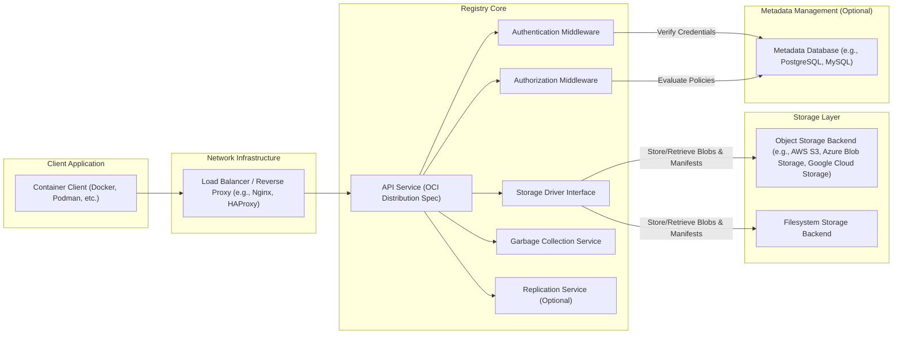
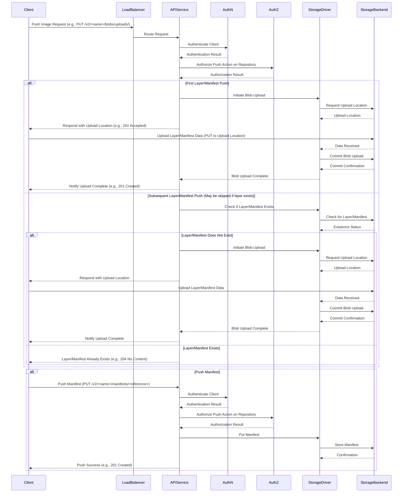
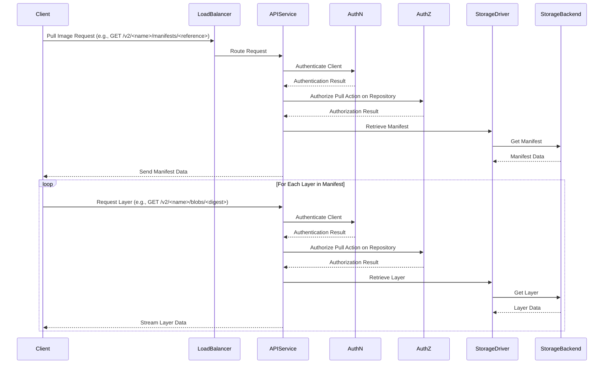

# Project Design Document: Docker Registry (distribution/distribution)

**Version:** 1.1
**Date:** October 26, 2023
**Author:** AI Software Architect

## 1. Introduction

This document provides an enhanced architectural design of the Docker Registry project, specifically focusing on the `distribution/distribution` codebase. This detailed design serves as a robust foundation for subsequent threat modeling activities, offering a comprehensive understanding of the system's components, interactions, data flow, and security considerations.

## 2. Goals and Objectives

The core goals of the Docker Registry are:

- To provide a secure, reliable, and efficient system for storing and distributing container images.
- To strictly adhere to the Open Container Initiative (OCI) specification for image formats and distribution protocols.
- To offer a highly scalable and performant solution capable of managing a large number of container images and handling significant traffic.
- To expose a well-defined and documented API for seamless integration with various container tools and platforms.
- To maintain a modular and extensible architecture, allowing for customization and the addition of new features.

## 3. High-Level Architecture

The Docker Registry employs a modular, service-oriented architecture. Key components interact to provide the core functionalities. The following diagram illustrates these components and their relationships:

**Components:**

- **Client Application:** Represents any software interacting with the registry, such as the Docker CLI, Podman, or other OCI-compliant tools.
- **Network Infrastructure:**  Handles routing and load balancing of incoming requests. This often includes a reverse proxy for TLS termination and security.
- **Registry Core:** The heart of the registry application, responsible for processing requests and managing image data.
    - **API Service (OCI Distribution Spec):**  The primary interface for clients, implementing the OCI Distribution Specification endpoints for pushing, pulling, and managing images.
    - **Storage Driver Interface:** An abstraction layer that allows the API Service to interact with different storage backends without needing to know the specifics of each.
    - **Authentication Middleware:**  Handles the verification of client credentials, supporting various authentication methods.
    - **Authorization Middleware:** Enforces access control policies, determining if an authenticated client has permission to perform the requested action.
    - **Garbage Collection Service:**  A background process that reclaims storage space by deleting unreferenced blobs and manifests.
    - **Replication Service (Optional):**  Facilitates the replication of image data across multiple registries or storage locations for redundancy and disaster recovery.
- **Storage Layer:**  Provides persistent storage for container image layers (blobs) and manifests.
    - **Object Storage Backend:** Utilizes cloud-based object storage services for scalable and durable storage.
    - **Filesystem Storage Backend:** Stores image data on the local filesystem of the registry server.
- **Metadata Management (Optional):**  A database used to store metadata about images, users, and access control policies, enhancing scalability and enabling advanced features.

## 4. Detailed Component Description

### 4.1. API Service (OCI Distribution Spec)

- **Responsibilities:**
    - Receives and interprets API requests conforming to the OCI Distribution Specification (e.g., `/v2/`, `/v2/<name>/blobs/<digest>`, `/v2/<name>/manifests/<reference>`).
    - Manages the lifecycle of image manifests and layers (blobs).
    - Coordinates with the Authentication and Authorization middleware to secure API endpoints.
    - Interacts with the Storage Driver Interface to store and retrieve image content.
    - Implements endpoints for:
        - **Pushing Images:** Initiating blob uploads, uploading blob content, completing blob uploads, pushing manifests.
        - **Pulling Images:** Retrieving manifests, retrieving blob content.
        - **Listing Repositories and Tags:** Discovering available images.
        - **Deleting Images and Tags:** Removing image content.
    - Handles content negotiation (e.g., `application/vnd.docker.distribution.manifest.v2+json`, `application/vnd.oci.image.manifest.v1+json`).
    - Generates appropriate HTTP status codes and error responses.

### 4.2. Storage Driver Interface

- **Responsibilities:**
    - Provides a consistent API for the API Service to interact with various storage backends.
    - Abstracts away the specific implementation details of each storage backend.
    - Defines operations for:
        - **Blob Management:** `PutBlob`, `GetBlob`, `StatBlob`, `DeleteBlob`, `OpenBlob`.
        - **Manifest Management:** `PutManifest`, `GetManifest`, `StatManifest`, `DeleteManifest`.
        - **Mounting Blobs:** Efficiently sharing blobs between repositories.
        - **Initiating and Completing Uploads:** Managing chunked uploads.
    - Supports different consistency models depending on the underlying storage backend.
    - Implementations include drivers for:
        - Amazon S3 (supports features like server-side encryption).
        - Azure Blob Storage (supports features like access tiers).
        - Google Cloud Storage (supports features like object lifecycle management).
        - Filesystem (for local storage).
        - Other community-contributed drivers.

### 4.3. Authentication Middleware

- **Responsibilities:**
    - Verifies the identity of clients attempting to access protected registry resources.
    - Supports multiple authentication mechanisms, configurable through the registry's settings:
        - **Basic Authentication:** Using username and password credentials.
        - **Bearer Tokens (OAuth 2.0, JWT):**  Verifying tokens issued by an authorization server.
        - **TLS Client Certificates:** Authenticating clients based on their X.509 certificates.
    - May integrate with external identity providers via standard protocols like OpenID Connect (OIDC).
    - Issues authentication challenges (e.g., `WWW-Authenticate` header) when requests are unauthenticated.
    - Passes authenticated user information to the Authorization Middleware.

### 4.4. Authorization Middleware

- **Responsibilities:**
    - Determines whether an authenticated client is authorized to perform a specific action on a specific resource.
    - Evaluates access control policies based on:
        - The authenticated user's identity.
        - The requested action (e.g., `pull`, `push`, `delete`).
        - The target resource (e.g., a specific repository or image).
    - Can be configured with different authorization backends:
        - **Configuration File:** Defining policies in a static configuration file.
        - **Database:** Storing and managing policies in a database.
        - **External Authorization Services:** Integrating with services like Open Policy Agent (OPA) for more complex policy enforcement.
    - Enforces authorization decisions by allowing or denying access to resources.

### 4.5. Garbage Collection Service

- **Responsibilities:**
    - Identifies and removes unreferenced blobs and manifests to reclaim storage space.
    - Operates based on a mark-and-sweep algorithm:
        - **Mark:** Iterates through all repositories and tags, marking all referenced blobs and manifests.
        - **Sweep:** Deletes any blobs and manifests that were not marked.
    - Typically runs as a scheduled background process to avoid impacting API request latency.
    - Requires careful configuration to ensure that actively used images are not inadvertently deleted.
    - Can be triggered manually for immediate cleanup.

### 4.6. Replication Service (Optional)

- **Responsibilities:**
    - Copies image data (blobs and manifests) between different registry instances or storage locations.
    - Enhances availability and provides disaster recovery capabilities.
    - Can be configured for various replication strategies:
        - **Mirroring:**  Creating an exact copy of the source registry.
        - **Selective Replication:** Replicating specific repositories or namespaces.
    - May involve synchronizing metadata in addition to blob and manifest data.
    - Can operate in active-active or active-passive modes.

### 4.7. Metadata Database (Optional)

- **Responsibilities:**
    - Stores metadata about repositories, images, tags, namespaces, and access control policies.
    - Provides a persistent and queryable store for registry state, improving performance for certain operations.
    - Enables more advanced features, such as:
        - More efficient tag listing.
        - Fine-grained access control management.
        - Enhanced search capabilities.
    - Common database choices include PostgreSQL, MySQL, and other relational databases.

## 5. Data Flow

### 5.1. Image Push

**Steps:** (As described previously, but with more detail in the diagram)

### 5.2. Image Pull

**Steps:** (As described previously, but with more detail in the diagram)

## 6. Security Considerations

This section details security considerations crucial for the Docker Registry.

- **Authentication and Authorization:**
    - **Strong Authentication:** Enforce the use of strong authentication mechanisms like Bearer Tokens (OAuth 2.0) over Basic Authentication where possible. Implement robust password policies if Basic Authentication is used.
    - **Fine-grained Authorization:** Implement granular access control policies based on the principle of least privilege. Define roles and permissions for different users and groups, controlling access at the repository level.
    - **Secure Credential Storage:**  Never store authentication credentials in plain text. Utilize secure hashing algorithms and consider using dedicated secrets management solutions.
- **Data Integrity and Confidentiality:**
    - **Content Addressable Storage:** Leverage the content-addressable nature of image layers (identified by their SHA256 digest) to ensure data integrity. Verify checksums during push and pull operations.
    - **TLS Encryption:** Enforce HTTPS for all communication between clients and the registry to protect data in transit. Ensure proper TLS configuration, including strong cipher suites and up-to-date certificates.
    - **Data at Rest Encryption:** Consider encrypting image data at rest in the storage backend to protect against unauthorized access to the underlying storage. Utilize server-side encryption provided by cloud storage providers or implement client-side encryption.
- **Access Control:**
    - **Role-Based Access Control (RBAC):** Implement RBAC to manage user permissions effectively. Define roles with specific privileges and assign users to these roles.
    - **Namespace Isolation:** Utilize namespaces or organizations to logically separate repositories and enforce access control boundaries between different teams or projects.
    - **Regular Policy Review:** Regularly review and update access control policies to reflect changes in organizational structure and security requirements.
- **Vulnerability Management:**
    - **Image Scanning Integration:** Integrate with vulnerability scanning tools to automatically scan pushed images for known vulnerabilities. Block the deployment of images with critical vulnerabilities.
    - **Regular Updates:** Keep the registry software and its dependencies up-to-date with the latest security patches.
- **Denial of Service (DoS) Protection:**
    - **Rate Limiting:** Implement rate limiting on API endpoints to prevent abuse and resource exhaustion.
    - **Request Size Limits:** Enforce limits on the size of requests to prevent large uploads from overwhelming the system.
    - **Resource Monitoring:** Monitor resource utilization (CPU, memory, network) to detect and respond to potential DoS attacks.
- **Supply Chain Security:**
    - **Image Signing and Verification:** Implement support for image signing using technologies like Docker Content Trust (Notary) or Sigstore to verify the authenticity and integrity of images.
    - **Provenance Tracking:** Track the origin and build process of container images to ensure their trustworthiness.
- **Secrets Management:**
    - **Avoid Embedding Secrets:**  Do not embed secrets (e.g., database credentials, API keys) directly in the registry configuration or code.
    - **Use Secrets Management Tools:** Utilize dedicated secrets management tools (e.g., HashiCorp Vault, AWS Secrets Manager) to securely store and manage sensitive information.
- **Auditing and Logging:**
    - **Comprehensive Audit Logs:** Maintain detailed audit logs of all API requests, authentication attempts, authorization decisions, and administrative actions.
    - **Secure Log Storage:** Store audit logs securely and protect them from unauthorized access or modification.
    - **Log Monitoring and Analysis:** Implement log monitoring and analysis to detect suspicious activity and potential security incidents.

## 7. Deployment Considerations

- **Scalability and High Availability:**
    - **Horizontal Scaling:** Deploy multiple instances of the registry behind a load balancer to handle increased traffic and ensure high availability.
    - **Stateless Design:** Design the registry instances to be stateless, allowing for easy scaling and failover. Store persistent data in the storage backend and optional database.
    - **Database Replication:** If using a database, implement replication for high availability and disaster recovery.
    - **Storage Backend Redundancy:** Choose a storage backend that provides built-in redundancy and durability.
- **Infrastructure Security:**
    - **Secure Network Configuration:**  Implement proper network segmentation and firewall rules to restrict access to the registry infrastructure.
    - **Operating System Hardening:** Harden the operating systems of the registry servers by disabling unnecessary services and applying security patches.
    - **Regular Security Audits:** Conduct regular security audits and penetration testing to identify and address potential vulnerabilities.
- **Monitoring and Alerting:**
    - **Performance Monitoring:** Monitor key performance metrics (e.g., request latency, error rates, resource utilization) to ensure the registry is operating efficiently.
    - **Security Monitoring:** Implement security monitoring and alerting to detect suspicious activity, failed authentication attempts, and other security events.
- **Backup and Recovery:**
    - **Regular Backups:** Implement a robust backup strategy for the storage backend and the optional database.
    - **Disaster Recovery Plan:** Develop and test a disaster recovery plan to ensure business continuity in the event of a major outage.

## 8. Future Considerations

- **Enhanced Vulnerability Scanning:** Integrate with more advanced vulnerability scanning solutions that provide deeper analysis and support for different image formats.
- **Supply Chain Security Enhancements:** Implement more robust image signing and verification mechanisms, potentially leveraging technologies like Sigstore's Cosign. Explore integration with software bill of materials (SBOM) generation and management tools.
- **WebAssembly (Wasm) Support:**  Explore extending the registry to support the storage and distribution of WebAssembly modules.
- **Geo-Replication:** Implement more sophisticated geo-replication strategies to optimize image pull performance for clients located in different geographical regions.
- **Integration with Policy Engines:**  Deepen integration with policy engines like Open Policy Agent (OPA) to enable more complex and dynamic authorization policies.

## 9. Glossary

- **OCI:** Open Container Initiative.
- **Blob:** A binary data object representing a layer in a container image.
- **Manifest:** A JSON or YAML document describing the layers of a container image, its configuration, and other metadata.
- **Repository:** A named collection of related container images.
- **Tag:** A human-readable, mutable reference to a specific version of an image within a repository.
- **Digest:** A cryptographic hash (typically SHA256) that uniquely identifies a specific blob or manifest.
- **Namespace:** A logical grouping of repositories, often used for organizational purposes.
- **RBAC:** Role-Based Access Control.
- **SBOM:** Software Bill of Materials.
- **Wasm:** WebAssembly.