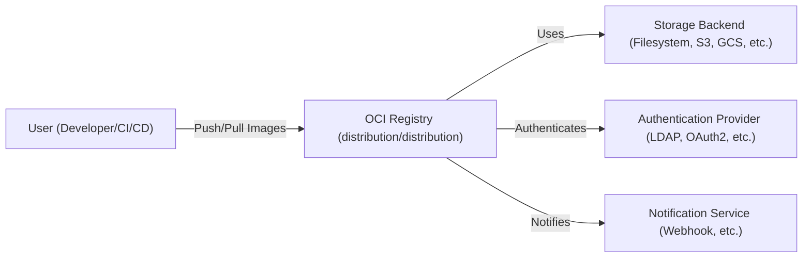
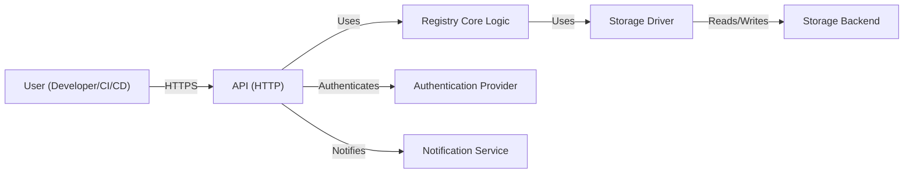
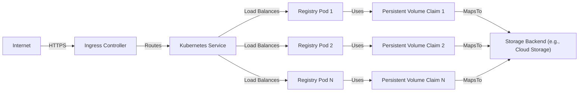
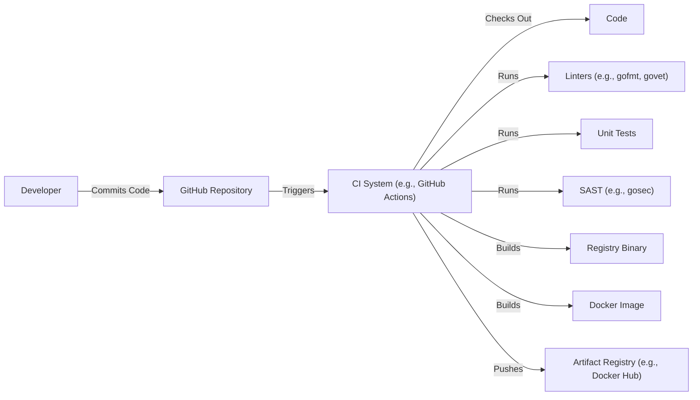

Okay, let's create a design document for the `distribution/distribution` project (OCI registry implementation).

# BUSINESS POSTURE

The `distribution/distribution` project, which is the reference implementation of the OCI Distribution specification, serves a critical role in the modern software development and deployment ecosystem.  It's used by countless organizations to store and distribute container images.

Business Priorities and Goals:

*   Reliability and Availability:  The registry must be highly available and reliable. Downtime or data loss directly impacts software deployments and can halt development pipelines.
*   Scalability: The registry needs to scale to handle a potentially massive number of images, tags, and concurrent requests.  Growth in container adoption necessitates horizontal scalability.
*   Performance:  Pushing and pulling images should be fast.  Slow performance impacts developer productivity and deployment speed.
*   Security:  The registry must protect against unauthorized access, data breaches, and image tampering.  This is paramount, as compromised images can lead to widespread security vulnerabilities.
*   Compliance:  The registry should adhere to the OCI Distribution specification, ensuring interoperability with other container tools and platforms.
*   Maintainability: The codebase should be maintainable and extensible to allow for future enhancements and bug fixes.
*   Cost-Effectiveness: While not explicitly stated, operating the registry should be cost-effective, especially when self-hosting.

Most Important Business Risks:

*   Compromised Images:  An attacker successfully pushing a malicious image into the registry, leading to widespread compromise of systems using that image. This is the highest risk.
*   Denial of Service:  The registry becoming unavailable, preventing deployments and impacting development.
*   Data Breach:  Unauthorized access to image data, potentially exposing sensitive information embedded within images.
*   Data Loss:  Loss of image data due to hardware failure, software bugs, or operational errors.
*   Non-Compliance:  Deviation from the OCI specification, leading to interoperability issues.

# SECURITY POSTURE

Existing Security Controls (based on the repository and common practices):

*   security control: Authentication: The registry supports various authentication mechanisms, including token-based authentication (often via OAuth 2.0 providers) and basic authentication. Described in documentation and configuration files.
*   security control: Authorization: Access control is typically implemented through a combination of registry-level permissions and integration with external identity providers. Described in documentation and configuration files.
*   security control: TLS Encryption: Communication with the registry is expected to be encrypted using TLS. Described in documentation and configuration files.
*   security control: Input Validation: The registry validates incoming requests and data to prevent common attacks like path traversal and injection vulnerabilities. Implemented in the codebase.
*   security control: Regular Security Audits: The project likely undergoes regular security audits and penetration testing, given its critical role. Implied, but best practice.
*   security control: Dependency Management: The project uses Go modules, which helps manage dependencies and track vulnerabilities. Implemented in go.mod and go.sum files.
*   security control: Code Reviews: The project uses a pull request-based workflow, which implies code reviews are performed. Implemented in GitHub workflow.
*   security control: Static Analysis: The project likely uses static analysis tools to identify potential security vulnerabilities in the codebase. Implied, but best practice.

Accepted Risks:

*   accepted risk: Complexity: The registry is a complex piece of software, and despite best efforts, there's always a risk of undiscovered vulnerabilities.
*   accepted risk: Third-Party Dependencies: The registry relies on third-party libraries, which may contain vulnerabilities.
*   accepted risk: Configuration Errors: Misconfiguration of the registry (e.g., weak authentication settings, exposed ports) can lead to security breaches.
*   accepted risk: Operational Errors: Human error during operation (e.g., accidental deletion of data) can lead to data loss or downtime.

Recommended Security Controls:

*   Content Trust/Image Signing: Integrate with Notary or other image signing mechanisms to ensure image integrity and authenticity. This is a *high priority* addition.
*   Vulnerability Scanning: Implement continuous vulnerability scanning of stored images to identify known vulnerabilities.
*   Rate Limiting: Implement rate limiting to mitigate denial-of-service attacks.
*   Audit Logging: Implement comprehensive audit logging to track all registry operations for security monitoring and incident response.
*   Web Application Firewall (WAF): Deploy a WAF in front of the registry to protect against common web attacks.

Security Requirements:

*   Authentication:
    *   Support multiple authentication mechanisms (token-based, basic auth, etc.).
    *   Integrate with common identity providers (LDAP, OAuth 2.0, etc.).
    *   Enforce strong password policies.
    *   Implement multi-factor authentication (MFA).
*   Authorization:
    *   Implement granular access control based on roles and permissions.
    *   Support fine-grained control over image repositories and tags.
    *   Integrate with external authorization services.
*   Input Validation:
    *   Validate all incoming data against a strict schema.
    *   Sanitize user input to prevent injection attacks.
    *   Protect against path traversal vulnerabilities.
*   Cryptography:
    *   Use TLS for all communication.
    *   Use strong cryptographic algorithms and key lengths.
    *   Securely store sensitive data (e.g., passwords, API keys).
    *   Implement image signing and verification.

# DESIGN

## C4 CONTEXT

C4 Context Element List:

*   1.  Name: User (Developer/CI/CD)
    *   Type: Person
    *   Description: Developers or CI/CD systems interacting with the registry to push and pull images.
    *   Responsibilities: Push images to the registry, Pull images from the registry, Manage image tags.
    *   Security controls: Authentication (API keys, tokens), Authorization (RBAC).

*   2.  Name: OCI Registry (distribution/distribution)
    *   Type: Software System
    *   Description: The core application, implementing the OCI Distribution specification.
    *   Responsibilities: Handle image push/pull requests, Manage image metadata, Enforce access control, Interact with storage backend.
    *   Security controls: Authentication, Authorization, Input Validation, TLS Encryption, Rate Limiting.

*   3.  Name: Storage Backend (Filesystem, S3, GCS, etc.)
    *   Type: Software System
    *   Description: The underlying storage used to store image layers and manifests.
    *   Responsibilities: Store image data, Retrieve image data.
    *   Security controls: Access Control Lists (ACLs), Encryption at Rest, Data Integrity Checks.

*   4.  Name: Authentication Provider (LDAP, OAuth2, etc.)
    *   Type: Software System
    *   Description: An external system used for user authentication.
    *   Responsibilities: Authenticate users, Provide user information.
    *   Security controls: Standard security controls for the chosen authentication provider.

*   5.  Name: Notification Service (Webhook, etc.)
    *   Type: Software System
    *   Description: An optional service that receives notifications about registry events (e.g., image pushes).
    *   Responsibilities: Receive and process registry events.
    *   Security controls: Authentication (API keys, tokens), TLS Encryption.

## C4 CONTAINER

C4 Container Element List:

*   1.  Name: User (Developer/CI/CD)
    *   Type: Person
    *   Description: Developers or CI/CD systems interacting with the registry.
    *   Responsibilities: Push images, Pull images, Manage tags.
    *   Security controls: Authentication (API keys, tokens), Authorization (RBAC).

*   2.  Name: API (HTTP)
    *   Type: Container (Web Application)
    *   Description: The HTTP API endpoint that handles incoming requests.
    *   Responsibilities: Handle HTTP requests, Parse request data, Route requests to the core logic, Return responses.
    *   Security controls: TLS Encryption, Input Validation, Rate Limiting, Authentication, Authorization.

*   3.  Name: Registry Core Logic
    *   Type: Container (Application Component)
    *   Description: The core logic of the registry, implementing the OCI specification.
    *   Responsibilities: Manage image manifests and layers, Enforce access control, Interact with the storage driver.
    *   Security controls: Input Validation, Authorization.

*   4.  Name: Storage Driver
    *   Type: Container (Application Component)
    *   Description: An abstraction layer for interacting with different storage backends.
    *   Responsibilities: Read and write image data to the storage backend.
    *   Security controls: Data Integrity Checks.

*   5.  Name: Storage Backend
    *   Type: Software System
    *   Description: The underlying storage (e.g., filesystem, cloud storage).
    *   Responsibilities: Store and retrieve image data.
    *   Security controls: Access Control Lists (ACLs), Encryption at Rest.

*   6.  Name: Authentication Provider
    *   Type: Software System
    *   Description: External system for user authentication.
    *   Responsibilities: Authenticate users.
    *   Security controls: Standard security controls for the chosen provider.

*   7.  Name: Notification Service
    *   Type: Software System
    *   Description: Optional service for registry event notifications.
    *   Responsibilities: Receive and process events.
    *   Security controls: Authentication, TLS Encryption.

## DEPLOYMENT

Possible Deployment Solutions:

1.  Standalone Docker Container:  The simplest deployment, running the registry as a single Docker container.
2.  Docker Compose:  Using Docker Compose to manage the registry and its dependencies (e.g., storage).
3.  Kubernetes:  Deploying the registry to a Kubernetes cluster for high availability and scalability.
4.  Cloud-Specific Deployments:  Using cloud-managed container services (e.g., AWS ECR, Google Artifact Registry, Azure Container Registry).  These often provide built-in security and scalability features.

Chosen Solution (for detailed description): Kubernetes

Deployment Element List:

*   1.  Name: Internet
    *   Type: External
    *   Description: The public internet.
    *   Responsibilities: N/A
    *   Security controls: N/A

*   2.  Name: Ingress Controller
    *   Type: Infrastructure Node (Software)
    *   Description: A Kubernetes Ingress controller (e.g., Nginx, Traefik) that handles incoming traffic.
    *   Responsibilities: Terminate TLS, Route traffic to the registry service.
    *   Security controls: TLS Configuration, WAF (optional).

*   3.  Name: Kubernetes Service
    *   Type: Infrastructure Node (Software)
    *   Description: A Kubernetes Service that provides a stable endpoint for the registry pods.
    *   Responsibilities: Load balance traffic across registry pods.
    *   Security controls: Network Policies.

*   4.  Name: Registry Pod 1, Pod 2, Pod N
    *   Type: Infrastructure Node (Container)
    *   Description: Instances of the registry application running in Kubernetes pods.
    *   Responsibilities: Run the registry application.
    *   Security controls: All security controls listed in the C4 Container section.

*   5.  Name: Persistent Volume Claim 1, 2, N
    *   Type: Infrastructure Node (Software)
    *   Description: Kubernetes Persistent Volume Claims that request storage for the registry pods.
    *   Responsibilities: Provide persistent storage for the registry.
    *   Security controls: Access Modes (ReadWriteOnce, ReadOnlyMany, ReadWriteMany).

*   6.  Name: Storage Backend (e.g., Cloud Storage)
    *   Type: Software System
    *   Description: The underlying storage used by the registry (e.g., cloud storage, network file system).
    *   Responsibilities: Store and retrieve image data.
    *   Security controls: Access Control Lists (ACLs), Encryption at Rest.

## BUILD

The `distribution/distribution` project uses Go modules and a Makefile for building.  A typical CI/CD pipeline would involve the following steps:

Build Process Security Controls:

*   security control: Code Reviews:  Mandatory code reviews before merging changes. Implemented via GitHub pull requests.
*   security control: Static Analysis (SAST):  Using tools like `gosec` to identify potential security vulnerabilities in the code. Integrated into the CI pipeline.
*   security control: Dependency Scanning:  Using `go mod` to manage dependencies and identify vulnerable packages.  Regularly updating dependencies.
*   security control: Build Automation:  Using a Makefile and CI system (e.g., GitHub Actions) to automate the build process, ensuring consistency and reproducibility.
*   security control: Signed Commits: Developers should sign their commits using GPG keys to ensure the integrity of the codebase.
*   security control: Least Privilege: Build systems should run with the least necessary privileges.

# RISK ASSESSMENT

*   Critical Business Processes:
    *   Software Deployment: The registry is critical for deploying containerized applications.
    *   Development Pipeline: The registry is an integral part of the development workflow.

*   Data to Protect:
    *   Container Images (Manifests and Layers): These are the primary data stored in the registry.
        *   Sensitivity:  Varies greatly.  Images can contain anything from public open-source software to highly sensitive proprietary code and data.  The sensitivity depends on the specific image and its contents.
    *   Registry Metadata:  Information about images, tags, and users.
        *   Sensitivity:  Moderately sensitive.  Metadata can reveal information about the organization's software and infrastructure.
    *   Authentication Credentials:  Usernames, passwords, API keys, and tokens.
        *   Sensitivity:  Highly sensitive.  Compromise of credentials can lead to unauthorized access to the registry.

# QUESTIONS & ASSUMPTIONS

*   Questions:
    *   What specific authentication providers are intended to be supported?
    *   What are the expected performance and scalability requirements (e.g., number of images, concurrent requests)?
    *   What is the target deployment environment (e.g., cloud provider, on-premises)?
    *   Are there any specific compliance requirements (e.g., GDPR, HIPAA)?
    *   What level of audit logging is required?
    *   What is the process for handling security vulnerabilities discovered in the registry?

*   Assumptions:
    *   BUSINESS POSTURE: The organization prioritizes security and is willing to invest in necessary security controls.
    *   SECURITY POSTURE: The organization has a mature security program and follows secure development practices.
    *   DESIGN: The registry will be deployed in a highly available and scalable manner. The registry will be integrated with existing authentication and authorization systems. The registry will be regularly monitored and audited.