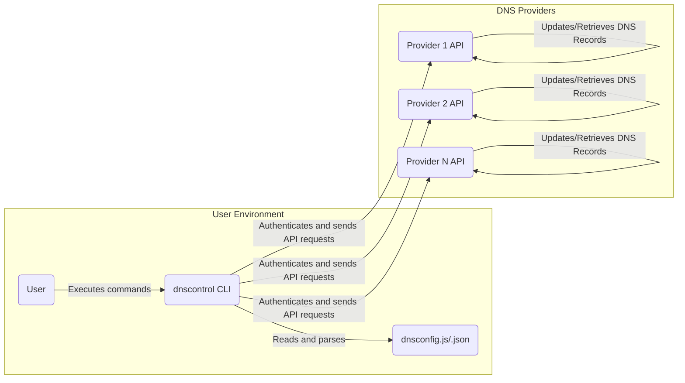
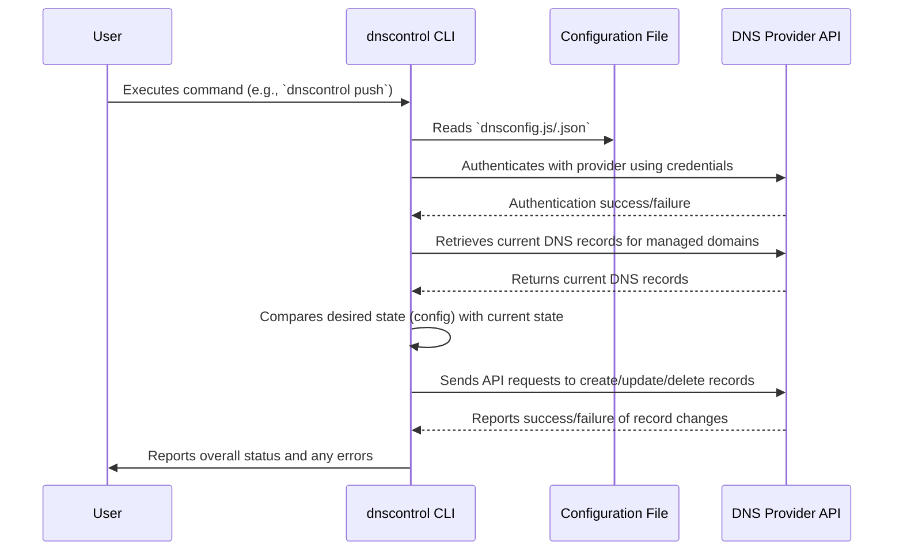

# Project Design Document: dnscontrol

**Version:** 1.1
**Date:** October 26, 2023
**Author:** AI Software Architect

## 1. Introduction

This document provides a detailed design overview of the `dnscontrol` project, an open-source command-line tool developed by Stack Exchange. `dnscontrol` enables users to manage DNS records across multiple DNS providers through a declarative configuration approach. This document aims to provide a clear and comprehensive understanding of the system's architecture, key components, and data flow, serving as a foundation for subsequent threat modeling activities.

## 2. Goals and Non-Goals

### 2.1 Goals

*   To offer a declarative method for defining and managing DNS records.
*   To provide a unified interface for interacting with diverse DNS providers.
*   To facilitate version control of DNS configurations, enabling tracking and rollback of changes.
*   To automate the process of updating and synchronizing DNS records across providers.
*   To expose functionality through a command-line interface (CLI) for user interaction and automation.
*   To ensure that DNS record updates are idempotent, meaning applying the same configuration multiple times results in the same outcome.

### 2.2 Non-Goals

*   This project is not intended to function as a DNS server or resolver.
*   Providing a graphical user interface (GUI) is outside the scope of this project.
*   `dnscontrol` does not handle real-time DNS traffic or query resolution.
*   Management of domain registration or transfer is not a goal of this project.

## 3. System Architecture

The `dnscontrol` system employs a client-side architecture. The `dnscontrol` tool is executed locally by a user or within an automated system. It interacts with various DNS providers by making calls to their respective APIs, based on the desired DNS state defined in a user-provided configuration file.

## 4. Components

*   **User:** The individual or automated system (e.g., CI/CD pipeline) that utilizes the `dnscontrol` tool to manage DNS records.
*   **`dnscontrol` CLI:** The core application, implemented as a command-line interface in Go. Its responsibilities include:
    *   **Configuration Parsing:** Reading and interpreting the `dnsconfig.js` or `dnsconfig.json` file to understand the desired DNS state.
    *   **Provider Authentication:** Handling the authentication process with different DNS providers using configured credentials (API keys, tokens, etc.).
    *   **API Interaction Layer:**  Making requests to the specific APIs of the configured DNS providers to retrieve current DNS records and apply changes. This involves translating `dnscontrol`'s internal representation of DNS records into the format expected by each provider's API.
    *   **State Management and Diffing:**  Maintaining the current and desired state of DNS records and calculating the differences to determine the necessary actions.
    *   **Change Application:**  Orchestrating the application of DNS record changes through the provider APIs, handling potential errors and retries.
    *   **Reporting and Logging:** Providing feedback to the user about the success or failure of operations, including detailed logs of API interactions.
*   **Configuration File (`dnsconfig.js` or `dnsconfig.json`):** A declarative file, written in JavaScript or JSON, that specifies the desired state of DNS records for one or more domains. This file includes:
    *   **Domain Definitions:**  Listing the domains managed by `dnscontrol`.
    *   **DNS Record Definitions:**  Declarations for various DNS record types (A, AAAA, CNAME, MX, TXT, SRV, etc.) with their corresponding values.
    *   **Provider Configurations:**  Credentials and settings required to authenticate with each DNS provider's API. This often includes API keys, secrets, or tokens.
*   **DNS Provider APIs:** The set of application programming interfaces exposed by various DNS hosting providers (e.g., Cloudflare, AWS Route 53, Google Cloud DNS, Azure DNS). `dnscontrol` interacts with these APIs to:
    *   **Retrieve Current DNS Records:** Fetch the existing DNS records for a given domain.
    *   **Create New DNS Records:** Add new DNS records.
    *   **Modify Existing DNS Records:** Update the values of existing DNS records.
    *   **Delete DNS Records:** Remove DNS records.

## 5. Data Flow

The typical workflow of `dnscontrol` when applying changes involves the following sequence of actions:

1. **User Invokes `dnscontrol`:** The user executes the `dnscontrol` CLI with a command, such as `dnscontrol push`, indicating the intention to apply the configured DNS state.
2. **Configuration is Loaded and Parsed:** The `dnscontrol` CLI reads the `dnsconfig.js` or `dnsconfig.json` file from the local filesystem. The file is parsed to understand the desired DNS configuration and provider credentials.
3. **Provider Authentication:** For each DNS provider specified in the configuration, `dnscontrol` uses the provided credentials (e.g., API keys, tokens) to authenticate with the respective provider's API. This typically involves sending authentication headers or parameters with API requests.
4. **Current State Retrieval:** `dnscontrol` queries the current DNS records for the managed domains from each configured provider's API. This involves sending API requests to the provider endpoints responsible for listing DNS records. The responses contain the current state of the DNS zone.
5. **State Comparison and Diff Calculation:** `dnscontrol` compares the desired DNS state defined in the configuration file with the current state retrieved from the providers. It calculates the necessary changes, identifying records that need to be added, modified, or deleted.
6. **API Requests for Changes:** `dnscontrol` sends API requests to the DNS providers to apply the calculated changes. These requests include the specific DNS record data (name, type, value, TTL, etc.) and the necessary authentication information. The API endpoints for creating, updating, and deleting records are used.
7. **Status Reporting and Logging:** `dnscontrol` receives responses from the DNS provider APIs indicating the success or failure of each change. This information is aggregated, and `dnscontrol` reports the overall status to the user, including any errors encountered. Detailed logs of the API interactions are often generated for debugging and auditing purposes.

## 6. Security Considerations (Pre-Threat Modeling)

This section highlights potential security considerations that will be the focus of subsequent threat modeling activities.

*   **Sensitive Credential Management in Configuration:** The `dnsconfig.js` or `.json` file contains sensitive credentials (API keys, secrets, tokens) required to authenticate with DNS providers.
    *   **Threat:** Exposure of this file could grant an attacker full control over the managed DNS zones.
    *   **Consideration:** How are these files stored and accessed? Are there mechanisms for encrypting sensitive data within the configuration? Are there best practices for managing these files in version control systems?
*   **Compromised API Keys:** If the API keys used by `dnscontrol` are compromised, unauthorized individuals could manipulate DNS records.
    *   **Threat:**  Attackers could redirect traffic, perform phishing attacks, or cause denial of service.
    *   **Consideration:** What are the permission scopes of the API keys used? Can they be restricted to the minimum necessary permissions? Are there auditing mechanisms for API key usage?
*   **Man-in-the-Middle (MITM) Attacks on API Communication:** Communication between `dnscontrol` and DNS provider APIs could be intercepted, potentially exposing credentials or allowing manipulation of API requests.
    *   **Threat:**  Credentials could be stolen, or malicious DNS changes could be injected.
    *   **Consideration:** Is HTTPS enforced for all API communication? Are there mechanisms to verify the authenticity of the API endpoints?
*   **Configuration File Tampering:** If an attacker gains unauthorized access to the machine where `dnscontrol` is executed or the repository containing the configuration file, they could modify the DNS configuration.
    *   **Threat:**  Malicious DNS changes could be applied, leading to service disruption or redirection.
    *   **Consideration:** What are the access controls on the machines and repositories where `dnscontrol` is used? Are there mechanisms for detecting and preventing unauthorized modifications?
*   **Dependency Vulnerabilities:** `dnscontrol` relies on third-party libraries and dependencies. Vulnerabilities in these dependencies could be exploited to compromise the tool or the system it runs on.
    *   **Threat:**  Remote code execution, denial of service, or information disclosure.
    *   **Consideration:** What is the process for managing and updating dependencies? Are there automated vulnerability scanning tools in place?
*   **Rate Limiting and API Abuse:** Malicious use of `dnscontrol` or a compromised instance could lead to excessive API calls, potentially exceeding rate limits imposed by DNS providers or causing denial of service.
    *   **Threat:**  Account lockout, service disruption, or unexpected costs.
    *   **Consideration:** Does `dnscontrol` implement any rate limiting or retry mechanisms to avoid overwhelming provider APIs? Are there safeguards against accidental or malicious excessive API calls?
*   **Impersonation of DNS Providers:** Although less likely, vulnerabilities in `dnscontrol`'s API interaction logic could potentially be exploited if an attacker could impersonate a legitimate DNS provider's API.
    *   **Threat:**  `dnscontrol` could be tricked into applying incorrect or malicious DNS configurations.
    *   **Consideration:** How does `dnscontrol` validate the responses from DNS provider APIs? Are there mechanisms to prevent interaction with rogue API endpoints?
*   **Security of the Execution Environment:** The security posture of the machine where `dnscontrol` is executed is critical. A compromised machine could lead to credential theft or malicious DNS changes.
    *   **Threat:**  If the machine is compromised, an attacker could gain access to credentials and manipulate DNS settings.
    *   **Consideration:** What security best practices should users follow when running `dnscontrol`? Are there recommendations for isolating the execution environment?

## 7. Deployment

The `dnscontrol` CLI is typically deployed and executed on a user's local machine, a build server, or another environment with network access to the internet. The deployment process generally involves:

*   **Downloading the Binary:** Obtaining the pre-compiled binary for the target operating system from the official releases page or building it from the source code.
*   **Configuration:** Setting up the necessary credentials (API keys, secrets, tokens) for the target DNS providers. This often involves storing these credentials securely, potentially using environment variables or dedicated secrets management tools.
*   **Creating the Configuration File:**  Developing the `dnsconfig.js` or `dnsconfig.json` file that defines the desired DNS state for the managed domains. This file needs to be placed in a location accessible to the `dnscontrol` CLI.
*   **Execution:** Running the `dnscontrol` CLI with the appropriate commands to apply the desired DNS configuration.

## 8. Future Considerations

*   **Enhanced Integration with Secrets Management Tools:**  Providing more robust and secure ways to manage sensitive credentials, such as integration with HashiCorp Vault, AWS Secrets Manager, or similar services.
*   **Improved Error Handling and Granular Reporting:** Offering more detailed and actionable error messages, making it easier to diagnose and resolve issues.
*   **Expanded Provider Support:** Continuously adding support for more DNS providers to broaden the tool's applicability.
*   **Advanced DNS Features:** Implementing support for more advanced DNS features, such as DNS Security Extensions (DNSSEC) management or more sophisticated record filtering and manipulation capabilities.
*   **Webhooks and Notifications:** Adding the ability to trigger webhooks or send notifications upon successful or failed DNS updates.

This revised design document provides a more detailed and comprehensive overview of the `dnscontrol` project, specifically focusing on aspects relevant to threat modeling. The enhanced descriptions of components, data flow, and security considerations should facilitate a more thorough analysis of potential vulnerabilities and risks.
