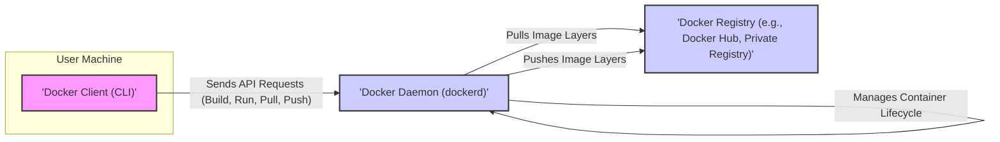

# Project Design Document: Docker

**Version:** 1.1
**Date:** October 26, 2023
**Author:** AI Software Architect

## 1. Introduction

This document provides an enhanced design overview of the Docker project, with a specific focus on architectural details relevant to threat modeling. It builds upon the previous version by providing more granular information about component interactions, data flows, and security considerations. The aim is to create a robust foundation for identifying potential security vulnerabilities and attack vectors within the Docker ecosystem.

## 2. Goals and Objectives

The core goals and objectives of Docker remain focused on streamlining application development, deployment, and execution through containerization. Key objectives include:

* **Robust Application Isolation:** Ensuring strong isolation between applications and their dependencies to prevent interference and enhance security.
* **Cross-Environment Portability:** Facilitating consistent application behavior across diverse infrastructure landscapes, from local machines to cloud environments.
* **Efficient Resource Utilization:** Optimizing the use of system resources by leveraging shared kernel capabilities.
* **Simplified and Accelerated Deployment Cycles:** Making application packaging and deployment faster and more manageable.
* **Infrastructure as Code through Dockerfiles:** Enabling declarative configuration and version control for application environments.

## 3. High-Level Architecture

The Docker architecture maintains its client-server structure, with the Docker client interacting with the Docker daemon to manage containers. Docker images serve as the immutable building blocks for these containers. The interaction with container registries is crucial for image distribution and management.

## 4. Detailed Component Breakdown

This section provides a more detailed breakdown of the Docker components, emphasizing aspects relevant to security and potential attack surfaces.

### 4.1. Docker Client (CLI)

* **Description:** The command-line interface used by users to interact with the Docker daemon. This is a primary entry point for user commands and potential malicious input.
* **Functionality:**
    * **Command Submission:**  Sends commands to the Docker daemon via a REST API. Input validation on the client side is minimal, making the daemon the primary point for security checks.
    * **Registry Authentication:** Handles user credentials for accessing private registries. Secure storage and transmission of these credentials are vital.
    * **Context Management:** Allows switching between different Docker environments, potentially exposing different sets of resources.
* **Key Interactions:** Communicates with the Docker daemon over a local Unix socket (default) or a TCP port. The security of this communication channel is important.

### 4.2. Docker Daemon (dockerd)

* **Description:** The central component responsible for building, running, and managing containers. It operates with elevated privileges and is a critical security boundary.
* **Functionality:**
    * **Image Building:** Executes instructions from Dockerfiles, which can include arbitrary commands. Insecure Dockerfile practices can introduce vulnerabilities.
    * **Image Management:** Pulls and pushes images from/to registries. Verification of image integrity and authenticity is crucial.
    * **Container Lifecycle Management:** Creates, starts, stops, and manages containers. Resource isolation and security policies are enforced during this process.
    * **Networking:** Configures and manages container networking, including port mappings and network policies. Misconfigurations can lead to security breaches.
    * **Storage Management:** Manages image layers and container volumes. Permissions and access control for storage are important.
    * **API Endpoint:** Exposes a REST API for communication with the client and potentially other services. Securing this API is paramount.
    * **Security Feature Enforcement:** Implements security features like namespaces, cgroups, seccomp, and AppArmor/SELinux profiles.
* **Key Interactions:**
    * **Operating System Kernel:** Relies on kernel features for container isolation. Vulnerabilities in the kernel can impact container security.
    * **Container Registries:** Communicates to retrieve and store images. Secure communication channels (TLS) are essential.
    * **Storage Drivers:** Interacts with storage drivers to manage image layers and volumes.
    * **Networking Subsystem:** Manages network interfaces and routing for containers.

### 4.3. Docker Images

* **Description:** Read-only templates that define the environment and application to be run in a container. Image content is a significant security concern.
* **Functionality:**
    * **Container Blueprint:** Serves as the basis for creating container instances.
    * **Layered Filesystem:** Consists of read-only layers, allowing for efficient storage and sharing. Vulnerabilities in base images propagate to dependent images.
    * **Metadata:** Contains information about the image, including its creator, dependencies, and entry point. This metadata can be a target for manipulation.
* **Key Characteristics:**
    * **Immutability:** Once built, image layers are generally immutable.
    * **Versioning and Tagging:** Images are identified by names and tags, allowing for version control.
    * **Registry Storage:** Stored in Docker registries.

### 4.4. Docker Containers

* **Description:** Runnable instances of Docker images, providing isolated environments for applications. Container runtime security is critical.
* **Functionality:**
    * **Application Execution:** Runs the application defined in the image.
    * **Resource Isolation:** Utilizes kernel namespaces and cgroups to isolate processes, network, and filesystem.
    * **Network Exposure:** Can expose ports to the host or other networks.
    * **Volume Mounting:** Can mount volumes for persistent data storage. Incorrectly configured volumes can bypass isolation.
* **Key Characteristics:**
    * **Ephemeral Nature:** Changes within a container are typically not persistent unless written to a volume.
    * **Isolation Boundaries:**  Isolation is provided by the underlying operating system kernel.

### 4.5. Docker Registries

* **Description:** Repositories for storing and distributing Docker images. Registry security is vital for preventing the spread of malicious images.
* **Functionality:**
    * **Image Storage and Management:** Stores and organizes Docker images.
    * **Authentication and Authorization:** Controls access to images. Weak access controls can lead to unauthorized access or modification.
    * **Image Signing and Verification:**  Mechanisms for ensuring image integrity and authenticity (Docker Content Trust).
    * **Vulnerability Scanning:** Some registries offer vulnerability scanning of stored images.
* **Examples:**
    * Docker Hub (public).
    * Private registries (self-hosted or cloud-based).
* **Key Interactions:**
    * **Docker Daemon:** Pulls and pushes images. Secure communication is essential.
    * **Users/Clients:** Authenticate to access and manage images.

### 4.6. Docker Networking

* **Description:** Manages network connectivity for containers, enabling communication between containers and the outside world. Network configurations are a significant attack vector.
* **Functionality:**
    * **Network Creation and Management:**  Allows defining isolated networks for containers.
    * **Inter-Container Communication:** Enables communication between containers on the same network.
    * **Port Mapping:** Exposes container ports to the host or external networks. Incorrect port mappings can expose services unintentionally.
    * **DNS Resolution:** Provides DNS resolution for containers.
    * **Network Policy Enforcement:** Allows defining rules for network traffic between containers.
* **Key Components:**
    * **Bridge Networks:** Default network type, providing isolation.
    * **Host Networks:** Bypasses container network isolation, using the host's network directly. This can have security implications.
    * **Overlay Networks:** Enables multi-host container networking.
    * **Macvlan Networks:** Assigns MAC addresses to container interfaces.

### 4.7. Docker Storage

* **Description:** Manages how data is stored and accessed by containers. Storage misconfigurations can lead to data leaks or corruption.
* **Functionality:**
    * **Image Layer Management:**  Manages the read-only layers of Docker images.
    * **Container Layer Management:** Manages the writable layer of a container.
    * **Volume Management:** Provides persistent storage for containers. Permissions and access control for volumes are critical.
    * **Bind Mount Management:** Allows mounting host directories into containers. This can bypass container isolation if not managed carefully.
    * **tmpfs Mount Management:**  Uses in-memory storage for containers.
* **Key Components:**
    * **Image Layers:** Read-only, shared across containers using the same image.
    * **Container Layer:** Writable, specific to each container instance.
    * **Volumes:**  Managed by Docker, offering data persistence.
    * **Bind Mounts:** Direct access to the host filesystem.
    * **tmpfs Mounts:**  Data is not persisted across container restarts.

## 5. Data Flow with Security Considerations

This section details key data flows, highlighting potential security implications at each stage.

* **Pulling an Image:**
    1. **Docker Client -> Docker Daemon (API Request):**  The client requests an image pull. *Potential threat: Malicious client could request unintended images, potentially leading to denial of service or resource exhaustion.*
    2. **Docker Daemon -> Docker Registry (Authentication):** The daemon authenticates with the registry. *Potential threat: Compromised credentials could allow unauthorized access to the registry.*
    3. **Docker Daemon <-> Docker Registry (Image Layer Transfer):** Image layers are downloaded. *Potential threat: Man-in-the-middle attacks could inject malicious layers if TLS is not enforced or compromised. Unsigned images pose a risk.*
    4. **Docker Daemon (Local Storage):** Image layers are stored locally. *Potential threat:  If local storage is compromised, malicious layers could be introduced.*

* **Running a Container:**
    1. **Docker Client -> Docker Daemon (API Request):** The client requests to run a container from an image. *Potential threat:  Malicious clients could specify vulnerable images or configurations.*
    2. **Docker Daemon (Image Retrieval):** The daemon retrieves the necessary image layers.
    3. **Docker Daemon (Resource Allocation):** Resources (CPU, memory, network) are allocated. *Potential threat: Resource exhaustion attacks could be launched by requesting excessive resources.*
    4. **Docker Daemon (Container Creation & Startup):** The container is created and the application starts. *Potential threat: Vulnerabilities in the image or the container runtime environment could be exploited.*

* **Building an Image:**
    1. **Docker Client -> Docker Daemon (API Request with Dockerfile):** The client sends a build request with a Dockerfile. *Potential threat: Malicious Dockerfiles can contain commands that compromise the build environment or create vulnerable images.*
    2. **Docker Daemon (Dockerfile Processing):** The daemon executes instructions in the Dockerfile. *Potential threat:  Insecure commands in the Dockerfile (e.g., downloading from untrusted sources, running with excessive privileges) can introduce vulnerabilities.*
    3. **Docker Daemon (Image Layer Creation):** Each instruction creates a new image layer.
    4. **Docker Daemon -> Docker Registry (Push - optional):** The built image can be pushed to a registry. *Potential threat: Pushing to an insecure or compromised registry exposes the image to potential tampering.*

* **Inter-Container Communication:**
    1. **Source Container -> Docker Network -> Destination Container:** Containers communicate over Docker networks. *Potential threat:  Lack of network segmentation or improperly configured network policies can allow unauthorized communication between containers.*

## 6. Security Considerations (Enhanced)

This section expands on the security features and potential vulnerabilities within the Docker ecosystem.

* **Kernel Namespaces:** Provide fundamental isolation but are dependent on the underlying kernel's security. *Potential vulnerability: Kernel exploits could break out of namespace isolation.*
* **Control Groups (cgroups):** Limit resource usage but do not provide security isolation themselves. *Potential vulnerability: Misconfigured cgroups might not prevent resource exhaustion effectively.*
* **Seccomp Profiles:** Restrict system calls, reducing the attack surface. *Potential vulnerability:  Insufficiently restrictive profiles might still allow dangerous system calls. Custom profiles need careful auditing.*
* **AppArmor/SELinux Profiles:** Provide mandatory access control. *Potential vulnerability:  Incorrectly configured profiles can either be too permissive or break container functionality.*
* **User Namespaces:** Map user IDs inside the container to different IDs on the host. *Potential vulnerability: Complex configuration can be error-prone. Rootless Docker aims to improve security here.*
* **Docker Content Trust:** Uses digital signatures for image verification. *Potential vulnerability: Requires proper key management and adoption across the ecosystem.*
* **Image Scanning:** Identifies known vulnerabilities in images. *Potential vulnerability: Only detects known vulnerabilities; zero-day exploits remain a risk. The frequency and comprehensiveness of scanning are important.*
* **Network Policies:** Control network traffic. *Potential vulnerability:  Complex policies can be difficult to manage and verify. Default-allow policies can be insecure.*
* **Secrets Management:** Securely manages sensitive data. *Potential vulnerability: Improper storage or transmission of secrets can lead to compromise.*
* **Docker API Security:** Securing access to the Docker daemon API is critical. *Potential vulnerability: Unprotected API endpoints can allow unauthorized container management.*

## 7. Deployment Model Security Implications

The deployment model significantly impacts the security posture of a Docker environment.

* **Local Development (Docker Desktop):**  Relies on the security of the host operating system. Privilege escalation vulnerabilities in Docker Desktop could compromise the host.
* **On-Premises Servers:** Requires careful management of the Docker daemon and host OS security. Physical security of the servers is also a factor.
* **Cloud Environments (Managed Services):** Security is a shared responsibility. The cloud provider manages the underlying infrastructure, but users are responsible for container and application security. Misconfigurations in cloud IAM policies can be a risk.
* **Orchestration Platforms (e.g., Kubernetes):** Introduces additional layers of complexity and security considerations. Security of the orchestration platform itself is paramount. RBAC and network policies within the orchestrator are crucial.

## 8. Assumptions and Constraints

* **Secure Host Operating System:** The underlying host OS is assumed to be secure, patched, and hardened.
* **Secure Registry Infrastructure:** Docker registries are assumed to be secure and protected against unauthorized access and tampering.
* **Secure Configuration Practices:** Docker Engine and related components are configured according to security best practices.
* **Principle of Least Privilege:** User access and container privileges are managed according to the principle of least privilege.
* **Network Segmentation:** Network configurations are designed to segment container traffic and limit the blast radius of potential breaches.

## 9. Out of Scope

This document focuses on the core Docker Engine and its immediate components. The following are explicitly excluded:

* **Detailed Design of Specific Containerized Applications:** The internal workings and security of applications running within containers are not covered.
* **Third-Party Tools and Extensions:**  Specific tools built on top of Docker are not within the scope.
* **Specific Cloud Provider Implementations in Detail:** While deployment models are discussed, the intricate details of how each cloud provider implements Docker services are excluded.
* **Container Orchestration Platform Internals:**  The detailed architecture and security mechanisms of orchestration platforms like Kubernetes are not covered here.
* **Detailed Code-Level Analysis:** This document provides an architectural overview, not a code-level security audit.

This enhanced design document provides a more detailed and security-focused view of the Docker project, intended to be a valuable resource for threat modeling activities. By understanding the intricacies of the architecture and potential vulnerabilities, security professionals can develop more effective strategies for mitigating risks.