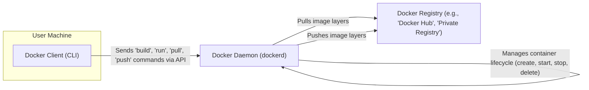

# Project Design Document: Docker

**Version:** 1.1
**Date:** October 26, 2023
**Author:** AI Software Architect

## 1. Introduction

This document provides an enhanced and detailed design overview of the Docker project, with a specific focus on architectural elements relevant to threat modeling. It elaborates on the components, interactions, and data flows within the Docker ecosystem to facilitate a comprehensive understanding of potential security vulnerabilities and attack vectors. This document builds upon the previous version by providing more granular details and clarifications.

## 2. Goals and Objectives

The fundamental goal of Docker remains to offer a platform for the efficient development, distribution, and execution of applications within isolated containers. Key objectives, with added detail, include:

*   **Enhanced Application Isolation:**  Providing robust isolation of applications and their complete dependency sets, preventing conflicts between applications and ensuring consistent runtime behavior across diverse environments. This isolation leverages kernel namespaces and cgroups.
*   **Cross-Environment Portability:**  Enabling seamless application deployment and execution across various infrastructure landscapes, including developer laptops, testing environments, on-premises servers, and cloud platforms, minimizing environment-specific issues.
*   **Optimized Resource Utilization:**  Achieving higher resource efficiency by allowing containers to share the host operating system kernel, reducing overhead compared to traditional virtual machines. Resource limits can be enforced using cgroups.
*   **Simplified and Accelerated Deployment Pipelines:**  Streamlining the application packaging and deployment process through containerization, leading to faster release cycles and improved consistency. Dockerfiles enable infrastructure-as-code principles.
*   **Infrastructure Version Control and Reproducibility:**  Treating application environments as code through the use of Dockerfiles, enabling version control, reproducibility, and easier rollback capabilities for infrastructure changes.

## 3. High-Level Architecture

The Docker architecture adheres to a client-server model, where the Docker client initiates actions that are executed by the Docker daemon. Docker images serve as the immutable blueprints for creating container instances. The Docker Registry acts as a centralized repository for storing and distributing these images.

## 4. Detailed Component Breakdown

This section provides a more in-depth look at the core components of the Docker system and their respective functionalities.

### 4.1. Docker Client (CLI)

*   **Description:** The command-line interface (CLI) is the primary tool for users to interact with the Docker daemon. It translates user commands into API requests.
*   **Functionality:**
    *   **Command Submission:**  Sending commands to the Docker daemon via a REST API to perform actions such as building images (`docker build`), running containers (`docker run`), pulling images (`docker pull`), and pushing images (`docker push`).
    *   **Registry Authentication:** Handling user authentication credentials for accessing private Docker registries.
    *   **Configuration Management:**  Allowing users to configure Docker client settings, such as registry mirrors and authentication details.
*   **Key Interactions:** Communicates with the Docker daemon over a REST API, typically via a Unix socket (`/var/run/docker.sock`) or a TCP port (if configured). This communication can be secured using TLS.

### 4.2. Docker Daemon (dockerd)

*   **Description:** The core background service (daemon) responsible for the heavy lifting of building, running, and managing Docker containers. It listens for API requests from the Docker client.
*   **Functionality:**
    *   **API Request Handling:** Receiving and processing requests from the Docker client.
    *   **Image Building:** Constructing Docker images from Dockerfiles, executing the instructions defined within them layer by layer.
    *   **Image Management:** Pulling images from and pushing images to configured Docker registries.
    *   **Container Lifecycle Management:** Creating, starting, stopping, pausing, resuming, and deleting containers.
    *   **Resource Management:** Allocating and managing resources (CPU, memory, network, storage) for containers, often leveraging cgroups for enforcement.
    *   **Networking Management:** Setting up and managing container networks, including bridge, host, and overlay networks.
    *   **Storage Management:** Managing image layers and container storage using configured storage drivers (e.g., overlay2, aufs).
    *   **Security Enforcement:** Enforcing security policies and resource constraints defined for containers, including the use of namespaces, cgroups, seccomp profiles, and AppArmor/SELinux profiles.
*   **Key Interactions:**
    *   **Operating System Kernel:** Interacts directly with the operating system kernel to leverage features like namespaces and cgroups for container isolation and resource management.
    *   **Container Registries:** Communicates with container registries over HTTPS to retrieve and store Docker images, handling authentication and authorization.
    *   **Storage Drivers:** Utilizes storage drivers to manage the storage of image layers and container data on the host filesystem.
    *   **Networking Subsystem:** Interacts with the host's networking stack to create and manage virtual network interfaces and routing for containers.

### 4.3. Docker Images

*   **Description:** Immutable, read-only templates that serve as the foundation for creating Docker containers. They encapsulate the application code, runtime environment, libraries, dependencies, and system tools required to run an application.
*   **Functionality:**
    *   **Container Blueprint:** Acting as the blueprint for instantiating containers, defining the initial state of the container's filesystem and runtime environment.
    *   **Layered Storage:** Storing application code and dependencies in a layered filesystem, where each layer represents a set of changes. This promotes efficient storage and sharing of common components.
    *   **Filesystem Definition:** Defining the initial filesystem structure within the container.
    *   **Entry Point Specification:** Specifying the command or executable that will be run when a container is started from the image.
*   **Key Characteristics:**
    *   **Layered Architecture:** Built in layers, enabling efficient storage by sharing layers between images and optimizing image distribution.
    *   **Identification:** Identified by a name and tag (e.g., `nginx:latest`, `my-app:v1.0`).
    *   **Registry Storage:** Stored and distributed through Docker registries.

### 4.4. Docker Containers

*   **Description:** Runnable instances of Docker images. They provide an isolated and consistent environment for executing applications. Multiple containers can be created from the same image.
*   **Functionality:**
    *   **Application Execution:** Running the application defined within the Docker image.
    *   **Resource Isolation:** Providing process and filesystem isolation from the host operating system and other containers through the use of namespaces.
    *   **Resource Utilization:** Utilizing CPU, memory, and other resources allocated by the Docker daemon, with limits potentially enforced by cgroups.
    *   **Network Exposure:** Exposing network ports to allow communication with the container from the host or external networks.
    *   **Data Persistence:** Mounting volumes to provide persistent storage for container data that survives container restarts or deletions.
*   **Key Characteristics:**
    *   **Ephemeral Nature (by default):** Changes made within a container are not persisted unless explicitly written to a volume or bind mount.
    *   **Isolation Mechanisms:** Isolated using kernel features like namespaces (PID, network, mount, IPC, UTS, user) and cgroups.

### 4.5. Docker Registries

*   **Description:** Centralized repositories for storing and distributing Docker images. They facilitate sharing and versioning of container images.
*   **Functionality:**
    *   **Image Storage and Management:** Storing and managing Docker images, including different versions (tags) of the same image.
    *   **Authentication and Authorization:** Providing mechanisms for controlling access to images, requiring authentication for pulling or pushing images, especially for private registries.
    *   **Image Tagging and Versioning:** Supporting tagging of images to represent different versions or variations.
    *   **Search and Discovery:** Offering features to search for and discover available images (primarily in public registries).
*   **Examples:**
    *   **Docker Hub:** The default public registry provided by Docker.
    *   **Private Registries:** Self-hosted or cloud-based registries for storing proprietary or sensitive images. Examples include Harbor, GitLab Container Registry, and cloud provider offerings.
*   **Key Interactions:**
    *   **Docker Daemon (Pull):** The Docker daemon pulls image layers from registries over HTTPS.
    *   **Docker Daemon (Push):** The Docker daemon pushes image layers to registries over HTTPS.
    *   **Docker Client:** The Docker client can authenticate with registries to enable pull and push operations.

### 4.6. Docker Networking

*   **Description:** Manages network connectivity for Docker containers, enabling communication between containers and with the external world.
*   **Functionality:**
    *   **Network Creation:** Creating isolated networks for containers to reside in.
    *   **Inter-Container Communication:** Enabling communication between containers within the same network.
    *   **Port Mapping:** Exposing container ports to the host or external networks by mapping host ports to container ports.
    *   **DNS Resolution:** Providing DNS resolution for containers within a network.
*   **Key Components:**
    *   **Bridge Network:** The default network, creating a private internal network for containers on the same host.
    *   **Host Network:** Bypasses container network isolation, allowing the container to directly use the host's network namespace.
    *   **Overlay Network:** Enables communication between containers running on different Docker hosts, often used in Swarm or Kubernetes environments.
    *   **Macvlan Network:** Assigns a MAC address to a container's virtual network interface, making it appear as a physical device on the network.

### 4.7. Docker Storage

*   **Description:** Manages how data is stored and accessed by Docker containers, encompassing both image layers and persistent data.
*   **Functionality:**
    *   **Image Layer Management:** Managing the read-only layers of Docker images.
    *   **Persistent Data Storage:** Providing mechanisms for storing data that persists beyond the lifecycle of a container.
*   **Key Components:**
    *   **Image Layers:** Read-only layers that form the basis of a container's filesystem. Changes in subsequent layers are stored as diffs.
    *   **Container Layer (Thin Writable Layer):** A thin, writable layer added on top of the image layers when a container is created. Changes made inside the container are stored in this layer. This layer is deleted when the container is removed (unless volumes are used).
    *   **Volumes:** The preferred mechanism for persisting data. Volumes are managed by Docker and are independent of the container lifecycle. They can be shared between containers.
    *   **Bind Mounts:** Allow mounting a file or directory from the host machine into a container. Changes made in the container are reflected on the host, and vice versa.
    *   **tmpfs Mounts:** Mounts that reside in the host's system memory, offering fast but non-persistent storage.

## 5. Data Flow

This section details the typical data flow for common operations within the Docker system, providing a more granular breakdown:

*   **Pulling an Image:**
    1. The Docker client sends a `docker pull <image_name>:<tag>` command to the Docker daemon via the API.
    2. The Docker daemon checks its local image cache. If the image or layers are present, it may skip downloading.
    3. If the image or layers are not present, the Docker daemon authenticates with the specified registry (or the default registry if none is specified) using configured credentials.
    4. Upon successful authentication, the Docker daemon requests the image manifest from the registry. The manifest describes the image layers.
    5. The Docker daemon downloads the required image layers from the registry over HTTPS. Each layer is a compressed archive.
    6. The Docker daemon decompresses and stores the downloaded image layers locally in the Docker storage directory.

*   **Running a Container:**
    1. The Docker client sends a `docker run <image_name>:<tag>` command (along with other configurations like port mappings, volume mounts, etc.) to the Docker daemon.
    2. The Docker daemon checks if the specified image is present locally. If not, it initiates an image pull.
    3. The Docker daemon creates a new container based on the specified image. This involves creating a new network namespace, PID namespace, etc., for isolation.
    4. The Docker daemon allocates resources (CPU shares, memory limits, etc.) for the container based on configuration or defaults.
    5. A writable container layer is created on top of the image layers.
    6. If volumes or bind mounts are specified, they are mounted into the container's filesystem.
    7. The Docker daemon starts the process defined in the image's `ENTRYPOINT` or `CMD`.

*   **Building an Image:**
    1. The Docker client sends a `docker build -t <image_name>:<tag> <path_to_dockerfile>` command to the Docker daemon.
    2. The Docker daemon reads the `Dockerfile` from the specified path.
    3. The Docker daemon executes each instruction in the `Dockerfile` sequentially. Each instruction typically results in a new image layer.
    4. Instructions like `FROM` specify the base image. Instructions like `COPY`, `ADD`, `RUN` modify the filesystem and create new layers.
    5. The Docker daemon caches intermediate layers to speed up subsequent builds.
    6. Once all instructions are executed, the Docker daemon creates a final image with the specified name and tag.

*   **Pushing an Image:**
    1. The Docker client sends a `docker push <image_name>:<tag>` command to the Docker daemon.
    2. The Docker daemon authenticates with the target registry using configured credentials.
    3. The Docker daemon uploads the image layers to the registry over HTTPS. Only layers that are not already present in the registry need to be uploaded.
    4. The Docker daemon uploads the image manifest, which describes the layers of the image.

## 6. Security Considerations

Docker incorporates several security features and considerations, but also presents potential vulnerabilities if not configured and used correctly:

*   **Namespaces:** Provide a fundamental level of isolation, but vulnerabilities in the kernel or namespace implementation could lead to escapes.
*   **Control Groups (cgroups):** Limit resource usage, preventing denial-of-service attacks from within containers. However, misconfigurations can lead to resource starvation.
*   **Seccomp (Secure Computing Mode):** Restricts system calls, reducing the attack surface. Custom seccomp profiles should be carefully crafted to avoid breaking container functionality.
*   **AppArmor/SELinux:** Mandatory access control systems that can enforce stricter security policies on containers. Requires proper configuration and understanding.
*   **User Namespaces:** Map user IDs inside the container to non-privileged user IDs on the host, mitigating privilege escalation risks. Requires careful consideration of file ownership and permissions.
*   **Content Trust (Docker Content Trust):** Uses digital signatures to verify the publisher and integrity of images. Requires enabling and proper key management.
*   **Image Scanning:** Tools like Trivy or Clair can scan images for known vulnerabilities in their software dependencies. Integrating scanning into CI/CD pipelines is crucial.
*   **Network Policies:** Control network traffic between containers, limiting lateral movement of attackers.
*   **Secrets Management:** Docker Secrets provide a way to securely manage sensitive information, avoiding hardcoding secrets in images or environment variables.
*   **Daemon Security:** Securing the Docker daemon itself is paramount. This includes restricting access to the Docker socket, using TLS for API communication, and regularly patching the Docker Engine.
*   **Registry Security:** Ensuring the security of Docker registries is critical to prevent the distribution of malicious images. This includes access control, vulnerability scanning, and secure storage.
*   **Kernel Vulnerabilities:** Containers share the host kernel, so vulnerabilities in the kernel can potentially affect all containers. Keeping the host kernel updated is essential.

## 7. Deployment Model

Docker's flexibility allows for diverse deployment models:

*   **Local Development (Docker Desktop):** Running Docker Engine on developer workstations (macOS, Windows, Linux) for local development and testing.
*   **On-Premises Servers (Bare Metal or VMs):** Deploying Docker Engine directly on physical servers or virtual machines within a private data center. Requires manual setup and management.
*   **Cloud Environments (IaaS):** Installing Docker Engine on virtual machines provided by cloud providers (e.g., AWS EC2, Azure VMs, Google Compute Engine). Offers more control but requires managing the underlying infrastructure.
*   **Managed Container Services (PaaS/CaaS):** Utilizing managed container services like Amazon ECS, Azure Container Instances, Google Kubernetes Engine (GKE), which abstract away much of the infrastructure management.
*   **Container Orchestration Platforms (e.g., Kubernetes, Docker Swarm):** Deploying and managing multi-container applications at scale using orchestration platforms. Docker is a common runtime for these platforms.

## 8. Assumptions and Constraints

*   **Secure Host Operating System:** The underlying host operating system is assumed to be properly secured, patched against known vulnerabilities, and hardened according to security best practices.
*   **Secure Registry Infrastructure:** The security of Docker registries (both public and private) is paramount. It's assumed that registries have appropriate access controls, vulnerability scanning, and secure storage mechanisms in place.
*   **Secure Configuration of Docker Engine:** It is assumed that the Docker Engine and related components are configured securely, following security best practices, including TLS for API communication and restricted access to the Docker socket.
*   **Proper User Permissions and Access Control:** User access to the Docker CLI and daemon is appropriately managed using role-based access control (RBAC) or similar mechanisms.
*   **Secure Network Configuration:** Network configurations and firewalls are in place to protect Docker environments, limiting unnecessary network exposure and controlling traffic flow.
*   **Regular Security Audits and Vulnerability Scanning:** It is assumed that regular security audits and vulnerability scanning are performed on both the Docker infrastructure and the container images.

## 9. Out of Scope

This document focuses on the core Docker Engine and its immediate components. The following are explicitly considered out of scope:

*   **Detailed Design of Container Orchestration Platforms (e.g., Kubernetes, Docker Swarm):** While Docker is a fundamental component, the internal design and security of these orchestration platforms are not covered here.
*   **Specific Security Policies and Procedures:** This document outlines architectural components, not specific organizational security policies or incident response procedures.
*   **Detailed Design of Specific Containerized Applications:** The internal architecture and security of individual applications running within Docker containers are outside the scope.
*   **Third-Party Docker Tools and Extensions:** The focus is on the core Docker project maintained by Docker, Inc., not on external tools or plugins.
*   **Specific Cloud Provider Implementations in Detail:** While cloud deployment is mentioned, the specific implementation details and security features of individual cloud providers' container services are not exhaustively covered.

This enhanced design document provides a more detailed and nuanced understanding of the Docker project's architecture, crucial for conducting thorough threat modeling activities. By elaborating on components, interactions, and data flows, it aims to facilitate the identification of a wider range of potential security vulnerabilities and inform the development of effective mitigation strategies.
