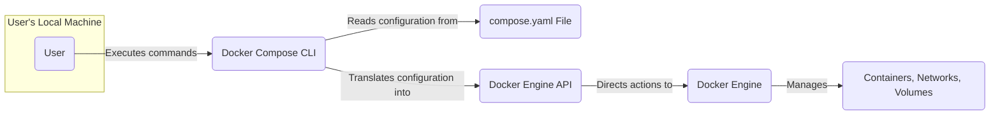
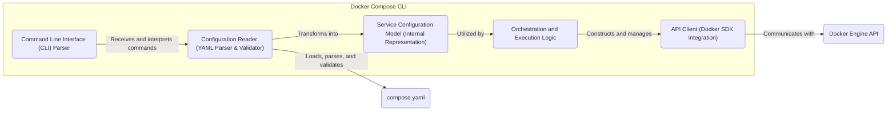

# Project Design Document: Docker Compose (Improved)

**Version:** 1.1
**Date:** October 26, 2023
**Author:** AI Architecture Expert

## 1. Introduction

### 1.1. Project Overview

Docker Compose is a pivotal tool designed to streamline the definition and execution of multi-container Docker applications. By leveraging a declarative YAML configuration file (`compose.yaml`), it simplifies the orchestration of interconnected services, networks, and volumes. A single command initiates and manages the entire application stack. Its widespread adoption spans development, testing, and staging environments, significantly reducing the complexity of managing interdependent application components. This document details the architectural blueprint of Docker Compose, laying the groundwork for comprehensive threat modeling.

### 1.2. Goals

*   Articulate a clear and detailed architectural overview of the Docker Compose system.
*   Precisely identify the core components of Docker Compose and elucidate their interactions.
*   Thoroughly describe the flow of data and control within the system.
*   Enumerate the key technologies and dependencies that underpin Docker Compose.
*   Establish a solid foundation for identifying potential security weaknesses and vulnerabilities during subsequent threat modeling activities.

### 1.3. Scope

This document specifically focuses on the internal architecture of the `docker compose` command-line interface (CLI) and its communication pathways with the Docker Engine. It encompasses the complete process, starting from parsing the `compose.yaml` file to the translation of its contents into actionable Docker API calls, and ultimately, the management of the lifecycle of the defined services. The internal workings and security mechanisms of the Docker Engine itself are considered to be out of scope for this document.

## 2. System Architecture

### 2.1. High-Level Architecture

*   **User:** The entity (developer, operator, or automated system) that interacts with the Docker Compose tool to manage multi-container applications.
*   **Docker Compose CLI:** The executable command-line interface. It acts as the central orchestrator, interpreting the `compose.yaml` file and translating its directives into interactions with the Docker Engine.
*   **compose.yaml File:** The human-readable YAML file that declaratively defines the services, networks, volumes, and their configurations for the multi-container application.
*   **Docker Engine API:** The programmatic interface exposed by the Docker Engine, allowing external tools like Docker Compose to control and manage Docker resources (images, containers, networks, volumes).
*   **Docker Engine:** The core runtime environment responsible for building, running, and managing containerized applications. It receives instructions from the Docker Compose CLI via the API.
*   **Containers, Networks, Volumes:** The tangible outcomes of the Docker Compose orchestration – running instances of the application components (containers), their isolated network configurations, and persistent data storage locations.

### 2.2. Detailed Component Architecture

*   **Command Line Interface (CLI) Parser:** This component is responsible for processing commands entered by the user (e.g., `up`, `down`, `ps`). It parses the command and its associated flags and arguments, preparing the input for further processing.
*   **Configuration Reader (YAML Parser & Validator):** This module reads the `compose.yaml` file, parsing its YAML structure. It also performs validation to ensure the configuration adheres to the expected schema and constraints, identifying potential errors early in the process.
*   **Service Configuration Model (Internal Representation):**  After successful parsing and validation, the configuration from `compose.yaml` is transformed into an internal, object-oriented representation. This model holds the structured information about services, networks, volumes, and their dependencies, making it easier for the orchestration logic to work with.
*   **API Client (Docker SDK Integration):** Docker Compose leverages the official Docker SDK for Go to interact with the Docker Engine API. This component encapsulates the logic for constructing and sending HTTP requests to the Docker Engine, handling authentication and error responses.
*   **Orchestration and Execution Logic:** This is the core of Docker Compose. It takes the service configuration model and the user's command as input and determines the sequence of Docker API calls required to achieve the desired state. This includes logic for creating networks, building or pulling images, creating and starting containers, and managing their lifecycle.
*   **compose.yaml:** The external YAML file containing the declarative configuration of the multi-container application.
*   **Docker Engine API:** The target interface for the API calls generated by the Docker Compose CLI.

### 2.3. Data Flow

The typical sequence of actions when starting a Docker Compose application is as follows:

1. **User Input:** The user initiates an operation by executing a `docker compose` command (e.g., `docker compose up`).
2. **Command Parsing:** The `Command Line Interface (CLI) Parser` within the Docker Compose CLI receives and interprets the user's command and any provided options.
3. **Configuration Loading and Validation:** The `Configuration Reader (YAML Parser & Validator)` loads the `compose.yaml` file from the current directory (or a specified path). It parses the YAML and validates its structure and content against the expected schema.
4. **Model Creation:** The validated configuration is then transformed into the `Service Configuration Model`, an in-memory representation of the application's services, networks, and volumes.
5. **API Call Generation:** The `Orchestration and Execution Logic` analyzes the user's command and the service configuration model. Based on this information, it determines the necessary sequence of calls to the Docker Engine API to achieve the desired state (e.g., creating networks, pulling images, creating containers, starting containers).
6. **API Communication:** The `API Client (Docker SDK Integration)` constructs and sends the generated API requests to the Docker Engine via HTTP. This involves handling authentication and potentially retries.
7. **Docker Engine Execution:** The Docker Engine receives the API calls and executes the corresponding actions, such as pulling container images, creating and configuring networks and volumes, and launching containers.
8. **Status Reporting:** The Docker Engine sends responses back to the Docker Compose CLI via the API, indicating the success or failure of each operation.
9. **User Feedback:** The Docker Compose CLI processes the responses from the Docker Engine and provides feedback to the user on the progress and outcome of the requested operation.

## 3. Technology Stack

*   **Primary Programming Language:** Go (Golang)
*   **Configuration Definition Language:** YAML (for `compose.yaml` files)
*   **Docker Engine API Interaction Library:** Docker SDK for Go (likely utilizing packages under `github.com/docker/docker/client`)
*   **YAML Parsing and Validation Library:**  Standard Go YAML libraries (e.g., `gopkg.in/yaml.v3`) are typically employed.
*   **Command Line Interface Framework:**  Libraries like `spf13/cobra` are often used for structuring and parsing command-line arguments and options.
*   **Supported Operating Systems:** Docker Compose is designed to be cross-platform, running on any operating system that supports the Docker Engine (including Linux, macOS, and Windows).

## 4. Security Considerations (Initial)

These initial security considerations will serve as a starting point for a more in-depth threat modeling exercise.

*   **Security of the `compose.yaml` File:**
    *   **Secret Management:** Sensitive credentials (passwords, API keys, tokens) might be inadvertently stored directly within the `compose.yaml` file, leading to exposure. Secure secret management practices should be enforced.
    *   **File Tampering:** Unauthorized modification of the `compose.yaml` file could lead to the deployment of compromised or malicious containers. File system permissions and integrity checks are important.
    *   **Access Control:** Restricting access to the `compose.yaml` file to authorized personnel is crucial to prevent unauthorized changes.
*   **Interaction with the Docker Engine:**
    *   **Docker Engine Security:** Docker Compose relies on the underlying security of the Docker Engine. Vulnerabilities in the Docker Engine itself could be exploited through Docker Compose. Regular updates and security audits of the Docker Engine are necessary.
    *   **User Permissions:** The permissions of the user executing `docker compose` commands directly impact the actions that can be performed on the Docker Engine. Least privilege principles should be applied.
    *   **API Security:** Communication with the Docker Engine API should be secured (e.g., using TLS). Misconfigurations in the Docker Engine API could be exploited.
*   **Dependency and Supply Chain Security:**
    *   **Third-Party Libraries:** Vulnerabilities in the Go libraries and dependencies used by Docker Compose could introduce security risks. Regular dependency scanning and updates are essential.
    *   **Binary Integrity:** Ensuring the integrity and authenticity of the Docker Compose binary itself is important to prevent the execution of malicious code.
*   **Network Configuration Security:**
    *   **Network Segmentation:** Improper network configurations defined in `compose.yaml` could lead to unintended network exposure and security breaches.
    *   **Port Exposure:**  Careful consideration should be given to which container ports are exposed to the host or external networks.
*   **Volume Security:**
    *   **Data at Rest:** Sensitive data stored in volumes might require encryption and appropriate access controls.
    *   **Volume Permissions:**  Incorrectly configured volume permissions could allow unauthorized access to sensitive data.
*   **Authentication and Authorization:**
    *   **Docker Registry Credentials:** Securely managing credentials for accessing private Docker registries is important.
    *   **Access Control for Compose Operations:** Mechanisms to control who can execute Docker Compose commands and manage application deployments might be needed in certain environments.

## 5. Deployment and Usage

Docker Compose is typically deployed as a command-line tool installed on individual developer machines, build servers, or within CI/CD pipelines. The common usage pattern involves:

*   **Configuration File Creation:** Developers create a `compose.yaml` file defining their multi-container application within the project's root directory or a designated configuration directory.
*   **Command Execution:** Users execute `docker compose` commands from the command line within the directory containing the `compose.yaml` file. The CLI interacts with the Docker Engine configured on the local machine or a remote Docker host as defined by environment variables or context settings.
*   **Lifecycle Management:**  Commands such as `up`, `down`, `start`, `stop`, `restart`, and `ps` are used to manage the lifecycle of the application's services, networks, and volumes.

## 6. Future Considerations

*   **Enhanced Kubernetes Integration:**  Further development to improve compatibility and interoperability with Kubernetes and other container orchestration platforms.
*   **Graphical User Interface (GUI):** Exploration of a graphical interface to simplify the management and visualization of Docker Compose applications.
*   **Advanced Networking Capabilities:**  Expansion of networking features within `compose.yaml` to support more complex network topologies and configurations.
*   **Improved Secret Management Solutions:**  Integration with dedicated secret management tools and services to securely handle sensitive information within Docker Compose deployments.
*   **Policy Enforcement:**  Mechanisms to enforce predefined policies and constraints on Docker Compose configurations and deployments.

This improved design document provides a more detailed and structured overview of Docker Compose's architecture, offering a stronger foundation for conducting thorough threat modeling activities. The refined descriptions of components, data flow, and security considerations aim to facilitate a deeper understanding of potential vulnerabilities and inform the development of effective mitigation strategies.
