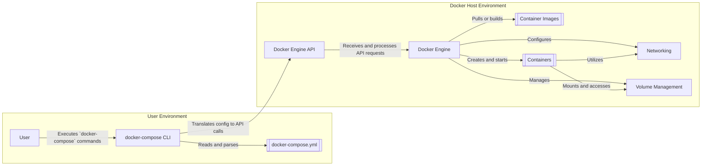

# Project Design Document: Docker Compose

**Version:** 1.1
**Date:** October 26, 2023
**Author:** AI Software Architect

## 1. Introduction

This document provides a detailed architectural design of the Docker Compose project, as found in the GitHub repository [https://github.com/docker/compose](https://github.com/docker/compose). This document is intended to serve as a foundation for subsequent threat modeling activities. It outlines the key components, their interactions, data flow, and potential security considerations in greater detail.

## 2. System Overview

Docker Compose is a powerful tool for defining and running complex, multi-container Docker applications. It leverages a declarative approach, using a YAML file (`docker-compose.yml`) to configure the application's various services, their networking configurations, and persistent data volumes. A single command from the `docker-compose` CLI orchestrates the creation and startup of all defined services, simplifying the management of interconnected containers. Compose is particularly valuable in development, testing, and staging environments, enabling consistent and reproducible application deployments.

## 3. Architectural Design

The architecture of Docker Compose centers around the interpretation of the `docker-compose.yml` file and subsequent interactions with the Docker Engine API. The following components are crucial to its operation:

*   **`docker-compose` CLI:** The primary interface for users to interact with Docker Compose. It accepts commands, parses the `docker-compose.yml` file, and translates the configuration into instructions for the Docker Engine. This component handles command-line argument parsing, configuration file loading, and communication with the Docker Engine API.
*   **`docker-compose.yml` File:**  A YAML-formatted file that serves as the declarative blueprint for the multi-container application. It defines individual services (containers), their respective images, port mappings, volume mounts, environment variables, dependencies between services, and network configurations.
*   **Configuration Parser & Validator:**  A module within the `docker-compose` CLI responsible for reading, parsing, and validating the syntax and semantics of the `docker-compose.yml` file. This ensures the configuration is well-formed and adheres to the expected schema before attempting to apply it.
*   **Docker Engine API Client:**  A component within the `docker-compose` CLI that implements the logic for communicating with the Docker Engine's RESTful API. It constructs and sends API requests based on the parsed `docker-compose.yml` configuration and user commands.
*   **Docker Engine:** The core container runtime environment responsible for managing the lifecycle of Docker containers. It receives instructions from the Docker Engine API to pull images, create containers, configure networking, manage volumes, and execute container processes.
*   **Networking Subsystem (Docker):** Docker's built-in networking capabilities, which Compose utilizes to create isolated networks for the application's services. This allows containers within the same Compose application to communicate with each other while providing isolation from other containers or the host network if desired.
*   **Volume Management Subsystem (Docker):** Docker's features for managing persistent data storage for containers. Compose leverages this to define and manage volumes that can be shared between containers or persist data beyond the lifecycle of individual containers.
*   **Container Images:**  Read-only templates used to create Docker containers. The `docker-compose.yml` file specifies which images to use for each service.
*   **Containers:**  Runnable instances of Docker images. Compose orchestrates the creation and management of these containers based on the configuration.

### 3.1. Component Diagram



### 3.2. Data Flow

The typical workflow of Docker Compose involves the following detailed data flow:

1. **User Interaction:** The user initiates an action by executing a `docker-compose` command (e.g., `up`, `down`, `start`, `stop`, `ps`) in their terminal or command prompt.
2. **CLI Invocation and Configuration Loading:** The `docker-compose` CLI application is invoked. It first attempts to locate and load the `docker-compose.yml` file (and potentially other related files like `docker-compose.override.yml`).
3. **Configuration Parsing and Validation:** The Configuration Parser within the CLI reads the contents of the `docker-compose.yml` file. It then performs syntactic and semantic validation to ensure the file is correctly formatted YAML and adheres to the expected schema for Docker Compose configurations. Errors during this phase are reported to the user.
4. **Translation to Docker Engine API Calls:**  Based on the parsed configuration and the user's command, the `docker-compose` CLI translates the desired state into a series of specific requests to the Docker Engine API. For example, `docker-compose up` might translate into API calls to pull images, create networks, create volumes, and create and start containers.
5. **Communication with Docker Engine API:** The Docker Engine API Client within the CLI establishes a connection with the Docker Engine API (typically over a local socket or a network connection). It then sends the formulated API requests to the Docker Engine. Authentication and authorization may be required for this communication.
6. **Docker Engine Processing:** The Docker Engine receives the API requests and processes them accordingly. This involves:
    *   **Image Management:** Pulling specified container images from configured registries or building images based on Dockerfiles defined in the `docker-compose.yml`.
    *   **Network Management:** Creating and configuring Docker networks as defined in the `docker-compose.yml`, ensuring isolation and connectivity between containers.
    *   **Volume Management:** Creating and mounting Docker volumes as specified, providing persistent storage for container data.
    *   **Container Management:** Creating container instances from the specified images, configuring resource limits, environment variables, port mappings, and starting the container processes.
7. **Resource Allocation and Execution:** The Docker Engine interacts with the underlying operating system kernel to allocate resources (CPU, memory, etc.) to the containers and manage their execution.
8. **Status Reporting:** The Docker Engine reports the status of the requested operations back to the `docker-compose` CLI via the API.
9. **User Feedback:** The `docker-compose` CLI receives the status updates from the Docker Engine and presents the information to the user, indicating success or failure of the requested actions.

### 3.3. Key Data Structures

*   **`docker-compose.yml`:**  A structured YAML file defining the application's architecture. Key elements include:
    *   **`services`:** A map defining individual containerized services, including image names, build contexts, ports, volumes, environment variables, dependencies (`depends_on`), and more.
    *   **`networks`:**  A map defining custom network configurations, including driver types and options.
    *   **`volumes`:** A map defining named volumes for persistent data storage.
    *   **`secrets` and `configs`:** Mechanisms for managing sensitive information and configuration data.
*   **Service Definition Object:** An internal representation within the `docker-compose` CLI of a single service defined in the `docker-compose.yml`. This object holds all the configuration details for that service.
*   **Network Configuration Object:** Represents a Docker network defined in the `docker-compose.yml`, storing its name, driver, and other options.
*   **Volume Configuration Object:** Represents a Docker volume, storing its name and driver options.

## 4. Key Interactions

The primary interactions within the Docker Compose ecosystem are:

*   **User to `docker-compose` CLI:** Users interact with Docker Compose by executing commands through the command-line interface, providing instructions for managing their multi-container applications.
*   **`docker-compose` CLI to `docker-compose.yml`:** The CLI reads and parses the `docker-compose.yml` file to understand the desired application configuration.
*   **`docker-compose` CLI to Docker Engine API:** The CLI communicates with the Docker daemon via its RESTful API, sending requests to create, start, stop, and manage containers, networks, and volumes. This interaction is crucial for orchestrating the application.
*   **Docker Engine API to Docker Engine:** The API acts as a well-defined interface to the core container runtime, translating API requests into actions performed by the Docker Engine.
*   **Docker Engine with Container Image Registry:** The Engine interacts with container image registries (like Docker Hub or private registries) to pull the necessary container images.
*   **Docker Engine with the Operating System:** The Engine interacts directly with the host operating system kernel to manage container lifecycles, resource allocation, and isolation.
*   **Containers with each other (via Docker Networking):** Containers within the same Docker Compose application can communicate with each other over the networks defined in the `docker-compose.yml`.

## 5. Security Considerations (Detailed for Threat Modeling)

Building upon the initial thoughts, here are more detailed security considerations for threat modeling:

*   **`docker-compose.yml` Security Vulnerabilities:**
    *   **Hardcoded Secrets:** Storing sensitive information like passwords, API keys, or database credentials directly in the YAML file, making them easily accessible.
    *   **Use of Insecure Base Images:** Specifying base images with known vulnerabilities, which can be inherited by the application containers.
    *   **Overly Permissive Port Mappings:** Exposing container ports to the host or external networks unnecessarily, increasing the attack surface.
    *   **Privileged Mode:** Running containers in privileged mode grants them excessive capabilities on the host system, potentially leading to container escapes.
    *   **Insecure Volume Mounts:** Mounting sensitive host directories into containers without proper access controls, potentially allowing containers to access or modify sensitive host data.
    *   **Missing Resource Limits:** Failing to define resource limits (CPU, memory) for containers, potentially leading to denial-of-service attacks or resource exhaustion on the host.
*   **Docker Engine API Security:**
    *   **Unauthorized Access:**  If the Docker Engine API is exposed without proper authentication and authorization, attackers could gain full control over the Docker host.
    *   **Man-in-the-Middle Attacks:** Communication between the `docker-compose` CLI and the Docker Engine API could be intercepted if not properly secured (e.g., using TLS).
*   **Container Security Risks:**
    *   **Vulnerable Dependencies:** Container images may contain vulnerable software packages or libraries.
    *   **Container Escape Vulnerabilities:** Exploits that allow a container to break out of its isolation and gain access to the host system.
    *   **Capabilities and Seccomp Profiles:** Incorrectly configured capabilities or missing Seccomp profiles can increase the attack surface of containers.
*   **Network Security Weaknesses:**
    *   **Unencrypted Inter-Container Communication:** Communication between containers on the same network might not be encrypted, potentially exposing sensitive data.
    *   **Exposure of Internal Services:** Internal services within the Compose application might be unintentionally exposed to external networks due to misconfigured port mappings or network configurations.
*   **Volume Security Issues:**
    *   **Data Breaches:** Sensitive data stored in volumes could be compromised if access controls are not properly configured on the host system.
    *   **Malicious Volume Mounting:** Attackers could potentially mount malicious volumes into containers to inject malicious code or steal data.
*   **Supply Chain Security Concerns:**
    *   **Compromised Base Images:** Using base images from untrusted sources that may contain malware or backdoors.
    *   **Vulnerable Dependencies:** Introducing vulnerable dependencies during the container image build process.
*   **User Permissions and Access Control:**
    *   **Insufficiently Restricted User Permissions:** Users with excessive permissions to run `docker-compose` commands could potentially compromise the entire Docker environment.

## 6. Deployment Considerations

Docker Compose is a versatile tool used in various deployment scenarios:

*   **Local Development Environments:**  Compose simplifies the setup and management of development environments by allowing developers to define and run all the necessary services (databases, web servers, etc.) with a single command, ensuring consistency across development machines.
*   **Testing and Integration Environments:** Compose is ideal for creating isolated and reproducible environments for running integration tests and end-to-end tests, ensuring that different components of the application work correctly together.
*   **Staging Environments:**  Compose can be used to create staging environments that closely mirror production setups, allowing for thorough pre-release testing and validation.
*   **Single-Host Production Deployments:** For simpler applications or applications that don't require high availability or scalability across multiple hosts, Compose can be used for production deployments on a single Docker host. However, for more complex production environments, container orchestration tools like Kubernetes are generally preferred.

## 7. Future Considerations

Potential future developments and areas of focus for Docker Compose include:

*   **Enhanced Security Features:**  Integration of more robust security features, such as built-in secret management, security scanning of images, and improved network security configurations.
*   **Improved Kubernetes Integration:**  Further enhancements to facilitate the transition from Compose configurations to Kubernetes deployments, potentially through tools like Kompose.
*   **Advanced Dependency Management:** More sophisticated mechanisms for managing dependencies between services, including health checks and rolling updates.
*   **Enhanced Monitoring and Logging Integration:**  Better integration with monitoring and logging tools to provide insights into the health and performance of Compose applications.
*   **GUI or Web Interface:**  Potentially exploring a graphical user interface or web interface for managing Compose applications, making it more accessible to users who prefer visual tools.

## Appendix A: Component Diagram (Textual Representation)

*   **User Environment:**
    *   User
    *   `docker-compose` CLI
    *   `docker-compose.yml`
*   **Docker Host Environment:**
    *   Docker Engine API
    *   Docker Engine
    *   Networking
    *   Volume Management
    *   Container Images
    *   Containers

## Appendix B: Data Flow Diagram

```mermaid
graph TD
    A("User") --> B("docker-compose CLI");
    B --> C("Read docker-compose.yml");
    C --> D("Configuration Parser & Validator");
    D --> E("Docker Engine API Client");
    E --> F("Docker Engine API");
    F --> G("Docker Engine");
    G --> H("Pull/Build Images");
    G --> I("Create Networks");
    G --> J("Create Volumes");
    G --> K("Create/Start Containers");
    K --> I;
    K --> J;