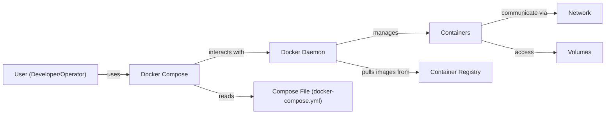
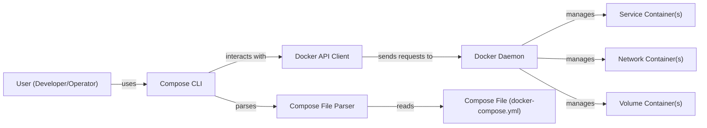
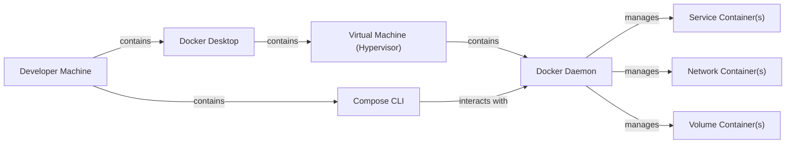
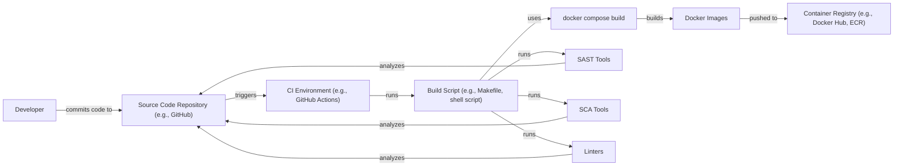

Okay, let's create a design document for the Docker Compose project, keeping in mind its purpose and potential security considerations.

# BUSINESS POSTURE

Docker Compose is a tool for defining and running multi-container Docker applications.  It simplifies the process of managing interconnected services, networks, and volumes, making it easier for developers to build and deploy complex applications.

Priorities:

-   Developer Productivity:  Enable developers to quickly and easily define, build, and run multi-container applications locally and in testing environments.
-   Consistency: Ensure consistent application behavior across different environments (development, testing, production).
-   Simplicity: Provide a user-friendly and intuitive interface for managing complex application stacks.
-   Portability:  Allow applications to be easily moved between different infrastructure providers.
-   Open Source Community: Maintain a vibrant and active open-source community around the project.

Goals:

-   Become the standard tool for defining and running multi-container Docker applications.
-   Reduce the complexity of managing containerized applications.
-   Improve developer workflow and efficiency.
-   Facilitate the adoption of containerization best practices.

Business Risks:

-   Security Vulnerabilities:  Vulnerabilities in Compose itself, or in the way it's used, could lead to container escapes, privilege escalation, or data breaches. This is the most critical risk.
-   Misconfiguration:  Incorrectly configured Compose files could expose services, data, or the host system to unauthorized access.
-   Dependency Management Issues:  Problems with managing dependencies between containers or with external services could lead to application instability or failure.
-   Performance Bottlenecks:  Poorly optimized Compose configurations could lead to performance issues in the deployed applications.
-   Lack of Adoption: If Compose fails to gain widespread adoption, it may become less relevant and its development may slow down.
-   Competition: Other orchestration tools could surpass Compose in features or usability, leading to a decline in its user base.

# SECURITY POSTURE

Existing Security Controls:

-   security control: Docker Daemon Security: Compose relies on the underlying security features of the Docker daemon, such as namespaces, cgroups, and seccomp profiles. (Described in Docker documentation)
-   security control: User Namespaces: Compose can leverage user namespaces to isolate containers from the host system. (Configurable in Compose file and Docker daemon settings)
-   security control: Network Isolation: Compose creates isolated networks for applications by default, preventing containers from accessing unintended networks. (Defined in Compose file)
-   security control: Read-Only Root Filesystem:  Compose supports mounting container filesystems as read-only, reducing the attack surface. (Configurable in Compose file)
-   security control: Secrets Management: Compose integrates with Docker secrets to securely manage sensitive data. (Defined in Compose file and Docker Swarm/Kubernetes)
-   security control: Limited Resource Allocation: Compose allows setting resource limits (CPU, memory) for containers, preventing resource exhaustion attacks. (Configurable in Compose file)

Accepted Risks:

-   accepted risk: Reliance on Docker Daemon Security: Compose's security is inherently tied to the security of the Docker daemon. Any vulnerabilities in the daemon could impact Compose-managed applications.
-   accepted risk: User Responsibility for Image Security: Compose does not scan or validate the security of container images used in Compose files. Users are responsible for ensuring the images they use are secure.
-   accepted risk: Potential for Misconfiguration:  While Compose provides security features, it's possible for users to misconfigure them, leading to vulnerabilities.
-   accepted risk: Limited Built-in Auditing: Compose itself has limited built-in auditing capabilities. Auditing relies on the underlying Docker daemon and other tools.

Recommended Security Controls:

-   security control: Integrate image scanning tools into the Compose workflow to automatically check for vulnerabilities in container images.
-   security control: Implement a policy-as-code framework (e.g., Open Policy Agent) to enforce security best practices in Compose files.
-   security control: Provide more detailed guidance and examples on secure Compose file configurations in the official documentation.
-   security control: Enhance auditing capabilities within Compose, potentially by integrating with existing logging and monitoring solutions.

Security Requirements:

-   Authentication: Not directly applicable to Compose itself, as it's a client-side tool. Authentication is handled by the Docker daemon and any registries used to pull images.
-   Authorization: Compose relies on the Docker daemon's authorization mechanisms.  Compose CLI access control should be managed through operating system user permissions.
-   Input Validation: Compose should validate user input in Compose files to prevent errors and potential security vulnerabilities (e.g., invalid YAML syntax, incorrect configuration options).
-   Cryptography: Compose should use secure communication channels (TLS) when interacting with the Docker daemon and registries.  Secrets management should utilize strong encryption.

# DESIGN

## C4 CONTEXT

Element Descriptions:

-   1.  Name: User (Developer/Operator)
    2.  Type: Person
    3.  Description: A person who uses Docker Compose to define, build, and run multi-container applications.
    4.  Responsibilities: Writing Compose files, running Compose commands, managing application deployments.
    5.  Security controls: OS-level user permissions, SSH key management (if interacting with remote Docker daemons).

-   1.  Name: Docker Compose
    2.  Type: Software System
    3.  Description: A tool for defining and running multi-container Docker applications.
    4.  Responsibilities: Parsing Compose files, interacting with the Docker daemon API, orchestrating container creation and management.
    5.  Security controls: Input validation, reliance on Docker daemon security.

-   1.  Name: Docker Daemon
    2.  Type: Software System
    3.  Description: The background service that manages Docker containers, images, networks, and volumes.
    4.  Responsibilities: Building and running containers, managing images, networking, and storage.
    5.  Security controls: Namespaces, cgroups, seccomp profiles, user namespaces, AppArmor/SELinux.

-   1.  Name: Containers
    2.  Type: Container
    3.  Description: Isolated instances of applications running within Docker.
    4.  Responsibilities: Running application processes, handling requests, interacting with other containers.
    5.  Security controls: Inherited from Docker daemon, application-specific security measures.

-   1.  Name: Container Registry
    2.  Type: Software System
    3.  Description: A repository for storing and distributing Docker images.
    4.  Responsibilities: Storing images, managing access control, providing an API for image retrieval.
    5.  Security controls: Authentication, authorization, TLS encryption, image signing.

-   1.  Name: Network
    2.  Type: Network
    3.  Description: A virtual network created by Docker Compose to allow containers to communicate with each other.
    4.  Responsibilities: Routing traffic between containers, providing DNS resolution.
    5.  Security controls: Network isolation, firewall rules (if applicable).

-   1.  Name: Volumes
    2.  Type: Storage
    3.  Description: Persistent storage volumes that can be shared between containers or used to persist data across container restarts.
    4.  Responsibilities: Storing data, providing access to containers.
    5.  Security controls: File system permissions, encryption (if applicable).

-   1.  Name: Compose File (docker-compose.yml)
    2.  Type: Configuration File
    3.  Description: A YAML file that defines the services, networks, and volumes for a multi-container application.
    4.  Responsibilities: Specifying application configuration, defining dependencies between services.
    5.  Security controls: Input validation by Compose, policy-as-code enforcement (recommended).

## C4 CONTAINER

Element Descriptions:

-   1.  Name: User (Developer/Operator)
    2.  Type: Person
    3.  Description: A person who uses Docker Compose to define, build, and run multi-container applications.
    4.  Responsibilities: Writing Compose files, running Compose commands, managing application deployments.
    5.  Security controls: OS-level user permissions, SSH key management (if interacting with remote Docker daemons).

-   1.  Name: Compose CLI
    2.  Type: Application
    3.  Description: The command-line interface for Docker Compose.
    4.  Responsibilities: Accepting user commands, validating input, interacting with other components.
    5.  Security controls: Input validation.

-   1.  Name: Compose File Parser
    2.  Type: Library/Module
    3.  Description: A component that parses and validates the Compose file (docker-compose.yml).
    4.  Responsibilities: Reading the Compose file, validating its syntax and structure, extracting configuration information.
    5.  Security controls: Input validation, schema validation.

-   1.  Name: Docker API Client
    2.  Type: Library/Module
    3.  Description: A component that interacts with the Docker daemon API.
    4.  Responsibilities: Sending requests to the Docker daemon, receiving responses, handling errors.
    5.  Security controls: TLS encryption (if communicating with a remote daemon).

-   1.  Name: Docker Daemon
    2.  Type: Software System
    3.  Description: The background service that manages Docker containers, images, networks, and volumes.
    4.  Responsibilities: Building and running containers, managing images, networking, and storage.
    5.  Security controls: Namespaces, cgroups, seccomp profiles, user namespaces, AppArmor/SELinux.

-   1.  Name: Service Container(s)
    2.  Type: Container
    3.  Description: Containers that run the application services defined in the Compose file.
    4.  Responsibilities: Running application processes, handling requests.
    5.  Security controls: Inherited from Docker daemon, application-specific security measures.

-   1.  Name: Network Container(s)
    2.  Type: Container
    3.  Description: Containers that provide networking services (e.g., DNS, load balancing) for the application.  Often implicit and managed by Docker itself.
    4.  Responsibilities: Routing traffic, providing service discovery.
    5.  Security controls: Network isolation, firewall rules.

-   1.  Name: Volume Container(s)
    2.  Type: Container
    3.  Description:  Containers that manage persistent storage volumes. Often implicit and managed by Docker itself.
    4.  Responsibilities: Providing access to persistent storage.
    5.  Security controls: File system permissions, encryption (if applicable).

-   1.  Name: Compose File (docker-compose.yml)
    2.  Type: Configuration File
    3.  Description: A YAML file that defines the services, networks, and volumes for a multi-container application.
    4.  Responsibilities: Specifying application configuration, defining dependencies between services.
    5.  Security controls: Input validation by Compose, policy-as-code enforcement (recommended).

## DEPLOYMENT

Possible Deployment Solutions:

1.  Local Development Environment: Docker Desktop (Windows/Mac) or Docker Engine (Linux) directly on the developer's machine.
2.  Cloud-Based Development Environment:  Cloud-based IDEs with Docker support (e.g., Gitpod, GitHub Codespaces).
3.  Testing/Staging Environment:  Dedicated servers or virtual machines running Docker Engine.
4.  Production Environment:
    -   Single Server: Docker Engine on a single server (suitable for small deployments).
    -   Docker Swarm:  Docker's built-in orchestration tool.
    -   Kubernetes:  A popular container orchestration platform.
    -   Cloud Provider Services:  Managed Kubernetes services (e.g., Amazon EKS, Google GKE, Azure AKS) or other container services (e.g., AWS Fargate, Azure Container Instances).

Chosen Solution (for detailed description): Local Development Environment (Docker Desktop)

Element Descriptions:

-   1.  Name: Developer Machine
    2.  Type: Physical Machine
    3.  Description: The developer's laptop or workstation.
    4.  Responsibilities: Running the developer's tools, including Docker Desktop and the Compose CLI.
    5.  Security controls: OS-level security measures, firewall, antivirus.

-   1.  Name: Docker Desktop
    2.  Type: Application
    3.  Description:  A desktop application that provides a simplified way to run Docker on Windows and macOS.
    4.  Responsibilities: Managing the Docker VM, providing a user interface, integrating with the host operating system.
    5.  Security controls:  Sandboxing, regular updates.

-   1.  Name: Virtual Machine (Hypervisor)
    2.  Type: Virtual Machine
    3.  Description: A virtual machine that runs the Docker daemon and containers.  (On Linux, Docker runs directly on the host, so this VM layer is not present).
    4.  Responsibilities: Providing an isolated environment for Docker.
    5.  Security controls:  Hypervisor security features.

-   1.  Name: Docker Daemon
    2.  Type: Software System
    3.  Description: The background service that manages Docker containers, images, networks, and volumes.
    4.  Responsibilities: Building and running containers, managing images, networking, and storage.
    5.  Security controls: Namespaces, cgroups, seccomp profiles, user namespaces, AppArmor/SELinux.

-   1.  Name: Service Container(s)
    2.  Type: Container
    3.  Description: Containers that run the application services defined in the Compose file.
    4.  Responsibilities: Running application processes, handling requests.
    5.  Security controls: Inherited from Docker daemon, application-specific security measures.

-   1.  Name: Network Container(s)
    2.  Type: Container
    3.  Description: Containers that provide networking services. Often implicit.
    4.  Responsibilities: Routing traffic, providing service discovery.
    5.  Security controls: Network isolation, firewall rules.

-   1.  Name: Volume Container(s)
    2.  Type: Container
    3.  Description: Containers that manage persistent storage volumes. Often implicit.
    4.  Responsibilities: Providing access to persistent storage.
    5.  Security controls: File system permissions, encryption (if applicable).

-   1.  Name: Compose CLI
    2.  Type: Application
    3.  Description: The command-line interface for Docker Compose.
    4.  Responsibilities: Accepting user commands, validating input, interacting with the Docker daemon.
    5.  Security controls: Input validation.

## BUILD

Build Process Description:

1.  Developer commits code to the Source Code Repository (e.g., GitHub).
2.  The commit triggers a build in the CI Environment (e.g., GitHub Actions, Jenkins).
3.  The CI Environment runs a Build Script (e.g., Makefile, shell script).
4.  The Build Script uses the `docker compose build` command to build the Docker images defined in the Compose file.
5.  The built Docker images are pushed to a Container Registry (e.g., Docker Hub, Amazon ECR).
6.  Static Application Security Testing (SAST) tools are run against the source code to identify potential vulnerabilities.
7.  Software Composition Analysis (SCA) tools are run to identify vulnerabilities in third-party dependencies.
8.  Linters are used to enforce code style and identify potential errors.

Security Controls:

-   security control: Source Code Repository Access Control:  Restrict access to the source code repository to authorized developers.
-   security control: CI Environment Security:  Secure the CI environment and its credentials.
-   security control: SAST:  Use static analysis tools to identify vulnerabilities in the application code.
-   security control: SCA:  Use software composition analysis tools to identify vulnerabilities in third-party dependencies.
-   security control: Image Signing:  Sign Docker images to ensure their integrity and authenticity.
-   security control: Container Registry Authentication:  Use strong authentication and authorization for the container registry.
-   security control: Least Privilege:  Grant only the necessary permissions to the CI environment and build processes.

# RISK ASSESSMENT

Critical Business Processes:

-   Application Development Workflow:  Compose is critical for enabling developers to build and test applications efficiently.
-   Deployment Pipeline:  Compose can be used as part of a larger deployment pipeline to automate the deployment of applications.
-   Multi-Container Application Management: Compose simplifies the management of complex applications composed of multiple services.

Data Sensitivity:

The data sensitivity depends on the applications being managed by Compose. Compose itself does not handle sensitive data directly, but it orchestrates containers that may process or store sensitive data.  Therefore, the data sensitivity is determined by the specific application. Examples include:

-   No Sensitive Data:  A simple static website.
-   Personally Identifiable Information (PII):  An application that collects user data.
-   Financial Data:  An application that processes payments or handles financial transactions.
-   Protected Health Information (PHI):  An application that handles medical records.
-   Secrets: API keys, database credentials, and other secrets used by the application.

# QUESTIONS & ASSUMPTIONS

Questions:

-   What specific compliance requirements (e.g., PCI DSS, HIPAA) apply to the applications being managed by Compose?
-   What is the expected scale of the deployments (number of containers, users, etc.)?
-   What are the existing security policies and procedures of the organization?
-   What level of logging and monitoring is required for the applications and Compose itself?
-   Are there any specific threat models or attack scenarios that need to be considered?
-   What is organization risk appetite?

Assumptions:

-   BUSINESS POSTURE: The primary use case for Compose is local development and testing, with potential use in staging and small-scale production environments.
-   SECURITY POSTURE: The Docker daemon is configured securely, following best practices. Users are responsible for the security of their application code and container images.
-   DESIGN: The Compose file is well-structured and follows best practices. The network configuration is secure, and containers are isolated from each other and the host system. The deployment environment is a local development machine using Docker Desktop. The build process includes security checks such as SAST and SCA.