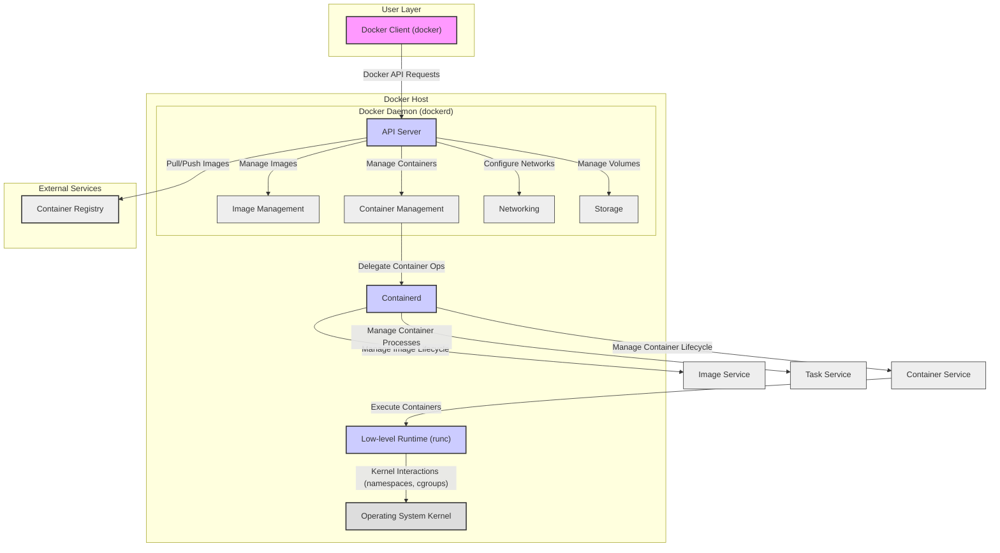
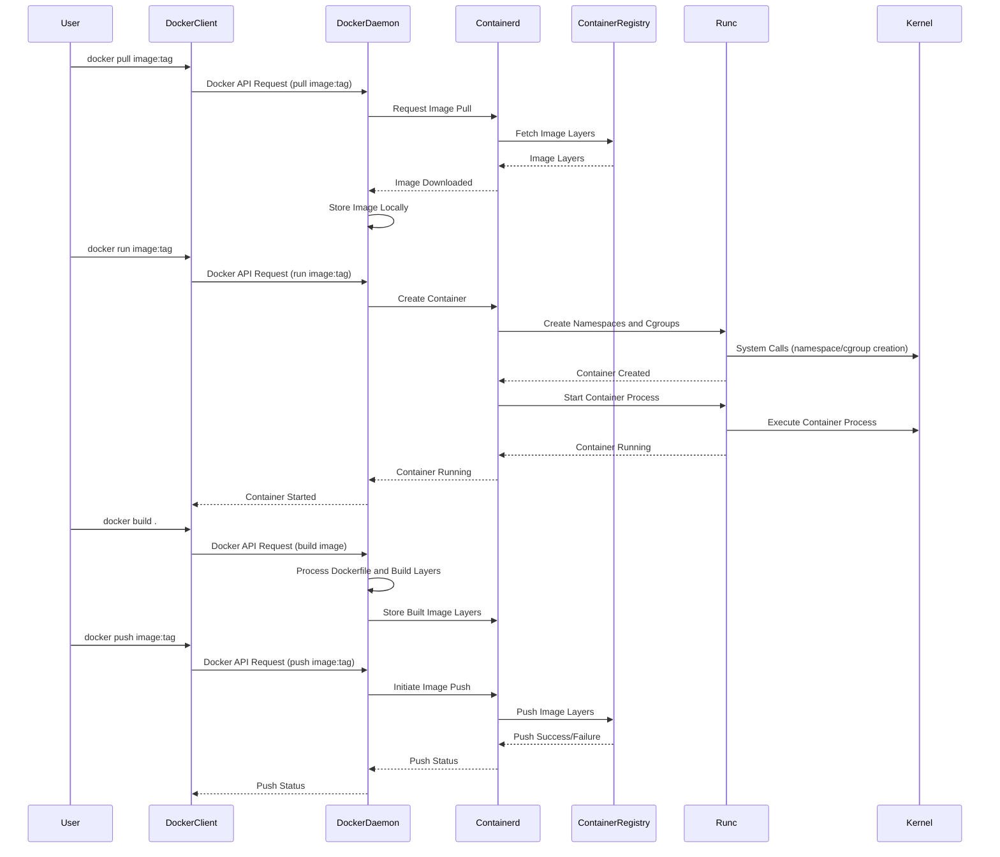

# Project Design Document: Docker Platform - Enhanced

**Version:** 1.1
**Date:** October 26, 2023
**Author:** Gemini (AI Language Model)

## 1. Introduction

This document provides an enhanced architectural design of the Docker platform, based on the open-source project hosted at [https://github.com/docker/docker](https://github.com/docker/docker). This design delves deeper into the core components and their interactions, offering a more comprehensive foundation for subsequent threat modeling activities. The aim is to clearly illustrate the system's structure, control flow, and data flow to facilitate the identification of potential security vulnerabilities.

## 2. Goals

*   Provide a detailed and clear architectural overview of the Docker platform.
*   Identify key components and their specific responsibilities and sub-components.
*   Illustrate the interactions, control flow, and data flow between components with greater precision.
*   Establish a robust foundation for threat modeling and security analysis, highlighting potential attack surfaces.

## 3. Target Audience

This document is intended for:

*   Security engineers and architects performing in-depth threat modeling and security assessments of Docker deployments.
*   Software developers contributing to or extending the Docker platform's codebase.
*   Operations teams responsible for designing, deploying, and managing Docker infrastructure at scale.

## 4. System Overview

Docker is a platform enabling the development, shipping, and execution of applications within isolated environments known as containers. It leverages operating system-level virtualization to package software alongside all its necessary dependencies into standardized units, streamlining the software development lifecycle.

## 5. Architectural Design

The Docker platform comprises several interconnected components working together. We can categorize them into logical groupings for clarity:

*   **User Interface Layer:**
    *   **Docker Client (docker):** The primary interface for users to interact with the Docker system.

*   **Core Docker Engine:**
    *   **Docker Daemon (dockerd):** The central, persistent background process managing all aspects of containerization.
        *   **API Server:**  Handles requests from the Docker Client and other internal components.
        *   **Image Management:** Responsible for storing, retrieving, and managing Docker images.
        *   **Container Management:** Oversees the lifecycle of containers, including creation, starting, stopping, and resource allocation.
        *   **Networking:** Configures and manages container networks and connectivity.
        *   **Storage:** Manages volumes and the container filesystem.

*   **Container Runtime Infrastructure:**
    *   **Containerd:** A high-level container runtime managing the complete container lifecycle on a host.
        *   **Image Service:**  Manages the pulling, pushing, and storage of container images.
        *   **Container Service:** Manages the creation, execution, and deletion of containers.
        *   **Task Service:** Manages the execution of processes within containers.

    *   **Low-level Runtime (runc):** A lightweight, portable runtime responsible for the actual execution and isolation of containers.

*   **Operating System Interface:**
    *   **Operating System Kernel:** Provides the fundamental isolation and resource management capabilities for containers.

*   **External Services:**
    *   **Container Registry (e.g., Docker Hub, private registry):**  Stores and distributes Docker images.

### 5.1. Enhanced Component Diagram

### 5.2. Component Descriptions (Enhanced)

*   **Docker Client (docker):**
    *   The primary command-line interface for users to interact with the Docker platform.
    *   Constructs and sends requests to the Docker Daemon via the Docker API (a RESTful API).
    *   Provides commands for image management (e.g., `build`, `pull`, `push`), container management (e.g., `run`, `start`, `stop`), and other Docker functionalities.

*   **Docker Daemon (dockerd):**
    *   The core background service responsible for managing Docker images, containers, networks, and volumes.
    *   **API Server:** Listens for and processes requests from the Docker Client and potentially other internal components via the Docker API. Enforces authorization policies.
    *   **Image Management:** Handles the storage and retrieval of Docker images, managing image layers and metadata. Interacts with container registries for pulling and pushing images.
    *   **Container Management:** Manages the lifecycle of containers, including creating container instances from images, starting and stopping containers, and monitoring their status.
    *   **Networking:** Configures virtual networks for containers, manages port mappings, and handles DNS resolution for containers.
    *   **Storage:** Manages container filesystems and persistent volumes, providing mechanisms for data persistence.

*   **Containerd:**
    *   A high-level container runtime daemon that manages the complete container lifecycle on a host system.
    *   **Image Service:** Responsible for pulling, pushing, and storing container images. It manages image layers and content addressing.
    *   **Container Service:** Manages the creation, execution, and deletion of containers. It interacts with the task service to manage processes within containers.
    *   **Task Service:** Manages the execution of processes within containers, including starting, stopping, and monitoring them.

*   **Low-level Runtime (runc):**
    *   A lightweight and portable container runtime that directly interacts with the operating system kernel.
    *   Responsible for creating and running containers by utilizing kernel features like namespaces and cgroups to provide isolation and resource management.

*   **Operating System Kernel:**
    *   Provides the foundational technologies for containerization:
        *   **Namespaces:** Isolate various system resources, such as process IDs (PID namespace), network interfaces (network namespace), mount points (mount namespace), inter-process communication (IPC namespace), hostname (UTS namespace), and user and group IDs (user namespace).
        *   **Control Groups (cgroups):** Limit and isolate the resource usage (CPU, memory, I/O, etc.) of groups of processes, ensuring fair resource allocation and preventing resource exhaustion.

*   **Container Registry:**
    *   A service that stores and distributes Docker images.
    *   Can be a public registry (e.g., Docker Hub) or a private registry hosted within an organization.
    *   Provides authentication and authorization mechanisms to control access to images.

## 6. Data and Control Flow

The operation of Docker involves intricate data and control flows between its components. Here are some key scenarios:

1. **Pulling an Image:**
    *   **Control Flow:** User -> Docker Client -> Docker Daemon -> Containerd -> Container Registry.
    *   **Data Flow:** Image layers are transferred from the Container Registry to Containerd, then stored and managed by the Docker Daemon.

2. **Running a Container:**
    *   **Control Flow:** User -> Docker Client -> Docker Daemon -> Containerd -> Runc -> Kernel.
    *   **Data Flow:** Container configuration and image data are passed down the chain. The Kernel manages the isolated environment.

3. **Building an Image:**
    *   **Control Flow:** User -> Docker Client -> Docker Daemon.
    *   **Data Flow:** The Dockerfile and build context are transferred to the Docker Daemon, which orchestrates the image build process, potentially pulling base images from a registry.

4. **Pushing an Image:**
    *   **Control Flow:** User -> Docker Client -> Docker Daemon -> Containerd -> Container Registry.
    *   **Data Flow:** Image layers are transferred from the Docker Daemon (managed by Containerd) to the Container Registry.

## 7. Security Considerations (Pre-Threat Modeling) - Enhanced

This section outlines potential security considerations for each component, providing a foundation for subsequent threat modeling.

*   **Docker Client (docker):**
    *   **Threats:** Maliciously crafted client binaries, insecure client configurations, exposure of credentials used to authenticate with the Docker Daemon.

*   **Docker Daemon (dockerd):**
    *   **Threats:** API vulnerabilities allowing unauthorized access or control, privilege escalation vulnerabilities due to its root privileges, insecure default configurations, vulnerabilities in image handling leading to arbitrary code execution.

*   **Containerd:**
    *   **Threats:** Vulnerabilities in the containerd API or image handling, potential for container escapes if containerd itself is compromised.

*   **Low-level Runtime (runc):**
    *   **Threats:** Kernel vulnerabilities exploitable through runc, leading to container escapes and host compromise.

*   **Operating System Kernel:**
    *   **Threats:** Underlying kernel vulnerabilities that could bypass container isolation mechanisms (namespaces and cgroups).

*   **Container Registry:**
    *   **Threats:** Unauthorized access to images, image tampering or malware injection, vulnerabilities in the registry software itself.

*   **Container Images:**
    *   **Threats:** Inclusion of vulnerabilities in application dependencies or base images, embedded secrets or malware.

*   **Container Networking:**
    *   **Threats:** Unauthorized network access between containers or to the host, exposure of sensitive services through insecure port mappings.

*   **Container Storage:**
    *   **Threats:** Unauthorized access to container data, vulnerabilities in volume management leading to data corruption or leakage.

## 8. Assumptions and Constraints

*   This document describes the core architecture of the open-source Docker Engine. Commercial distributions or extensions may introduce additional components or modifications.
*   The focus is on the logical architecture and key interactions. Implementation details and specific code paths are not covered.
*   It is assumed that the host operating system provides the necessary kernel features (namespaces, cgroups) for containerization.
*   Security considerations are high-level and intended to guide further threat modeling.

## 9. Future Considerations

*   Detailed design specifications for networking components (e.g., bridge networks, overlay networks) and storage drivers.
*   Integration with container orchestration platforms like Kubernetes and Docker Swarm.
*   In-depth analysis of specific security features like Docker Content Trust, security scanning tools, and runtime security mechanisms.
*   Consideration of container security best practices and hardening guidelines.

This enhanced design document provides a more detailed and structured understanding of the Docker platform's architecture, facilitating more effective threat modeling and security analysis.
