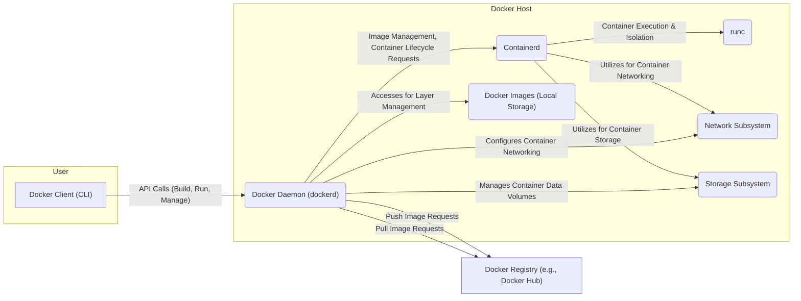

## Project Design Document: Docker (Improved)

**1. Introduction**

This document provides an enhanced architectural design of the Docker project, focusing on the core components, their interactions, and security-relevant aspects. This detailed design will serve as a robust foundation for subsequent threat modeling activities. The scope of this document primarily covers the core Docker Engine and its immediate dependencies, excluding higher-level orchestration tools like Docker Swarm or Kubernetes, unless their interaction is directly relevant to the core engine's functionality.

**2. System Overview**

Docker is a platform enabling the development, shipping, and execution of applications within isolated environments known as containers. It leverages operating system-level virtualization to package software and its dependencies into a standardized, portable unit.

The core components of Docker collaborate to build, manage, and run these containers. The following diagram illustrates the high-level architecture, emphasizing key interactions:

**3. Key Components**

*   **Docker Client (CLI):**
    *   The primary command-line interface for users to interact with the Docker system.
    *   Accepts commands from the user and communicates with the Docker Daemon via a RESTful API over a local socket or network.
    *   Responsible for initiating actions such as building images, running containers, managing volumes, and configuring networks.
    *   Potential attack surface if the client machine is compromised or if API access is not properly secured.

*   **Docker Daemon (dockerd):**
    *   The central, privileged background service responsible for building, running, and managing Docker containers.
    *   Listens for Docker API requests from the Docker Client and other authorized entities.
    *   Manages the lifecycle of Docker objects, including images, containers, networks, and volumes.
    *   Interacts with `containerd` to delegate container lifecycle management.
    *   Communicates with Docker Registries to pull and push container images, involving authentication and authorization.
    *   A critical component from a security perspective due to its root privileges and direct control over the host system. The Docker socket is a significant point of concern.

*   **Containerd:**
    *   A core container runtime daemon that manages the complete container lifecycle on a host system, adhering to industry standards.
    *   Responsible for tasks such as pulling and unpacking images, managing container storage and networking namespaces, and monitoring container execution.
    *   Provides a stable and well-defined gRPC API for higher-level systems like the Docker Daemon.
    *   Delegates the actual execution of containers to lower-level runtimes like `runc`.

*   **runc:**
    *   A lightweight and portable container runtime conforming to the Open Container Initiative (OCI) specification.
    *   Responsible for the actual creation and execution of container processes, leveraging kernel features like namespaces and cgroups for isolation and resource management.
    *   Invoked by `containerd` to instantiate and run containers based on the OCI image specification.
    *   Security vulnerabilities in `runc` can have significant impact on container isolation.

*   **Docker Images (Local Storage):**
    *   Read-only templates used to create Docker containers.
    *   Composed of layered filesystems, where each layer represents a set of changes.
    *   Stored locally on the Docker host within the Docker's graphdriver directory.
    *   Image integrity and provenance are crucial security considerations. Tampered images can introduce vulnerabilities.

*   **Docker Registry:**
    *   A stateless, scalable server-side application that stores and distributes Docker images.
    *   Examples include Docker Hub (a public registry), private registries, and cloud provider container registries.
    *   Provides mechanisms for authentication and authorization to control access to images.
    *   Image vulnerabilities within registries are a significant concern. Secure communication (TLS) is essential.

*   **Network Subsystem:**
    *   Manages networking for Docker containers, enabling communication between containers and with the external network.
    *   Provides various network drivers (e.g., bridge, host, overlay, macvlan) to configure container networking.
    *   Handles port mapping (publishing) to expose container services on the host.
    *   Implements network isolation between containers and the host using namespaces and firewall rules (iptables/nftables).
    *   Network configuration vulnerabilities can lead to container escape or unauthorized access.

*   **Storage Subsystem:**
    *   Manages how data is stored and accessed by Docker containers, including image layers and container writable layers.
    *   Supports different storage drivers (e.g., overlay2, aufs, devicemapper) that implement copy-on-write mechanisms for efficient storage utilization.
    *   Provides mechanisms for persistent storage through volumes (managed by Docker) and bind mounts (mapping host directories into containers).
    *   Security considerations include data at rest encryption, proper permissions on volumes, and preventing container escape through volume mounts.

**4. Data Flow**

The following outlines the typical data flow for common Docker operations, highlighting security-relevant aspects:

*   **Building an Image:**
    *   The user issues a `docker build` command via the Docker Client, potentially including sensitive information in the build context.
    *   The Docker Client sends the build context (Dockerfile and related files) to the Docker Daemon over the API.
    *   The Docker Daemon interprets the Dockerfile instructions, which may involve downloading packages or executing scripts.
    *   Each instruction in the Dockerfile creates a new layer in the image.
    *   The resulting image is stored locally on the Docker host. Security risks include supply chain attacks through base images or malicious build steps.

*   **Pulling an Image:**
    *   The user issues a `docker pull` command via the Docker Client, specifying the image name and tag.
    *   The Docker Client sends a request to the Docker Daemon.
    *   The Docker Daemon contacts the configured Docker Registry over HTTPS, potentially requiring authentication.
    *   The Registry authenticates the request and authorizes access to the image.
    *   The Docker Daemon downloads the image layers from the Registry, verifying checksums for integrity.
    *   The downloaded image is stored locally on the Docker host. Security risks involve pulling compromised images from untrusted registries.

*   **Running a Container:**
    *   The user issues a `docker run` command via the Docker Client, specifying the image, environment variables (potentially containing secrets), port mappings, and volume mounts.
    *   The Docker Client sends a request to the Docker Daemon.
    *   The Docker Daemon interacts with `containerd` to create and start the container.
    *   `Containerd` pulls the necessary image layers (if not already present).
    *   `Containerd` uses `runc` to create the container's isolated environment using namespaces and cgroups, applying security profiles if configured.
    *   `Containerd` configures networking and storage for the container based on the user's specifications.
    *   The container process starts executing within its isolated environment. Security risks include privilege escalation within the container, container escapes, and exposure of sensitive data through environment variables or volume mounts.

*   **Pushing an Image:**
    *   The user issues a `docker push` command via the Docker Client, specifying the image name and tag.
    *   The Docker Client sends a request to the Docker Daemon.
    *   The Docker Daemon authenticates with the specified Docker Registry over HTTPS.
    *   The Docker Daemon uploads the image layers to the Registry. Security risks involve pushing images with vulnerabilities or sensitive information to public registries unintentionally.

**5. Security Considerations**

Docker incorporates several security features and considerations, but also presents potential attack surfaces:

*   **Namespaces:** Provide fundamental process isolation, limiting a container's view of the system. However, kernel vulnerabilities can sometimes allow namespace escapes.
*   **Control Groups (cgroups):** Limit and monitor resource usage, preventing denial-of-service attacks from within containers. Misconfigured cgroups can still lead to resource exhaustion on the host.
*   **Capabilities:** Offer fine-grained control over privileges, reducing the attack surface compared to running as root. However, improperly assigned capabilities can grant excessive permissions.
*   **Security Profiles (AppArmor and SELinux):** Provide mandatory access control, further restricting container actions. Proper configuration is crucial for effectiveness.
*   **Image Signing and Verification (Docker Content Trust):** Allows verification of image integrity and publisher. Requires proper key management and adoption.
*   **Network Security:** Docker allows for creating isolated networks and controlling traffic. Misconfigured network policies can lead to unintended exposure.
*   **Secrets Management (Docker Secrets):** Provides a mechanism for securely managing sensitive information. Requires careful implementation and access control.
*   **Vulnerability Scanning:** Tools can scan images for known vulnerabilities. This is a crucial step in the development pipeline.
*   **Daemon Security:** Securing the Docker Daemon is paramount. This includes controlling access to the Docker socket (a major attack vector), using TLS for API communication, and following the principle of least privilege.
*   **Kernel Security:** Docker relies on the host kernel. Kernel vulnerabilities can directly impact container security.
*   **Supply Chain Security:** The security of base images and dependencies used in Dockerfiles is critical.

**6. Deployment Model**

Docker can be deployed in various environments, each with its own security implications:

*   **Local Development:** Running Docker Desktop or Docker Engine directly on a developer's machine. Security depends on the developer's machine security.
*   **Single Server:** Deploying containers directly on a single physical or virtual server. Requires careful hardening of the server and the Docker Daemon.
*   **Orchestration Platforms (e.g., Docker Swarm, Kubernetes):** Introduces additional layers of complexity and security considerations related to the orchestrator itself.
*   **Cloud Providers (e.g., AWS ECS, Azure Container Instances, Google Kubernetes Engine):** Leverages the cloud provider's security infrastructure but requires understanding the shared responsibility model.

**7. Assumptions and Constraints**

*   This document focuses on the core Docker Engine architecture.
*   Security best practices for configuring and managing the Docker environment are assumed but not explicitly detailed.
*   The design assumes a standard Linux-based host operating system for the Docker Daemon.
*   Specific security configurations (e.g., AppArmor profiles, SELinux policies) are not detailed.

This improved design document provides a more detailed and security-focused understanding of the Docker architecture, making it more suitable for comprehensive threat modeling activities. The added details on data flow, component responsibilities, and security considerations aim to facilitate the identification of potential vulnerabilities and attack vectors.