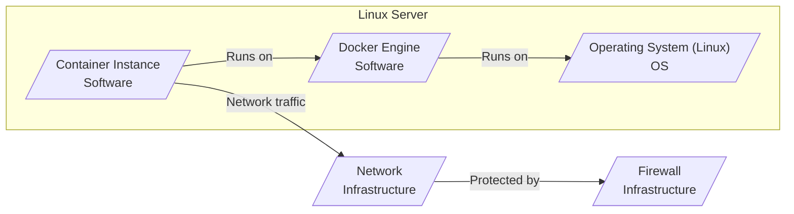
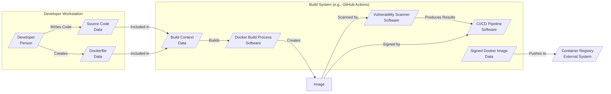

# BUSINESS POSTURE

The Docker project aims to provide a platform for developers and system administrators to build, share, and run applications using containers. By containerizing applications, Docker enables consistency across different environments, simplifies deployment, and improves resource utilization.

Business Priorities and Goals:
- Primary goal is to streamline the software development lifecycle, from development to production, by providing a consistent and portable container runtime environment.
- Enable faster application delivery and deployment cycles.
- Improve resource efficiency by allowing multiple containers to run on the same host.
- Foster a large ecosystem of containerized applications and services.
- Support hybrid and multi-cloud deployments by providing a platform-agnostic container runtime.

Business Risks:
- Security vulnerabilities in the Docker Engine or container images could lead to widespread application compromise.
- Supply chain attacks targeting Docker Hub or other container registries could distribute malicious images.
- Misconfiguration of Docker environments could expose sensitive data or create security loopholes.
- Operational complexity in managing large-scale container deployments can lead to errors and security incidents.
- Reliance on open-source components introduces potential vulnerabilities and maintenance challenges.

# SECURITY POSTURE

Existing Security Controls:
- security control: Namespace isolation (implemented in Docker Engine) - Isolates resources like process IDs, network, mount points, and inter-process communication between containers.
- security control: Control Groups (cgroups) (implemented in Docker Engine) - Limits and monitors resource usage (CPU, memory, disk I/O) for containers.
- security control: Seccomp (implemented in Docker Engine) - Restricts the system calls that a containerized process can make to the kernel.
- security control: AppArmor/SELinux (implemented in Docker Engine, host OS dependent) - Mandatory Access Control systems that can further restrict container capabilities and access to resources.
- security control: User Namespaces (implemented in Docker Engine) - Allows mapping container users to different user IDs on the host, reducing the risk of privilege escalation.
- security control: Image Signing (Docker Content Trust - documentation available in Docker documentation) - Enables verification of image publishers and integrity using cryptographic signatures.
- security control: Vulnerability Scanning (Docker Hub, third-party scanners) - Docker Hub and third-party tools can scan images for known vulnerabilities.

Accepted Risks:
- accepted risk: Complexity of container security configuration can lead to misconfigurations and vulnerabilities if not properly managed.
- accepted risk: Reliance on base images from public registries introduces potential vulnerabilities if base images are not regularly updated and scanned.
- accepted risk: Shared kernel between containers and the host OS means kernel vulnerabilities can potentially affect multiple containers.
- accepted risk: Security of containerized applications is ultimately the responsibility of the application developers, not just the container runtime.

Recommended Security Controls:
- recommended security control: Implement Runtime Security Monitoring - Use tools to monitor container behavior at runtime for anomalous activity and potential threats.
- recommended security control: Enforce Image Provenance Tracking - Track the origin and build process of container images to ensure integrity and reduce supply chain risks.
- recommended security control: Automate Security Configuration Checks - Use tools to automatically audit Docker configurations and container images against security best practices.
- recommended security control: Implement Network Policies - Define network policies to restrict network traffic between containers and external networks, limiting the blast radius of potential breaches.
- recommended security control: Regularly Update Base Images and Docker Engine - Keep base images and the Docker Engine up-to-date with the latest security patches.

Security Requirements:
- Authentication:
    - Requirement: Secure authentication for accessing the Docker API (e.g., TLS mutual authentication, access tokens).
    - Requirement: Secure authentication for accessing container registries (e.g., username/password, access tokens, cloud provider IAM).
    - Requirement: Secure authentication for managing Docker Swarm or Kubernetes clusters (if used).
- Authorization:
    - Requirement: Role-Based Access Control (RBAC) for Docker API access to restrict actions based on user roles.
    - Requirement: Fine-grained authorization policies for container resource access (e.g., limiting access to host resources, networks, volumes).
    - Requirement: Authorization policies for image access in container registries (e.g., private registries, image pull permissions).
- Input Validation:
    - Requirement: Validate all inputs to the Docker API to prevent injection attacks and other vulnerabilities.
    - Requirement: Validate container image configurations and Dockerfile instructions to prevent insecure configurations.
    - Requirement: Validate environment variables and volumes passed to containers to prevent injection and path traversal vulnerabilities.
- Cryptography:
    - Requirement: Use TLS encryption for all communication between Docker components (e.g., Docker CLI to Docker Engine, Docker Engine to registry).
    - Requirement: Utilize image signing and verification (Docker Content Trust) to ensure image integrity and authenticity.
    - Requirement: Securely manage and store cryptographic keys used for image signing and TLS certificates.
    - Requirement: Consider encryption for sensitive data stored in volumes or container configurations.

# DESIGN

## C4 CONTEXT

```mermaid
graph LR
    subgraph "Organization"
        User[/"Developer"\nUser/]
        Ops[/"Operations Team"\nUser/]
    end
    Docker[/"Docker Project"\nSoftware System/]
    Registry[/"Container Registry (Docker Hub, etc.)"\nExternal System/]
    OS[/"Operating System (Linux, Windows, macOS)"\nExternal System/]
    Orchestrator[/"Container Orchestration (Kubernetes, Swarm)"\nExternal System/]

    User --> Docker: Builds and runs containers
    Ops --> Docker: Manages and monitors containers
    Docker --> Registry: Pulls and pushes container images
    Docker --> OS: Runs on the operating system
    Docker --> Orchestrator: Managed by orchestration platforms (optional)
    User -- Uses --> Registry
    Ops -- Manages --> Orchestrator
```

Context Diagram Elements:

- Name: User
    - Type: Person
    - Description: Software developers who use Docker to build, package, and run their applications in containers.
    - Responsibilities: Develops applications, creates Dockerfiles, builds container images, runs containers locally for development and testing.
    - Security controls: User authentication to access development environments, secure coding practices, vulnerability scanning of developed applications.
- Name: Operations Team
    - Type: Person
    - Description: System administrators and operations engineers who manage and operate Docker environments in production and other environments.
    - Responsibilities: Deploys and manages Docker infrastructure, monitors containerized applications, ensures system availability and security, manages container orchestration platforms.
    - Security controls: Access control to production environments, security monitoring and incident response, configuration management, vulnerability management of Docker infrastructure.
- Name: Docker Project
    - Type: Software System
    - Description: The core Docker platform, including the Docker Engine, Docker CLI, and related components, responsible for building, running, and managing containers.
    - Responsibilities: Container runtime environment, image management, API for container control, networking and storage for containers, security features like namespaces, cgroups, seccomp.
    - Security controls: Namespaces, cgroups, seccomp, AppArmor/SELinux, User Namespaces, Docker Content Trust, API authentication and authorization, vulnerability scanning of Docker Engine.
- Name: Container Registry (Docker Hub, etc.)
    - Type: External System
    - Description: Public or private registries for storing and distributing container images. Examples include Docker Hub, Amazon ECR, Google Container Registry, and private enterprise registries.
    - Responsibilities: Stores container images, provides image distribution services, may offer vulnerability scanning and image signing features.
    - Security controls: Access control to registries, image signing and verification, vulnerability scanning of images, secure communication (TLS), audit logging.
- Name: Operating System (Linux, Windows, macOS)
    - Type: External System
    - Description: The host operating system on which the Docker Engine runs. Docker supports various operating systems including Linux distributions, Windows Server, and macOS.
    - Responsibilities: Provides the kernel and system resources for running containers, host-level security features, networking and storage infrastructure.
    - Security controls: Kernel security features, operating system hardening, patching and updates, host-based firewalls, intrusion detection systems.
- Name: Container Orchestration (Kubernetes, Swarm)
    - Type: External System
    - Description: Platforms for automating deployment, scaling, and management of containerized applications. Examples include Kubernetes, Docker Swarm (deprecated in favor of Kubernetes for many use cases).
    - Responsibilities: Container scheduling and orchestration, service discovery, load balancing, scaling, health monitoring, automated deployments.
    - Security controls: RBAC, network policies, pod security policies/admission controllers, secret management, security monitoring, integration with Docker security features.

## C4 CONTAINER

```mermaid
graph LR
    subgraph "Docker Project"
        DockerCLI[/"Docker CLI"\nContainer/]
        DockerEngine[/"Docker Engine"\nContainer/]
    end
    Registry[/"Container Registry"\nExternal System/]
    OS[/"Operating System"\nExternal System/]

    User[/"User"\nPerson/]

    User --> DockerCLI: Uses to manage Docker
    DockerCLI --> DockerEngine: Communicates with Docker Engine API
    DockerEngine --> Registry: Pulls and pushes images
    DockerEngine --> OS: Interacts with OS kernel for containerization
```

Container Diagram Elements:

- Name: Docker CLI
    - Type: Container
    - Description: Command-line interface for interacting with the Docker Engine. Allows users to build, run, manage, and inspect containers and images.
    - Responsibilities: Provides a user interface to the Docker API, handles user commands, formats output, communicates with the Docker Engine.
    - Security controls: User authentication (delegated to Docker Engine API), command validation, secure communication with Docker Engine API (TLS).
- Name: Docker Engine
    - Type: Container
    - Description: The core container runtime engine responsible for building, running, and managing containers. Includes components like containerd and runc.
    - Responsibilities: Container lifecycle management, image management, networking, storage, resource isolation (namespaces, cgroups), security features (seccomp, AppArmor/SELinux).
    - Security controls: Namespaces, cgroups, seccomp, AppArmor/SELinux, User Namespaces, Docker Content Trust, API authentication and authorization, vulnerability scanning, secure defaults.

## DEPLOYMENT

Deployment Solution: Standalone Docker Engine on Linux Server



Deployment Diagram Elements:

- Name: Linux Server
    - Type: Infrastructure
    - Description: A physical or virtual server running a Linux operating system. This server hosts the Docker Engine and container instances.
    - Responsibilities: Provides compute resources, network connectivity, and storage for Docker.
    - Security controls: Operating system hardening, patching and updates, host-based intrusion detection system, access control to the server, firewall.
- Name: Docker Engine
    - Type: Software
    - Description: The Docker Engine software installed on the Linux server.
    - Responsibilities: Container runtime environment, managing container instances, interacting with the operating system kernel.
    - Security controls: As described in Container Diagram, plus secure installation and configuration on the server.
- Name: Container Instance
    - Type: Software
    - Description: An instance of a running containerized application. Multiple container instances can run on the same Docker Engine.
    - Responsibilities: Executes the application code within the container, provides application services.
    - Security controls: Application-level security controls, container security configurations, resource limits, network policies.
- Name: Operating System (Linux)
    - Type: OS
    - Description: The Linux operating system running on the server.
    - Responsibilities: Provides the kernel and system resources for Docker Engine and containers.
    - Security controls: Kernel security features, operating system hardening, patching and updates, host-based firewall.
- Name: Network
    - Type: Infrastructure
    - Description: The network infrastructure connecting the Linux server to other systems and users.
    - Responsibilities: Provides network connectivity for containerized applications.
    - Security controls: Network segmentation, network monitoring, intrusion detection system, secure network protocols (TLS).
- Name: Firewall
    - Type: Infrastructure
    - Description: A firewall protecting the Linux server and the network.
    - Responsibilities: Controls network traffic to and from the server, blocks unauthorized access.
    - Security controls: Firewall rules based on the principle of least privilege, regular rule reviews, logging and monitoring.

## BUILD



Build Process Description:

1. Developer writes application source code and creates a Dockerfile defining how to build the container image.
2. Developer commits code and Dockerfile to a source code repository (e.g., GitHub).
3. CI/CD pipeline (e.g., GitHub Actions) is triggered by code commit.
4. CI pipeline retrieves source code and Dockerfile to create the build context.
5. Docker Build process within the CI environment uses the Dockerfile and build context to build a Docker image.
6. The newly built Docker image is scanned for vulnerabilities using a vulnerability scanner integrated into the CI pipeline.
7. Based on the scan results and defined policies, the CI pipeline may proceed or fail the build.
8. If the build passes security checks, the CI pipeline signs the Docker image using Docker Content Trust.
9. The signed Docker image is pushed to a container registry (e.g., Docker Hub, private registry).

Build Process Security Controls:

- security control: Source Code Management - Use a secure source code repository (e.g., GitHub, GitLab) with access controls and audit logging.
- security control: CI/CD Pipeline Security - Secure the CI/CD pipeline infrastructure, including access controls, secrets management, and secure build agents.
- security control: Build Context Minimization - Minimize the build context to only include necessary files, reducing the attack surface.
- security control: Dockerfile Security Best Practices - Follow Dockerfile security best practices (e.g., use minimal base images, avoid running as root, use multi-stage builds).
- security control: Vulnerability Scanning - Integrate vulnerability scanning into the CI pipeline to automatically scan images for known vulnerabilities before deployment.
- security control: Image Signing (Docker Content Trust) - Implement Docker Content Trust to sign and verify container images, ensuring image integrity and provenance.
- security control: Static Analysis Security Testing (SAST) - Integrate SAST tools into the CI pipeline to analyze source code for security vulnerabilities before building images.
- security control: Dependency Scanning - Scan application dependencies for known vulnerabilities during the build process.
- security control: Build Artifact Integrity - Ensure the integrity of build artifacts (container images) using checksums and signing.
- security control: Access Control to Registry - Implement strict access control to the container registry to prevent unauthorized image pushes and pulls.

# RISK ASSESSMENT

Critical Business Process:
- Deployment and execution of containerized applications. Disruption or compromise of this process can impact application availability, data integrity, and business operations.

Data to Protect and Sensitivity:
- Container Images: Contain application code, libraries, and configurations. Sensitivity depends on the application, can range from public to highly confidential intellectual property and business logic.
- Application Data within Containers: Data processed and stored by containerized applications. Sensitivity varies greatly depending on the application, can include highly sensitive personal data, financial data, or trade secrets.
- Secrets and Credentials: API keys, passwords, certificates used by containerized applications. Highly sensitive, compromise can lead to unauthorized access and data breaches.
- Infrastructure Configuration: Docker configurations, orchestration configurations. Sensitive, misconfiguration can lead to security vulnerabilities and system compromise.

# QUESTIONS & ASSUMPTIONS

Questions:
- What is the specific deployment environment for Docker (cloud, on-premises, hybrid)?
- What type of applications will be containerized using Docker (web applications, databases, microservices)?
- What are the specific compliance requirements for the applications and data being containerized?
- What is the organization's risk appetite regarding container security?
- Are there existing security policies or guidelines that need to be considered?

Assumptions:
- Docker is used for general-purpose application containerization, not for highly specialized or isolated environments.
- Security is a significant concern for the users of this design document.
- The organization has a basic understanding of container security principles.
- The deployment environment includes standard network and infrastructure security controls (firewalls, intrusion detection, etc.).
- Container images are built and managed using a CI/CD pipeline.