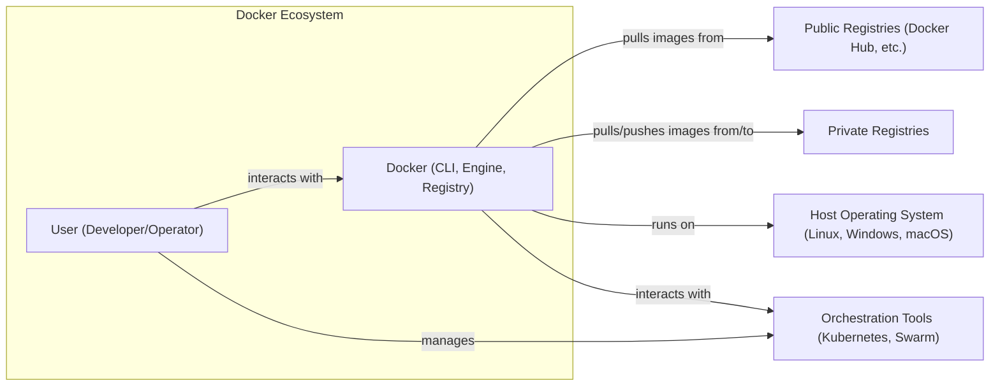
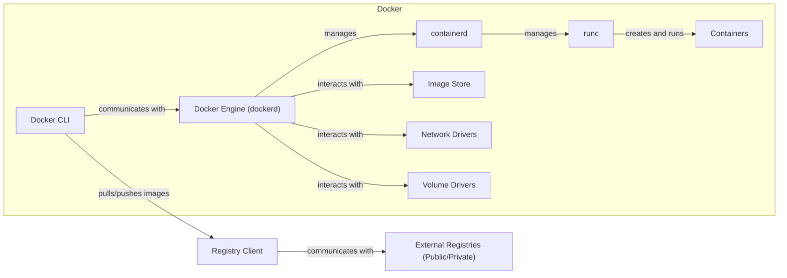
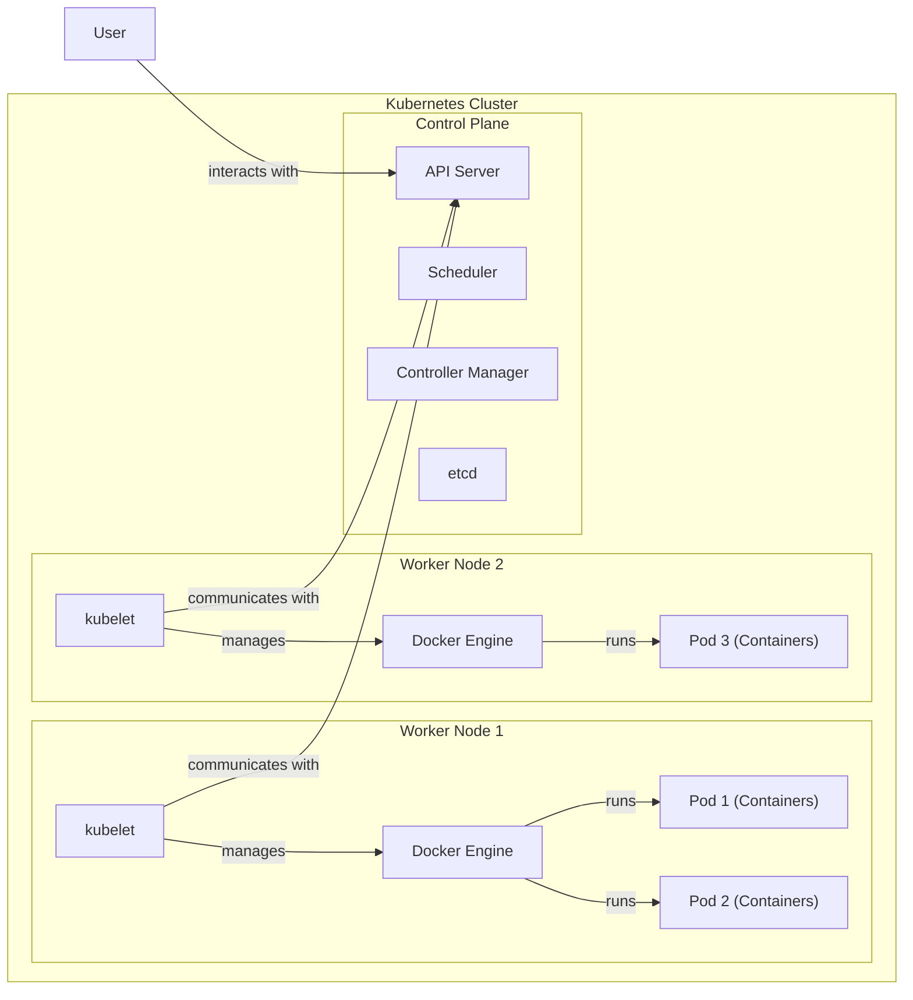
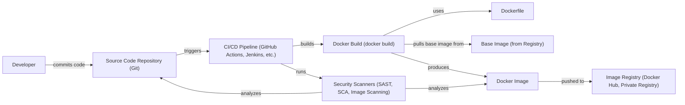

Okay, let's create a design document for the Docker project, focusing on aspects relevant for threat modeling.

# BUSINESS POSTURE

Docker has become a foundational technology for modern software development and deployment.  It's used by individual developers, small startups, and large enterprises.  Given its widespread adoption and critical role in many organizations' infrastructure, the business posture emphasizes stability, security, and broad compatibility.

Priorities and Goals:

*   Enable efficient and consistent application packaging and deployment.
*   Provide a platform-agnostic way to run applications.
*   Facilitate microservices architectures.
*   Reduce the "it works on my machine" problem.
*   Maintain backward compatibility where possible, while still innovating.
*   Foster a large and active community and ecosystem.
*   Provide enterprise-grade solutions with support and enhanced security features.

Business Risks:

*   Security vulnerabilities in Docker itself could lead to widespread exploits, impacting a vast number of deployments. This is the most critical risk.
*   Incompatibility with specific operating systems or kernel versions could limit adoption or break existing workflows.
*   Performance overhead could make Docker unsuitable for certain performance-sensitive applications.
*   Complexity of managing large-scale Docker deployments (especially with orchestration tools like Kubernetes) could hinder adoption or lead to operational issues.
*   Competition from alternative containerization technologies could erode Docker's market share.
*   Reputational damage from security incidents or poor community management.

# SECURITY POSTURE

Docker, being a core infrastructure component, has a significant security surface.  The project has evolved its security posture over time, incorporating various controls and addressing vulnerabilities.

Existing Security Controls:

*   security control: User Namespaces: Isolates containers from the host system by mapping container user IDs to different host user IDs. Implemented in the Docker Engine.
*   security control: Control Groups (cgroups): Limits the resources (CPU, memory, network, I/O) that a container can consume. Implemented in the Docker Engine and Linux kernel.
*   security control: Capabilities: Provides fine-grained control over the privileges of processes within a container, limiting the potential impact of a compromised container. Implemented in the Docker Engine and Linux kernel.
*   security control: Seccomp Profiles: Restricts the system calls that a container can make, reducing the attack surface. Implemented in the Docker Engine and Linux kernel.
*   security control: AppArmor/SELinux: Mandatory Access Control (MAC) systems that provide an additional layer of security by enforcing policies on container behavior. Can be configured and used with Docker.
*   security control: Docker Content Trust: Uses digital signatures to verify the integrity and publisher of Docker images. Implemented in Docker CLI and Docker Hub/Registry.
*   security control: Image Scanning: Tools (both integrated and third-party) are available to scan Docker images for known vulnerabilities. Implemented in Docker Hub, third-party tools, and CI/CD pipelines.
*   security control: Regular Security Audits: Docker Inc. and the community conduct security audits and penetration testing. Described in security documentation and reports.
*   security control: Security Advisories and CVE Handling: Docker Inc. publishes security advisories and addresses Common Vulnerabilities and Exposures (CVEs) promptly. Described in security documentation.
*   security control: Hardened Base Images: Official images are regularly updated and maintained to minimize vulnerabilities. Described in Docker Hub documentation.

Accepted Risks:

*   accepted risk: Root Access within Containers: By default, processes within a container run as root (though with limited capabilities). This is a known risk, mitigated by other controls like user namespaces and capabilities.
*   accepted risk: Shared Kernel: Containers share the host operating system's kernel. A kernel vulnerability could potentially affect all containers on the host. This is inherent to containerization.
*   accepted risk: Complexity of Configuration: Securely configuring Docker and related tools (e.g., networking, storage) requires expertise. Misconfiguration is a potential risk.
*   accepted risk: Third-Party Image Risks: Users can pull and run images from any registry, including untrusted sources. This is mitigated by Docker Content Trust and image scanning, but the risk remains.
*   accepted risk: Supply Chain Attacks: Compromise of build systems or dependencies used to create Docker images could lead to malicious images.

Recommended Security Controls:

*   Implement Software Bill of Materials (SBOM) generation and verification for all official images.
*   Enhance integration with Security Enhanced Linux (SELinux) and AppArmor, providing default profiles for common use cases.
*   Provide more granular control over network access within and between containers.

Security Requirements:

*   Authentication:
    *   Docker CLI should authenticate with registries (e.g., Docker Hub) securely, using API keys or other strong authentication mechanisms.
    *   Private registries should support robust authentication and access control.
*   Authorization:
    *   Access to Docker Engine should be restricted to authorized users and groups.
    *   Fine-grained authorization should be available for managing containers, images, networks, and volumes.
    *   Integration with existing identity providers (e.g., LDAP, Active Directory) should be supported.
*   Input Validation:
    *   Dockerfiles should be validated to prevent injection of malicious commands.
    *   Image names and tags should be sanitized to prevent attacks.
    *   API inputs should be validated to prevent vulnerabilities like command injection.
*   Cryptography:
    *   Docker Content Trust should use strong cryptographic algorithms and key management practices.
    *   Communication between Docker components (e.g., CLI and daemon) should be encrypted using TLS.
    *   Secrets management should be integrated to securely store and distribute sensitive data (e.g., passwords, API keys) to containers.

# DESIGN

## C4 CONTEXT

Element Descriptions:

*   Element:
    *   Name: User (Developer/Operator)
    *   Type: Person
    *   Description: A person who uses Docker to build, ship, and run applications.
    *   Responsibilities: Writing Dockerfiles, building images, pushing/pulling images, running containers, managing Docker deployments.
    *   Security controls: Uses strong passwords, API keys, multi-factor authentication (where available).
*   Element:
    *   Name: Docker (CLI, Engine, Registry)
    *   Type: Software System
    *   Description: The core Docker platform, including the command-line interface, the Docker Engine (daemon), and the default registry (Docker Hub).
    *   Responsibilities: Building, shipping, and running containers; managing images, networks, and volumes; interacting with registries.
    *   Security controls: User namespaces, cgroups, capabilities, seccomp, AppArmor/SELinux integration, Docker Content Trust, image scanning.
*   Element:
    *   Name: Public Registries (Docker Hub, etc.)
    *   Type: Software System
    *   Description: Publicly accessible registries that store Docker images.
    *   Responsibilities: Storing and distributing Docker images; providing search and discovery capabilities.
    *   Security controls: Image scanning, vulnerability reporting, access controls (for some registries).
*   Element:
    *   Name: Private Registries
    *   Type: Software System
    *   Description: Privately hosted registries for storing and distributing Docker images within an organization.
    *   Responsibilities: Storing and distributing Docker images; enforcing access control policies.
    *   Security controls: Authentication, authorization, image scanning, integration with enterprise identity providers.
*   Element:
    *   Name: Host Operating System (Linux, Windows, macOS)
    *   Type: Software System
    *   Description: The underlying operating system on which Docker Engine runs.
    *   Responsibilities: Providing the kernel and core system services.
    *   Security controls: OS-level security features (e.g., firewalls, user management, security updates).
*   Element:
    *   Name: Orchestration Tools (Kubernetes, Swarm)
    *   Type: Software System
    *   Description: Tools for managing and scaling Docker deployments across multiple hosts.
    *   Responsibilities: Scheduling containers, managing resources, providing networking and service discovery.
    *   Security controls: Role-based access control (RBAC), network policies, secrets management, integration with security tools.

## C4 CONTAINER

Element Descriptions:

*   Element:
    *   Name: Docker CLI
    *   Type: Application
    *   Description: Command-line interface for interacting with Docker Engine.
    *   Responsibilities: Sending commands to Docker Engine, displaying output, managing local images and containers.
    *   Security controls: Authentication with registries, TLS for communication with Engine.
*   Element:
    *   Name: Docker Engine (dockerd)
    *   Type: Application
    *   Description: The core daemon process that manages containers, images, networks, and volumes.
    *   Responsibilities: Receiving commands from the CLI, managing container lifecycle, interacting with containerd and runc.
    *   Security controls: User namespaces, cgroups, capabilities, seccomp, AppArmor/SELinux integration.
*   Element:
    *   Name: containerd
    *   Type: Application
    *   Description: A container runtime that manages the complete container lifecycle.
    *   Responsibilities: Pulling images, creating containers, managing container execution.
    *   Security controls: Inherits security features from Docker Engine.
*   Element:
    *   Name: runc
    *   Type: Application
    *   Description: A low-level container runtime that creates and runs containers according to the OCI specification.
    *   Responsibilities: Creating the container environment, starting the container process.
    *   Security controls: Inherits security features from Docker Engine.
*   Element:
    *   Name: Containers
    *   Type: Container
    *   Description: Isolated environments for running applications.
    *   Responsibilities: Running the application process, providing isolation from the host and other containers.
    *   Security controls: User namespaces, cgroups, capabilities, seccomp, AppArmor/SELinux.
*   Element:
    *   Name: Image Store
    *   Type: Data Store
    *   Description: Local storage for Docker images.
    *   Responsibilities: Storing image layers, managing image metadata.
    *   Security controls: File system permissions.
*   Element:
    *   Name: Network Drivers
    *   Type: Component
    *   Description: Plugins that provide networking capabilities for containers.
    *   Responsibilities: Creating virtual networks, assigning IP addresses, managing network connectivity.
    *   Security controls: Network isolation, firewall rules.
*   Element:
    *   Name: Volume Drivers
    *   Type: Component
    *   Description: Plugins that provide persistent storage for containers.
    *   Responsibilities: Creating and managing volumes, mounting volumes into containers.
    *   Security controls: Access controls, encryption (for some drivers).
*   Element:
    *   Name: Registry Client
    *   Type: Component
    *   Description: Component within Docker Engine that handles communication with registries.
    *   Responsibilities: Authenticating with registries, pulling and pushing images.
    *   Security controls: TLS for communication, authentication credentials.
*   Element:
    *   Name: External Registries (Public/Private)
    *   Type: External System
    *   Description: Registries that store Docker images.
    *   Responsibilities: Storing and distributing Docker images.
    *   Security controls: Authentication, authorization, image scanning.

## DEPLOYMENT

Docker can be deployed in various ways, including:

1.  Single Host: Docker Engine installed directly on a physical or virtual machine.
2.  Docker Swarm: Docker's built-in orchestration tool for managing a cluster of Docker Engines.
3.  Kubernetes: A popular container orchestration platform that can manage Docker containers.
4.  Cloud Provider Services: Managed container services like AWS ECS, Azure Container Instances, Google Kubernetes Engine.

We'll describe the Kubernetes deployment in detail, as it's a common and complex scenario.

Element Descriptions:

*   Element:
    *   Name: Worker Node 1, Worker Node 2
    *   Type: Node
    *   Description: Physical or virtual machines that run containerized applications.
    *   Responsibilities: Running containers, providing resources (CPU, memory, storage).
    *   Security controls: OS-level security, network security, Docker Engine security.
*   Element:
    *   Name: kubelet
    *   Type: Application
    *   Description: An agent that runs on each node and manages containers.
    *   Responsibilities: Communicating with the API Server, starting and stopping containers, monitoring container health.
    *   Security controls: TLS for communication with API Server, authentication.
*   Element:
    *   Name: Docker Engine
    *   Type: Application
    *   Description: The Docker Engine instance running on each worker node.
    *   Responsibilities: Managing containers, images, networks, and volumes.
    *   Security controls: User namespaces, cgroups, capabilities, seccomp, AppArmor/SELinux integration.
*   Element:
    *   Name: Pod 1, Pod 2, Pod 3
    *   Type: Kubernetes Pod
    *   Description: The smallest deployable unit in Kubernetes, containing one or more containers.
    *   Responsibilities: Running the application workload.
    *   Security controls: Kubernetes security context, network policies, secrets management.
*   Element:
    *   Name: API Server
    *   Type: Application
    *   Description: The central control plane component that exposes the Kubernetes API.
    *   Responsibilities: Handling requests from users and other control plane components, validating and persisting data to etcd.
    *   Security controls: Authentication, authorization (RBAC), TLS encryption, audit logging.
*   Element:
    *   Name: Scheduler
    *   Type: Application
    *   Description: Assigns Pods to Nodes.
    *   Responsibilities: Deciding which node to run a Pod on, based on resource availability and constraints.
    *   Security controls: None directly, relies on API Server for security.
*   Element:
    *   Name: Controller Manager
    *   Type: Application
    *   Description: Runs controller processes that regulate the state of the cluster.
    *   Responsibilities: Managing deployments, replica sets, services, etc.
    *   Security controls: None directly, relies on API Server for security.
*   Element:
    *   Name: etcd
    *   Type: Data Store
    *   Description: A distributed key-value store that stores the cluster's configuration and state.
    *   Responsibilities: Providing a consistent and reliable data store for the control plane.
    *   Security controls: TLS encryption, authentication, access control.
*   Element:
    *   Name: User
    *   Type: Person
    *   Description: A person who interacts with the Kubernetes cluster.
    *   Responsibilities: Deploying and managing applications, configuring the cluster.
    *   Security controls: Authentication, authorization (RBAC).

## BUILD

Docker images are typically built using a Dockerfile, a text file that contains instructions for building the image. The build process can be automated using CI/CD pipelines.

Security Controls in the Build Process:

*   Source Code Repository: Access control, branch protection rules, code review policies.
*   CI/CD Pipeline:
    *   Secure configuration of the pipeline itself (e.g., access control, secrets management).
    *   Static Application Security Testing (SAST): Analyzing the source code for vulnerabilities.
    *   Software Composition Analysis (SCA): Identifying and analyzing open-source dependencies for known vulnerabilities.
    *   Image Scanning: Scanning the built Docker image for vulnerabilities.
    *   Linting: Enforcing coding standards and best practices in the Dockerfile.
    *   Build provenance: Signing build artifacts to ensure integrity and authenticity.
*   Dockerfile:
    *   Using minimal base images.
    *   Avoiding hardcoding secrets.
    *   Using multi-stage builds to reduce image size.
    *   Running security checks within the Dockerfile (e.g., using `RUN` commands to install security tools and scan the image).
*   Image Registry:
    *   Authentication and authorization for pushing and pulling images.
    *   Image scanning (if provided by the registry).

# RISK ASSESSMENT

Critical Business Processes:

*   Application Deployment: Docker is critical for deploying applications consistently and reliably across different environments.
*   Software Development Lifecycle: Docker is used throughout the SDLC, from development to testing to production.
*   Microservices Architecture: Docker is a key enabler of microservices architectures, allowing organizations to build and deploy independent services.

Data to Protect:

*   Application Code (Source Code and Binaries): Sensitivity varies depending on the application.
*   Configuration Data: May contain sensitive information like API keys, database credentials, etc. (High sensitivity)
*   Customer Data: Stored within applications running in containers. (High sensitivity, subject to regulations like GDPR, CCPA)
*   Docker Images: May contain proprietary code or sensitive configuration. (Sensitivity varies)
*   Docker Registry Credentials: Used to access private registries. (High sensitivity)
*   Docker Engine API Credentials: Used to access the Docker Engine. (High sensitivity)

# QUESTIONS & ASSUMPTIONS

Questions:

*   What specific compliance requirements (e.g., PCI DSS, HIPAA) apply to applications deployed using Docker?
*   What is the organization's risk tolerance for container escapes and other container-specific vulnerabilities?
*   What are the existing security monitoring and incident response capabilities?
*   What level of access do developers have to production environments?
*   Are there any specific security concerns related to the use of third-party Docker images?
*   What is the process for vulnerability management and patching of Docker Engine and related components?

Assumptions:

*   BUSINESS POSTURE: The organization prioritizes security and stability over rapid feature development.
*   SECURITY POSTURE: Basic security hygiene practices (e.g., regular patching, strong passwords) are in place.
*   DESIGN: The deployment environment is a Kubernetes cluster. The build process uses a CI/CD pipeline.