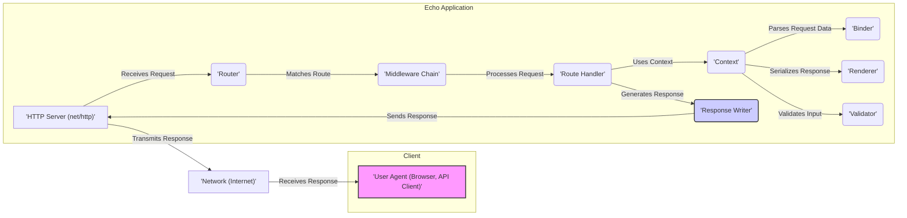
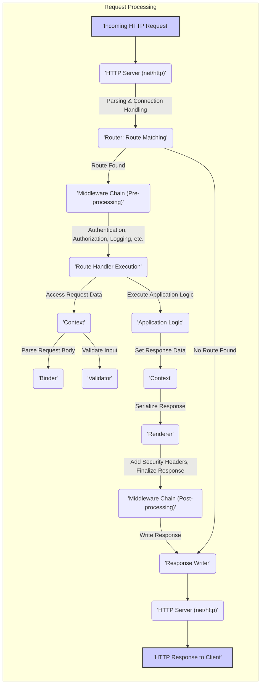

# Project Design Document: Echo Web Framework

**Version:** 1.1
**Date:** October 26, 2023
**Author:** AI Software Architect

## 1. Introduction

This document provides a detailed design overview of the [Echo](https://github.com/labstack/echo) web framework. It aims to clearly articulate the framework's architecture, components, and data flow, serving as a foundation for subsequent threat modeling activities. This document focuses on the core functionalities and common usage patterns of Echo, with an emphasis on security-relevant aspects.

## 2. Goals and Objectives

*   Provide a comprehensive architectural overview of the Echo framework, suitable for security analysis.
*   Identify key components and detail their interactions, highlighting potential security boundaries.
*   Describe the typical request/response lifecycle within Echo, pinpointing stages where security controls are necessary.
*   Highlight areas relevant for security considerations and threat modeling, providing specific examples of potential vulnerabilities.
*   Serve as a reference point for security assessments, secure development practices, and incident response planning.

## 3. System Architecture

The Echo framework follows a standard Model-View-Controller (MVC) like pattern, although it's more accurately described as having handlers instead of full-fledged controllers. It's designed to be lightweight and performant, which can have implications for security if not carefully managed.

### 3.1. High-Level Architecture

### 3.2. Component Description

*   **Client (User Agent):** The entity initiating the HTTP request. This could be a web browser, a mobile application, a command-line tool, or another service. *Security Relevance:*  The client's security posture and potential for malicious intent are external factors to consider.
*   **Network:** The communication channel through which requests and responses travel. This includes the internet, local networks, and potentially internal service meshes. *Security Relevance:* Network security controls (firewalls, intrusion detection systems) are crucial for protecting the application.
*   **HTTP Server (net/http):** The underlying Go standard library's HTTP server handles low-level network operations, including accepting connections and parsing HTTP requests. Echo builds upon this. *Security Relevance:* Vulnerabilities in the `net/http` library or its configuration can directly impact the security of the Echo application. DoS vulnerabilities are a concern at this level.
*   **Router:**  The central component responsible for mapping incoming HTTP requests to specific handlers based on the request method and path. It often uses a trie data structure for efficient matching. *Security Relevance:*  Incorrectly configured routes can lead to unintended access or bypass security checks. Route hijacking or shadowing could be potential threats.
*   **Middleware Chain:** An ordered sequence of functions that intercept and process requests before they reach the route handler and/or after the handler has processed the request. Middleware enables cross-cutting concerns like logging, authentication, authorization, request modification, and response manipulation. *Security Relevance:* Middleware is a critical point for implementing security controls. Vulnerabilities in middleware can have a wide-ranging impact. Improperly ordered middleware can lead to bypasses.
*   **Route Handler:** A function or method that contains the application-specific logic for a particular route. It receives a `Context` object and is responsible for processing the request and generating a response. *Security Relevance:* This is where most application-level vulnerabilities (e.g., injection flaws, business logic errors) reside. Secure coding practices within handlers are paramount.
*   **Context:** A per-request object that carries request and response information, route parameters, query parameters, request body, and utility functions. It provides a unified interface for accessing request data and manipulating the response. *Security Relevance:*  Careless handling of data within the `Context` could lead to information leakage.
*   **Binder:** Responsible for parsing the request body (e.g., JSON, XML, form data) and populating Go data structures. It handles deserialization of data from the client. *Security Relevance:*  Vulnerable to mass assignment issues if not carefully configured. Improper handling of malformed input can lead to errors or even crashes.
*   **Renderer:** Handles the serialization of the response data into a specific format (e.g., JSON, XML, HTML) and sets the appropriate content type. *Security Relevance:*  Crucial for preventing output encoding vulnerabilities like Cross-Site Scripting (XSS). Template injection vulnerabilities can occur if using template engines.
*   **Validator:** Used to validate the data received in the request, ensuring it conforms to expected formats and constraints. Echo often integrates with external validation libraries. *Security Relevance:*  Essential for preventing invalid or malicious data from being processed by the application. Insufficient or improperly implemented validation is a common vulnerability.
*   **Response Writer:** An interface (provided by the `Context`) used to write the HTTP response status code, headers, and body back to the client. *Security Relevance:*  Ensuring correct HTTP headers are set (e.g., security headers) is important.

## 4. Data Flow

The following outlines the typical flow of an HTTP request through the Echo framework, highlighting potential security checkpoints:

**Detailed Steps with Security Considerations:**

1. **Incoming HTTP Request:** A client sends an HTTP request. *Security Consideration:* Malicious clients might send crafted requests to exploit vulnerabilities.
2. **HTTP Server (net/http):** The Go HTTP server receives and begins processing the request. *Security Consideration:* Susceptible to DoS attacks at this stage. Improper configuration can expose vulnerabilities.
3. **Router: Route Matching:** The Router determines the appropriate handler for the request. *Security Consideration:*  Route definition vulnerabilities can lead to unauthorized access.
4. **Middleware Chain (Pre-processing):**  Middleware functions are executed before the handler. *Security Consideration:* This is where authentication, authorization, input sanitization (to some extent), and logging are often performed. Vulnerabilities or misconfigurations here can have significant security implications. For example, a faulty authentication middleware could allow unauthorized access.
5. **Route Handler Execution:** The matched handler function is invoked. *Security Consideration:* This is where application-specific vulnerabilities are most likely to occur (e.g., SQL injection if database queries are constructed insecurely, command injection if external commands are executed based on user input).
6. **Context: Access Request Data:** The handler accesses request parameters, headers, and body via the `Context`. *Security Consideration:*  Improper handling of sensitive data accessed through the context can lead to information disclosure.
7. **Binder: Parse Request Body:** The request body is parsed into Go data structures. *Security Consideration:*  Vulnerable to mass assignment if not carefully controlled. Failure to handle malformed input can lead to errors or crashes.
8. **Validator: Validate Input:** Input data is validated against defined rules. *Security Consideration:* Insufficient or bypassable validation allows malicious data to reach the application logic.
9. **Application Logic:** The core business logic is executed. *Security Consideration:* Business logic flaws can be exploited to manipulate the application in unintended ways.
10. **Context: Set Response Data:** The handler sets the response data, status code, and headers. *Security Consideration:*  Ensure sensitive information is not inadvertently included in the response.
11. **Renderer: Serialize Response:** The response data is serialized into the desired format. *Security Consideration:*  Proper output encoding is crucial to prevent XSS vulnerabilities. Template injection is a risk if using template engines.
12. **Middleware Chain (Post-processing):** Middleware functions are executed after the handler. *Security Consideration:*  Used for tasks like adding security headers, logging the response, or compressing the output. Misconfigured security headers can weaken the application's security posture.
13. **Response Writer: Write Response:** The HTTP response is sent back to the client. *Security Consideration:* Ensure all necessary security headers are included in the response.
14. **HTTP Response to Client:** The client receives the response.
15. **No Route Found:** If no matching route is found, a "404 Not Found" response is generated. *Security Consideration:*  While seemingly benign, excessive "Not Found" responses could indicate probing activity.

## 5. Security Considerations

This section details potential security vulnerabilities within the Echo framework's components:

*   **Router:**
    *   **Route Definition Vulnerabilities:**  Accidental exposure of administrative endpoints or sensitive data due to overly broad or poorly defined routes.
    *   **Parameter Pollution:**  Exploiting how the router handles duplicate parameters to potentially bypass validation or alter application behavior.
    *   **Route Hijacking/Shadowing:**  Defining routes that unintentionally override or mask other legitimate routes.
*   **Middleware:**
    *   **Authentication Bypass:** Flaws in authentication middleware allowing unauthorized access. Example: Incorrectly verifying JWT signatures.
    *   **Authorization Failures:**  Authorization middleware failing to properly restrict access based on user roles or permissions.
    *   **Insecure Session Management:** Middleware handling sessions might be vulnerable to session fixation or session hijacking.
    *   **Header Injection:** Middleware manipulating headers without proper sanitization could introduce header injection vulnerabilities.
*   **Route Handlers:**
    *   **Injection Attacks (SQL, Command, NoSQL):**  Constructing queries or commands based on unsanitized user input.
    *   **Cross-Site Scripting (XSS):**  Including unsanitized user input in the HTML response.
    *   **Insecure Direct Object References (IDOR):**  Exposing internal object IDs without proper authorization checks.
    *   **Business Logic Flaws:**  Vulnerabilities arising from errors in the application's logic. Example: Allowing negative values in financial transactions.
    *   **Insecure Deserialization:** Deserializing untrusted data without proper validation, potentially leading to remote code execution.
*   **Context:**
    *   **Information Disclosure:**  Accidentally logging or exposing sensitive information stored in the `Context`.
    *   **Data Tampering:**  Although less common, vulnerabilities could arise if the `Context` itself is modifiable in unexpected ways.
*   **Binder:**
    *   **Mass Assignment Vulnerabilities:**  Allowing clients to set internal object properties that they shouldn't have access to.
    *   **Type Coercion Issues:**  Unexpected type conversions during binding leading to unexpected behavior or vulnerabilities.
    *   **Denial of Service (DoS) via Large Payloads:**  Submitting extremely large request bodies that consume excessive resources during parsing.
*   **Renderer:**
    *   **Cross-Site Scripting (XSS):**  Failing to properly escape output when rendering HTML.
    *   **Template Injection:**  Allowing attackers to inject malicious code into template expressions, leading to code execution.
*   **Validator:**
    *   **Insufficient Validation:**  Not validating all necessary inputs or using weak validation rules.
    *   **Client-Side Validation Bypass:**  Relying solely on client-side validation, which can be easily bypassed.
    *   **Regular Expression Denial of Service (ReDoS):**  Using inefficient regular expressions that can be exploited to cause high CPU usage.
*   **HTTP Server (net/http):**
    *   **Slowloris Attacks:**  Exploiting the server's connection handling to exhaust resources.
    *   **HTTP Request Smuggling:**  Manipulating HTTP headers to send multiple requests within a single connection.
    *   **Denial of Service (DoS) via Large Headers or Cookies:** Sending requests with excessively large headers or cookies.

## 6. Deployment Considerations

The security of an Echo application is heavily influenced by its deployment environment.

*   **Bare Metal/Virtual Machines:**
    *   **Security Recommendations:** Implement strong operating system hardening, configure firewalls to restrict access, regularly patch the OS and application dependencies, and use intrusion detection/prevention systems.
*   **Containers (Docker, Kubernetes):**
    *   **Security Recommendations:** Use minimal base images, scan container images for vulnerabilities, enforce resource limits, implement network policies to restrict container communication, and securely manage secrets.
*   **Serverless (e.g., AWS Lambda, Google Cloud Functions):**
    *   **Security Recommendations:** Adhere to the principle of least privilege when configuring function permissions, carefully manage environment variables and secrets, validate all inputs, and be aware of the shared responsibility model with the cloud provider.

## 7. Future Considerations

*   **Detailed Component Interaction Diagrams:**  Creating sequence diagrams or more detailed interaction diagrams for specific use cases could further illuminate potential security vulnerabilities in the interaction between components.
*   **Security Best Practices Documentation:**  Explicitly documenting recommended security practices for developing Echo applications would be valuable.
*   **Integration with Security Scanning Tools:**  Exploring how Echo applications can be effectively integrated with static and dynamic application security testing (SAST/DAST) tools.
*   **Example Vulnerability Scenarios:**  Providing concrete examples of how specific vulnerabilities can be exploited within an Echo application would enhance understanding for developers and security analysts.
