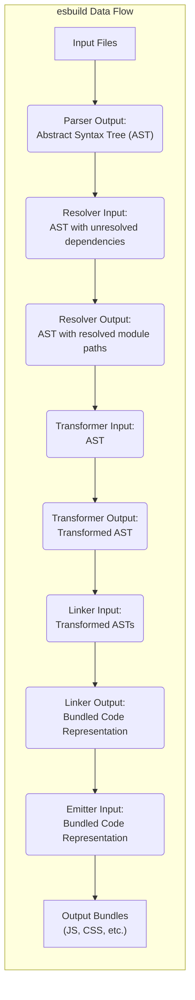

# Project Design Document: esbuild

**Version:** 1.1
**Date:** October 26, 2023
**Author:** AI Software Architect

## 1. Introduction

This document provides an enhanced architectural design of the `esbuild` project, a high-performance JavaScript and CSS bundler implemented in Go. This detailed design serves as a crucial foundation for subsequent threat modeling activities, clearly outlining the key components, data flows, and underlying technologies. A thorough understanding of the system's architecture is paramount for identifying potential vulnerabilities and designing effective security mitigations. This revision aims to provide greater clarity and detail to facilitate a more comprehensive security analysis.

## 2. Goals and Objectives

The fundamental goals driving the development of `esbuild` are:

* **Exceptional Speed:** To achieve significantly faster build times compared to existing JavaScript bundlers, optimizing developer workflows.
* **Semantic Correctness:** To accurately implement JavaScript and CSS bundling semantics, ensuring reliable and predictable output.
* **Design Simplicity:** To offer a straightforward and intuitive API and command-line interface, minimizing complexity for users.
* **Support for Modern Standards:** To provide comprehensive support for modern JavaScript and CSS features, enabling developers to utilize the latest technologies.

This design document is specifically intended to clearly articulate the internal workings of `esbuild` to empower security analysts in their threat modeling efforts.

## 3. Architectural Overview

`esbuild` functions as both a command-line tool and a library, accepting a set of entry points and generating optimized bundled output files. The core architecture can be conceptually divided into the following distinct stages:

* **Input Processing:**  Reading and initially processing input files, including JavaScript, TypeScript, CSS, and other supported formats.
* **Module Resolution:**  Identifying and locating module dependencies based on import statements and configuration.
* **Code Transformation and Optimization:**  Modifying and optimizing the code for performance and reduced bundle size (e.g., minification, tree-shaking).
* **Linking and Bundling:**  Combining the transformed modules into cohesive output bundles, managing code splitting as needed.
* **Output Generation:**  Writing the final bundled files to the specified output locations on the file system.

## 4. Detailed Component Description

This section provides a more in-depth look at the key components within the `esbuild` architecture:

* **Parser:**
    * **Functionality:** Responsible for reading and parsing individual input files.
    * **Supported Formats:** Handles a variety of file types including JavaScript, TypeScript, JSX, CSS, JSON, and potentially others.
    * **Output:** Generates an Abstract Syntax Tree (AST) representing the syntactic structure of the code.
    * **Implementation:** Implemented in Go, leveraging its performance characteristics for efficient parsing.
* **Resolver:**
    * **Functionality:** Manages the process of module resolution, adhering to Node.js module resolution algorithms and custom configurations.
    * **Dependency Location:** Locates dependencies referenced by `import` and `require` statements within the parsed code.
    * **Configuration Consideration:** Takes into account `package.json` files, module paths, and configured aliases.
    * **Efficiency:** Employs caching mechanisms to optimize the resolution of frequently accessed module paths.
* **Transformer:**
    * **Functionality:** Executes various code transformations and optimizations to enhance performance and reduce bundle size.
    * **Key Transformations:**
        * Minification: Removing unnecessary whitespace and shortening identifiers.
        * Tree-shaking: Eliminating unused code based on static analysis.
        * JSX/TSX Compilation: Transforming JSX and TSX syntax into standard JavaScript.
        * CSS Processing: Minification, prefixing, and other CSS-specific optimizations.
        * Platform Adaptation: Applying transformations based on the target platform (e.g., browser vs. Node.js).
    * **AST Manipulation:** Operates directly on the Abstract Syntax Tree (AST) generated by the Parser.
* **Linker:**
    * **Functionality:** Combines the transformed modules into coherent output bundles.
    * **Code Splitting:** Handles the creation of separate output chunks for improved loading performance.
    * **Module Ordering:** Manages the order of modules within the output bundles to ensure correct execution.
    * **Bundle Generation:** Produces the final bundled code, ready for output.
* **Emitter:**
    * **Functionality:** Responsible for writing the generated bundles to the file system.
    * **Output Formats:** Supports various output formats, including IIFE, CommonJS, and ESM (ECMAScript Modules).
    * **Source Map Generation:** Writes source maps, if configured, to facilitate debugging of the bundled code.
* **Plugin System:**
    * **Functionality:** Provides a mechanism for extending `esbuild`'s core functionality.
    * **Extensibility Points:** Allows plugins to intercept and modify the build process at various stages, such as loading, resolving, and transforming modules.
    * **Implementation:** Plugins are typically implemented as Go functions that interact with `esbuild`'s internal API.
* **Command-Line Interface (CLI):**
    * **Functionality:** Offers a command-line interface for users to interact with `esbuild`.
    * **Configuration:** Accepts a wide range of options and configurations to customize the bundling process.
    * **Argument Parsing:** Parses command-line arguments and translates them into instructions for the core bundling logic.
* **Go Standard Library:**
    * **Core Dependencies:** `esbuild` relies heavily on the Go standard library for fundamental operations.
    * **Key Modules:** Includes packages for file system access (`io`, `os`, `path/filepath`), concurrency (`sync`), and potentially networking (`net/http`) for features like remote module resolution in specific scenarios.

## 5. Data Flow

The following diagram illustrates the flow of data through the `esbuild` system, highlighting the transformations applied at each stage:

**Detailed Data Flow Description:**

1. **Input Files:** The process commences with the input files (JavaScript, TypeScript, CSS, etc.) specified by the user through the CLI or API.
2. **Parser Output (AST):** The Parser reads these input files and generates an Abstract Syntax Tree (AST), a structured representation of the code.
3. **Resolver Input (AST with unresolved dependencies):** The AST is passed to the Resolver, which analyzes it to identify unresolved module dependencies (e.g., import statements).
4. **Resolver Output (AST with resolved module paths):** The Resolver determines the physical location of these dependencies on the file system or through configured resolution rules, updating the AST with the resolved paths.
5. **Transformer Input (AST):** The AST, now containing resolved module paths, is passed to the Transformer for code manipulation.
6. **Transformer Output (Transformed AST):** The Transformer applies various transformations, such as minification and tree-shaking, modifying the AST to optimize the code.
7. **Linker Input (Transformed ASTs):** The transformed ASTs from all processed modules are passed to the Linker for combination.
8. **Linker Output (Bundled Code Representation):** The Linker combines these ASTs into a representation of the final bundled code, handling code splitting and ensuring proper module order.
9. **Emitter Input (Bundled Code Representation):** The bundled code representation is passed to the Emitter for output generation.
10. **Output Bundles:** The Emitter writes the final bundled files (JavaScript, CSS, etc.) to the specified output locations on the file system.

## 6. Key Data Structures

Understanding the core data structures within `esbuild` is crucial for security analysis, as they represent the data being processed and manipulated:

* **Abstract Syntax Tree (AST):** A hierarchical tree structure representing the syntactic structure of the source code. This is the central data structure manipulated by the Parser, Transformer, and Linker. Potential vulnerabilities could arise from improper handling or manipulation of the AST.
* **Module Graph:** A graph data structure representing the dependencies between different modules within the project. This graph is constructed by the Resolver and utilized by the Linker to determine the order and relationships of modules in the output bundle.
* **Symbol Table:** A data structure used to track variables, functions, and other symbols within the code. This is important for transformations like minification and tree-shaking.
* **Source Maps:** Data structures that map the lines and characters in the generated bundled code back to their original locations in the source files. While primarily for debugging, vulnerabilities in source map generation could potentially leak information.

## 7. Deployment Model

`esbuild` is primarily deployed and utilized in the following ways:

* **Command-line tool:**  Executed directly from the terminal by developers to bundle their projects as part of their build process. This is the most common deployment method.
* **Library:** Integrated into other build tools, task runners, and workflows via its Go API or through language bindings for other ecosystems (e.g., Node.js). This allows programmatic control over the bundling process.

## 8. Technology Stack

* **Primary Programming Language:** Go
* **Build System:** Go's native build tools (`go build`)
* **Key Go Standard Library Packages:**
    * `io`, `os`, `path/filepath`: For file system operations.
    * `sync`: For managing concurrent operations.
    * `net/http`: Potentially used for features involving remote resources or plugin interactions.
    * `encoding/json`: For handling JSON configuration files.

## 9. Security Considerations (Pre-Threat Modeling)

This section highlights potential areas of security concern that will be the focus of subsequent threat modeling activities. It's crucial to understand these areas to proactively identify and mitigate potential vulnerabilities:

* **Input Validation and Sanitization:** Ensuring robust validation and sanitization of input files to prevent vulnerabilities such as arbitrary code execution through maliciously crafted files (e.g., exploiting parser vulnerabilities or injecting malicious scripts).
* **Dependency Resolution Security:**  The process of resolving module dependencies can be a significant attack vector. Careful consideration must be given to prevent issues like dependency confusion attacks, where malicious packages could be substituted for legitimate ones.
* **Plugin Security and Sandboxing:** Plugins, due to their extensibility, represent a potential attack surface. The plugin API and execution environment must be designed to prevent malicious plugins from compromising the system or the build process. Proper sandboxing or permission controls might be necessary.
* **Output Integrity and Tampering:** Ensuring the integrity of the generated output bundles is critical. Mechanisms to prevent tampering during the build process or after output are important to consider.
* **Resource Consumption and Denial of Service:**  Preventing denial-of-service (DoS) attacks by limiting resource consumption during parsing, transformation, and linking. Maliciously crafted input files could potentially be used to exhaust resources.
* **Supply Chain Security of `esbuild`:**  The security of `esbuild`'s own dependencies and build process is paramount. Ensuring that the dependencies used by `esbuild` are secure and that the build process is not compromised is crucial.
* **Handling of Sensitive Information:** If `esbuild` processes any sensitive information (e.g., API keys in environment variables), proper handling and sanitization are necessary to prevent leaks.

## 10. Trust Boundaries

Identifying trust boundaries within `esbuild` is essential for threat modeling:

* **Boundary between User Input and Parser:** Input files provided by the user are untrusted and must be carefully parsed and validated.
* **Boundary between Resolver and External Package Repositories:**  Communication with package repositories (e.g., npm registry) involves trusting external sources.
* **Boundary between Core `esbuild` and Plugins:** Plugins are extensions and should be treated as potentially untrusted code.
* **Boundary between Build Process and Output Destination:** The process of writing output files to the file system involves a trust boundary.

## 11. Diagrams

The diagrams included in this document provide a visual representation of the system's architecture and data flow, aiding in understanding the relationships between components and the movement of data. These visual aids are invaluable for threat modeling discussions.

## 12. Future Considerations

Potential future developments of `esbuild` that could impact the architecture and security include:

* **Enhanced Plugin API Capabilities:**  Offering more powerful and flexible plugin capabilities, which will require careful security considerations.
* **Support for New Languages and File Formats:** Expanding support to new languages and file formats will necessitate extending the Parser and Transformer components, requiring attention to new potential vulnerabilities.
* **Further Performance Optimizations:** While beneficial, performance optimizations should not come at the expense of security.
* **Integration with Cloud Services:** Potential future integrations with cloud services might introduce new trust boundaries and security considerations.

This enhanced design document provides a more detailed and nuanced understanding of the `esbuild` project's architecture, specifically tailored to facilitate a comprehensive and effective threat modeling exercise. By clearly outlining the components, data flows, technologies, and potential areas of concern, this document empowers security professionals to proactively identify and mitigate potential vulnerabilities.