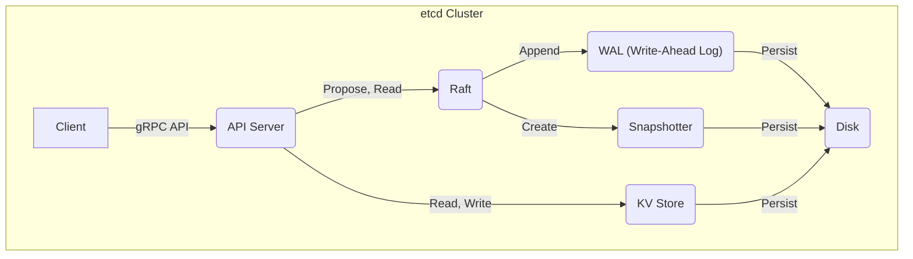
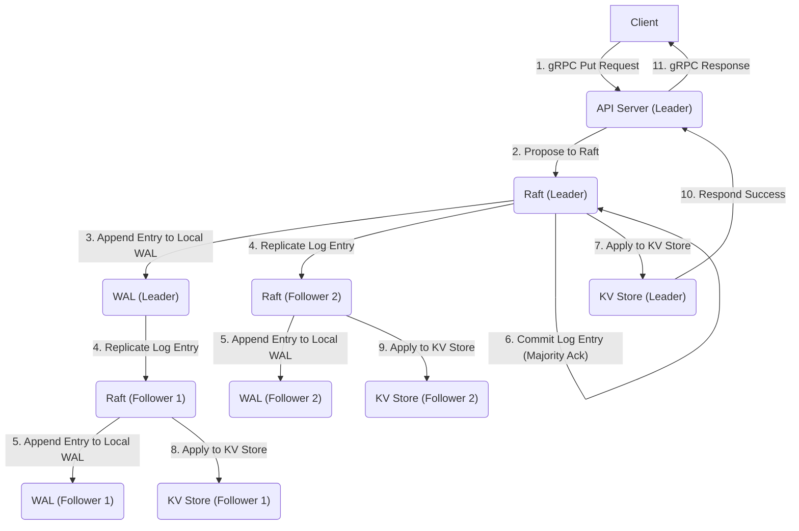
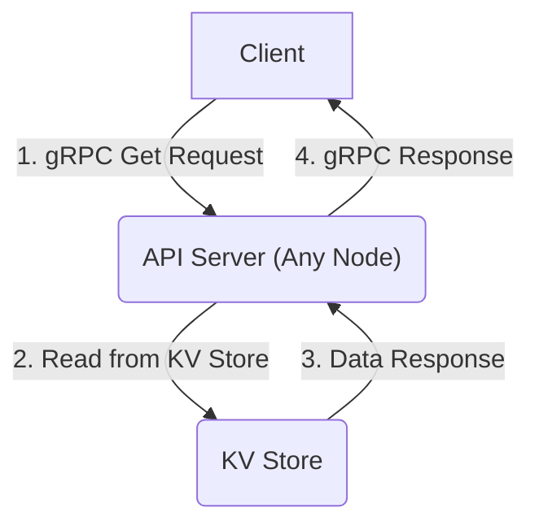
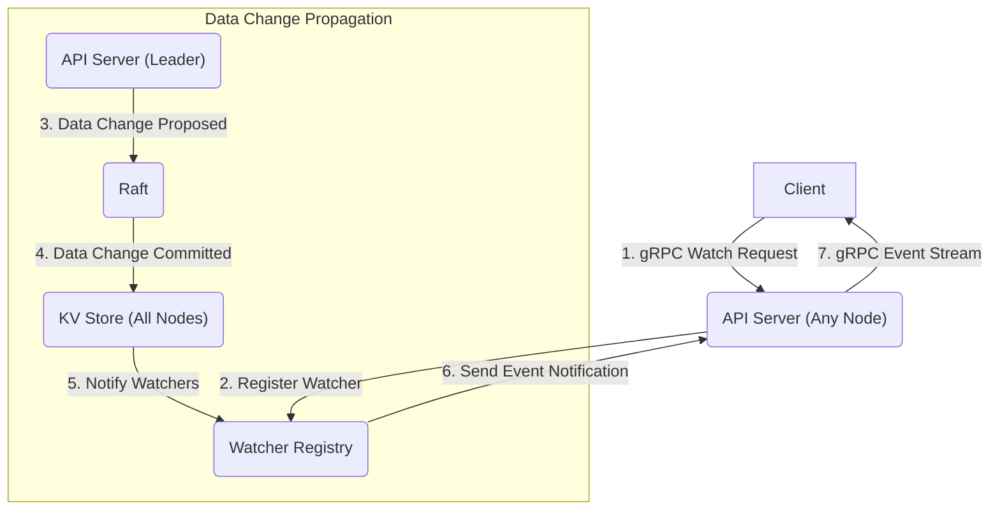
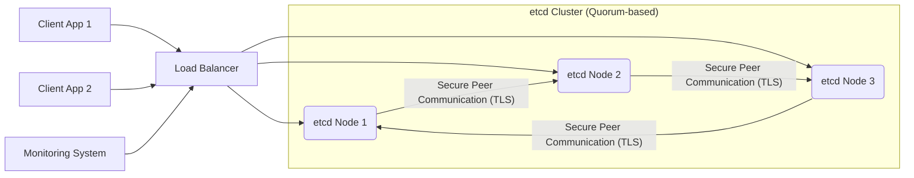

## Project Design Document: etcd (Improved)

**Version:** 1.1
**Date:** October 26, 2023
**Author:** AI Software Architect

### 1. Introduction

This document provides an enhanced and more detailed design overview of the etcd project, a distributed, reliable key-value store critical for managing the most sensitive data in distributed systems. This iteration aims to offer an even more granular understanding of etcd's architecture, individual components, and the intricate pathways of data flow. This refined documentation will serve as a robust and precise foundation for subsequent threat modeling activities, enabling a more thorough security analysis.

### 2. Goals and Objectives

The primary goals of this design document are to:

*   Articulate the architecture and constituent components of etcd with increased precision and detail.
*   Elucidate the interactions and dependencies between the various etcd components.
*   Thoroughly describe the data flow within the etcd system, covering various operational scenarios.
*   Identify and elaborate on the key technologies and external dependencies that underpin etcd's functionality.
*   Provide a highly detailed and accurate foundation for identifying potential security vulnerabilities, attack surfaces, and threat vectors during subsequent threat modeling exercises.

### 3. High-Level Architecture

etcd is architected as a clustered system, emphasizing strong consistency and high availability through its distributed nature. The core components work in concert to maintain the integrity and reliability of the distributed key-value store.

**Key Components:**

*   **Client:** External applications, services, or command-line tools that interact with the etcd cluster to perform operations on key-value pairs, such as reading, writing, and subscribing to change notifications.
*   **API Server:** The primary interface for client interactions. It manages incoming requests, handling authentication, authorization, request validation, and routing requests to the appropriate internal modules, primarily the Raft module for write operations.
*   **Raft:** The implementation of the Raft consensus algorithm, which is fundamental to ensuring data consistency and fault tolerance across the etcd cluster. It manages leader election, log replication, and the commitment of changes in a distributed manner.
*   **WAL (Write-Ahead Log):** A persistent, append-only record of all proposed changes to the etcd state before they are applied to the KV Store. This ensures data durability and enables recovery from failures by replaying the log.
*   **Snapshotter:** A component responsible for periodically creating point-in-time snapshots of the current state of the KV Store. This mechanism significantly reduces recovery time by minimizing the number of WAL entries that need to be replayed upon restart.
*   **Disk:** The persistent storage medium where the WAL files, snapshots, and the underlying KV Store data are physically stored. The performance and reliability of this layer are critical for etcd's overall operation.
*   **KV Store:** The core component responsible for storing the actual key-value data managed by etcd. It provides efficient mechanisms for data retrieval and modification and is typically implemented using an embedded, high-performance key-value database.

### 4. Component Breakdown

This section provides a more granular and detailed description of each key component within the etcd architecture:

*   **Client:**
    *   Communicates with the etcd cluster exclusively through the gRPC protocol, leveraging its efficiency and strong typing.
    *   Submits requests for a wide range of key-value operations, including `Put`, `Get`, `Delete`, `Txn` (transactions), and more.
    *   Can establish long-lived watch connections to receive real-time notifications of changes to specific keys or ranges of keys.
    *   Utilizes client libraries available in various programming languages, simplifying integration with diverse application environments.

*   **API Server:**
    *   Listens for incoming client requests on a configurable port, with the standard port for client communication being 2379.
    *   Enforces authentication and authorization policies based on configured mechanisms, such as TLS client certificates, basic authentication with usernames and passwords, or other authentication plugins.
    *   Performs rigorous validation of incoming requests to ensure they adhere to the expected format and semantics.
    *   For write requests (modifying data), it proposes the change to the Raft module for consensus.
    *   For read requests (retrieving data), it directly serves the information from the local KV Store, optimizing for read performance.
    *   Manages watch requests by registering client interest in specific keys or prefixes within a dedicated watcher registry and dispatching notifications when changes occur.

*   **Raft:**
    *   Implements the Raft consensus algorithm, a proven method for achieving distributed consensus in a fault-tolerant manner.
    *   Handles leader election dynamically, ensuring that the cluster can continue operating even if the current leader fails.
    *   Manages log replication by transmitting proposed changes (log entries) from the leader to the follower nodes in the cluster.
    *   Ensures log consistency across all nodes through a voting mechanism, where a majority of the cluster must acknowledge a log entry before it is considered committed.
    *   Facilitates membership changes (adding or removing nodes) in a safe and consistent way, allowing the cluster to scale and adapt to changing conditions.

*   **WAL (Write-Ahead Log):**
    *   Implemented as an append-only file on persistent storage, guaranteeing the ordered and durable recording of every proposed state change.
    *   Crucial for ensuring data durability, as changes are written to the WAL and flushed to disk before being applied to the KV Store and considered committed.
    *   Plays a vital role in recovery scenarios, allowing a node to reconstruct its state by replaying the WAL entries from the last known consistent point.
    *   Each log entry contains the proposed change itself, along with essential metadata such as the term number and log index.

*   **Snapshotter:**
    *   Periodically captures the complete, current state of the KV Store and persists it to disk as a snapshot file.
    *   Significantly reduces the time required for a node to recover from a failure, as it can load the latest snapshot instead of replaying a potentially lengthy WAL.
    *   Enables log compaction by providing a point from which the WAL can be truncated, reclaiming disk space occupied by older, already snapshotted entries.

*   **Disk:**
    *   Represents the underlying persistent storage subsystem where critical etcd data, including WAL files and snapshots, are stored.
    *   The input/output operations per second (IOPS) and latency characteristics of the disk subsystem directly impact etcd's performance and responsiveness.
    *   The reliability and durability of the disk storage are paramount for ensuring data integrity and preventing data loss.

*   **KV Store:**
    *   Serves as the central repository for all key-value data managed by etcd.
    *   Provides highly optimized read and write operations, crucial for the performance of applications relying on etcd.
    *   Typically implemented using a high-performance, embedded key-value database such as BoltDB or its fork, bbolt, known for their efficiency and reliability.
    *   Supports transactional operations within the context of the Raft consensus, ensuring atomicity and consistency of multi-key updates.

### 5. Data Flow

This section provides a detailed walkthrough of the data flow during various operations within the etcd cluster:

**Write Request Flow (Illustrating Consensus):**

**Detailed Steps:**

1. The client initiates a data modification by sending a gRPC write request (e.g., a `Put` request to store a key-value pair) to the currently elected leader API server.
2. The leader API server receives the request and proposes the change to the Raft module running on the same node.
3. The Raft leader appends the proposed change as a new entry to its local Write-Ahead Log (WAL).
4. The Raft leader then proceeds to replicate this log entry to all the follower nodes in the etcd cluster.
5. Each follower node, upon receiving the replicated log entry, appends it to its own local WAL.
6. The Raft leader waits for acknowledgment from a majority of the cluster (including itself) that the log entry has been successfully written to their WALs. Once a quorum is reached, the log entry is considered committed.
7. The Raft leader applies the committed log entry to its local KV Store, making the change effective on the leader node.
8. The follower nodes also apply the committed log entry to their respective local KV Stores, ensuring data consistency across the cluster.
9. Once the change has been applied locally, the leader API server sends a success response back to the originating client.

**Read Request Flow (Direct Serving):**

**Detailed Steps:**

1. The client sends a gRPC read request (e.g., a `Get` request to retrieve the value associated with a specific key) to any of the active etcd cluster members. Read requests do not necessarily need to be routed to the leader.
2. The API server on the receiving node directly retrieves the requested data from its local KV Store. Since etcd maintains strong consistency, any node should have the latest data.
3. The KV Store returns the requested data to the local API server.
4. The API server then sends the retrieved data back to the client in the gRPC response.

**Watch Request Flow (Real-time Notifications):**

**Detailed Steps:**

1. The client sends a gRPC watch request to subscribe to changes for a specific key or a range of keys. This request can be sent to any etcd node.
2. The API server receiving the request registers the client's interest in the Watcher Registry, a component responsible for managing active watch subscriptions.
3. When a data change occurs (initiated by a write request and processed through the consensus mechanism), the committed change is applied to the KV Stores of all nodes in the cluster.
4. The KV Store (or an associated notification mechanism) informs the Watcher Registry about the committed change and the keys that were affected.
5. The Watcher Registry identifies all clients that have registered watches for the affected keys or ranges.
6. The API server then sends an event notification to the interested client(s) through the established long-lived gRPC stream, informing them of the change.

### 6. Key Technologies

*   **Go:** The primary programming language in which etcd is developed, leveraging its concurrency features and performance characteristics.
*   **gRPC:** The high-performance, open-source framework utilizing Protocol Buffers for efficient and strongly-typed communication between clients and the etcd cluster, as well as for internal communication between etcd nodes.
*   **Raft:** The foundational consensus algorithm implemented within etcd, ensuring fault tolerance and strong consistency across the distributed key-value store.
*   **BoltDB/bbolt:** The embedded key-value database (bbolt being a fork of BoltDB) used as the default storage engine for the KV Store, chosen for its performance and suitability for embedded use cases.
*   **Protocol Buffers:** A language-neutral, platform-neutral, extensible mechanism for serializing structured data, used by gRPC for defining service interfaces and message formats.
*   **TLS (Transport Layer Security):** The cryptographic protocol used to secure communication channels, providing encryption and authentication for both client-to-server and server-to-server communication within the etcd ecosystem.

### 7. Deployment Architecture

etcd is typically deployed in a clustered configuration to achieve high availability and fault tolerance. Common deployment patterns include:

*   **Single-Node Deployment:** Primarily intended for development, testing, or non-critical environments. Offers no redundancy and is susceptible to single points of failure.
*   **Clustered Deployment (Highly Recommended):** Consists of multiple etcd nodes, ideally an odd number (e.g., 3, 5, or 7), to form a quorum and tolerate node failures without losing data or availability.

**Deployment Best Practices and Considerations:**

*   **Network Latency:** Maintaining low network latency between etcd nodes is critical for optimal performance of the Raft consensus algorithm. High latency can lead to increased proposal times and potential instability.
*   **Dedicated Disk I/O:**  Provisioning fast and reliable disk storage with sufficient IOPS is essential for the performance of WAL writes and snapshot operations. Solid-state drives (SSDs) are generally recommended.
*   **Robust Security Configuration:** Implementing strong security measures, including mutual TLS authentication for both client and peer communication, role-based access control (RBAC), and secure network configurations, is paramount.
*   **Comprehensive Monitoring:** Implementing comprehensive monitoring of key etcd metrics, such as leader election frequency, proposal latency, disk I/O, and resource utilization, is crucial for proactive identification and resolution of potential issues.

### 8. Security Considerations (Pre-Threat Modeling)

This section highlights built-in security features and important security considerations within etcd, setting the stage for a more detailed threat analysis:

*   **Mutual TLS Authentication (Client & Peer):** etcd strongly supports and recommends mutual TLS authentication for both client connections and communication between cluster members, ensuring that only authenticated and authorized entities can participate.
*   **Role-Based Access Control (RBAC):** A sophisticated RBAC system allows administrators to define roles with specific permissions and assign these roles to users or applications, controlling access to keys and operations within the etcd store.
*   **Authentication Plugins:** etcd's architecture allows for the integration of pluggable authentication mechanisms, enabling seamless integration with existing enterprise identity providers and authentication infrastructure (e.g., LDAP, OIDC).
*   **Encrypted Communication (TLS):** All network communication, both between clients and the cluster and between nodes within the cluster, can and should be encrypted using TLS to protect data in transit from eavesdropping and tampering.
*   **Audit Logging:** etcd provides configurable audit logging capabilities, allowing administrators to track API requests, authentication attempts, and other significant events for security monitoring and compliance purposes.
*   **Quorum-Based Fault Tolerance:** The underlying Raft consensus algorithm inherently provides a degree of resilience against node failures and data corruption, as a majority of the cluster must agree on changes, preventing single points of failure from compromising data integrity.

### 9. Assumptions and Constraints

*   This design document primarily focuses on the core operational aspects of etcd in a typical clustered deployment scenario. Advanced features or less common configurations may not be covered in exhaustive detail.
*   It is assumed that the reader possesses a foundational understanding of distributed systems concepts, consensus algorithms, and basic security principles.
*   The subsequent threat modeling exercise will directly leverage the detailed information presented within this document as its primary input.

### 10. Out of Scope

The following topics are explicitly excluded from the scope of this design document:

*   Detailed, low-level implementation specifics of the Raft algorithm or the underlying storage engine (BoltDB/bbolt).
*   In-depth performance benchmarking results or specific optimization techniques for various workloads.
*   Highly specific deployment configurations tailored to particular cloud providers or infrastructure environments.
*   Detailed code-level analysis or architectural decisions made during the development process.

### 11. Future Considerations

*   Exploring deeper integration with Hardware Security Modules (HSMs) for enhanced security of cryptographic keys used for TLS and other security features.
*   Further enhancements to the audit logging framework, potentially including more granular event tracking and integration with external security information and event management (SIEM) systems.
*   Continuous improvements and extensions to the Role-Based Access Control (RBAC) system to provide even finer-grained access control capabilities.
*   Evaluation and potential adoption of alternative or next-generation storage backends for the KV Store to improve performance or address specific use case requirements.

This improved document provides a more comprehensive and detailed design overview of the etcd project. The enhanced descriptions of components, refined data flow diagrams, and expanded security considerations offer a stronger foundation for subsequent threat modeling activities.