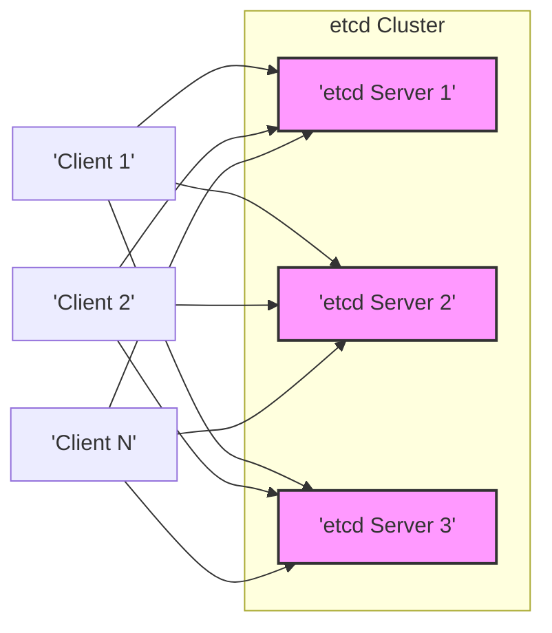
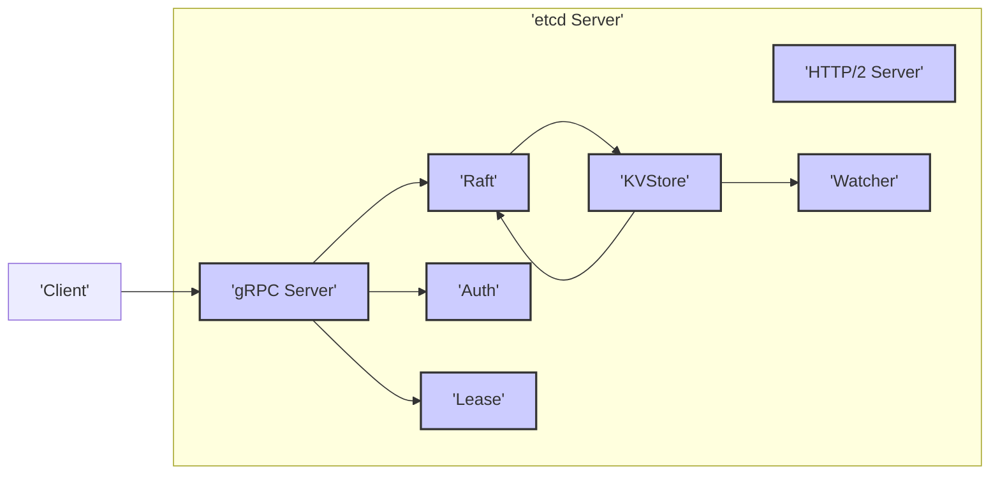
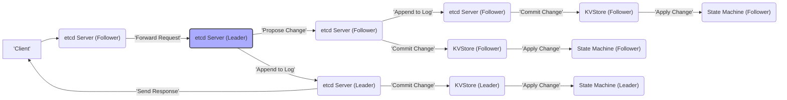
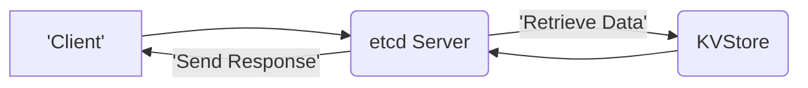
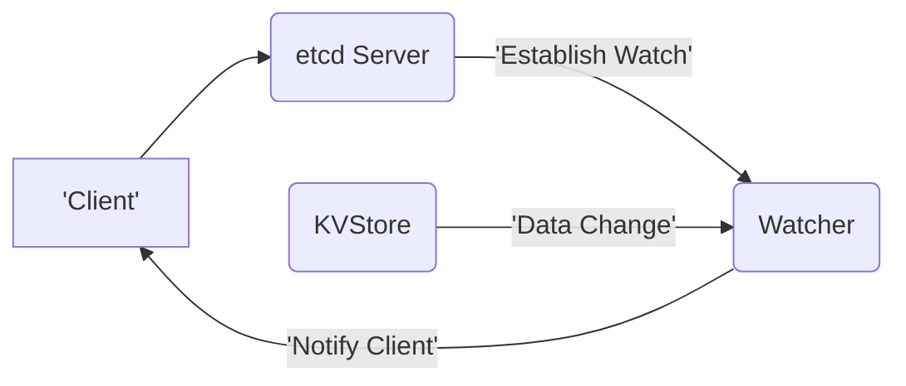

# Project Design Document: etcd

**Version:** 1.1
**Date:** October 26, 2023
**Author:** AI Software Architect

## 1. Introduction

This document provides a detailed design overview of the etcd project, a distributed reliable key-value store crucial for managing the most critical data in distributed systems. It serves as a foundational resource for understanding the system's architecture, internal components, and data flow, which is essential for conducting thorough threat modeling activities. This document prioritizes clarity and comprehensiveness, with a specific focus on aspects relevant to security vulnerabilities and potential attack vectors.

## 2. Goals and Objectives

The primary design goals of etcd are:

- **Strong Reliability:** Ensuring data durability and high availability, even in the presence of network partitions, hardware failures, or software errors. This includes mechanisms for data replication and fault tolerance.
- **Strict Consistency:** Providing a linearizable view of the data across all clients, guaranteeing that all clients see the same data at the same time. This is achieved through the Raft consensus algorithm.
- **Low Latency:** Offering fast read and write operations to minimize impact on dependent applications.
- **Operational Simplicity:** Maintaining a straightforward API, configuration, and operational model to reduce complexity for developers and operators.
- **Robust Security:** Protecting the confidentiality, integrity, and availability of the stored data and the system itself through various security mechanisms.

This design document emphasizes the architectural elements that contribute to these goals, particularly reliability, consistency, and security, providing the necessary context for effective threat modeling.

## 3. High-Level Architecture

etcd operates as a distributed cluster of servers, relying on the Raft consensus algorithm to maintain a consistent and fault-tolerant key-value store. Clients interact with the cluster to perform read and write operations. Clients can connect to any server in the cluster.

Key characteristics of the high-level architecture:

- **Distributed Consensus via Raft:** The Raft algorithm ensures that all members of the cluster agree on the state of the data, even in the face of failures. This involves leader election, log replication, and safety guarantees.
- **Leader-Based Operations:** One server is elected as the leader and is responsible for handling all write requests and coordinating the consensus process. This simplifies the implementation of consistency.
- **Data Replication for Fault Tolerance:** Data is replicated across multiple servers in the cluster. If one server fails, the remaining servers can continue to operate, ensuring high availability.
- **Client API Abstraction:** Clients interact with the cluster through a well-defined gRPC API, abstracting away the complexities of the underlying distributed system.

## 4. Detailed Component Design

This section provides a detailed breakdown of the key components within an individual etcd server and their interactions. Understanding these components is crucial for identifying potential attack surfaces.

### 4.1. etcd Server Components

An individual etcd server is composed of several tightly integrated modules:

- **Raft Consensus Module:** Implements the core Raft consensus algorithm.
    - **Log:** A persistent, ordered sequence of proposed changes to the key-value store. Each entry represents a command to be executed on the state machine.
    - **State Machine:** Applies committed entries from the Raft log to the actual key-value store, ensuring consistency across the cluster.
    - **Leader Election Mechanism:** Manages the process of electing a new leader when the current leader fails or becomes unavailable. This involves voting and timeouts.
    - **Membership Management:** Handles adding and removing members from the etcd cluster, ensuring that the cluster can dynamically adapt to changes in its composition.
- **KVStore (Key-Value Store):** The central component responsible for storing and managing the key-value data.
    - **In-memory B-tree:** Provides efficient read and write operations on the stored data. The B-tree structure allows for logarithmic time complexity for most operations.
    - **Write-Ahead Log (WAL):** A persistent log that records every transaction before it is applied to the in-memory store. This ensures data durability even if the server crashes before the data is fully written to disk.
    - **Snapshotting Mechanism:** Periodically saves the current state of the KVStore to disk. This reduces the amount of WAL that needs to be replayed during server restarts, improving startup time.
- **gRPC API Server:** Provides the primary interface for clients to interact with the etcd server.
    - **Authentication Layer:** Verifies the identity of clients attempting to connect to the server. This can involve TLS client certificates or other authentication mechanisms.
    - **Authorization Layer:** Controls access to specific keys or operations based on the authenticated client's roles and permissions. This implements the RBAC policies.
    - **Request Handling Logic:** Processes incoming client requests (put, get, delete, watch, etc.), coordinating with other components to fulfill these requests.
- **HTTP/2 Server (for Metrics and Health Checks):** Exposes endpoints for monitoring the server's health and performance metrics. This is crucial for operational awareness.
- **Auth Module:** Manages authentication and authorization policies within the etcd cluster.
    - **User Management System:** Stores user credentials and associated roles.
    - **Role-Based Access Control (RBAC) Implementation:** Defines roles and the permissions associated with each role, allowing for granular control over data access.
- **Lease Management:** Manages distributed leases, which are time-bound key associations. This is used for implementing features like leader election in other distributed systems and distributed locks.
- **Watcher System:** Allows clients to subscribe to changes on specific keys or prefixes. When a change occurs, the server notifies the registered clients.

### 4.2. Client Components

Clients interacting with etcd typically include libraries or applications that utilize the etcd gRPC API. Key client functionalities include:

- **Connection Management:** Establishing and maintaining connections to one or more etcd server endpoints. Clients often implement retry logic and load balancing across available servers.
- **Request Serialization and Deserialization:** Converting client requests into the gRPC protocol format and parsing responses from the server.
- **Secure Communication Handling:** Implementing TLS to ensure secure communication with the etcd servers, including handling certificate verification.
- **Session Management (for Watchers):** Maintaining persistent connections for receiving watch events from the server.

## 5. Data Flow

This section details the flow of data during critical operations, highlighting potential points of interaction and security considerations.

### 5.1. Write Operation (Put Request)

1. **Client Initiates Request:** A client sends a "put" request containing a key-value pair to an etcd server.
2. **Request Reception and Authentication:** The receiving etcd server's gRPC server receives the request and performs authentication of the client.
3. **Authorization Check:** The Auth module verifies if the authenticated client has the necessary permissions to write to the specified key.
4. **Forwarding to Leader (if necessary):** If the receiving server is not the leader, it forwards the request to the current leader of the etcd cluster.
5. **Raft Proposal:** The leader proposes the write operation (the key-value pair) to the other follower servers in the cluster.
6. **Log Replication:** Followers append the proposed operation to their local Raft log.
7. **Quorum Commitment:** Once a majority of the cluster (including the leader) has appended the entry to their logs, the leader commits the entry.
8. **State Machine Application:** The leader applies the committed operation to its local KVStore's in-memory B-tree.
9. **Follower Application:** Followers also apply the committed operation to their respective KVStore's in-memory B-trees.
10. **Persistence to WAL:** Before applying to the in-memory store, the operation is written to the Write-Ahead Log (WAL) on disk for durability.
11. **Response to Client:** The leader sends a success response back to the originating client.

### 5.2. Read Operation (Get Request)

1. **Client Initiates Request:** A client sends a "get" request for a specific key to an etcd server.
2. **Request Reception and Authentication:** The receiving etcd server's gRPC server receives the request and authenticates the client.
3. **Authorization Check:** The Auth module verifies if the authenticated client has permission to read the specified key.
4. **Data Retrieval:** The server retrieves the requested data from its local KVStore's in-memory B-tree.
5. **Response to Client:** The server sends the retrieved data back to the client. Read requests can be served by any server in the cluster, as they do not require consensus.

### 5.3. Watch Operation

1. **Client Initiates Request:** A client sends a "watch" request for a specific key or a range of keys (prefix).
2. **Request Reception and Authentication:** The receiving etcd server authenticates the client.
3. **Authorization Check:** The Auth module verifies if the client has permission to watch the specified key or range.
4. **Watch Registration:** The Watcher system on the server registers the client's interest in the specified key(s).
5. **Monitoring for Changes:** The server monitors changes occurring in the KVStore.
6. **Event Notification:** When a change occurs that matches the watch criteria, the Watcher system sends a notification event to the registered client(s). This notification includes the type of change (e.g., PUT, DELETE) and the affected key-value pair.

## 6. Security Considerations

Security is a paramount concern in etcd's design. This section details the security mechanisms implemented and potential security vulnerabilities that should be considered during threat modeling.

- **Authentication Mechanisms:**
    - **TLS for Client-Server Communication:** All client-server communication should be encrypted using TLS to protect against eavesdropping and man-in-the-middle attacks. Proper certificate management is crucial.
    - **Mutual TLS (mTLS):** Enforces mutual authentication, requiring clients to present valid certificates to the server, ensuring only authorized clients can connect. This adds a strong layer of security.
    - **Authentication Plugins (Extensibility):** etcd allows for integration with external authentication providers via plugins, enabling integration with existing identity management systems.
- **Authorization Mechanisms:**
    - **Role-Based Access Control (RBAC):** etcd implements RBAC, allowing administrators to define roles with specific permissions and assign these roles to users. This enables fine-grained control over data access.
    - **Key-Based Permissions:** Permissions can be granted on specific keys or prefixes, allowing for very granular control over who can access what data.
- **Secure Inter-Peer Communication:**
    - **TLS for Server-Server Communication:** Communication between etcd servers within the cluster should also be encrypted using TLS to protect the integrity and confidentiality of Raft messages and data replication.
    - **Peer Authentication:** Ensures that only authorized servers can join the cluster, preventing rogue servers from participating in the consensus process.
- **Data at Rest Encryption (Optional):**
    - **WAL and Snapshot Encryption:** etcd supports encrypting the Write-Ahead Log (WAL) and snapshots on disk, protecting sensitive data even if the underlying storage is compromised. This feature needs to be explicitly enabled and configured.
- **Audit Logging:**
    - **API Request Logging:** etcd can be configured to log API requests, providing an audit trail of client interactions. This is crucial for security monitoring and incident response.
- **Quorum and Consensus Security:**
    - **Majority Requirement for Writes:** The Raft consensus algorithm ensures that a majority of servers must agree on a write operation before it is committed. This prevents a single compromised server from unilaterally altering data.
- **Security Hardening Best Practices:**
    - **Principle of Least Privilege:** Running etcd processes with the minimum necessary privileges reduces the potential impact of a compromise.
    - **Regular Security Audits:** Conducting regular security audits and penetration testing helps identify and address potential vulnerabilities.
    - **Keeping Software Up-to-Date:** Applying security patches and updates promptly is essential for mitigating known vulnerabilities.

**Potential Security Threats for Threat Modeling:**

- **Compromised Leader Node:** If the leader node is compromised, an attacker could potentially manipulate data or disrupt the cluster before a new leader is elected.
- **Man-in-the-Middle Attacks (Lack of TLS):** If TLS is not properly configured or enforced, attackers could intercept communication between clients and servers or between servers themselves.
- **Authentication and Authorization Bypass:** Vulnerabilities in the authentication or authorization mechanisms could allow unauthorized access to sensitive data or the ability to perform administrative actions.
- **Data Exfiltration (Lack of Data at Rest Encryption):** If data at rest encryption is not enabled, an attacker who gains access to the underlying storage could potentially exfiltrate sensitive data from the WAL or snapshots.
- **Denial of Service (DoS) Attacks:** Attackers could attempt to overwhelm the etcd cluster with requests, making it unavailable to legitimate clients. This could target the gRPC API or the HTTP/2 metrics endpoint.
- **Replay Attacks:** Attackers could intercept and replay valid requests, potentially leading to unintended state changes. Proper use of nonces or timestamps can mitigate this.
- **Membership Manipulation:** If peer authentication is not properly configured, an attacker could potentially add rogue servers to the cluster or remove legitimate servers, disrupting the consensus process.
- **Side-Channel Attacks:** While less likely, vulnerabilities in the underlying hardware or operating system could potentially be exploited to leak information.
- **Supply Chain Attacks:** Compromised dependencies or vulnerabilities introduced during the build process could pose a security risk.

## 7. Deployment Considerations

- **Cluster Size and Topology:**  The number of etcd servers in a cluster (typically 3 or 5 for fault tolerance) and their network topology significantly impact performance and resilience.
- **Network Latency:** Low latency and reliable network connectivity between etcd servers are crucial for the performance and stability of the Raft consensus algorithm.
- **Storage Performance:** Fast and reliable storage (SSDs are recommended) is essential for the WAL and snapshots to ensure low latency and data durability.
- **Resource Allocation:**  Adequate CPU, memory, and disk resources must be allocated to each etcd server to handle the expected workload.
- **Monitoring and Alerting:** Implementing robust monitoring of key metrics (leader elections, proposal latency, disk usage, etc.) and setting up alerts for critical events are essential for operational awareness.
- **Backup and Restore Strategy:**  Regular backups of the etcd data are necessary for disaster recovery. A well-defined restore process is equally important.
- **Security Configuration Best Practices:**  Properly configuring TLS, authentication, authorization, and data at rest encryption is paramount for a secure deployment.

## 8. Future Considerations

- **Enhanced Observability and Tracing:**  Further improvements in metrics, logging, and distributed tracing capabilities to aid in debugging and performance analysis.
- **Improved Backup and Restore Mechanisms:** Exploring more efficient and flexible backup solutions, potentially including cloud-native options.
- **Further Security Enhancements:**  Continuously evaluating and implementing new security features to address emerging threats and improve the overall security posture. This could include exploring hardware security modules (HSMs) for key management.

## 9. Conclusion

This document provides a detailed design overview of the etcd project, emphasizing its architecture, components, data flow, and critical security considerations. This information is intended to serve as a comprehensive resource for conducting thorough threat modeling exercises, enabling the identification and mitigation of potential security risks. A deep understanding of etcd's internal workings is crucial for security professionals to effectively assess its vulnerabilities and implement appropriate security controls to protect this critical infrastructure component.